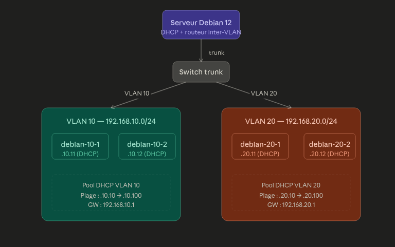
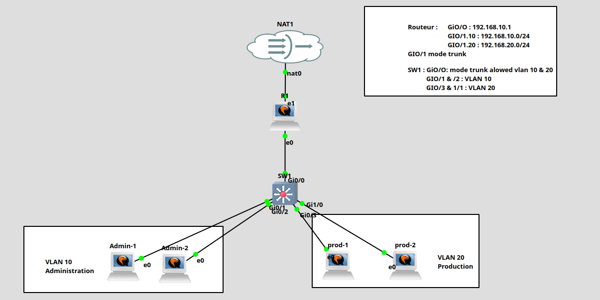
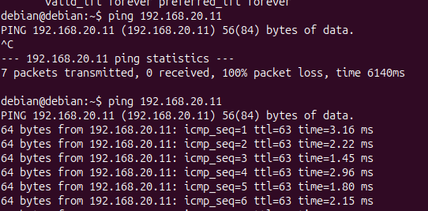
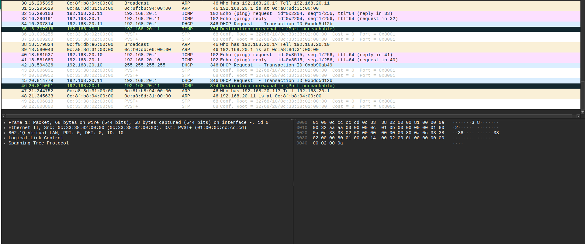
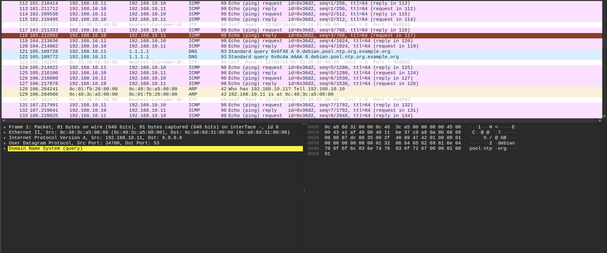
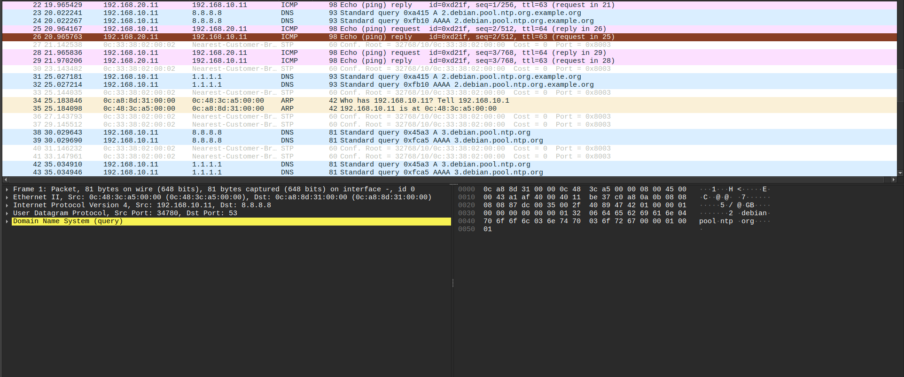

# Atelier 2 - VLANs securises et preparation du filtrage

## Objectif

Mettre en place une segmentation reseau avec deux VLANs, distribuer les adresses IP par DHCP, verifier le routage inter-VLAN et preparer le filtrage qui sera applique dans l'atelier suivant.

L'objectif securite est simple : separer les postes d'administration et de production, puis controler ensuite les flux entre ces zones.

## Architecture retenue

L'architecture utilise un serveur Debian 12 jouant le role de serveur DHCP et de routeur inter-VLAN. Le serveur est relie au switch par un lien trunk 802.1Q. Les postes clients sont branches sur des ports access.



| Zone | VLAN | Reseau | Passerelle | DHCP |
| --- | --- | --- | --- | --- |
| Administration | VLAN 10 | `192.168.10.0/24` | `192.168.10.1` | `192.168.10.10` a `192.168.10.100` |
| Production | VLAN 20 | `192.168.20.0/24` | `192.168.20.1` | `192.168.20.10` a `192.168.20.100` |

Principe de fonctionnement :

1. Le switch separe les postes dans le VLAN 10 ou le VLAN 20.
2. Le lien entre le switch et le serveur Debian est en trunk.
3. Debian recoit les trames taguees et les traite avec les sous-interfaces `eth0.10` et `eth0.20`.
4. Le service DHCP distribue une adresse dans le bon pool selon le VLAN.
5. Debian peut router entre les VLANs si `ip_forward` est active.
6. Le filtrage inter-VLAN sera ensuite ajoute avec `nftables`.

## Topologie GNS3

Dans GNS3, la topologie reprend le meme principe : VLAN 10 pour l'administration, VLAN 20 pour la production, lien trunk vers l'equipement qui route.



| Equipement | Role |
| --- | --- |
| Serveur Debian 12 | DHCP + routage inter-VLAN |
| Switch Cisco | VLANs, ports access, lien trunk |
| `debian-10-1`, `debian-10-2` | Clients VLAN 10 |
| `debian-20-1`, `debian-20-2` | Clients VLAN 20 |

## Configuration du serveur Debian

### Support VLAN

Installation des paquets :

```bash
sudo apt update
sudo apt install vlan isc-dhcp-server -y
```

Chargement du module 802.1Q :

```bash
sudo /sbin/modprobe 8021q
echo "8021q" | sudo tee -a /etc/modules
lsmod | grep 8021q
```

> `sudo echo "8021q" >> /etc/modules` ne fonctionne pas, car la redirection est faite par le shell sans privileges. Il faut utiliser `sudo tee`.

### Sous-interfaces VLAN

Exemple dans `/etc/network/interfaces` :

```text
auto eth0
iface eth0 inet manual

auto eth0.10
iface eth0.10 inet static
    address 192.168.10.1
    netmask 255.255.255.0
    vlan-raw-device eth0

auto eth0.20
iface eth0.20 inet static
    address 192.168.20.1
    netmask 255.255.255.0
    vlan-raw-device eth0
```

Application et verification :

```bash
sudo systemctl restart networking
ip addr show eth0.10
ip addr show eth0.20
```

### Routage inter-VLAN

Activation du routage IPv4 :

```bash
echo "net.ipv4.ip_forward=1" | sudo tee -a /etc/sysctl.conf
sudo sysctl -p
```

Sans cette option, Debian peut repondre sur chaque VLAN, mais ne route pas les paquets entre VLAN 10 et VLAN 20.

## Configuration DHCP

Dans `/etc/dhcp/dhcpd.conf` :

```text
default-lease-time 600;
max-lease-time 7200;
authoritative;

subnet 192.168.10.0 netmask 255.255.255.0 {
    range 192.168.10.10 192.168.10.100;
    option routers 192.168.10.1;
    option domain-name-servers 8.8.8.8, 1.1.1.1;
    option broadcast-address 192.168.10.255;
}

subnet 192.168.20.0 netmask 255.255.255.0 {
    range 192.168.20.10 192.168.20.100;
    option routers 192.168.20.1;
    option domain-name-servers 8.8.8.8, 1.1.1.1;
    option broadcast-address 192.168.20.255;
}
```

Dans `/etc/default/isc-dhcp-server` :

```text
INTERFACESv4="eth0.10 eth0.20"
```

Validation et demarrage :

```bash
sudo dhcpd -t -cf /etc/dhcp/dhcpd.conf
sudo systemctl enable --now isc-dhcp-server
sudo systemctl status isc-dhcp-server
```

Si le service echoue, verifier d'abord que `eth0.10` et `eth0.20` existent bien. Le serveur DHCP ne peut pas ecouter sur des interfaces qui ne sont pas encore montees.

## Configuration du switch Cisco

Creation des VLANs :

```text
configure terminal
vlan 10
 name ADMINISTRATION
vlan 20
 name PRODUCTION
```

Port trunk vers Debian :

```text
interface GigabitEthernet0/1
 description Trunk vers serveur Debian DHCP/routeur
 switchport trunk encapsulation dot1q
 switchport mode trunk
 switchport trunk allowed vlan 10,20
 no shutdown
```

Ports access pour les clients :

```text
interface range GigabitEthernet0/2 - 3
 description Clients VLAN 10
 switchport mode access
 switchport access vlan 10
 spanning-tree portfast

interface range GigabitEthernet0/4 - 5
 description Clients VLAN 20
 switchport mode access
 switchport access vlan 20
 spanning-tree portfast
```

Verification :

```text
show vlan brief
show interfaces trunk
show interfaces status
```

## Verification de la connectivite

Sur un client :

```bash
ip addr
ip route
ping 192.168.10.1
ping 192.168.20.1
```

Sur le serveur Debian :

```bash
cat /var/lib/dhcp/dhcpd.leases
ip addr show eth0.10
ip addr show eth0.20
```

Le test de ping inter-VLAN montre que la machine du VLAN 10 peut joindre une machine du VLAN 20, ici `192.168.20.11`.



## Observation Wireshark

Wireshark permet de valider ce qui circule reellement :

| Filtre | Utilisation |
| --- | --- |
| `vlan` | Voir les trames taguees 802.1Q |
| `vlan.id == 10` | Voir uniquement le VLAN 10 |
| `vlan.id == 20` | Voir uniquement le VLAN 20 |
| `icmp` | Observer les pings |
| `dhcp` ou `bootp` | Observer l'attribution DHCP |
| `arp` | Observer les resolutions d'adresses |

Capture d'une trame taguee VLAN :



Ping dans le meme VLAN :



Ping inter-VLAN :



## Preparation du filtrage

Une fois les VLANs, le DHCP et le routage valides, l'etape suivante consiste a filtrer les flux inter-VLAN.

Logique attendue :

| Flux | Decision | Justification |
| --- | --- | --- |
| VLAN 10 vers VLAN 20 en ICMP | Autoriser temporairement | Diagnostic |
| VLAN 10 vers VLAN 20 en SSH | Autoriser | Administration de la production |
| VLAN 20 vers VLAN 10 en SSH | Bloquer | Eviter les mouvements lateraux vers l'administration |
| VLAN 20 vers VLAN 10 en HTTP | Bloquer | Aucun besoin identifie |

Cette base servira directement a l'atelier 3 avec `nftables`.

## Synthese

Cet atelier montre le processus complet : le switch separe les postes dans des VLANs, le trunk transporte les VLANs jusqu'au serveur Debian, Debian distribue les adresses DHCP par sous-interface VLAN, puis le routage inter-VLAN permet les communications entre les deux reseaux.

La segmentation est fonctionnelle, mais elle n'est pas encore suffisante seule : il faut ensuite filtrer les flux pour appliquer le moindre privilege.

## Ressource

- Wireshark - How To Capture VLAN Tag : <https://www.youtube.com/watch?v=wORHm67WAj4&t=2s>

## Notions acquises

- VLAN access et trunk 802.1Q
- Sous-interfaces VLAN sur Debian
- DHCP par VLAN
- Routage inter-VLAN
- Verification avec `ping`, `ip addr`, `dhcpd -t`
- Observation Wireshark des tags VLAN
- Preparation du filtrage inter-VLAN
