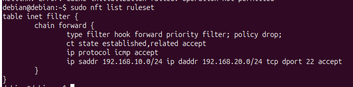
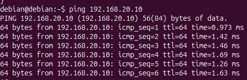
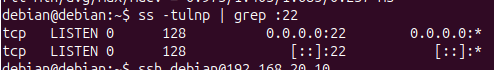
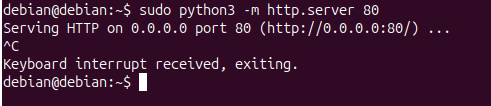
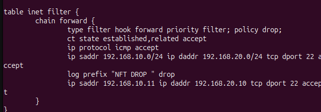
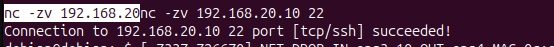

# Atelier 3 - Filtrage reseau avec nftables

## Objectif de l'atelier

Cet atelier consiste a mettre en oeuvre un filtrage reseau simple avec `nftables` sur une machine Linux jouant le role de routeur filtrant entre les VLANs. L'objectif est de partir d'une politique restrictive : tout bloquer par defaut, puis autoriser uniquement les flux necessaires.

Le filtrage porte ici sur les flux inter-VLAN qui traversent le routeur Linux. Les communications internes a un meme VLAN ne passent pas par la chaine `forward` du routeur et ne sont donc pas concernees par ces regles.

## Rappel - ACL

Une ACL, pour Access Control List, est un ensemble de regles qui indique quels flux reseau sont autorises ou interdits entre des machines ou des reseaux.

Dans ce module, les ACL servent a :

- limiter les communications entre VLANs ;
- empecher les deplacements lateraux ;
- autoriser uniquement les flux necessaires ;
- appliquer le principe du moindre privilege.

Avec `nftables`, les ACL sont representees par des regles de filtrage. Chaque regle peut tenir compte de la source, de la destination, du protocole, du port ou de l'etat de la connexion.

## Contexte de filtrage

L'architecture conserve les deux VLANs mis en place dans l'atelier precedent :

| VLAN | Role | Reseau |
| --- | --- | --- |
| VLAN 10 | Administration | `192.168.10.0/24` |
| VLAN 20 | Production | `192.168.20.0/24` |

La machine Linux routeur possede une interface ou sous-interface dans chaque VLAN. Elle assure le routage entre les reseaux, puis applique les regles `nftables` sur les paquets qui traversent la chaine `forward`.

Avant d'ajouter les regles de filtrage, il faut verifier que le routage inter-VLAN fonctionne. Sinon, un test bloque pourrait venir d'un probleme de routage ou d'adressage, et non d'une regle de securite.

## Point d'attention

Les flux entre deux machines du meme VLAN ne passent pas par la chaine `forward` du routeur Linux.

Exemples :

- VLAN 10 vers VLAN 10 : le trafic reste dans le meme domaine de niveau 2 ;
- VLAN 20 vers VLAN 20 : le trafic reste dans le meme domaine de niveau 2.

`nftables` sur le routeur Linux filtre donc les flux inter-VLAN, pas les flux internes a un meme VLAN. Pour filtrer les flux locaux d'un VLAN, il faudrait agir sur les postes eux-memes, sur un switch de niveau 3, ou sur un equipement de filtrage place dans le chemin du trafic.

## Preparation de la machine

Avant de configurer les regles de filtrage, il faut verifier que les paquets necessaires sont installes sur les machines utilisees pendant l'atelier.

Sur Debian ou Kali, commencer par mettre a jour la liste des paquets :

```bash
sudo apt update
```

### Paquets a installer sur le routeur Linux

La machine qui route entre les VLANs doit disposer de `nftables` et des outils reseau de base :

```bash
sudo apt install nftables iproute2 iputils-ping tcpdump
```

| Paquet | Utilisation |
| --- | --- |
| `nftables` | Creation des tables, chaines et regles de filtrage |
| `iproute2` | Commandes `ip addr`, `ip route` et gestion du routage |
| `iputils-ping` | Tests ICMP avec `ping` |
| `tcpdump` | Capture rapide de trafic en ligne de commande |

Verifier que la commande `nft` est disponible :

```bash
nft --version
```

Activer le service `nftables` pour pouvoir rendre les regles persistantes ensuite :

```bash
sudo systemctl enable nftables
sudo systemctl start nftables
sudo systemctl status nftables
```

### Paquets utiles sur les machines de test

Sur les postes clients ou sur Kali Linux, installer les outils de test :

```bash
sudo apt install iproute2 iputils-ping openssh-client netcat-openbsd curl
```

| Paquet | Utilisation |
| --- | --- |
| `openssh-client` | Tester une connexion SSH vers une machine distante |
| `netcat-openbsd` | Tester rapidement l'ouverture d'un port TCP |
| `curl` | Tester un service HTTP ou HTTPS |

### Paquets utiles sur une machine cible

Pour tester SSH, la machine destination doit avoir un serveur SSH actif :

```bash
sudo apt install openssh-server
sudo systemctl enable ssh
sudo systemctl start ssh
sudo systemctl status ssh
```

Pour tester un service HTTP temporaire, Python suffit generalement :

```bash
sudo apt install python3
```

Ces installations evitent de confondre un flux bloque par le pare-feu avec un service simplement absent sur la machine cible.

## Mise en place des regles nftables

### 1. Identifier les interfaces

La premiere etape consiste a identifier les interfaces utilisees par chaque VLAN :

```bash
ip addr
ip route
```

On doit retrouver une interface ou sous-interface associee au VLAN 10 et une autre associee au VLAN 20. Les machines des VLANs doivent utiliser le routeur Linux comme passerelle.

### 2. Verifier le routage avant filtrage

Avant de bloquer les flux, on verifie que les VLANs peuvent communiquer :

```bash
ping 192.168.20.10
ping 192.168.10.10
```

Si le ping inter-VLAN fonctionne avant la mise en place des regles, on peut ensuite tester l'effet reel du filtrage.

### 3. Reinitialiser les regles existantes

```bash
nft flush ruleset
```

Cette commande supprime les regles `nftables` existantes. Elle permet de repartir d'une configuration propre pour eviter les effets de bord.

### 4. Creer la table de filtrage

```bash
nft add table inet filter
```

La famille `inet` permet de gerer IPv4 et IPv6 dans une meme table. Ici, les tests portent surtout sur IPv4, mais cette organisation reste propre et evolutive.

### 5. Creer une chaine forward restrictive

```bash
nft add chain inet filter forward '{ type filter hook forward priority 0; policy drop; }'
```

La politique par defaut est `drop`. Cela signifie que tout paquet traverse par defaut le routeur est bloque, sauf si une regle l'autorise explicitement.

### 6. Autoriser les connexions deja etablies

```bash
nft add rule inet filter forward ct state established,related accept
```

Cette regle autorise les reponses aux connexions deja autorisees. Elle evite de devoir ecrire une regle retour pour chaque flux.

### 7. Autoriser ICMP entre VLANs

```bash
nft add rule inet filter forward ip protocol icmp accept
```

ICMP est autorise pour faciliter les tests de connectivite et le diagnostic reseau. En production, cette autorisation peut etre limitee selon la politique de securite.

### 8. Autoriser SSH depuis le VLAN 10 vers le VLAN 20

```bash
nft add rule inet filter forward ip saddr 192.168.10.0/24 ip daddr 192.168.20.0/24 tcp dport 22 accept
```

Cette regle autorise l'administration des machines de production depuis le VLAN 10. Le sens inverse n'est pas autorise, afin d'eviter qu'une machine de production puisse initier une connexion SSH vers le VLAN d'administration.

### 9. Afficher les regles

```bash
nft list ruleset
```

La commande permet de verifier la table, la chaine `forward`, la politique `drop` et les regles d'autorisation ajoutees.



## Exemple de ruleset attendu

```nft
table inet filter {
    chain forward {
        type filter hook forward priority 0; policy drop;
        ct state established,related accept
        ip protocol icmp accept
        ip saddr 192.168.10.0/24 ip daddr 192.168.20.0/24 tcp dport 22 accept
    }
}
```

Ce ruleset applique une logique de moindre privilege : le trafic inter-VLAN est bloque par defaut, ICMP est autorise pour les tests et SSH est autorise uniquement du VLAN Administration vers le VLAN Production.

## Rendre la configuration persistante

Les regles ajoutees avec `nft add rule ...` sont actives immediatement, mais elles ne sont pas persistantes si elles ne sont pas enregistrees dans un fichier charge au demarrage. Apres un redemarrage, il faut donc soit les retaper, soit configurer le service `nftables`.

Sur Debian 12, le fichier principal est :

```bash
/etc/nftables.conf
```

### 1. Sauvegarder le ruleset actif

Une fois les regles testees et validees, on peut exporter la configuration active :

```bash
sudo nft list ruleset | sudo tee /etc/nftables.conf
```

Cette commande ecrit le ruleset courant dans le fichier de configuration charge par le service `nftables`.

### 2. Exemple de fichier `/etc/nftables.conf`

Le fichier peut aussi etre redige manuellement avec une structure claire :

```nft
#!/usr/sbin/nft -f

flush ruleset

table inet filter {
    chain forward {
        type filter hook forward priority filter; policy drop;

        ct state established,related accept
        ip protocol icmp accept
        ip saddr 192.168.10.0/24 ip daddr 192.168.20.0/24 tcp dport 22 accept

        log prefix "NFT DROP " drop
    }
}
```

La ligne `flush ruleset` permet de repartir d'un etat propre a chaque chargement du fichier. La regle `log ... drop` doit rester a la fin de la chaine, apres toutes les regles `accept`.

### 3. Tester le fichier avant activation

Avant de redemarrer le service, il faut verifier que la syntaxe est correcte :

```bash
sudo nft -c -f /etc/nftables.conf
```

L'option `-c` effectue une verification sans appliquer les regles.

### 4. Charger la configuration

```bash
sudo nft -f /etc/nftables.conf
sudo nft list ruleset
```

### 5. Activer le service au demarrage

```bash
sudo systemctl enable nftables
sudo systemctl restart nftables
sudo systemctl status nftables
```

Apres redemarrage de la machine, on verifie que les regles sont toujours presentes :

```bash
sudo reboot
sudo nft list ruleset
```

### 6. Commandes utiles en cas de correction

Modifier le fichier :

```bash
sudo nano /etc/nftables.conf
```

Verifier puis recharger :

```bash
sudo nft -c -f /etc/nftables.conf
sudo systemctl restart nftables
sudo nft list ruleset
```

Cette persistance evite de devoir retaper les regles a chaque redemarrage et transforme le test de lab en configuration exploitable.

## Flux minimums a tester

| Source | Destination | Protocole | Resultat attendu | Remarque |
| --- | --- | --- | --- | --- |
| VLAN 10 | VLAN 10 | ICMP | Autorise | Meme VLAN, ne passe pas par `forward` |
| VLAN 20 | VLAN 20 | ICMP | Autorise | Meme VLAN, ne passe pas par `forward` |
| VLAN 10 | VLAN 20 | ICMP | Autorise | Passe par le routeur Linux |
| VLAN 20 | VLAN 10 | ICMP | Autorise | Passe par le routeur Linux |
| VLAN 10 | VLAN 20 | SSH | Autorise | Autorise explicitement |
| VLAN 20 | VLAN 10 | SSH | Bloque | Non autorise |
| VLAN 20 | VLAN 10 | HTTP | Bloque | Non autorise |

## Commandes de test

Tester ICMP :

```bash
ping 192.168.20.10
```



Verifier qu'un service SSH ecoute sur la machine destination :

```bash
ss -tulnp | grep :22
```



Tester SSH :

```bash
ssh user@192.168.20.10
```


Tester un port TCP avec `netcat` :

```bash
nc -zv 192.168.20.10 22
```

Sur Debian 12, la commande `nc` peut ne pas etre disponible par defaut ou ne pas se comporter comme attendu selon le paquet installe. Si `nc` ne fonctionne pas, on peut tester le port SSH directement avec la commande `ssh` ou installer une variante de netcat :

```bash
sudo apt install netcat-openbsd
```

On peut aussi utiliser une alternative Bash pour tester l'ouverture d'un port TCP :

```bash
timeout 3 bash -c '</dev/tcp/192.168.20.10/22' && echo "port ouvert" || echo "port ferme ou filtre"
```

Demarrer un serveur HTTP temporaire sur une machine destination :

```bash
python3 -m http.server 80
```



Tester le port HTTP depuis une autre machine :

```bash
nc -zv 192.168.10.10 80
```

Alternative si `nc` ne fonctionne pas :

```bash
curl -I --connect-timeout 3 http://192.168.10.10
```

Afficher les regles `nftables` :

```bash
nft list ruleset
```

## Documentation des tests

| Test | Source | Destination | Commande | Resultat attendu | Interpretation |
| --- | --- | --- | --- | --- | --- |
| Ping meme VLAN 10 | VLAN 10 | VLAN 10 | `ping 192.168.10.10` | Autorise | Le trafic reste dans le VLAN 10 |
| Ping meme VLAN 20 | VLAN 20 | VLAN 20 | `ping 192.168.20.10` | Autorise | Le trafic reste dans le VLAN 20 |
| Ping inter-VLAN | VLAN 10 | VLAN 20 | `ping 192.168.20.10` | Autorise | ICMP est autorise par la regle `ip protocol icmp accept` |
| Ping inter-VLAN retour | VLAN 20 | VLAN 10 | `ping 192.168.10.10` | Autorise | ICMP est autorise dans les deux sens |
| SSH administration | VLAN 10 | VLAN 20 | `ssh user@192.168.20.10` | Autorise | Flux d'administration explicitement autorise |
| SSH inverse | VLAN 20 | VLAN 10 | `ssh user@192.168.10.10` | Bloque | Le VLAN Production ne doit pas initier de SSH vers l'Administration |
| HTTP inverse | VLAN 20 | VLAN 10 | `curl -I --connect-timeout 3 http://192.168.10.10` | Bloque | Aucun besoin metier justifie ce flux |

## Deux flux supplementaires

| Source | Destination | Protocole ou port | Commande | Resultat attendu | Justification de securite |
| --- | --- | --- | --- | --- | --- |
| VLAN 10 | VLAN 20 | HTTP `tcp/80` | `curl -I --connect-timeout 3 http://192.168.20.10` | Bloque | L'administration des machines doit se faire en SSH, pas via un service web non justifie |
| VLAN 20 | VLAN 10 | SSH `tcp/22` | `ssh -o ConnectTimeout=3 user@192.168.10.10` | Bloque | La production ne doit pas initier de session d'administration vers le VLAN 10 |

Ces deux tests montrent que la politique par defaut `drop` fonctionne : un flux non explicitement autorise est bloque. Cela evite les ouvertures implicites et force a justifier chaque communication.

## Analyse de securite

La configuration applique trois principes importants :

- defense en profondeur : le filtrage inter-VLAN ajoute une couche de securite apres la segmentation ;
- moindre privilege : seuls ICMP et SSH dans le sens Administration vers Production sont autorises ;
- limitation des deplacements lateraux : une machine du VLAN 20 ne peut pas initier librement des connexions vers le VLAN 10.

Le point central est la politique par defaut `drop`. Elle inverse la logique habituelle d'un reseau trop permissif : au lieu de tout autoriser puis bloquer certains flux, on bloque tout puis on ouvre uniquement ce qui est necessaire.

## Aller plus loin

Pour approfondir, il est possible d'ajouter des logs `nftables` avant le blocage :

```bash
nft add rule inet filter forward log prefix "NFT DROP " drop
```

La syntaxe doit bien separer l'action de journalisation et l'action de blocage. Si la commande retourne une erreur de syntaxe, utiliser :

```bash
sudo nft add rule inet filter forward log prefix 'NFT DROP ' drop
```

Cette regle journalise les paquets qui arrivent jusqu'a elle, puis les bloque. Elle doit donc etre placee apres les regles `accept`, sinon elle risque de bloquer le trafic avant les autorisations.



Dans cette capture, la regle `log prefix "NFT DROP " drop` apparait avant une regle plus precise autorisant SSH depuis `192.168.10.11` vers `192.168.20.10`. Cet ordre pose probleme : des qu'un paquet atteint la regle `log drop`, il est journalise puis bloque. Les regles placees apres ne seront donc pas utilisees pour ce paquet.

Il est aussi possible de limiter une autorisation a une seule adresse source :

```bash
nft add rule inet filter forward ip saddr 192.168.10.11 ip daddr 192.168.20.10 tcp dport 22 accept
```

Cette approche est plus precise qu'une autorisation sur tout un VLAN. Elle correspond mieux au moindre privilege, car seul le poste d'administration designe peut ouvrir une session SSH vers la machine cible.

Exemple d'ordre recommande :

```nft
table inet filter {
    chain forward {
        type filter hook forward priority 0; policy drop;
        ct state established,related accept
        ip protocol icmp accept
        ip saddr 192.168.10.11 ip daddr 192.168.20.10 tcp dport 22 accept
        log prefix "NFT DROP " drop
    }
}
```

Dans cet ordre, le flux SSH autorise depuis `192.168.10.11` vers `192.168.20.10:22` est accepte avant la regle finale de journalisation et de blocage.

Test possible avec `netcat` si la commande fonctionne sur Debian 12 :

```bash
nc -zv 192.168.20.10 22
```

Un resultat de type `Connection to 192.168.20.10 22 port [tcp/ssh] succeeded!` confirme que le port SSH est joignable depuis la source autorisee.



### Lecture des logs DROP

Les lignes suivantes sont un exemple de logs produits par la regle `log prefix "NFT DROP " drop` :

```text
NFT DROP IN=ens3.20 OUT=ens4 SRC=192.168.20.10 DST=1.1.1.1 PROTO=UDP SPT=42675 DPT=53
NFT DROP IN=ens3.10 OUT=ens4 SRC=192.168.10.10 DST=8.8.8.8 PROTO=UDP SPT=46561 DPT=53
NFT DROP IN=ens3.20 OUT=ens4 SRC=192.168.20.11 DST=8.8.8.8 PROTO=UDP SPT=54892 DPT=53
```

Ces logs indiquent surtout des requetes DNS sortantes bloquees :

- `PROTO=UDP` : protocole UDP ;
- `DPT=53` : port destination 53, donc DNS ;
- `DST=1.1.1.1` ou `DST=8.8.8.8` : serveurs DNS publics ;
- `IN=ens3.10` ou `IN=ens3.20` : paquet venant du VLAN 10 ou du VLAN 20 ;
- `OUT=ens4` : paquet qui tente de sortir vers l'exterieur.

Ce comportement est normal avec une politique `drop` si aucune regle n'autorise le DNS vers Internet. Ce n'est pas une erreur SSH : le routeur journalise simplement tous les flux qui arrivent en fin de chaine sans avoir ete acceptes.

Si l'on veut autoriser le DNS sortant, il faut ajouter une regle avant le `log drop`, par exemple :

```bash
nft add rule inet filter forward ip saddr { 192.168.10.0/24, 192.168.20.0/24 } udp dport 53 accept
```

Dans un contexte securise, cette autorisation doit etre justifiee. Une meilleure pratique consiste souvent a autoriser uniquement le DNS vers un resolveur interne ou vers un serveur DNS precis, plutot que vers n'importe quelle destination.

## Synthese personnelle

Cet atelier montre comment transformer une segmentation VLAN en segmentation securisee. Les VLANs separent les zones, mais le filtrage `nftables` decide ensuite quels flux peuvent traverser le routeur Linux.

La configuration mise en place bloque tous les flux inter-VLAN par defaut, autorise les connexions deja etablies, autorise ICMP pour les tests et autorise SSH uniquement depuis le VLAN Administration vers le VLAN Production. Les flux non prevus, comme SSH depuis la Production vers l'Administration ou HTTP vers le VLAN 10, sont bloques.

La notion essentielle est qu'un flux autorise doit etre justifie. Dans une infrastructure securisee, la connectivite n'est pas un objectif suffisant : elle doit etre maitrisee, documentee et testee.

## Ressource

- nftables Wiki : <https://wiki.nftables.org/>

## Notions acquises

- Role d'une ACL
- Politique par defaut `drop`
- Table, chaine et regles `nftables`
- Filtrage de la chaine `forward`
- Autorisation des connexions `established,related`
- Autorisation explicite de flux inter-VLAN
- Test des flux autorises et bloques
- Application du moindre privilege
