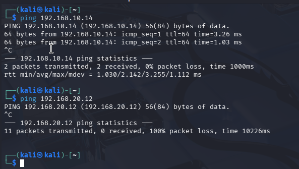
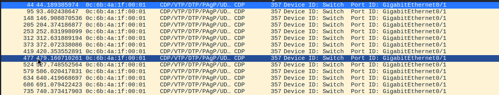
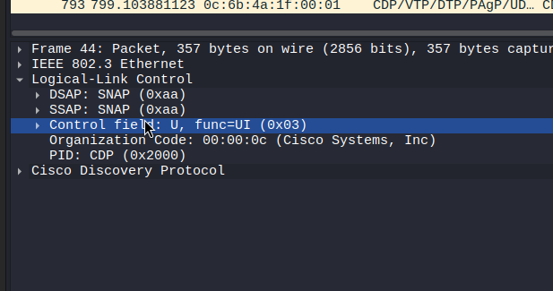
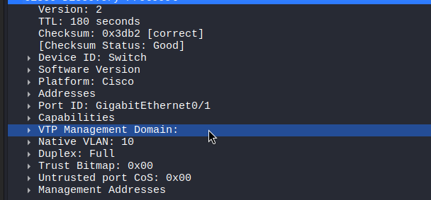
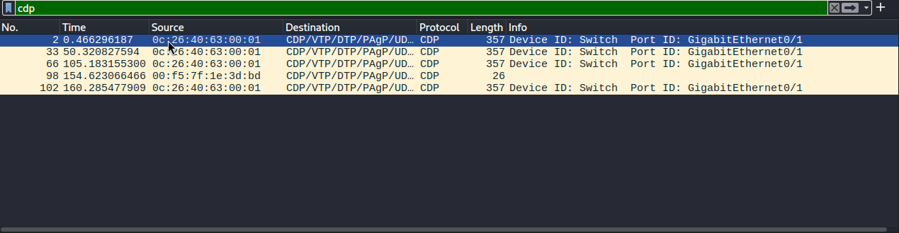
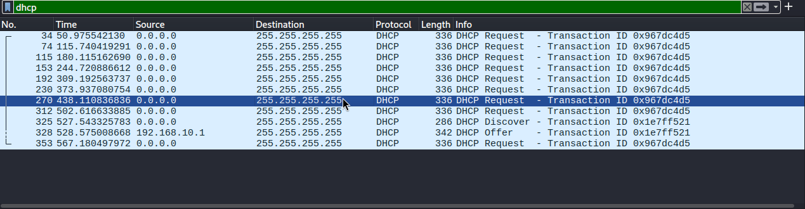
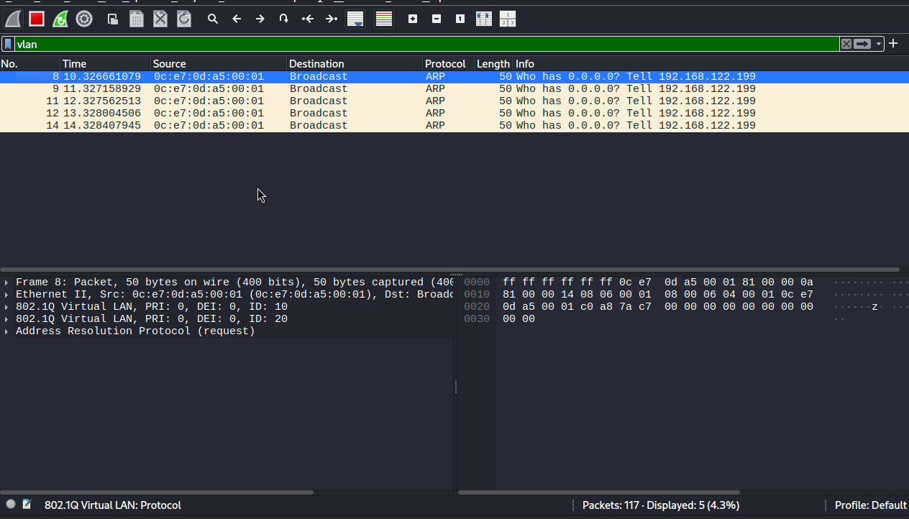
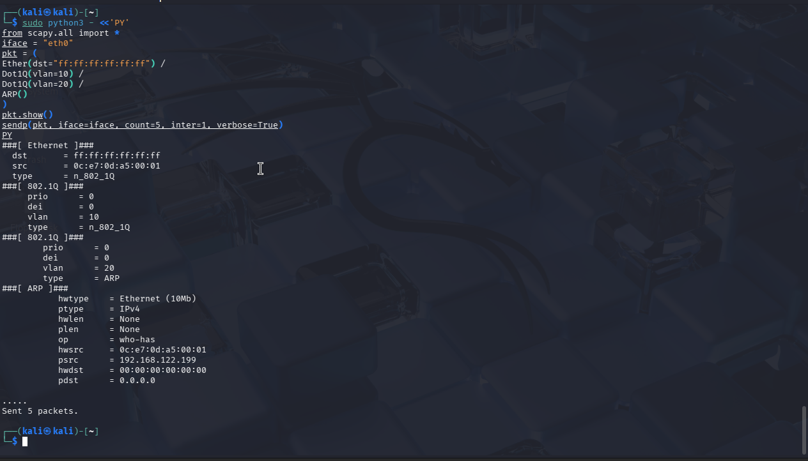
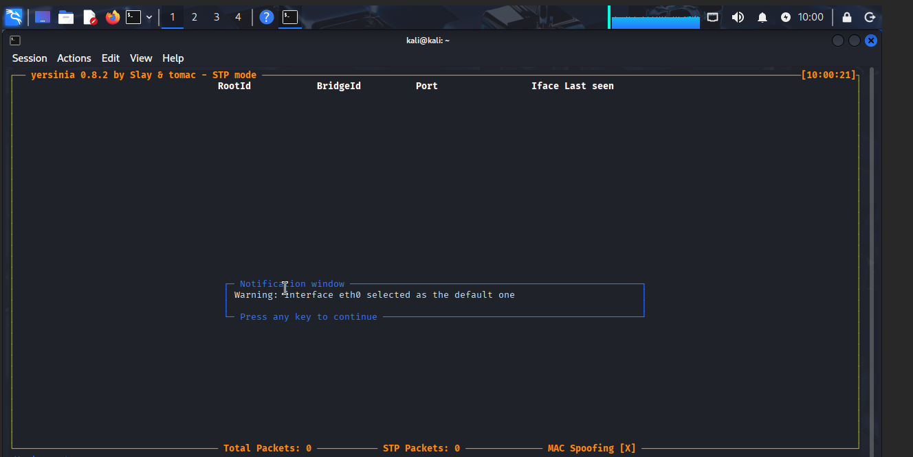

# Atelier 4 - Introduction au VLAN Hopping et tests d'attaque

## Objectif de l'atelier

Cet atelier a pour objectif de comprendre le principe des attaques de type VLAN Hopping et d'observer leur fonctionnement dans un environnement de laboratoire controle. Il ne s'agit pas de mener une attaque en conditions reelles, mais d'analyser comment une mauvaise configuration de switch peut permettre a une machine de sortir du VLAN auquel elle appartient normalement.

Les tests doivent etre realises uniquement dans l'environnement de TP, sur l'infrastructure VLAN construite pendant les ateliers precedents.

## Environnement de travail

L'atelier reprend l'architecture deja mise en place :

- VLAN 10 : Administration ;
- VLAN 20 : Production ;
- switch avec ports access et trunk ;
- routage inter-VLAN ;
- filtrage inter-VLAN avec `nftables` ;
- une machine Kali Linux disponible dans le groupe ;
- Wireshark pour observer le trafic.

Kali Linux peut etre utilisee sur une machine physique, dans une machine virtuelle ou depuis une image live. L'important est qu'elle soit connectee au reseau de TP et que son interface soit clairement identifiee.

## Kali Linux

Kali Linux est une distribution Linux specialisee dans les tests de securite, l'analyse reseau et les audits de systemes. Elle contient de nombreux outils utilises en cybersecurite :

- analyse reseau ;
- tests d'intrusion ;
- audit Wi-Fi ;
- analyse forensique ;
- generation de trafic ;
- exploitation et observation de protocoles reseau.

Dans cet atelier, les outils utiles sont principalement :

| Outil | Role dans l'atelier |
| --- | --- |
| Wireshark | Capturer et analyser les trames generees pendant les tests |
| Yersinia | Observer ou tester des protocoles de couche 2 dans un cadre de lab |
| Scapy | Construire ou analyser des paquets pour comprendre leur structure |
| Outils Linux classiques | Identifier les interfaces, tester la connectivite, lire les routes |

## Preparation des outils

Kali Linux a ete utilisee comme machine de test dans le VLAN 10. Elle peut etre installee sur une machine physique, dans une machine virtuelle ou lancee depuis une image live.

Commandes utiles pour preparer l'environnement :

```bash
sudo apt update
sudo apt install yersinia wireshark python3-scapy tcpdump
```

Verification de l'interface reseau de Kali :

```bash
ip -br addr
ip route
```

Dans le lab, l'interface utilisee est `eth0`.

## Principe du VLAN Hopping

Une attaque VLAN Hopping consiste a tenter de sortir du VLAN auquel une machine appartient normalement afin d'atteindre un autre VLAN. Le risque concerne surtout les reseaux mal configures, par exemple avec des trunks trop permissifs, un VLAN natif mal choisi ou des mecanismes de negociation automatique encore actifs.

L'objectif de l'attaquant est de faire circuler du trafic vers un VLAN auquel son port d'acces ne devrait pas donner acces.

## Technique 1 - Double Tagging

Le double tagging repose sur l'utilisation de deux tags VLAN dans une trame Ethernet :

- un tag externe, correspondant souvent au VLAN natif ou au VLAN attendu par le premier switch ;
- un tag interne, qui peut rester present apres le premier traitement et etre interprete plus loin dans le reseau.

Le principe theorique est le suivant :

1. La trame arrive sur un premier switch avec deux tags VLAN.
2. Le premier switch retire le tag externe.
3. Le tag interne reste dans la trame.
4. Un equipement suivant peut interpreter ce second tag et envoyer la trame vers un autre VLAN.

Cette attaque depend fortement de la topologie, du VLAN natif, des trunks et du comportement exact des switches. Dans un reseau correctement configure, elle doit etre bloquee ou inoperante.

## Technique 2 - Spoofing DTP

DTP, pour Dynamic Trunking Protocol, est un mecanisme Cisco permettant de negocier automatiquement un trunk entre deux equipements. Si un port utilisateur est laisse dans un mode qui accepte la negociation, une machine malveillante peut tenter de se faire passer pour un switch.

Le risque est le suivant :

- le port negocie un trunk par erreur ;
- l'attaquant peut envoyer ou recevoir du trafic tague ;
- plusieurs VLANs deviennent accessibles depuis un port qui devait rester en mode access.

Dans les reseaux bien configures, DTP est desactive sur les ports utilisateurs, et les trunks sont configures explicitement uniquement entre equipements reseau.

## Deroulement realise

### 1. Installation et verification de Kali Linux

La premiere etape consiste a verifier que Kali est bien connectee au reseau de TP :

```bash
ip addr
ip route
ping <passerelle_du_vlan>
```

Les informations importantes a relever sont :

- nom de l'interface reseau ;
- adresse IP de Kali ;
- VLAN ou segment auquel Kali est connectee ;
- passerelle utilisee ;
- connectivite vers les machines du meme VLAN.

Dans notre cas, Kali est placee dans le VLAN 10.

La verification de connectivite montre que Kali joint bien une machine du VLAN 10, mais ne joint pas directement une machine du VLAN 20. Cela confirme que la segmentation reste effective avant les tests d'attaque.



### 2. Identification du comportement du switch

Avant les tests, il faut documenter la configuration attendue :

| Element | Verification attendue |
| --- | --- |
| Port de Kali | Mode access |
| VLAN de Kali | VLAN unique, selon le branchement |
| Ports trunks | Limites aux liaisons entre equipements reseau |
| VLAN natif | Non utilise pour les postes utilisateurs |
| DTP | Desactive sur les ports d'acces |

Cette etape est essentielle : une tentative de VLAN Hopping n'a de sens que si l'on connait l'etat initial du reseau.

### 3. Capture Wireshark

Wireshark est lance sur Kali pour observer les trames generees pendant les tests. Les filtres utiles sont :

| Filtre | Utilisation |
| --- | --- |
| `dtp` | Observer une eventuelle negociation DTP |
| `vlan` | Observer les trames taguees 802.1Q |
| `eth` | Examiner les trames Ethernet |
| `arp` | Observer les resolutions d'adresses |
| `icmp` | Observer les tests de connectivite |

Sur un port access correctement configure, Kali ne doit normalement pas voir de trafic tague provenant de plusieurs VLANs. Les tags VLAN sont attendus sur les trunks, pas sur les ports utilisateurs.

### 4. Tentative de negociation DTP avec Yersinia

Le test demande consistait a verifier si le port connecte a Kali accepte une negociation de trunk avec Yersinia. Une tentative a ete lancee depuis Kali, mais elle n'a pas permis d'activer un mode trunk ou un mode `desirable`.

Le principe du test DTP est le suivant : si un port utilisateur accepte la negociation automatique, une machine malveillante peut tenter de se faire passer pour un switch et negocier un trunk. Si le switch est bien configure, la tentative doit echouer :

- le port reste en mode access ;
- aucun trunk n'est negocie ;
- Kali ne gagne pas d'acces aux autres VLANs ;
- Wireshark ne montre pas de trafic multi-VLAN exploitable depuis ce port.

Resultat attendu dans un environnement securise :

| Test | Resultat attendu |
| --- | --- |
| Tentative DTP depuis Kali | Echec de la negociation |
| Port switch | Reste en mode access |
| Acces aux autres VLANs | Non obtenu |
| Observation Wireshark | Pas de trunk exploitable |

Commande utilisee pour lancer Yersinia en mode interactif :

```bash
sudo yersinia -I -i eth0
```

Dans l'interface interactive, le protocole DTP a ete selectionne apres appui sur `g`. La table DTP est restee vide et aucune action exploitable de type `trunking` ou `desirable` n'a pu etre declenchee depuis l'outil.

Filtres Wireshark utiles :

```text
dtp
vlan
eth.type == 0x8100
```

Observation importante : Wireshark affiche des trames dans la famille `CDP/VTP/DTP/PAgP/UDLD`, mais le detail du paquet indique `PID: CDP (0x2000)`. Il s'agit donc de paquets CDP, pas d'une negociation DTP reussie. Les informations CDP visibles indiquent notamment :

| Champ observe | Valeur |
| --- | --- |
| Protocole decode | CDP |
| Device ID | `Switch` |
| Port ID | `GigabitEthernet0/1` |
| Native VLAN | `10` |
| Duplex | Full |



Le detail du paquet confirme que Wireshark decode le protocole CDP, avec un PID `CDP (0x2000)`.



Le detail CDP indique aussi les informations annoncees par le switch, notamment le port, le VLAN natif et le mode duplex.



Conclusion pour notre compte rendu : la tentative DTP avec Yersinia a ete lancee, mais elle n'est pas concluante cote outil. Aucun trunk n'a ete negocie, aucune option `trunking/desirable` exploitable n'a ete disponible, et les paquets observes correspondent a du CDP. Le test ne montre donc pas de VLAN Hopping par DTP.

Dans notre environnement, Yersinia n'etait pas disponible avec l'interface graphique GTK. Le lancement en mode graphique retourne un message indiquant que Yersinia a ete compile avec l'option `--disable-gtk`. Le mode interactif en terminal reste utilisable :

```bash
sudo yersinia -I -i eth0
```

Cette commande lance une attaque BPDU (Bridge Protocol Data Unit) sur l'interface eth0.

```bash
sudo yersinia stp -attack bpdu -interface eth0
```


Cette commande lance une attaque de type « flood » sur l’interface eth0, envoyant des paquets CDP massifs pour perturber le réseau.

```bash

sudo yersinia cdp -attack flood -interface eth0
```



Cette commande lance une attaque de type « discover » sur l’interface eth0, inondant le serveur DHCP de requêtes de découverte.

```bash
sudo yersinia dhcp -attack discover -interface eth0
```



Pour capturer les protocoles Cisco visibles depuis Kali, Wireshark a ete utilise avec les filtres suivants :

```text
cdp
dtp
stp
eth.type == 0x8100
```

### 5. Test de double tagging

Le test de double tagging vise a observer si une trame avec plusieurs tags VLAN peut traverser l'infrastructure et atteindre un VLAN non autorise.

Dans un environnement correctement configure, l'attaque doit etre bloquee ou ne produire aucun resultat exploitable. Les protections attendues sont :

- ports utilisateurs en mode access ;
- VLAN natif non utilise par les postes ;
- trunks limites aux VLANs strictement necessaires ;
- absence de trunk automatique ;
- filtrage inter-VLAN actif.

Dans notre lab, le test a ete realise avec Scapy depuis Kali. Le principe consiste a forger une trame Ethernet contenant deux tags 802.1Q :

- tag externe : VLAN 10, correspondant au VLAN natif observe ;
- tag interne : VLAN 20, correspondant au VLAN cible.

La commande utilisee est :

```bash
sudo python3 - <<'PY'
from scapy.all import *

iface = "eth0"

pkt = (
    Ether(dst="ff:ff:ff:ff:ff:ff") /
    Dot1Q(vlan=10) /
    Dot1Q(vlan=20) /
    ARP(
        op="who-has",
        psrc="192.168.122.199",
        pdst="0.0.0.0"
    )
)

pkt.show()
sendp(pkt, iface=iface, count=5, inter=1, verbose=True)
PY
```

Point important : il faut utiliser `sendp()` et non `send()`. La fonction `sendp()` envoie une trame de couche 2 et conserve les en-tetes Ethernet / 802.1Q. Avec `send()`, Scapy envoie en couche 3 et les tags VLAN ne sont pas envoyes comme attendu.



La capture Wireshark avec le filtre `vlan` montre bien les deux tags :

- `802.1Q Virtual LAN, ID: 10` ;
- `802.1Q Virtual LAN, ID: 20` ;
- une requete ARP encapsulee dans la trame.



Filtres utiles pour observer ce test :

```text
vlan
eth.type == 0x8100
vlan.id == 10 || vlan.id == 20
```

Le test prouve que Kali peut forger et envoyer une trame double taguee dans le lab. En revanche, cela ne suffit pas a prouver une compromission du VLAN 20 : il faut verifier si la trame apparait sur un trunk ou sur une machine du VLAN cible.

Dans notre observation, le double tag est visible dans Wireshark, mais aucune preuve d'acces exploitable au VLAN 20 n'est constatee. Le resultat est donc une tentative observable, sans VLAN Hopping reussi.

## Observations Wireshark

### Capture CDP passive

Une premiere capture Wireshark montre que Kali recoit des trames CDP provenant du switch.


Le detail du paquet CDP confirme qu'il ne s'agit pas d'une negociation DTP, meme si Wireshark regroupe l'affichage dans la famille `CDP/VTP/DTP/PAgP/UDLD`.


Les informations visibles sont :

| Champ observe | Valeur |
| --- | --- |
| Protocole | CDP - Cisco Discovery Protocol |
| Device ID | `Switch` |
| Plateforme | Cisco |
| Port ID | `GigabitEthernet1/1` |
| Native VLAN | `10` |
| TTL | `180` secondes |

Cette capture confirme que Kali est connectee sur un port associe au VLAN 10 et qu'elle recoit des protocoles de decouverte de couche 2. Le port expose donc des informations sur le switch : nom de l'equipement, port, plateforme, version logicielle et VLAN natif.

Ce point ne prouve pas un VLAN Hopping, mais il montre une fuite d'information utile a un attaquant dans un environnement mal securise.

### Test CDP flood avec Yersinia

Le test suivant a ete lance depuis Kali :

```bash
sudo yersinia cdp -attack flood -interface eth0
```

La capture Wireshark montre ensuite des paquets CDP supplementaires generes depuis Kali/Yersinia.



On distingue :

- les paquets CDP normaux envoyes par le switch ;
- un nouveau paquet CDP avec une adresse MAC source differente ;
- la destination multicast Cisco `01:00:0c:cc:cc:cc` ;
- un paquet CDP plus court, genere par l'outil de test.

Interpretation :

| Element | Analyse |
| --- | --- |
| CDP du switch visible | Le port utilisateur recoit des annonces de decouverte Cisco |
| CDP genere par Kali | Kali peut injecter du trafic de couche 2 sur le segment |
| Pas de tag 802.1Q observe | Aucun trunk exploitable n'est visible depuis Kali |
| Tentative DTP non concluante | Yersinia ne propose pas d'action exploitable et les captures montrent surtout du CDP |
| Impact VLAN | Le test CDP ne permet pas de sortir du VLAN 10 |

Ce test montre une attaque ou pollution CDP, mais pas une attaque VLAN Hopping reussie. Il sert surtout a montrer que les protocoles de decouverte visibles sur un port utilisateur peuvent etre abuses ou utilises pour collecter des informations.

### Double tagging avec Scapy

La tentative de double tagging a ete observee correctement dans Wireshark. Contrairement au test CDP, cette capture montre bien des tags VLAN 802.1Q.

| Element observe | Analyse |
| --- | --- |
| Trame Ethernet envoyee depuis Kali | Kali forge une trame de couche 2 |
| Premier tag VLAN | VLAN 10 |
| Second tag VLAN | VLAN 20 |
| Protocole encapsule | ARP |
| Resultat | Trame double taguee visible dans Wireshark |
| Impact VLAN | Pas de preuve d'acces exploitable au VLAN 20 |

Cette observation valide la comprehension du mecanisme : le double tagging consiste bien a empiler deux tags VLAN. Le test reste controle et limite au lab.

## Resultats et observations

| Observation | Interpretation |
| --- | --- |
| Kali communique uniquement dans son VLAN initial | Le port access joue correctement son role |
| Aucune negociation trunk exploitable observee pendant la tentative DTP | Le port ne devient pas trunk et les captures montrent principalement du CDP |
| Les autres VLANs ne deviennent pas directement accessibles | La segmentation reste effective |
| Les flux inter-VLAN restent controles par le routeur ou le pare-feu | Le filtrage continue de jouer son role |
| Les captures Wireshark ne montrent pas d'acces multi-VLAN depuis Kali | Le port n'expose pas de trafic trunk aux postes |
| CDP est visible depuis Kali | Le port expose des informations de decouverte Cisco |
| CDP flood genere des paquets depuis Kali | Kali peut injecter des trames CDP, sans obtenir d'acces VLAN supplementaire |
| Double tagging visible dans Wireshark | Scapy genere bien une trame avec VLAN 10 puis VLAN 20 |
| Aucun acces VLAN 20 valide | L'attaque n'est pas consideree comme reussie |

Si un test donne un resultat inattendu, il faut verifier en priorite :

- le mode du port switch ;
- la presence de DTP ;
- le VLAN natif ;
- la liste des VLANs autorises sur les trunks ;
- les regles de filtrage inter-VLAN ;
- la position exacte de Kali dans la topologie.

## Verification du deroule demande

| Etape demandee | Etat dans l'atelier | Preuve ou observation |
| --- | --- | --- |
| Installer Kali Linux | Fait | Kali utilisee comme machine de test dans le VLAN 10 |
| Verifier la connectivite reseau de Kali | Fait | Verification avec `ip addr`, `ip route`, `ping` |
| Identifier interfaces, VLANs et comportement switch | Fait | Interface `eth0`, VLAN 10, CDP indique `Native VLAN: 10` |
| Installer Yersinia | Fait | Utilisation de `yersinia`; interface GTK indisponible, mode terminal utilise |
| Lancer Wireshark sur Kali | Fait | Captures CDP, STP, VLAN et ARP |
| Capturer le port connecte au switch | Fait | Captures Wireshark depuis Kali |
| Tester DTP avec Yersinia | Tente, non concluant | La table DTP est restee vide, aucune action `trunking/desirable` exploitable ; les paquets observes sont du CDP |
| Observer les paquets generes | Fait | CDP passif et CDP flood observes |
| Tester le double tagging | Fait | Trame Scapy avec VLAN 10 puis VLAN 20 observee |
| Analyser le resultat | Fait | Tentative visible, pas d'acces exploitable au VLAN 20 |
| Identifier les protections | Fait | Ports access, trunks limites, filtrage inter-VLAN ; aucune negociation DTP exploitable observee |
| Documenter les observations | Fait | Tableaux d'observation, captures et synthese |

## Important

L'objectif de cet atelier est de comprendre les mecanismes reseau, d'observer le comportement des equipements et d'analyser les risques lies a une mauvaise configuration.

Les tests ont ete realises uniquement dans l'environnement de TP. Les commandes Yersinia et Scapy servent ici a produire des trames de laboratoire pour verifier la reaction du switch, pas a attaquer un reseau reel.

## Travail demande

### Resultat des tests realises

| Test | Resultat |
| --- | --- |
| Capture CDP passive | CDP visible depuis Kali, avec `Device ID: Switch`, `Port ID: GigabitEthernet1/1`, `Native VLAN: 10` |
| CDP flood avec Yersinia | Paquets CDP generes depuis Kali et visibles dans Wireshark |
| Recherche DTP | Tentative realisee avec Yersinia, mais non concluante ; aucune negociation trunk exploitable observee |
| Double tagging Scapy | Trame avec deux tags 802.1Q visible : VLAN 10 puis VLAN 20 |
| Acces VLAN 20 | Aucun acces exploitable au VLAN 20 valide |

### Protections qui limitent l'attaque

| Protection | Role |
| --- | --- |
| Port utilisateur en mode access | Evite qu'un poste devienne trunk |
| DTP non exploitable observe | La tentative Yersinia n'a pas permis de negocier un trunk ; les captures montrent du CDP, pas un trunk DTP reussi |
| Trunk limite aux VLANs necessaires | Reduit l'exposition des VLANs |
| Filtrage inter-VLAN | Controle les flux meme si le routage existe |
| Desactivation de CDP sur ports utilisateurs | Limite la fuite d'informations sur le switch |

### Bonnes pratiques a appliquer

| Bonne pratique | Interet |
| --- | --- |
| `switchport mode access` | Force le port en acces utilisateur |
| `switchport nonegotiate` | Desactive la negociation DTP |
| `no cdp enable` | Masque les informations CDP sur le port utilisateur |
| VLAN natif dedie et non utilise par les postes | Reduit le risque de double tagging |
| `switchport trunk allowed vlan ...` | Limite les VLANs transportes sur chaque trunk |

## Liste des protections identifiees contre le VLAN Hopping

Les protections suivantes ont ete identifiees pendant l'atelier. Elles permettent soit d'empecher directement une attaque de VLAN Hopping, soit de reduire son impact si une tentative est observee.

### Protections constatees dans le lab

| Protection identifiee | Etat observe | Effet securite |
| --- | --- | --- |
| Port de Kali en mode access | Kali reste dans le VLAN 10 | Empeche le poste de recevoir directement plusieurs VLANs |
| Aucune negociation DTP exploitable | Yersinia DTP affiche une table vide et aucun mode `trunking/desirable` exploitable | Le port utilisateur ne devient pas trunk |
| Pas de trunk visible depuis Kali | Wireshark ne montre pas de trafic multi-VLAN exploitable | Kali ne gagne pas d'acces direct aux autres VLANs |
| Double tagging non concluant | La trame double taguee est visible localement, mais aucun acces VLAN 20 n'est valide | La tentative ne permet pas de sortir du VLAN initial |
| Filtrage inter-VLAN actif | Les flux entre VLANs restent controles par le routeur/pare-feu | Meme si le routage existe, les communications sont limitees par les ACL |

### Protections recommandees sur les switches

| Protection a appliquer | Commande ou principe | Pourquoi c'est important |
| --- | --- | --- |
| Forcer les ports utilisateurs en access | `switchport mode access` | Evite qu'un poste negocie ou utilise un trunk |
| Affecter le bon VLAN utilisateur | `switchport access vlan 10` | Place le poste uniquement dans son VLAN |
| Desactiver DTP sur les ports utilisateurs | `switchport nonegotiate` | Empeche la negociation automatique d'un trunk |
| Limiter les VLANs sur les trunks | `switchport trunk allowed vlan 10,20,30` | Evite de transporter des VLANs inutiles |
| Utiliser un VLAN natif dedie et non utilise par les postes | VLAN natif separe | Reduit le risque de double tagging |
| Ne pas utiliser le VLAN 1 pour les postes | VLAN 1 reserve ou inutilise | Evite les configurations par defaut dangereuses |
| Desactiver CDP sur les ports utilisateurs si inutile | `no cdp enable` | Limite la fuite d'informations sur le switch |
| Desactiver les ports inutilises | `shutdown` | Evite qu'un poste non autorise se connecte |
| Placer les ports inutilises dans un VLAN parking | VLAN non route | Isole les ports non utilises |
| Surveiller les logs et captures | Wireshark, logs switch, logs pare-feu | Permet d'identifier les comportements anormaux |

### Exemple de configuration d'un port utilisateur securise

```text
interface GigabitEthernet1/1
 description Poste utilisateur VLAN 10
 switchport mode access
 switchport access vlan 10
 switchport nonegotiate
 spanning-tree portfast
 no cdp enable
 no shutdown
```

### Exemple de configuration d'un trunk maitrise

```text
interface GigabitEthernet0/1
 description Trunk vers routeur ou pare-feu
 switchport trunk encapsulation dot1q
 switchport mode trunk
 switchport trunk allowed vlan 10,20,30
 switchport nonegotiate
 no shutdown
```

Cette liste montre que la protection contre le VLAN Hopping ne repose pas sur une seule commande. Elle combine la configuration des ports access, la maitrise des trunks, la limitation des VLANs transportes, la reduction des protocoles visibles et le filtrage inter-VLAN.

## Bonnes pratiques

Pour reduire le risque de VLAN Hopping, il faut appliquer les bonnes pratiques suivantes :

- configurer les ports utilisateurs en mode access fixe ;
- desactiver DTP sur les ports non trunk ;
- ne jamais laisser un port utilisateur negocier automatiquement un trunk ;
- utiliser un VLAN natif dedie, non affecte aux postes ;
- ne pas utiliser le VLAN 1 pour les postes ou le management ;
- limiter les VLANs autorises sur chaque trunk ;
- desactiver les ports inutilises ou les placer dans un VLAN parking ;
- documenter les ports trunk et access ;
- verifier regulierement la configuration des switches ;
- controler les flux inter-VLAN avec `nftables`, pfSense ou des ACL.
- desactiver CDP sur les ports utilisateurs lorsque ce protocole n'est pas necessaire.

Exemple Cisco sur un port utilisateur :

```text
interface GigabitEthernet1/1
 switchport mode access
 switchport access vlan 10
 switchport nonegotiate
 no cdp enable
```

Si CDP doit etre desactive globalement :

```text
no cdp run
```

Dans un contexte de production, il faut toutefois verifier avant de desactiver CDP globalement, car certains outils d'inventaire ou de supervision peuvent l'utiliser.

## Synthese personnelle

Cet atelier montre que la securite VLAN ne repose pas seulement sur la creation de VLANs. Une mauvaise configuration de switch peut permettre a une machine de tenter de sortir de son VLAN, notamment avec des techniques comme le spoofing DTP ou le double tagging.

Dans une infrastructure securisee, les ports utilisateurs doivent rester en mode access, les trunks doivent etre explicites et limites, le VLAN natif doit etre maitrise, et les flux inter-VLAN doivent etre filtres. Kali Linux sert ici a observer le comportement du reseau et a verifier que les protections sont bien en place.

Le point important a retenir est qu'une segmentation VLAN doit toujours etre accompagnee de controles : configuration stricte des switches, filtrage inter-VLAN, journalisation et verification par capture reseau.

## Ressources

- Kali Linux : <https://www.kali.org/>
- Yersinia documentation : <https://github.com/tomac/yersinia>
- Wireshark : <https://www.wireshark.org/>
- Skill VLAN Hopping : <https://lobehub.com/skills/>
- Yersinia sur kali : <https://www.kalilinux.fr/commandes/yersinia-sur-kali-linux/>

## Notions acquises

- Role de Kali Linux dans un lab de securite reseau
- Principe du VLAN Hopping
- Double tagging
- Spoofing DTP
- Difference entre port access et trunk
- Risque lie au VLAN natif
- Protections contre le VLAN Hopping
- Observation des trames avec Wireshark
