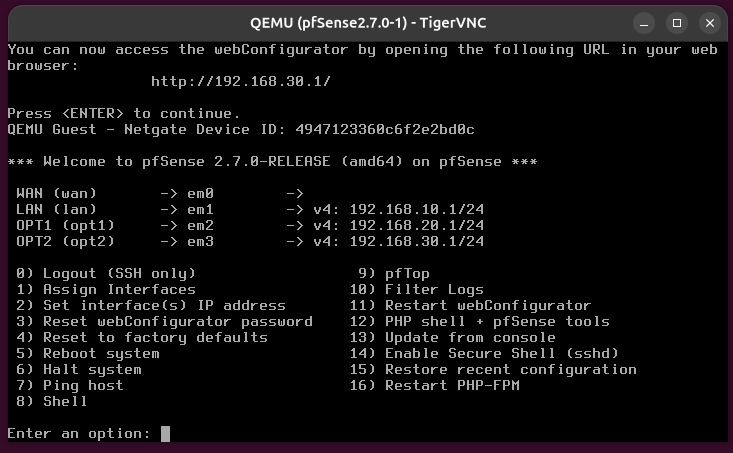
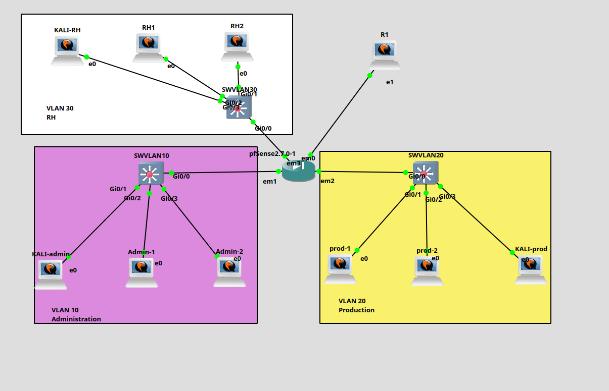
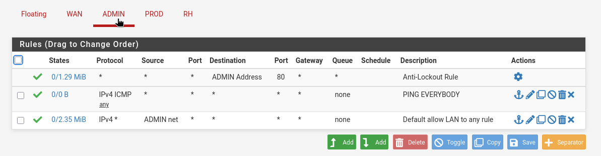
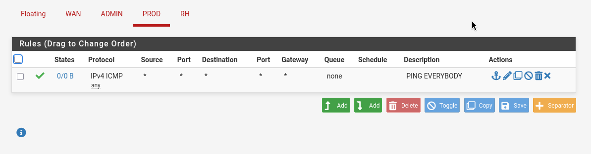
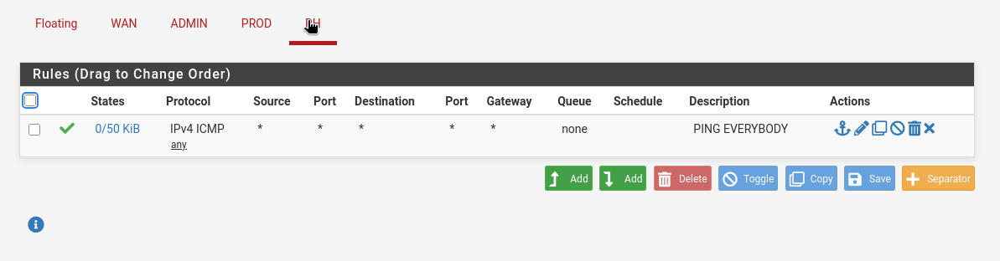
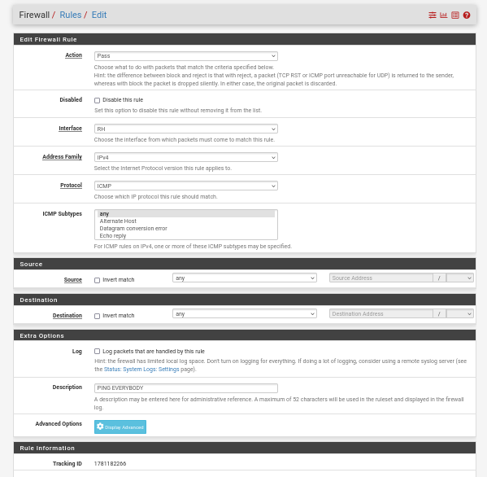

# Atelier 1 - Déploiement de pfSense

## Objectif de l'atelier

Cet atelier consiste à déployer pfSense dans l'infrastructure du groupe et à préparer le filtrage réseau entre les VLANs. L'objectif n'est pas encore de définir une politique de sécurité complète, mais de placer correctement le pare-feu dans l'architecture, de configurer ses interfaces et de vérifier que les machines passent bien par lui pour communiquer.

pfSense devient le point de passage entre les VLANs internes et le routeur physique. Cette position permet ensuite d'appliquer des règles de filtrage, de journaliser les flux et de valider le cloisonnement réseau.

## Environnement de départ

Chaque îlot dispose de l'architecture suivante :

| Élément | Rôle |
| --- | --- |
| 4 machines Linux | Postes clients, serveurs ou machines de test |
| 1 machine Kali Linux | Poste de test offensif et de vérification des flux |
| 1 routeur physique | Sortie réseau ou interconnexion avec le reste de l'infrastructure |
| VLAN 10 | Réseau déjà configuré lors de l'itération 1 |
| VLAN 20 | Réseau déjà configuré lors de l'itération 1 |
| pfSense | Pare-feu placé entre les VLANs et le routeur physique |

Les VLANs et l'adressage configurés lors de l'itération 1 sont réutilisés. Avant de modifier la passerelle des machines, il faut donc relever les adresses existantes, les masques, les VLANs utilisés et l'adresse du routeur physique.

## Position de pfSense dans l'architecture

pfSense doit être placé entre les réseaux internes et le routeur physique :

```text
VLAN 10 ----\
             \ 
              pfSense ---- Routeur physique ---- Réseau amont
             /
VLAN 20 ----/
```

Dans cette architecture :

- les machines du VLAN 10 utilisent l'adresse pfSense du VLAN 10 comme passerelle ;
- les machines du VLAN 20 utilisent l'adresse pfSense du VLAN 20 comme passerelle ;
- pfSense utilise son interface WAN pour joindre le routeur physique ;
- le routeur physique ne doit plus être la passerelle directe des machines internes.

## Rappel important

pfSense utilise FreeBSD comme système d'exploitation de base, et non Linux. Les noms d'interfaces ne sont donc pas du type `eth0`, `ens33` ou `enp0s3`.

On peut rencontrer des noms comme :

| Exemple | Signification possible |
| --- | --- |
| `em0` | Interface Intel émulée ou physique |
| `igb0` | Interface Intel Gigabit |
| `vtnet0` | Interface VirtIO |
| `re0` | Interface Realtek |

Il faut donc identifier les interfaces à partir de leur adresse MAC, de leur ordre de connexion ou des informations affichées par pfSense.

## Interfaces à configurer

La configuration minimale attendue comporte trois interfaces :

| Interface pfSense | Rôle | Exemple d'adressage |
| --- | --- | --- |
| WAN | Liaison vers le routeur physique | Adresse du réseau amont |
| VLAN 10 | Passerelle du VLAN 10 | `192.168.10.1/24` |
| VLAN 20 | Passerelle du VLAN 20 | `192.168.20.1/24` |

Les adresses exactes doivent correspondre au plan d'adressage de l'itération 1. Si le routeur Linux ou le routeur physique utilisait déjà `192.168.10.1` et `192.168.20.1`, ces adresses peuvent être reprises par pfSense après adaptation de l'architecture.

## Cas pratique GNS3 - interfaces `em0` à `em6`

Dans GNS3, il est possible que pfSense dispose de plusieurs interfaces visibles :

| Interface | Rôle prévu |
| --- | --- |
| `em0` | RI, WAN ou réseau amont |
| `em1`, `em2`, `em3` | Machines du VLAN 10 Administration |
| `em4`, `em5`, `em6` | Machines du VLAN 20 Production |

Point important : pfSense ne transforme pas automatiquement plusieurs interfaces en ports de switch. Si `em1`, `em2` et `em3` sont branchées à trois machines différentes, elles ne sont pas dans le même réseau simplement parce qu'on les appelle toutes "VLAN 10". Il faut soit utiliser un switch externe dans GNS3, soit créer un bridge dans pfSense.

### Option recommandée : utiliser deux switches GNS3

La solution la plus simple pour l'atelier consiste à utiliser un switch GNS3 par VLAN :

```text
RI / routeur physique
        |
      em0
     pfSense
      /   \
   em1     em4
    |       |
Switch    Switch
VLAN 10   VLAN 20
  | | |     | | |
Kali Admin Prod Kali
```

Dans ce cas, pfSense n'utilise qu'une interface par réseau :

| Interface pfSense | Rôle | Adresse conseillée |
| --- | --- | --- |
| `em0` | WAN / RI | DHCP ou adresse du réseau amont |
| `em1` | LAN / VLAN 10 | `192.168.10.1/24` |
| `em4` | OPT1 / VLAN 20 | `192.168.20.1/24` |

Les machines du VLAN 10 sont toutes reliées au switch VLAN 10. Les machines du VLAN 20 sont toutes reliées au switch VLAN 20. pfSense reste alors dans son rôle principal : routeur, pare-feu et passerelle entre les réseaux.

### Option possible : créer des bridges dans pfSense

Si l'on veut garder le câblage avec plusieurs interfaces directement connectées à pfSense, il faut créer des bridges :

| Bridge | Interfaces membres | Adresse du bridge |
| --- | --- | --- |
| `BRIDGE10` | `em1`, `em2`, `em3` | `192.168.10.1/24` |
| `BRIDGE20` | `em4`, `em5`, `em6` | `192.168.20.1/24` |

Dans ce cas, les adresses IP doivent être configurées sur les bridges, pas sur chaque interface membre. Les interfaces `em1`, `em2`, `em3`, `em4`, `em5` et `em6` jouent seulement le rôle de ports raccordés au bridge.

Depuis l'interface Web pfSense :

1. Aller dans `Interfaces > Assignments`.
2. Ajouter les interfaces optionnelles `em2`, `em3`, `em4`, `em5`, `em6`.
3. Aller dans `Interfaces > Assignments > Bridges`.
4. Créer un bridge avec `em1`, `em2`, `em3` pour le VLAN 10.
5. Créer un bridge avec `em4`, `em5`, `em6` pour le VLAN 20.
6. Assigner les bridges comme interfaces pfSense.
7. Configurer `BRIDGE10` en `192.168.10.1/24`.
8. Configurer `BRIDGE20` en `192.168.20.1/24`.

Pour un premier atelier, l'option avec deux switches GNS3 reste plus lisible et plus proche d'une architecture réseau classique.

## Configuration depuis la console pfSense

Au démarrage, pfSense affiche un menu texte. Les deux entrées les plus utiles au début sont :

| Option | Utilisation |
| --- | --- |
| `1) Assign Interfaces` | Associer `em0`, `em1`, `em4`, etc. aux rôles WAN, LAN et OPT |
| `2) Set interface(s) IP address` | Configurer les adresses IP des interfaces |

### Assignation des interfaces

Pour l'architecture recommandée avec deux switches GNS3 :

```text
WAN  -> em0
LAN  -> em1
OPT1 -> em4
```

Pour l'architecture minimale temporaire visible au premier démarrage, pfSense peut proposer :

```text
WAN -> em0
LAN -> em1
```

Il faut ensuite ajouter l'interface du VLAN 20 (`em4` ou le bridge correspondant) depuis l'interface Web, ou réassigner les interfaces depuis le menu console.

### Configuration du LAN VLAN 10

Dans `2) Set interface(s) IP address`, choisir l'interface LAN.

Réponses typiques pour le VLAN 10 :

```text
Configure IPv4 address LAN interface via DHCP? n
Enter the new LAN IPv4 address: 192.168.10.1
Enter the new LAN IPv4 subnet bit count: 24
For a LAN, press <ENTER> for none: [Entrée]
Configure IPv6 address LAN interface via DHCP6? n
Enter the new LAN IPv6 address: [Entrée]
Do you want to enable the DHCP server on LAN? y
Enter the start address of the IPv4 client address range: 192.168.10.100
Enter the end address of the IPv4 client address range: 192.168.10.200
```

Point important : lorsqu'il demande une passerelle amont pour le LAN, il faut appuyer sur `Entrée`. Une interface LAN n'a pas de passerelle amont. C'est elle qui devient la passerelle des machines du VLAN 10.

La plage DHCP `192.168.10.100` à `192.168.10.200` permet de laisser les adresses basses pour les équipements fixes :

| Adresse | Usage possible |
| --- | --- |
| `192.168.10.1` | pfSense LAN |
| `192.168.10.10` | Admin-1 statique |
| `192.168.10.11` | Admin-2 statique |
| `192.168.10.100` à `192.168.10.200` | Clients DHCP |

Si pfSense propose de repasser le WebConfigurator en HTTP, garder HTTPS en répondant `n`, sauf consigne contraire du formateur.

### Configuration du VLAN 20

L'interface du VLAN 20 peut être configurée depuis l'interface Web ou depuis la console si elle est déjà assignée.

Exemple de configuration :

```text
Interface : OPT1 / VLAN 20
Adresse   : 192.168.20.1
Masque    : 24
Passerelle amont : aucune
DHCP      : optionnel, par exemple 192.168.20.100 à 192.168.20.200
```

Comme pour le LAN, l'interface VLAN 20 ne doit pas avoir de passerelle amont. Les machines de production utiliseront `192.168.20.1` comme passerelle.

### Configuration du VLAN 30 RH

Pour l'exercice d'approfondissement, un troisième réseau peut être ajouté pour représenter le service RH.

Dans le lab actuel, le VLAN 30 est raccordé à l'interface `em3` de pfSense :

```text
Interface : OPT2 / VLAN 30 / RH
Adresse   : 192.168.30.1
Masque    : 24
Passerelle amont : aucune
DHCP      : 192.168.30.10 à 192.168.30.254
```

Depuis la console pfSense, l'état attendu ressemble à ceci :

```text
WAN  (wan)  -> em0
LAN  (lan)  -> em1  -> v4: 192.168.10.1/24
OPT1 (opt1) -> em2  -> v4: 192.168.20.1/24
OPT2 (opt2) -> em3  -> v4: 192.168.30.1/24
```



Point d'attention : si les machines RH sont reliées à un switch simple GNS3, il faut utiliser `em3` comme interface physique non taggée. Il ne faut pas créer un VLAN taggé 30 sur `em3`, sauf si le switch entre pfSense et les machines transporte réellement des trames taggées.

Symptôme typique d'une erreur de raccordement ou de VLAN taggé : les machines RH se ping entre elles, reçoivent une adresse DHCP en `192.168.30.0/24`, mais ne ping pas `192.168.30.1`. Dans ce cas, vérifier :

- le câble entre le switch RH et `em3` ;
- que `em3` est bien assignée à `OPT2` ;
- que l'interface `OPT2` est activée ;
- que l'adresse `192.168.30.1/24` est portée par `OPT2` ;
- qu'aucun VLAN taggé inutile n'a été créé sur `em3`.

### Configuration des machines clientes

Si le DHCP est activé sur pfSense, les machines peuvent récupérer leur configuration automatiquement.

Sinon, configurer les adresses à la main.

Exemple pour une machine du VLAN 10 :

```bash
sudo ip addr add 192.168.10.10/24 dev eth0
sudo ip route replace default via 192.168.10.1
```

Exemple pour une machine du VLAN 20 :

```bash
sudo ip addr add 192.168.20.10/24 dev eth0
sudo ip route replace default via 192.168.20.1
```

Exemple pour une machine du VLAN 30 :

```bash
sudo ip addr add 192.168.30.10/24 dev eth0
sudo ip route replace default via 192.168.30.1
```

Adapter l'adresse IP de chaque machine pour éviter les doublons.

### Désactiver le DHCP sur R1 sous Debian

Si R1 était utilisé comme routeur ou serveur DHCP lors de l'itération précédente, il faut désactiver son service DHCP pour éviter qu'il distribue des adresses à la place de pfSense.

Sur R1, identifier le service DHCP actif :

```bash
systemctl list-units --type=service | grep -Ei 'dhcp|dnsmasq'
```

Vérifier aussi les paquets installés :

```bash
dpkg -l | grep -Ei 'isc-dhcp|kea|dnsmasq'
```

Cas le plus courant avec `isc-dhcp-server` :

```bash
sudo systemctl stop isc-dhcp-server
sudo systemctl disable isc-dhcp-server
sudo systemctl status isc-dhcp-server
```

Si le DHCP était fourni par `dnsmasq` :

```bash
sudo systemctl stop dnsmasq
sudo systemctl disable dnsmasq
sudo systemctl status dnsmasq
```

Si le DHCP était fourni par Kea :

```bash
sudo systemctl stop kea-dhcp4-server
sudo systemctl disable kea-dhcp4-server
sudo systemctl status kea-dhcp4-server
```

Après désactivation, renouveler l'adresse IP sur une machine cliente ou redémarrer son interface réseau. La passerelle reçue doit être pfSense :

```bash
ip addr
ip route
```

Résultat attendu pour le VLAN 10 :

```text
default via 192.168.10.1
```

Résultat attendu pour le VLAN 20 :

```text
default via 192.168.20.1
```

L'objectif est d'avoir un seul serveur DHCP actif par VLAN. Dans cet atelier, pfSense doit devenir la source principale pour les adresses IP, les passerelles et, si configuré, les serveurs DNS.

### Règles firewall pfSense de validation

Par défaut, pfSense filtre les flux à l'entrée de chaque interface. Une règle placée dans l'onglet `ADMIN` concerne donc le trafic qui entre dans pfSense depuis le réseau Administration. Une règle placée dans l'onglet `PROD` concerne le trafic qui entre depuis le réseau Production. Une règle placée dans l'onglet `RH` concerne le trafic qui entre depuis le réseau RH.

Pour valider rapidement la connectivité pendant le TP, on peut créer des règles temporaires simples dans `Firewall > Rules`.

Sur l'interface `ADMIN` :

| Action | Protocole | Source | Destination | Description |
| --- | --- | --- | --- | --- |
| Pass | IPv4 ICMP | any | any | `PING EVERYBODY` |
| Pass | IPv4 any | `ADMIN net` | any | `Default allow LAN to any rule` |

Sur l'interface `PROD` :

| Action | Protocole | Source | Destination | Description |
| --- | --- | --- | --- | --- |
| Pass | IPv4 ICMP | any | any | `PING EVERYBODY` |

Sur l'interface `RH` :

| Action | Protocole | Source | Destination | Description |
| --- | --- | --- | --- | --- |
| Pass | IPv4 ICMP | any | any | `PING EVERYBODY` |

Paramètres de la règle ICMP :

```text
Action        : Pass
Interface     : ADMIN, PROD ou RH selon l'onglet
Address Family: IPv4
Protocol      : ICMP
ICMP Subtypes : any
Source        : any
Destination   : any
Description   : PING EVERYBODY
```

Ces règles servent uniquement à vérifier que le routage inter-VLAN fonctionne. Une fois les tests terminés, il faut remplacer les règles trop larges par des règles plus restrictives correspondant aux besoins réels.

Exemple de logique de durcissement :

| Besoin | Règle possible |
| --- | --- |
| Administration vers tous les réseaux | Autoriser `ADMIN net` vers les destinations nécessaires |
| Production vers Administration | Bloquer par défaut, sauf besoin explicite |
| RH vers Production | Autoriser seulement les services nécessaires |
| Ping de diagnostic | Autoriser ICMP temporairement ou seulement depuis le VLAN Administration |

## Déroulement

### 1. Démarrer pfSense

Démarrer la machine pfSense et accéder à la console. Au premier lancement, pfSense peut demander d'assigner les interfaces réseau.

Avant de valider, relever :

- le nombre d'interfaces détectées ;
- les noms FreeBSD des interfaces ;
- les adresses MAC associées ;
- le lien physique ou virtuel correspondant à chaque réseau.

### 2. Identifier les interfaces disponibles

Depuis la console pfSense, observer la liste des interfaces proposées. L'objectif est d'associer chaque interface à son usage :

| Usage | Interface à identifier |
| --- | --- |
| WAN | Interface reliée au routeur physique |
| VLAN 10 | Interface ou sous-interface reliée au VLAN 10 |
| VLAN 20 | Interface ou sous-interface reliée au VLAN 20 |

Si les VLANs sont transportés sur un lien trunk, il faut créer des interfaces VLAN dans pfSense à partir de l'interface physique concernée. Si chaque VLAN arrive sur une interface séparée, l'association se fait directement par interface.

### 3. Configurer le WAN

Configurer l'interface WAN vers le routeur physique.

Deux cas sont possibles :

| Cas | Configuration |
| --- | --- |
| Réseau amont en DHCP | pfSense reçoit automatiquement son adresse WAN |
| Réseau amont statique | Saisir l'adresse IP, le masque et la passerelle du routeur physique |

Après configuration, pfSense doit pouvoir joindre sa passerelle WAN.

### 4. Configurer l'interface VLAN 10

Configurer l'interface associée au VLAN 10 avec l'adresse prévue dans le plan d'adressage.

Exemple :

```text
Interface : VLAN 10
Adresse   : 192.168.10.1
Masque    : /24
```

Cette adresse devient la passerelle par défaut des machines du VLAN 10.

### 5. Configurer l'interface VLAN 20

Configurer l'interface associée au VLAN 20 avec l'adresse prévue dans le plan d'adressage.

Exemple :

```text
Interface : VLAN 20
Adresse   : 192.168.20.1
Masque    : /24
```

Cette adresse devient la passerelle par défaut des machines du VLAN 20.

### 6. Configurer les passerelles des machines

Sur chaque machine Linux, vérifier l'adresse IP, le masque et la passerelle :

```bash
ip addr
ip route
```

La route par défaut doit pointer vers pfSense.

Exemple pour une machine du VLAN 10 :

```text
default via 192.168.10.1
```

Exemple pour une machine du VLAN 20 :

```text
default via 192.168.20.1
```

Si besoin, adapter temporairement la passerelle avec :

```bash
sudo ip route replace default via 192.168.10.1
```

ou :

```bash
sudo ip route replace default via 192.168.20.1
```

La configuration permanente dépend de la distribution et du gestionnaire réseau utilisé.

### 7. Vérifier la connectivité réseau

Tester la connectivité étape par étape afin d'identifier précisément l'origine d'un éventuel problème.

Depuis une machine du VLAN 10 :

```bash
ping 192.168.10.1
ping 192.168.20.1
ping 192.168.20.10
```

Depuis une machine du VLAN 20 :

```bash
ping 192.168.20.1
ping 192.168.10.1
ping 192.168.10.10
```

Depuis pfSense, vérifier aussi la connectivité vers le routeur physique et, si disponible, vers une adresse extérieure.

## Accès à l'interface Web pfSense

Depuis une machine placée dans un VLAN interne autorisé, ouvrir un navigateur vers l'adresse de pfSense :

```text
https://192.168.10.1
```

ou :

```text
https://192.168.20.1
```

Selon la configuration initiale, l'accès Web peut être autorisé seulement depuis certaines interfaces. Pour l'administration, il est préférable d'utiliser le VLAN d'administration si celui-ci existe dans le plan d'adressage.

Après connexion, vérifier :

- les interfaces configurées ;
- les adresses IP ;
- la passerelle WAN ;
- l'état des liens ;
- les règles de pare-feu par défaut ;
- les journaux système.

## Vérification des flux avec Kali Linux

Kali Linux sert à observer les flux accessibles avant la mise en place d'un filtrage restrictif.

### Découverte réseau

Identifier le réseau local :

```bash
ip addr
ip route
```

Scanner un VLAN connu :

```bash
nmap -sn 192.168.10.0/24
nmap -sn 192.168.20.0/24
```

### Scan de ports

Tester les ports exposés sur une machine cible :

```bash
nmap -sV 192.168.20.10
```

Tester les ports accessibles sur pfSense :

```bash
nmap -sV 192.168.10.1
```

Ces tests servent de point de référence. Ils permettront ensuite de comparer l'état du réseau avant et après la mise en place des règles de filtrage.

### Tests simples avec Scapy

Scapy peut être utilisé pour générer des paquets simples et observer les réponses :

```bash
sudo scapy
```

Exemple de test ICMP :

```python
sr1(IP(dst="192.168.20.10")/ICMP())
```

L'objectif n'est pas d'attaquer l'infrastructure, mais de vérifier quels flux sont possibles avant durcissement.

## Points de contrôle

| Contrôle | Résultat attendu |
| --- | --- |
| pfSense démarre correctement | Console accessible |
| Interfaces identifiées | WAN, VLAN 10, VLAN 20 et VLAN 30 repérés |
| Adresses IP configurées | Chaque interface possède l'adresse prévue |
| Passerelles machines | Les machines utilisent pfSense comme passerelle |
| Ping vers pfSense | Fonctionnel depuis chaque VLAN |
| Ping inter-VLAN | Fonctionnel avant filtrage restrictif, selon règles par défaut |
| Interface Web | Accessible depuis le réseau d'administration |
| Tests Kali | Flux accessibles documentés |

## Documentation attendue

À la fin de l'atelier, chaque groupe doit documenter l'architecture mise à jour avec le plan réellement utilisé pendant le TP.

La documentation doit contenir :

- un schéma réseau indiquant pfSense, R1, les VLANs et les machines ;
- le plan d'adressage utilisé ;
- les interfaces pfSense et leur rôle ;
- les passerelles configurées sur les machines ;
- l'état du DHCP : pfSense actif, DHCP de R1 désactivé si R1 est sous Debian ;
- les tests de connectivité réalisés ;
- les flux observés depuis Kali Linux avant filtrage ;
- les problèmes rencontrés et les corrections appliquées.

## Plan d'architecture actuel

Dans le plan utilisé pendant l'atelier, pfSense est placé entre R1 et les trois réseaux internes :



```text
                              R1 / RI
                                |
                             em0 WAN
                             pfSense
                  /-------------|-------------\
              em1 LAN        em2 OPT1       em3 OPT2
             VLAN 10         VLAN 20        VLAN 30
          Administration    Production         RH
              |               |              |
          SWVLAN10        SWVLAN20       SWVLAN30
          /   |   \        /   |   \      /   |   \
   Kali-admin Admin-1 Admin-2 Prod-1 Prod-2 Kali-prod Kali-RH RH1 RH2
```

Rôle des interfaces :

| Interface pfSense | Zone | Rôle |
| --- | --- | --- |
| `em0` | WAN / RI | Liaison vers R1 ou le réseau amont |
| `em1` | VLAN 10 / ADMIN | Liaison vers le switch Administration |
| `em2` | VLAN 20 / PROD | Liaison vers le switch Production |
| `em3` | VLAN 30 / RH | Liaison vers le switch RH |

Chaque VLAN est raccordé à son propre switch GNS3. Les ports des machines sont donc dans le même domaine de niveau 2 que l'interface pfSense correspondante.

| Switch | VLAN | Machines |
| --- | --- | --- |
| `SWVLAN10` | 10 / ADMIN | Kali-admin, Admin-1, Admin-2 |
| `SWVLAN20` | 20 / PROD | Prod-1, Prod-2, Kali-prod |
| `SWVLAN30` | 30 / RH | Kali-RH, RH1, RH2 |

Dans ce plan, il n'est pas nécessaire de créer des bridges pfSense. Les bridges ne sont utiles que si plusieurs interfaces physiques pfSense doivent appartenir au même réseau.

## Plan d'adressage actuel

| Zone | VLAN | Réseau | Passerelle pfSense | Exemple de machine |
| --- | --- | --- | --- | --- |
| Administration | 10 | `192.168.10.0/24` | `192.168.10.1` | Kali-admin, Admin-1, Admin-2 |
| Production | 20 | `192.168.20.0/24` | `192.168.20.1` | Prod-1, Prod-2, Kali-prod |
| RH | 30 | `192.168.30.0/24` | `192.168.30.1` | Kali-RH, RH1, RH2 |
| WAN / RI | - | Réseau amont | R1 / RI | `em0` pfSense |

Exemple d'adressage fixe possible :

| Machine | VLAN | Adresse IP | Passerelle |
| --- | --- | --- | --- |
| pfSense VLAN 10 | 10 | `192.168.10.1/24` | Aucune passerelle sur l'interface LAN |
| Kali-1 | 10 | `192.168.10.10/24` | `192.168.10.1` |
| Admin-1 | 10 | `192.168.10.11/24` | `192.168.10.1` |
| Admin-2 | 10 | `192.168.10.12/24` | `192.168.10.1` |
| pfSense VLAN 20 | 20 | `192.168.20.1/24` | Aucune passerelle sur l'interface LAN |
| Prod-1 | 20 | `192.168.20.10/24` | `192.168.20.1` |
| Prod-2 | 20 | `192.168.20.11/24` | `192.168.20.1` |
| Kali-prod | 20 | `192.168.20.12/24` | `192.168.20.1` |
| pfSense VLAN 30 | 30 | `192.168.30.1/24` | Aucune passerelle sur l'interface LAN |
| Kali-RH | 30 | `192.168.30.10/24` | `192.168.30.1` |
| RH1 | 30 | `192.168.30.11/24` | `192.168.30.1` |
| RH2 | 30 | `192.168.30.12/24` | `192.168.30.1` |

Exemple de plages DHCP pfSense :

| VLAN | Plage DHCP | Remarque |
| --- | --- | --- |
| VLAN 10 | `192.168.10.100` à `192.168.10.200` | Clients du réseau Administration |
| VLAN 20 | `192.168.20.100` à `192.168.20.200` | Clients du réseau Production |
| VLAN 30 | `192.168.30.10` à `192.168.30.254` | Clients du réseau RH |

R1 sous Debian ne doit plus distribuer d'adresses DHCP sur les VLANs internes. Le DHCP doit être arrêté sur R1 afin d'éviter qu'une machine reçoive une mauvaise passerelle.

## Règles firewall actuelles

Les règles pfSense se configurent sur l'interface d'entrée du trafic. Par exemple, pour autoriser RH à pinguer les autres réseaux, la règle doit être créée dans l'onglet `RH`.

Règles de validation utilisées pendant l'atelier :

| Onglet pfSense | Action | Protocole | Source | Destination | Description |
| --- | --- | --- | --- | --- | --- |
| `ADMIN` | Pass | IPv4 ICMP | any | any | `PING EVERYBODY` |
| `ADMIN` | Pass | IPv4 any | `ADMIN net` | any | `Default allow LAN to any rule` |
| `PROD` | Pass | IPv4 ICMP | any | any | `PING EVERYBODY` |
| `RH` | Pass | IPv4 ICMP | any | any | `PING EVERYBODY` |







Cette configuration permet de valider les pings entre les VLANs. Elle n'est pas encore une politique de sécurité finale : ICMP est volontairement large pour faciliter les tests.

Exemple de configuration de la règle ICMP `PING EVERYBODY` :



| Paramètre | Valeur |
| --- | --- |
| Action | `Pass` |
| Interface | `ADMIN`, `PROD` ou `RH` selon l'onglet |
| Address Family | `IPv4` |
| Protocol | `ICMP` |
| ICMP Subtypes | `any` |
| Source | `any` |
| Destination | `any` |
| Description | `PING EVERYBODY` |

Une fois les tests de connectivité validés, la logique attendue est :

| Flux | Décision de sécurité recommandée |
| --- | --- |
| ADMIN vers PROD/RH | Autoriser seulement les flux d'administration nécessaires |
| PROD vers ADMIN | Bloquer par défaut |
| RH vers ADMIN | Bloquer par défaut, sauf besoin justifié |
| RH vers PROD | Autoriser uniquement les services nécessaires |
| ICMP | Garder temporairement pour diagnostic ou limiter au VLAN ADMIN |

## Tests de validation à documenter

| Test | Commande | Résultat attendu |
| --- | --- | --- |
| Vérifier l'adresse d'une machine | `ip addr` | Adresse dans le bon réseau |
| Vérifier la passerelle | `ip route` | Route par défaut vers pfSense |
| Joindre pfSense depuis le VLAN 10 | `ping 192.168.10.1` | Réponse ICMP |
| Joindre pfSense depuis le VLAN 20 | `ping 192.168.20.1` | Réponse ICMP |
| Joindre pfSense depuis le VLAN 30 | `ping 192.168.30.1` | Réponse ICMP |
| Tester le routage inter-VLAN | `ping 192.168.20.10` depuis le VLAN 10 | Réponse si les règles pfSense l'autorisent |
| Tester le retour inter-VLAN | `ping 192.168.10.10` depuis le VLAN 20 | Réponse si les règles pfSense l'autorisent |
| Tester RH vers Administration | `ping 192.168.10.11` depuis le VLAN 30 | Réponse si la règle ICMP RH l'autorise |
| Accéder à pfSense | `https://192.168.10.1` | Interface Web accessible depuis le VLAN d'administration |

## Aller plus loin

Ajouter un troisième VLAN et configurer son interface dans pfSense.

Étapes possibles :

- créer ou raccorder le VLAN supplémentaire ;
- déclarer l'interface VLAN dans pfSense ;
- lui attribuer une adresse IP ;
- configurer une machine de test dans ce VLAN ;
- vérifier la passerelle et la connectivité ;
- documenter les flux accessibles.

## Synthèse personnelle

pfSense devient le point central de contrôle entre les VLANs et le routeur physique. Une fois les interfaces correctement associées et les passerelles des machines modifiées, tous les flux inter-VLAN peuvent être observés et filtrés depuis un seul équipement.

La difficulté principale de l'atelier est l'identification des interfaces. Comme pfSense repose sur FreeBSD, les noms d'interfaces diffèrent de ceux rencontrés sous Linux. Il faut donc raisonner à partir des liens réseau, des adresses MAC et du plan d'adressage plutôt qu'à partir des noms habituels comme `eth0`.

## Ressources

- pfSense Documentation : <https://docs.netgate.com/pfsense/>
- pfSense Interfaces Overview : <https://docs.netgate.com/pfsense/en/latest/interfaces/>
- Scapy - Simple one-liners : <https://scapy.readthedocs.io/en/latest/usage.html#simple-one-liners>

## Notions acquises

- Rôle de pfSense comme pare-feu inter-VLAN
- Différence entre interface WAN et interfaces internes
- Identification des interfaces FreeBSD
- Configuration des passerelles sur les machines Linux
- Vérification de la connectivité avant filtrage
- Utilisation de Kali Linux pour établir un état initial des flux accessibles
