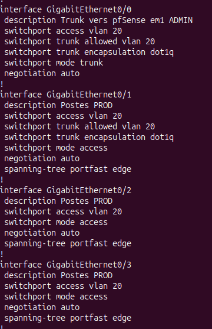
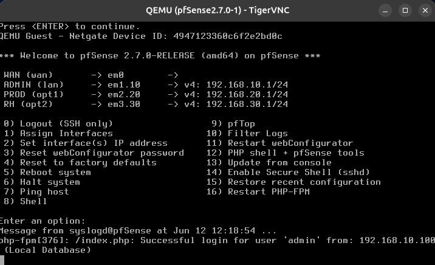
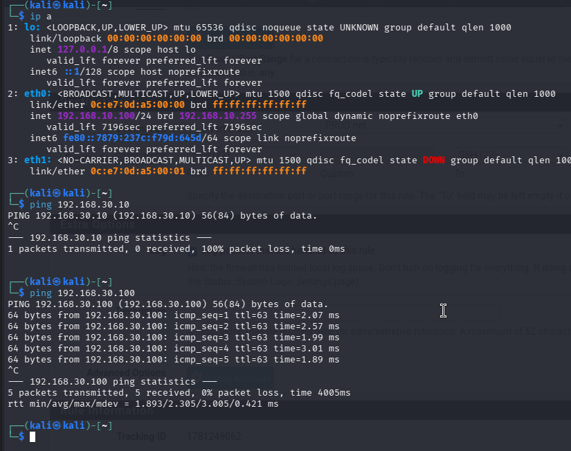

# Atelier 1 - Déploiement de pfSense avec vrais VLANs

## Objectif de l'atelier

Cet atelier consiste à déployer pfSense comme passerelle et pare-feu central entre trois VLANs réels :

- VLAN 10 : Administration ;
- VLAN 20 : Production ;
- VLAN 30 : RH.

L'objectif est de mettre en place une infrastructure propre avant l'atelier 2, qui portera sur les règles de filtrage et les ACL. Dans cette version, les VLANs sont réellement transportés en 802.1Q entre pfSense et les switches.

## Principe retenu

La topologie utilise trois switches GNS3, un par VLAN. Chaque switch est relié à pfSense par un lien trunk. Les postes sont branchés sur des ports access.

```text
                     R1 / réseau amont
                            |
                          em0
                        pfSense
          em1.10 -------- em2.20 -------- em3.30
            |               |               |
        SWVLAN10        SWVLAN20        SWVLAN30
          ADMIN            PROD             RH
        /   |   \        /   |   \       /   |   \
     Kali  D1  D2    D1  D2  Kali   Kali  RH1  RH2
```

Le schéma GNS3 suivant sert de référence pour les ateliers 1 et 2. La topologie ne change pas entre le déploiement pfSense et la configuration des ACL.


Dans cette architecture :

- pfSense route entre les VLANs ;
- chaque switch transporte un seul VLAN utilisateur ;
- le port switch vers pfSense est en trunk ;
- les ports des machines sont en access ;
- chaque machine utilise pfSense comme passerelle par défaut.

## Plan d'adressage

| Zone | VLAN | Interface pfSense | Réseau | Passerelle |
| --- | --- | --- | --- | --- |
| Administration | 10 | `em1.10` / `ADMIN` | `192.168.10.0/24` | `192.168.10.1` |
| Production | 20 | `em2.20` / `PROD` | `192.168.20.0/24` | `192.168.20.1` |
| RH | 30 | `em3.30` / `RH` | `192.168.30.0/24` | `192.168.30.1` |
| WAN | - | `em0` | réseau amont | selon le routeur |

Exemple de postes :

| VLAN | Machines |
| --- | --- |
| VLAN 10 | `KALI-admin`, `Admin-1`, `Admin-2` |
| VLAN 20 | `prod-1`, `prod-2`, `KALI-prod` |
| VLAN 30 | `KALI-RH`, `RH1`, `RH2` |

## Rappel sur les interfaces pfSense

pfSense utilise FreeBSD. Les interfaces ne s'appellent donc pas `eth0` ou `ens33`, mais plutôt :

| Exemple | Signification possible |
| --- | --- |
| `em0` | Interface Intel émulée ou virtuelle |
| `em1` | Interface physique utilisée comme parent VLAN |
| `em1.10` | Sous-interface VLAN 10 créée sur `em1` |
| `em2.20` | Sous-interface VLAN 20 créée sur `em2` |
| `em3.30` | Sous-interface VLAN 30 créée sur `em3` |

Le point important est le suffixe :

```text
em1.10 = VLAN 10 taggé sur em1
em2.20 = VLAN 20 taggé sur em2
em3.30 = VLAN 30 taggé sur em3
```

## Étape 1 - Câblage GNS3

Raccorder les équipements ainsi :

| Lien | Rôle |
| --- | --- |
| `pfSense em0` -> `R1` | WAN / réseau amont |
| `pfSense em1` -> `SWVLAN10 Gi0/0` | Trunk VLAN 10 |
| `pfSense em2` -> `SWVLAN20 Gi0/0` | Trunk VLAN 20 |
| `pfSense em3` -> `SWVLAN30 Gi0/0` | Trunk VLAN 30 |
| `SWVLAN10 Gi0/1-3` | Postes Administration |
| `SWVLAN20 Gi0/1-3` | Postes Production |
| `SWVLAN30 Gi0/1-3` | Postes RH |

## Étape 2 - Configuration des switches

Chaque switch transporte un seul VLAN utilisateur. Le port vers pfSense est en trunk, les ports vers les machines sont en access.

### Switch VLAN 10 - ADMIN

```text
enable
configure terminal

vlan 10
 name ADMIN

interface GigabitEthernet0/0
 description Trunk vers pfSense em1 ADMIN
 switchport trunk encapsulation dot1q
 switchport mode trunk
 switchport trunk allowed vlan 10
 no shutdown

interface range GigabitEthernet0/1 - 3
 description Postes ADMIN
 switchport mode access
 switchport access vlan 10
 spanning-tree portfast edge
 no shutdown

end
write memory
```

### Switch VLAN 20 - PROD

```text
enable
configure terminal

vlan 20
 name PROD

interface GigabitEthernet0/0
 description Trunk vers pfSense em2 PROD
 switchport trunk encapsulation dot1q
 switchport mode trunk
 switchport trunk allowed vlan 20
 no shutdown

interface range GigabitEthernet0/1 - 3
 description Postes PROD
 switchport mode access
 switchport access vlan 20
 spanning-tree portfast edge
 no shutdown

end
write memory
```

### Switch VLAN 30 - RH

```text
enable
configure terminal

vlan 30
 name RH

interface GigabitEthernet0/0
 description Trunk vers pfSense em3 RH
 switchport trunk encapsulation dot1q
 switchport mode trunk
 switchport trunk allowed vlan 30
 no shutdown

interface range GigabitEthernet0/1 - 3
 description Postes RH
 switchport mode access
 switchport access vlan 30
 spanning-tree portfast edge
 no shutdown

end
write memory
```

Si la commande `switchport mode trunk` est refusée avec un message sur l'encapsulation `Auto`, il faut saisir avant :

```text
switchport trunk encapsulation dot1q
```

### Vérification des switches

Sur chaque switch :

```text
show vlan brief
show interfaces trunk
show interfaces status
```

Résultat attendu :

- `Gi0/0` est en trunk ;
- le VLAN autorisé correspond au switch ;
- `Gi0/1`, `Gi0/2`, `Gi0/3` sont en access dans le bon VLAN ;
- les postes connectés apparaissent en `connected`.

La capture suivante montre un exemple de configuration switch pour un VLAN utilisateur avec un trunk vers pfSense et des ports access vers les postes.



Dans l'exemple illustré, le VLAN configuré est le VLAN 20. Pour le switch Production, la description attendue du trunk est `Trunk vers pfSense em2 PROD`. Le principe reste identique pour ADMIN et RH en adaptant le VLAN, l'interface pfSense et les descriptions.

## Étape 3 - Création des VLANs dans pfSense

Depuis l'interface Web pfSense :

```text
Interfaces > Assignments > VLANs
```

Créer les VLANs suivants :

| Parent | Tag VLAN | Description |
| --- | --- | --- |
| `em1` | `10` | `VLAN10_ADMIN` |
| `em2` | `20` | `VLAN20_PROD` |
| `em3` | `30` | `VLAN30_RH` |

Ensuite aller dans :

```text
Interfaces > Assignments
```

Ajouter les interfaces VLAN créées, puis les renommer :

| Interface créée | Nom pfSense | Adresse IPv4 |
| --- | --- | --- |
| `em1.10` | `ADMIN` | `192.168.10.1/24` |
| `em2.20` | `PROD` | `192.168.20.1/24` |
| `em3.30` | `RH` | `192.168.30.1/24` |

Pour chaque interface :

1. cocher `Enable interface` ;
2. configurer l'adresse IPv4 statique ;
3. ne pas définir de passerelle amont ;
4. sauvegarder ;
5. appliquer les changements.

Depuis la console pfSense, l'état attendu ressemble à ceci :

```text
WAN   (wan)  -> em0
ADMIN (lan)  -> em1.10 -> v4: 192.168.10.1/24
PROD  (opt1) -> em2.20 -> v4: 192.168.20.1/24
RH    (opt2) -> em3.30 -> v4: 192.168.30.1/24
```



## Étape 4 - Configuration DHCP dans pfSense

Activer un serveur DHCP par interface interne si les postes doivent recevoir automatiquement leur configuration.

Menu :

```text
Services > DHCP Server
```

### DHCP ADMIN

| Paramètre | Valeur |
| --- | --- |
| Interface | `ADMIN` |
| Range | `192.168.10.100` à `192.168.10.200` |
| Gateway | `192.168.10.1` |
| DNS | `192.168.10.1` ou DNS réel |

### DHCP PROD

| Paramètre | Valeur |
| --- | --- |
| Interface | `PROD` |
| Range | `192.168.20.100` à `192.168.20.200` |
| Gateway | `192.168.20.1` |
| DNS | `192.168.20.1` ou DNS réel |

### DHCP RH

| Paramètre | Valeur |
| --- | --- |
| Interface | `RH` |
| Range | `192.168.30.100` à `192.168.30.200` |
| Gateway | `192.168.30.1` |
| DNS | `192.168.30.1` ou DNS réel |

Point important : le champ `Gateway` doit être rempli. Sinon les machines reçoivent une adresse IP, mais aucune route par défaut. Elles peuvent alors ping les machines de leur VLAN, mais ne sortent pas vers les autres réseaux.

## Étape 5 - Configuration des machines Debian/Kali

Si le DHCP pfSense est utilisé, renouveler la configuration réseau sur les machines.

Sur Kali avec `dhcpcd` :

```bash
sudo ip addr flush dev eth0
sudo ip link set eth0 up
sudo dhcpcd eth0
```

Sur Debian selon les outils disponibles :

```bash
sudo ip addr flush dev eth0
sudo ip link set eth0 up
sudo dhclient eth0
```

Si `dhclient` n'est pas installé, utiliser une configuration IP fixe temporaire.

### Configuration fixe temporaire

Poste ADMIN :

```bash
sudo ip addr flush dev eth0
sudo ip addr add 192.168.10.10/24 dev eth0
sudo ip link set eth0 up
sudo ip route replace default via 192.168.10.1 dev eth0
```

Poste PROD :

```bash
sudo ip addr flush dev eth0
sudo ip addr add 192.168.20.10/24 dev eth0
sudo ip link set eth0 up
sudo ip route replace default via 192.168.20.1 dev eth0
```

Poste RH :

```bash
sudo ip addr flush dev eth0
sudo ip addr add 192.168.30.10/24 dev eth0
sudo ip link set eth0 up
sudo ip route replace default via 192.168.30.1 dev eth0
```

Vérifier :

```bash
ip -br addr
ip route
```

Résultat attendu pour une machine PROD :

```text
eth0 UP 192.168.20.x/24
default via 192.168.20.1 dev eth0
```

## Étape 6 - Règles firewall temporaires de validation

Avant d'appliquer la politique restrictive de l'atelier 2, créer des règles temporaires pour vérifier que le routage inter-VLAN fonctionne.

Menu :

```text
Firewall > Rules
```

Sur `ADMIN` :

| Action | Protocole | Source | Destination | Description |
| --- | --- | --- | --- | --- |
| Pass | IPv4 ICMP | `ADMIN net` | any | `PING EVERYBODY` |

Sur `PROD` :

| Action | Protocole | Source | Destination | Description |
| --- | --- | --- | --- | --- |
| Pass | IPv4 ICMP | `PROD net` | any | `PING EVERYBODY` |

Sur `RH` :

| Action | Protocole | Source | Destination | Description |
| --- | --- | --- | --- | --- |
| Pass | IPv4 ICMP | `RH net` | any | `PING EVERYBODY` |

Appliquer les changements avec `Apply Changes`.

Ces règles servent seulement à valider la connectivité. Elles seront remplacées par les ACL restrictives de l'atelier 2.

## Étape 7 - Tests de connectivité

Depuis une machine ADMIN :

```bash
ping 192.168.10.1
ping 192.168.20.1
ping 192.168.30.1
```

Depuis une machine PROD :

```bash
ping 192.168.20.1
ping 192.168.10.1
ping 192.168.30.1
```

Depuis une machine RH :

```bash
ping 192.168.30.1
ping 192.168.10.1
ping 192.168.20.1
```

Interprétation :

| Résultat | Analyse |
| --- | --- |
| La machine ping sa passerelle, mais pas les autres VLANs | Règles firewall pfSense à vérifier |
| La machine ne ping pas sa passerelle | Trunk, VLAN, interface pfSense ou IP client à vérifier |
| DHCP donne une IP mais pas de route par défaut | Gateway DHCP manquante dans pfSense |
| Deux IP apparaissent sur la même interface | Mélange DHCP/IP fixe ou service réseau à nettoyer |

La capture suivante montre une machine Kali ayant reçu une adresse DHCP dans le VLAN 10 et un ping réussi vers une machine du VLAN 30. Cela valide que le routage inter-VLAN passe bien par pfSense lorsque les routes et les règles temporaires sont correctes.



## Étape 8 - Vérifications utiles

### Sur pfSense

Vérifier les interfaces :

```text
ADMIN -> em1.10 -> 192.168.10.1/24
PROD  -> em2.20 -> 192.168.20.1/24
RH    -> em3.30 -> 192.168.30.1/24
```

Vérifier les logs firewall :

```text
Status > System Logs > Firewall
```

### Sur les switches

```text
show vlan brief
show interfaces trunk
show interfaces status
```

Sur chaque switch :

- `Gi0/0` doit être trunk ;
- le VLAN autorisé doit être le bon ;
- les ports `Gi0/1` à `Gi0/3` doivent être en access dans le bon VLAN.

### Sur les machines

```bash
ip -br addr
ip route
ping <passerelle_du_vlan>
```

## Problèmes fréquents

| Symptôme | Cause probable | Correction |
| --- | --- | --- |
| DHCP fonctionne mais la machine ne sort pas du VLAN | Gateway DHCP absente | Renseigner `Gateway` dans `Services > DHCP Server` |
| Les postes se pingent dans leur VLAN, mais pas pfSense | Trunk switch ou VLAN pfSense incorrect | Vérifier `show interfaces trunk` et `emX.VLAN` |
| pfSense affiche `em3.30`, mais le port switch est en access | Incohérence taggé/non taggé | Mettre le port vers pfSense en trunk |
| Le switch refuse `switchport mode trunk` | Encapsulation en `Auto` | Saisir `switchport trunk encapsulation dot1q` avant |
| Une machine a deux IP | Ancienne config IP + DHCP | Nettoyer l'interface ou choisir une seule méthode |
| Ping inter-VLAN bloqué malgré les routes | Règle firewall manquante | Ajouter une règle ICMP temporaire sur l'interface source |

## Synthèse

À la fin de l'atelier :

- pfSense est connecté au WAN via `em0` ;
- le VLAN 10 Administration passe par `em1.10` ;
- le VLAN 20 Production passe par `em2.20` ;
- le VLAN 30 RH passe par `em3.30` ;
- chaque switch a un trunk vers pfSense ;
- les postes sont sur des ports access ;
- les machines reçoivent une IP, une passerelle et éventuellement un DNS via pfSense ;
- le ping entre VLANs fonctionne avec les règles temporaires.

L'infrastructure est alors prête pour l'atelier 2 : mise en place d'une politique restrictive et d'ACL pfSense.
