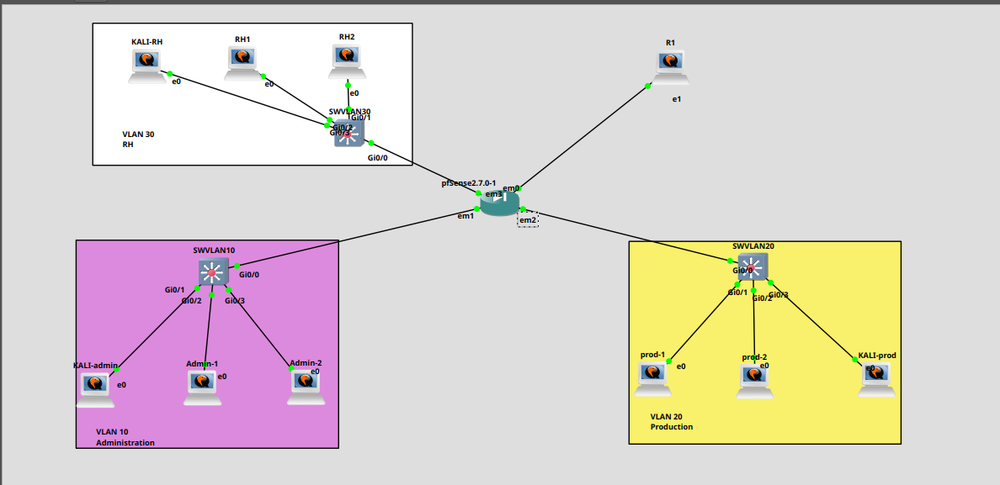
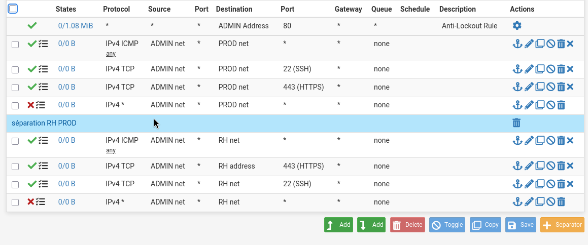
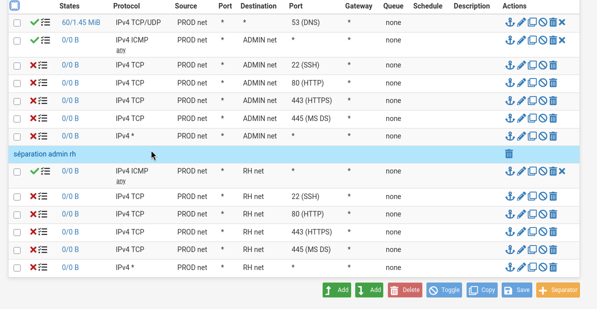
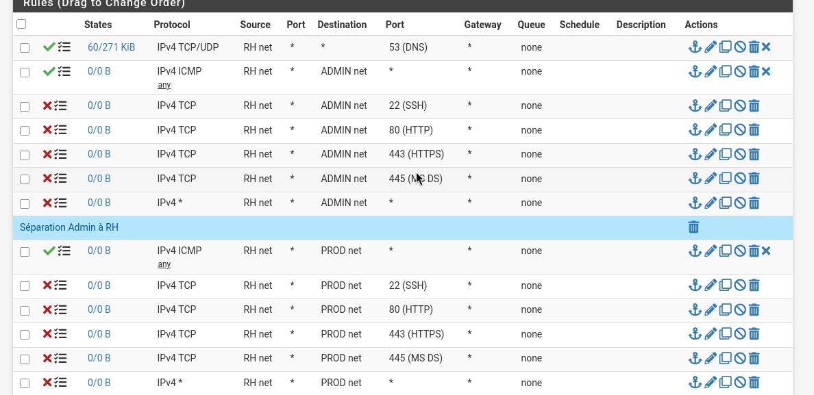
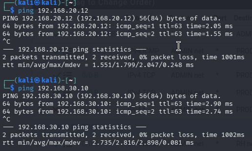
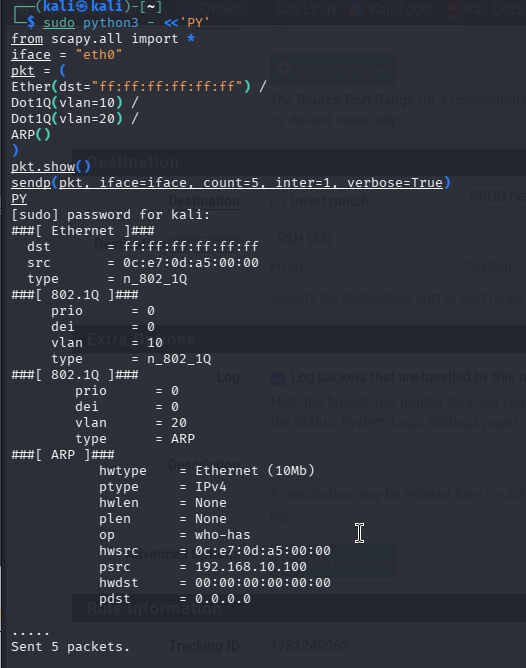
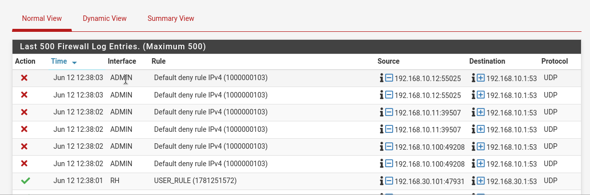

# Atelier 2 - Regles de filtrage et ACL avec pfSense

## Objectif de l'atelier

Cet atelier consiste a configurer des regles de filtrage reseau avec pfSense afin de controler les flux entre trois zones reseau : ADMIN, PROD et RH. Dans le lab, chaque zone correspond a un VLAN logique et dispose de son propre switch GNS3. La logique retenue est restrictive : tout ce qui n'est pas explicitement autorise doit etre bloque.

pfSense joue ici le role de pare-feu entre les trois interfaces internes `ADMIN`, `PROD` et `RH`. Les ACL sont donc implementees sous forme de regles firewall appliquees sur les interfaces pfSense.

## Rappel - ACL

Une ACL, pour Access Control List, est un ensemble de regles qui definit quels flux reseau sont autorises ou interdits entre des machines ou des reseaux.

Dans pfSense, les ACL correspondent aux regles presentes dans `Firewall > Rules`. Elles sont appliquees a l'entree des interfaces. Une regle placee sur l'interface `ADMIN` concerne donc le trafic qui entre dans pfSense depuis le switch du VLAN 10. Une regle placee sur `PROD` concerne le trafic qui entre depuis le switch du VLAN 20. Une regle placee sur `RH` concerne le trafic qui entre depuis le switch du VLAN 30.

## Architecture utilisee

L'atelier reprend l'architecture pfSense de l'atelier precedent :

| Zone | VLAN logique | Switch GNS3 | Interface pfSense | Reseau | Passerelle pfSense | Role |
| --- | --- | --- | --- | --- | --- | --- |
| Administration | VLAN 10 | `SWVLAN10` | `em1` / `ADMIN` | `192.168.10.0/24` | `192.168.10.1` | Postes d'administration et Kali |
| Production | VLAN 20 | `SWVLAN20` | `em2` / `PROD` | `192.168.20.0/24` | `192.168.20.1` | Serveurs ou postes de production |
| RH | VLAN 30 | `SWVLAN30` | `em3` / `RH` | `192.168.30.0/24` | `192.168.30.1` | Postes RH et Kali-RH |

Les tests principaux portent sur les flux entre le VLAN 10, le VLAN 20 et le VLAN 30.

Point important : dans cette topologie, pfSense est relie a trois switches differents, un par VLAN logique. Il n'y a pas de trunk 802.1Q vers pfSense dans le scenario retenu. Le filtrage se fait donc entre interfaces physiques pfSense, pas entre sous-interfaces VLAN taggees.




## Politique de securite retenue

La politique appliquee est la suivante :

- bloquer par defaut les flux entre les zones ADMIN, PROD et RH ;
- autoriser uniquement les flux necessaires ;
- autoriser ICMP entre VLANs pour les tests de connectivite ;
- autoriser SSH du VLAN 10 vers le VLAN 20 pour l'administration ;
- autoriser les flux d'administration necessaires du VLAN 10 vers le VLAN 30 RH ;
- bloquer SSH du VLAN 20 vers le VLAN 10 ;
- bloquer HTTP du VLAN 20 vers le VLAN 10 ;
- bloquer les flux non necessaires depuis RH vers ADMIN et PROD ;
- activer le logging sur les regles importantes.

Cette approche respecte le principe du moindre privilege : une machine de production ou RH ne doit pas pouvoir initier librement des connexions vers le reseau d'administration.

## Preparation dans pfSense

### 1. Acceder aux regles

Depuis l'interface Web pfSense :

```text
Firewall > Rules
```

Verifier ensuite les onglets correspondant aux interfaces internes :

- `LAN`, `ADMIN` ou `VLAN10_ADMIN` ;
- `OPT1`, `PROD` ou `VLAN20_PROD` ;
- eventuellement `OPT2`, `RH` ou `VLAN30_RH`.

Le nom exact depend de l'assignation realisee dans l'atelier 1.

### 2. Identifier les regles existantes

Avant modification, il faut relever les regles deja presentes :

| Interface | Regle observee | Analyse |
| --- | --- | --- |
| ADMIN / VLAN 10 | `Default allow LAN to any rule`, si presente | Trop permissive pour une politique restrictive |
| PROD / VLAN 20 | Regles ICMP temporaires, si presentes | A remplacer par des regles controlees |
| RH / VLAN 30 | Regles ICMP temporaires, si presentes | A remplacer par des regles controlees pour le reseau RH |
| WAN | Regles pfSense par defaut | Hors sujet pour le filtrage inter-VLAN |

Une regle de type `allow any to any` sur un VLAN interne autorise trop de trafic. Elle doit etre supprimee, desactivee ou remplacee par des autorisations plus precises.

### 3. Desactiver les regles trop permissives

Dans chaque onglet d'interface interne :

1. reperer les regles qui autorisent `any` vers `any` ;
2. les desactiver avec l'icone correspondante, ou les supprimer si elles ne sont plus necessaires ;
3. sauvegarder ;
4. appliquer les changements avec `Apply Changes`.

Il est preferable de desactiver d'abord les regles plutot que de les supprimer immediatement. Cela permet de revenir rapidement en arriere pendant le TP si une erreur de filtrage coupe l'acces.

## Regles a configurer

### Regles sur ADMIN / VLAN 10

Les flux venant du switch `SWVLAN10` entrent dans pfSense par l'interface `em1`, renommee `ADMIN`. Les regles suivantes sont donc a placer dans l'onglet `ADMIN` ou `LAN` selon le nom de l'interface.

| Ordre | Action | Protocole | Source | Destination | Port | Logging | Description |
| --- | --- | --- | --- | --- | --- | --- | --- |
| 1 | Pass | ICMP | `VLAN10 net` | `VLAN20 net` | - | Oui | Autoriser ICMP VLAN10 vers VLAN20 |
| 2 | Pass | TCP | `VLAN10 net` | `VLAN20 net` | `22` | Oui | Autoriser SSH admin vers production |
| 3 | Pass | TCP | `VLAN10 net` | `VLAN20 net` | `443` | Oui | Autoriser HTTPS admin vers production |
| 4 | Block | Any | `VLAN10 net` | `VLAN20 net` | any | Oui | Bloquer le reste VLAN10 vers VLAN20 |
| 5 | Pass | ICMP | `VLAN10 net` | `VLAN30 net` | - | Oui | Autoriser ICMP admin vers RH |
| 6 | Pass | TCP | `VLAN10 net` | `VLAN30 net` | `22` | Oui | Autoriser SSH admin vers RH |
| 7 | Pass | TCP | `VLAN10 net` | `VLAN30 net` | `443` | Oui | Autoriser HTTPS admin vers RH |
| 8 | Block | Any | `VLAN10 net` | `VLAN30 net` | any | Oui | Bloquer le reste admin vers RH |

La regle HTTPS est un flux supplementaire autorise. Elle peut representer l'acces a une interface Web d'administration securisee sur un serveur de production ou sur un equipement du VLAN RH.

Point important : dans pfSense, `RH address` designe l'adresse IP de l'interface pfSense du VLAN RH, par exemple `192.168.30.1`. Pour viser les machines RH comme `RH1`, `RH2` ou `KALI-RH`, il faut utiliser `RH net`, pas `RH address`.

La capture suivante montre les regles configurees dans l'onglet `ADMIN`.



Les regles `ADMIN -> PROD` sont correctes : ICMP, SSH et HTTPS sont autorises, puis le reste est bloque. Les regles `ADMIN -> RH` sont egalement coherentes si l'objectif est :

- ICMP vers tout le reseau RH ;
- HTTPS vers l'adresse pfSense de l'interface RH ;
- SSH vers les machines du reseau RH ;
- blocage du reste vers RH.

Si l'objectif est d'atteindre un service HTTPS heberge sur une machine RH, il faudra remplacer `RH address` par `RH net` pour la regle TCP/443.

### Regles sur PROD / VLAN 20

Les flux venant du switch `SWVLAN20` entrent dans pfSense par l'interface `em2`, renommee `PROD`. Les regles suivantes sont donc a placer dans l'onglet `PROD` ou `OPT1`.

Dans pfSense, les regles de l'onglet `PROD` controlent uniquement les connexions initiees depuis le VLAN 20. Elles ne remplacent donc pas les regles de l'onglet `ADMIN`.

#### Flux PROD vers ADMIN

| Ordre | Action | Protocole | Source | Destination | Port | Logging | Description |
| --- | --- | --- | --- | --- | --- | --- | --- |
| 1 | Pass | ICMP | `PROD net` | `ADMIN net` | - | Oui | Autoriser ICMP production vers admin |
| 2 | Pass | TCP | `PROD net` | serveur DNS autorise | `53` | Oui | Autoriser DNS TCP si le DNS est cote admin |
| 3 | Pass | UDP | `PROD net` | serveur DNS autorise | `53` | Oui | Autoriser DNS UDP si le DNS est cote admin |
| 4 | Block | TCP | `PROD net` | `ADMIN net` | `22` | Oui | Bloquer SSH production vers admin |
| 5 | Block | TCP | `PROD net` | `ADMIN net` | `80` | Oui | Bloquer HTTP production vers admin |
| 6 | Block | TCP | `PROD net` | `ADMIN net` | `443` | Oui | Bloquer HTTPS production vers admin |
| 7 | Block | TCP | `PROD net` | `ADMIN net` | `445` | Oui | Bloquer SMB production vers admin |
| 8 | Block | Any | `PROD net` | `ADMIN net` | any | Oui | Bloquer le reste production vers admin |

#### Flux PROD vers RH

| Ordre | Action | Protocole | Source | Destination | Port | Logging | Description |
| --- | --- | --- | --- | --- | --- | --- | --- |
| 9 | Pass | ICMP | `PROD net` | `RH net` | - | Oui | Autoriser ICMP production vers RH |
| 10 | Block | TCP | `PROD net` | `RH net` | `22` | Oui | Bloquer SSH production vers RH |
| 11 | Block | TCP | `PROD net` | `RH net` | `80` | Oui | Bloquer HTTP production vers RH |
| 12 | Block | TCP | `PROD net` | `RH net` | `443` | Oui | Bloquer HTTPS production vers RH |
| 13 | Block | TCP | `PROD net` | `RH net` | `445` | Oui | Bloquer SMB production vers RH |
| 14 | Block | Any | `PROD net` | `RH net` | any | Oui | Bloquer le reste production vers RH |

Les regles DNS constituent un flux supplementaire autorise. Si le DNS interne n'est pas dans le VLAN 10, ces regles doivent etre adaptees a l'adresse reelle du serveur DNS ou supprimees. Il vaut mieux viser une adresse IP de serveur DNS precise plutot que `ADMIN net` entier.

La regle SMB est un flux supplementaire bloque. Elle limite les risques de propagation laterale vers le VLAN d'administration.

Sur la capture pfSense, l'onglet doit donc ressembler a cette logique :

```text
PROD net -> ADMIN net : ICMP autorise
PROD net -> DNS autorise : TCP/UDP 53 autorise si necessaire
PROD net -> ADMIN net : SSH, HTTP, HTTPS, SMB bloques
PROD net -> ADMIN net : reste bloque
PROD net -> RH net    : ICMP autorise
PROD net -> RH net    : SSH, HTTP, HTTPS, SMB bloques
PROD net -> RH net    : reste bloque
```

Le blocage final est important : il evite qu'un protocole non prevu passe simplement parce qu'aucune regle explicite ne l'a bloque.

La capture suivante montre les regles configurees dans l'onglet `PROD`.



La configuration est conforme a la politique attendue :

- DNS est autorise depuis `PROD net` ;
- ICMP est autorise vers `ADMIN net` et `RH net` ;
- SSH, HTTP, HTTPS et SMB sont bloques vers `ADMIN net` ;
- SSH, HTTP, HTTPS et SMB sont bloques vers `RH net` ;
- un blocage final interdit les autres flux vers chaque zone.

Point d'attention : la regle DNS visible sur la capture utilise une destination `*`. C'est acceptable dans un TP si les postes doivent utiliser un DNS externe ou si le DNS n'est pas encore fixe. Dans une configuration plus stricte, il faudrait remplacer `*` par l'adresse du serveur DNS autorise.

### Regles sur RH / VLAN 30

Les flux venant du switch `SWVLAN30` entrent dans pfSense par l'interface `em3`, renommee `RH`. Les regles suivantes sont a placer dans l'onglet `RH` ou `OPT2`.

| Ordre | Action | Protocole | Source | Destination | Port | Logging | Description |
| --- | --- | --- | --- | --- | --- | --- | --- |
| 1 | Pass | ICMP | `RH net` | `ADMIN net` | - | Oui | Autoriser ICMP RH vers admin |
| 2 | Pass | ICMP | `RH net` | `PROD net` | - | Oui | Autoriser ICMP RH vers production |
| 3 | Pass | TCP/UDP | `RH net` | serveur DNS autorise | `53` | Oui | Autoriser DNS RH |
| 4 | Block | TCP | `RH net` | `ADMIN net` | `22` | Oui | Bloquer SSH RH vers admin |
| 5 | Block | TCP | `RH net` | `ADMIN net` | `80` | Oui | Bloquer HTTP RH vers admin |
| 6 | Block | TCP | `RH net` | `PROD net` | `22` | Oui | Bloquer SSH RH vers production |
| 7 | Block | TCP | `RH net` | `PROD net` | `445` | Oui | Bloquer SMB RH vers production |
| 8 | Block | Any | `RH net` | `ADMIN net` | any | Oui | Bloquer le reste RH vers admin |
| 9 | Block | Any | `RH net` | `PROD net` | any | Oui | Bloquer le reste RH vers production |

Si aucun serveur DNS specifique n'est disponible, la regle DNS doit etre adaptee vers le DNS reellement utilise ou retiree. Elle ne doit pas rester en destination `any` si l'objectif est de documenter une politique restrictive.

La capture suivante montre les regles configurees dans l'onglet `RH`.



La configuration est conforme a la politique attendue :

- DNS est autorise depuis `RH net` ;
- ICMP est autorise vers `ADMIN net` et `PROD net` ;
- SSH, HTTP, HTTPS et SMB sont bloques vers `ADMIN net` ;
- SSH, HTTP, HTTPS et SMB sont bloques vers `PROD net` ;
- un blocage final interdit les autres flux vers chaque zone.

Comme pour `PROD`, la regle DNS vers `*` est acceptable pour le TP, mais une configuration plus stricte devrait viser uniquement le serveur DNS autorise.

## Verification des captures pfSense

La topologie visible sur la capture est coherente :

| Interface pfSense | Raccordement observe | VLAN |
| --- | --- | --- |
| `em1` | Switch `SWVLAN10` | VLAN 10 Administration |
| `em2` | Switch `SWVLAN20` | VLAN 20 Production |
| `em3` | Switch `SWVLAN30` | VLAN 30 RH |
| `em0` | Routeur `R1` | WAN ou reseau amont |

Les captures pfSense sont coherentes avec la politique de filtrage demandee. Les flux utiles sont autorises explicitement, puis des regles de blocage ferment le reste.

| Capture | Etat | Remarque |
| --- | --- | --- |
| `ADMIN.png` | Validee | `ADMIN -> PROD` est bien limite a ICMP, SSH et HTTPS. `ADMIN -> RH` autorise ICMP, SSH vers `RH net` et HTTPS vers `RH address`. |
| `Prod.png` | Validee | `PROD` ne peut pas initier SSH, HTTP, HTTPS ou SMB vers `ADMIN` ou `RH`. |
| `RH.png` | Validee | `RH` ne peut pas initier SSH, HTTP, HTTPS ou SMB vers `ADMIN` ou `PROD`. |
| `GNS3atelier2.png` | Validee | Les trois zones sont bien separees : VLAN 10 Administration, VLAN 20 Production et VLAN 30 RH. |

Les seules limites relevees sont volontaires ou acceptables pour le TP :

- les regles DNS de `PROD` et `RH` utilisent `*` comme destination ;
- la regle HTTPS `ADMIN -> RH address` vise pfSense cote RH, pas les postes RH.

## Tableau des flux minimums a tester

| Source | Destination | Protocole | Resultat attendu | Justification securite |
| --- | --- | --- | --- | --- |
| VLAN 10 | VLAN 20 | ICMP | Autorise | Permet le diagnostic de connectivite pendant le TP |
| VLAN 20 | VLAN 10 | ICMP | Autorise | Permet de verifier le routage et les retours de test |
| VLAN 10 | VLAN 20 | SSH | Autorise | Administration des machines de production depuis le VLAN admin |
| VLAN 20 | VLAN 10 | SSH | Bloque | Une machine de production ne doit pas administrer le reseau admin |
| VLAN 20 | VLAN 10 | HTTP | Bloque | Evite l'acces non chiffre a des services Web internes |
| VLAN 10 | VLAN 30 | ICMP | Autorise | Permet le diagnostic vers le reseau RH |
| VLAN 30 | VLAN 10 | SSH | Bloque | Une machine RH ne doit pas administrer le reseau admin |

## Flux supplementaires ajoutes

| Source | Destination | Protocole | Resultat attendu | Justification securite |
| --- | --- | --- | --- | --- |
| VLAN 10 | VLAN 20 | HTTPS TCP/443 | Autorise | Permet l'administration ou la consultation securisee d'un service de production |
| VLAN 20 | VLAN 10 | DNS UDP/TCP 53 | Autorise | Permet aux machines de production d'utiliser un service DNS interne controle, si celui-ci est heberge cote admin |
| VLAN 10 | VLAN 30 | SSH TCP/22 | Autorise | Permet l'administration controlee des machines RH depuis le VLAN admin |
| VLAN 20 | VLAN 10 | SMB TCP/445 | Bloque | Limite les mouvements lateraux et l'exposition des partages Windows/Samba |
| VLAN 30 | VLAN 20 | SSH TCP/22 | Bloque | Evite qu'un poste RH initie une administration vers la production |
| VLAN 10 | VLAN 20 | Tout autre flux | Bloque | Evite qu'un poste admin initie des flux non prevus vers la production |

## Tests depuis Kali Linux

Kali Linux est utilisee pour generer des flux reseau et verifier les decisions pfSense. Dans cet atelier, Kali est placee dans le VLAN 10.

### Verification de l'adressage

Sur Kali :

```bash
ip -br addr
ip route
```

La passerelle doit etre l'adresse pfSense du VLAN 10 :

```text
default via 192.168.10.1
```

Sur une machine du VLAN 20, la passerelle doit etre :

```text
default via 192.168.20.1
```

Sur une machine du VLAN 30 RH, la passerelle doit etre :

```text
default via 192.168.30.1
```

### Test ICMP

Depuis Kali, vers une machine du VLAN 20 :

```bash
ping 192.168.20.10
```

Depuis une machine du VLAN 20, vers Kali ou une machine du VLAN 10 :

```bash
ping 192.168.10.10
```

Resultat attendu : les deux sens sont autorises.

La capture suivante valide les tests ICMP depuis le VLAN Administration vers les reseaux Production et RH.



### Test SSH autorise

Sur la machine cible du VLAN 20, verifier que SSH est actif :

```bash
sudo systemctl status ssh
```

Depuis Kali dans le VLAN 10 :

```bash
ssh utilisateur@192.168.20.10
```

ou, pour tester uniquement le port :

```bash
nc -vz 192.168.20.10 22
```

Resultat attendu : le flux est autorise par pfSense. Si la connexion echoue, verifier aussi que le service SSH est bien demarre sur la cible.

La capture suivante montre une connexion SSH reussie depuis le VLAN Administration vers une machine du VLAN Production.


### Test SSH bloque dans le sens inverse

Depuis une machine du VLAN 20 :

```bash
nc -vz 192.168.10.10 22
```

Resultat attendu : le flux est bloque par pfSense.

La capture suivante montre le test `nc` du port 22 depuis le VLAN Production vers le VLAN Administration. Le test ne donne pas de connexion SSH exploitable ; pour conclure definitivement a un blocage pfSense, il faut le croiser avec les logs firewall.


### Test HTTP bloque

Sur une machine du VLAN 10, lancer temporairement un service HTTP :

```bash
python3 -m http.server 80
```

Depuis une machine du VLAN 20 :

```bash
curl -I http://192.168.10.10
```

Resultat attendu : le flux est bloque. Dans les logs pfSense, la regle `Bloquer HTTP production vers admin` doit apparaitre si le logging est active.

La capture suivante montre un test HTTP depuis le VLAN RH vers le VLAN Administration. La connexion au port 80 n'aboutit pas, ce qui correspond au resultat attendu si la regle de blocage HTTP est active.


### Test HTTPS autorise

Si un service HTTPS existe sur une machine du VLAN 20 :

```bash
curl -k -I https://192.168.20.10
```

Resultat attendu : le flux depuis VLAN 10 vers VLAN 20 est autorise sur TCP/443.

### Test DNS autorise

Si un DNS interne est present dans le VLAN 10 :

```bash
dig @192.168.10.10 exemple.local
```

ou :

```bash
nslookup exemple.local 192.168.10.10
```

Resultat attendu : le flux DNS depuis VLAN 20 vers le serveur DNS autorise fonctionne. Si aucun serveur DNS n'est present dans le VLAN 10, ce test reste theorique et doit etre adapte a l'infrastructure reelle.

### Test du VLAN RH

Depuis une machine du VLAN 10 vers une machine RH :

```bash
ping 192.168.30.10
nc -vz 192.168.30.10 22
```

Resultat attendu : ICMP et SSH sont autorises si les regles `ADMIN -> RH` ont ete creees avec les ports precis.

Depuis une machine RH vers le VLAN 10 :

```bash
ping 192.168.10.10
nc -vz 192.168.10.10 22
curl -I http://192.168.10.10
```

Resultat attendu : ICMP peut etre autorise pour le diagnostic, mais SSH et HTTP doivent etre bloques.

Depuis une machine RH vers le VLAN 20 :

```bash
ping 192.168.20.10
nc -vz 192.168.20.10 22
nc -vz 192.168.20.10 445
```

Resultat attendu : ICMP peut etre autorise pour le diagnostic, mais SSH et SMB doivent etre bloques.

## Verification des logs pfSense

Les journaux sont consultables dans :

```text
Status > System Logs > Firewall
```

Pour chaque test, relever :

| Element | Information a observer |
| --- | --- |
| Horodatage | Moment du test |
| Interface | VLAN d'entree du paquet |
| Action | Pass ou Block |
| Source | Adresse IP et port source |
| Destination | Adresse IP, protocole et port destination |
| Regle | Description de la regle qui a matche |

Les logs sont particulierement utiles pour les flux bloques, car ils permettent de distinguer un blocage firewall d'un service absent ou d'une erreur d'adresse IP.

La capture suivante montre des entrees bloquees dans les logs pfSense. Les lignes visibles concernent ici du trafic UDP vers le port 53 ; elles valident surtout que la journalisation des blocages fonctionne et que pfSense trace les paquets rejetes.


## Tests VLAN Hopping

Les tests VLAN Hopping sont realises depuis Kali dans le cadre du lab uniquement. Dans cette topologie, leur portee est limitee, car il y a trois switches separes : `SWVLAN10`, `SWVLAN20` et `SWVLAN30`. Chaque switch est relie a une interface pfSense differente.

Il n'y a donc pas de trunk 802.1Q commun entre les postes et pfSense dans le scenario retenu. Le test sert surtout a montrer que Kali peut forger des trames taguees, mais il ne doit pas permettre d'atteindre directement un autre VLAN logique.

### Test double tagging avec Scapy

Exemple de trame double taguee envoyee depuis Kali :

```bash
sudo python3 - <<'PY'
from scapy.all import *

iface = "eth0"

pkt = (
    Ether(dst="ff:ff:ff:ff:ff:ff") /
    Dot1Q(vlan=10) /
    Dot1Q(vlan=20) /
    ARP(op="who-has", psrc="192.168.10.10", pdst="192.168.20.10")
)

pkt.show()
sendp(pkt, iface=iface, count=5, inter=1, verbose=True)
PY
```

La capture suivante montre l'envoi de la trame double taguee avec Scapy. On retrouve bien deux en-tetes 802.1Q : un premier tag VLAN 10, puis un second tag VLAN 20.



Wireshark peut etre utilise avec les filtres suivants :

```text
vlan
eth.type == 0x8100
vlan.id == 10 || vlan.id == 20
```

Sur la machine ADMIN, Wireshark permet d'observer les trames taguees generees localement pendant le test.


Sur la machine PROD, le filtre `vlan` ne montre pas de trame VLAN exploitable provenant du test. Cela confirme que la tentative n'a pas permis d'atteindre directement le VLAN Production.


Capture du journal durant le Hopping


### Comportement observe

| Test | Observation | Interpretation |
| --- | --- | --- |
| Envoi de trames double taguees depuis Kali | Les trames peuvent etre forgees et visibles localement dans Wireshark | Kali est capable de generer du trafic 802.1Q de test |
| Observation cote ADMIN | Les trames VLAN 10 puis VLAN 20 sont visibles dans Wireshark | Le test Scapy est bien genere |
| Observation cote PROD | Aucune trame exploitable n'est visible avec le filtre `vlan` | Le VLAN Hopping n'a pas reussi |
| Acces direct au VLAN 20 depuis le switch VLAN 10 | Non obtenu | Les trunks vers pfSense et les regles de filtrage ne donnent pas d'acces direct au VLAN cible |
| Logs pfSense | Peu ou pas de logs pour les trames purement couche 2 | pfSense filtre surtout les paquets IP routés entre interfaces |
| Flux IP entre ADMIN, PROD et RH | Filtrage conforme aux regles ACL | Les decisions de securite sont bien appliquees au niveau 3/4 |

pfSense ne remplace pas la securisation des switches. Dans ce lab, le cloisonnement repose sur trois switches separes et sur le filtrage pfSense entre `em1`, `em2` et `em3`. Une tentative de VLAN Hopping se situe principalement en couche 2, alors que pfSense intervient surtout lorsque le trafic IP est route entre interfaces.

## Protections presentes ou attendues

| Protection | Etat attendu | Role |
| --- | --- | --- |
| Un switch par VLAN logique | Present | Separe physiquement ADMIN, PROD et RH dans GNS3 |
| Une interface pfSense par zone | Present | `em1` pour ADMIN, `em2` pour PROD, `em3` pour RH |
| Absence de trunk utilisateur commun | Present | Limite fortement les tests de VLAN Hopping dans ce lab |
| Ports utilisateurs raccordes au bon switch | A verifier | Evite qu'une machine soit branchee dans la mauvaise zone |
| Regles pfSense restrictives | Present | Controle les flux IP entre ADMIN, PROD et RH |
| Logging pfSense | Present sur les regles importantes | Permet de prouver les autorisations et les blocages |

## Limites des tests

Les tests realises ont plusieurs limites :

- ils sont effectues dans une topologie de lab ;
- les trois switches sont separes, donc il n'y a pas de trunk commun a exploiter entre les postes et pfSense ;
- ils ne couvrent pas toutes les variantes de switchs physiques ;
- le double tagging depend normalement du VLAN natif, des trunks et du comportement exact des equipements, ce qui est peu applicable ici ;
- pfSense ne voit pas forcement les trames couche 2 qui ne lui sont pas routees ;
- un flux bloque peut aussi venir d'un service absent, d'une route incorrecte ou d'une passerelle mal configuree.

Pour fiabiliser l'analyse, chaque test doit etre croise avec :

- la configuration pfSense ;
- les logs firewall ;
- une capture Wireshark ou tcpdump ;
- le raccordement au bon switch GNS3 ;
- l'etat du service cible.

## Synthese des resultats

| Flux teste | Resultat attendu | Resultat observe |
| --- | --- | --- |
| VLAN 10 vers VLAN 20 - ICMP | Autorise | Conforme si le ping repond |
| VLAN 20 vers VLAN 10 - ICMP | Autorise | Conforme si le ping repond |
| VLAN 10 vers VLAN 20 - SSH | Autorise | Conforme si SSH ou `nc` repond |
| VLAN 20 vers VLAN 10 - SSH | Bloque | Conforme si pfSense logue un blocage |
| VLAN 20 vers VLAN 10 - HTTP | Bloque | Conforme si `curl` echoue et si pfSense logue un blocage |
| VLAN 10 vers VLAN 20 - HTTPS | Autorise | A verifier selon le service disponible |
| VLAN 20 vers VLAN 10 - DNS | Autorise | A verifier si un DNS interne existe |
| VLAN 20 vers VLAN 10 - SMB | Bloque | Conforme si TCP/445 ne passe pas |
| VLAN 10 vers VLAN 30 - ICMP | Autorise | Conforme si le ping repond |
| VLAN 10 vers VLAN 30 - SSH | Autorise | Conforme si SSH ou `nc` repond |
| VLAN 30 vers VLAN 10 - SSH | Bloque | Conforme si pfSense logue un blocage |
| VLAN 30 vers VLAN 20 - SMB | Bloque | Conforme si TCP/445 ne passe pas |
| VLAN Hopping double tagging | Pas d'acces exploitable | Conforme si aucune communication VLAN cible n'est validee |

## Aller plus loin

### Creer des alias pfSense

Dans `Firewall > Aliases`, creer des alias pour simplifier les regles :

| Alias | Valeur |
| --- | --- |
| `NET_ADMIN` | `192.168.10.0/24` |
| `NET_PROD` | `192.168.20.0/24` |
| `NET_RH` | `192.168.30.0/24` |
| `PORTS_DNS` | `53` |
| `PORTS_ADMIN_PROD` | `22, 443` |

Les regles deviennent plus lisibles et plus faciles a maintenir.

### Limiter SSH a une seule adresse source

Au lieu d'autoriser tout le VLAN 10 vers SSH en production, on peut autoriser uniquement Kali ou le poste administrateur :

```text
Source      : 192.168.10.10
Destination : VLAN20 net
Port        : 22
Action      : Pass
```

Cette restriction reduit encore la surface d'attaque.

### Comparaison avec nftables

| Point compare | pfSense | nftables |
| --- | --- | --- |
| Interface | Web, regles par interface | Ligne de commande, fichiers de configuration |
| Logique | Regles appliquees a l'entree des interfaces | Chaines `input`, `forward`, `output` |
| Lisibilite | Bonne avec descriptions et alias | Tres bonne si le ruleset est bien structure |
| Cible | Pare-feu dedie | Routeur Linux ou poste Linux |
| Journalisation | Activee par regle | Via `log`, `journalctl` ou `dmesg` selon configuration |

Dans les deux cas, la logique de securite reste la meme : politique restrictive, autorisations explicites, journalisation et verification par tests.

## Ressources

- pfSense Firewall Rules : <https://docs.netgate.com/pfsense/en/latest/firewall/>
- pfSense Aliases : <https://docs.netgate.com/pfsense/en/latest/firewall/aliases.html>
- Nmap Reference Guide : <https://nmap.org/book/man.html>
