# Atelier 3 - Journalisation et analyse des logs pfSense

## Objectif de l'atelier

Cet atelier consiste a analyser les journaux pfSense afin d'identifier les evenements reseau lies aux regles de filtrage configurees dans l'atelier precedent.

L'objectif n'est pas seulement de generer du trafic, mais de comprendre ce que pfSense voit reellement :

- les flux autorises ;
- les flux bloques ;
- les sources et destinations ;
- les ports utilises ;
- les evenements visibles dans les logs ;
- les evenements absents ou difficiles a observer.

## Architecture utilisee

L'atelier reprend la meme topologie que les ateliers 1 et 2 :

| Zone | VLAN | Interface pfSense | Reseau | Passerelle |
| --- | --- | --- | --- | --- |
| Administration | VLAN 10 | `ADMIN` / `em1.10` | `192.168.10.0/24` | `192.168.10.1` |
| Production | VLAN 20 | `PROD` / `em2.20` | `192.168.20.0/24` | `192.168.20.1` |
| RH | VLAN 30 | `RH` / `em3.30` | `192.168.30.0/24` | `192.168.30.1` |

La machine Kali principale est placee dans le VLAN 10 Administration. D'autres tests peuvent etre lances depuis `KALI-prod` ou `KALI-RH` si besoin.

## Principe des logs pfSense

Les logs firewall pfSense sont consultables dans :

```text
Status > System Logs > Firewall
```

Une ligne de log contient generalement :

| Champ | Signification |
| --- | --- |
| Action | Paquet autorise ou bloque |
| Time | Date et heure de l'evenement |
| Interface | Interface d'entree du paquet |
| Source | Adresse IP et port source |
| Destination | Adresse IP et port destination |
| Protocol | Protocole observe |
| Rule | Regle pfSense responsable du resultat |

Point important : pfSense journalise seulement les regles pour lesquelles le logging est active. Un flux peut donc etre autorise ou bloque sans etre visible dans les logs si la regle correspondante ne journalise pas.

## Preparation

### Verifier les regles de l'atelier 2

Avant les tests, verifier que les regles importantes ont le logging active :

```text
Firewall > Rules > ADMIN
Firewall > Rules > PROD
Firewall > Rules > RH
```

Les regles a journaliser en priorite sont :

| Interface | Regle | Interet |
| --- | --- | --- |
| `ADMIN` | ICMP vers `PROD net` et `RH net` | Voir les tests de ping autorises |
| `ADMIN` | SSH vers `PROD net` | Voir le flux admin autorise |
| `PROD` | Blocage SSH, HTTP, HTTPS, SMB vers `ADMIN net` | Voir les tentatives bloquees |
| `RH` | Blocage SSH, HTTP, HTTPS, SMB vers `ADMIN net` et `PROD net` | Voir les tentatives bloquees |
| `PROD` et `RH` | Blocage final vers les autres zones | Voir les flux non prevus |

### Verifier les routes des machines

Sur chaque Kali ou Debian :

```bash
ip -br addr
ip route
```

Exemples attendus :

```text
default via 192.168.10.1 dev eth0
default via 192.168.20.1 dev eth0
default via 192.168.30.1 dev eth0
```

Si une machine n'a pas de route par defaut, elle ne pourra pas sortir de son VLAN. Dans ce cas, corriger le DHCP pfSense ou ajouter temporairement une route :

```bash
sudo ip route replace default via 192.168.20.1 dev eth0
```

## Generation de trafic depuis Kali

### 1. Pings ICMP

Depuis `KALI-admin` :

```bash
ping -c 3 192.168.20.12
ping -c 3 192.168.30.100
```

Resultat attendu :

| Source | Destination | Protocole | Resultat |
| --- | --- | --- | --- |
| `KALI-admin` | Machine PROD | ICMP | Autorise |
| `KALI-admin` | Machine RH | ICMP | Autorise |

Dans les logs pfSense, ces pings apparaissent seulement si les regles ICMP `ADMIN -> PROD` et `ADMIN -> RH` journalisent les paquets.

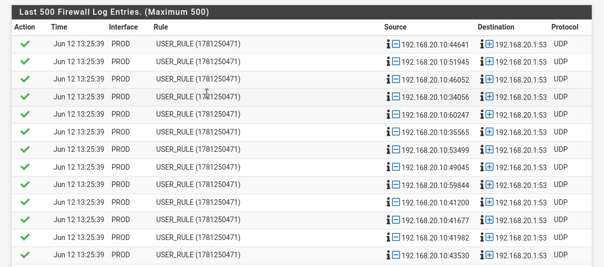

### 2. Connexion SSH autorisee

Depuis `KALI-admin` vers une machine PROD :

```bash
ssh kali@192.168.20.12
```

ou, pour tester seulement le port :

```bash
nc -vz 192.168.20.12 22
```

Resultat attendu :

| Source | Destination | Protocole | Resultat |
| --- | --- | --- | --- |
| `KALI-admin` | Machine PROD | TCP/22 | Autorise |

La regle responsable est la regle `ADMIN net -> PROD net TCP/22 Pass`.

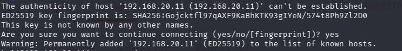

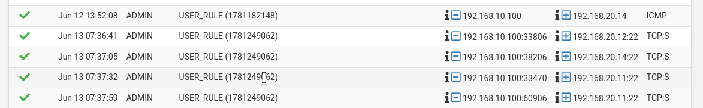

### 3. Connexion SSH bloquee

Depuis `KALI-prod` vers une machine ADMIN :

```bash
nc -vz 192.168.10.100 22
```

Resultat attendu :

| Source | Destination | Protocole | Resultat |
| --- | --- | --- | --- |
| `KALI-prod` | Machine ADMIN | TCP/22 | Bloque |

La regle responsable est la regle `PROD net -> ADMIN net TCP/22 Block`, ou le blocage final `PROD net -> ADMIN net any Block` si aucune regle plus precise ne matche avant.

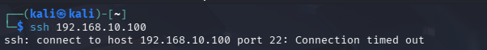

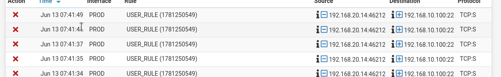

### 4. Connexion HTTP bloquee

Depuis `KALI-RH` vers une machine ADMIN :

```bash
curl -I http://192.168.10.100
```

Resultat attendu :

| Source | Destination | Protocole | Resultat |
| --- | --- | --- | --- |
| `KALI-RH` | Machine ADMIN | TCP/80 | Bloque |

La regle responsable est la regle `RH net -> ADMIN net TCP/80 Block`, ou le blocage final `RH net -> ADMIN net any Block`.

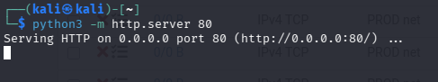

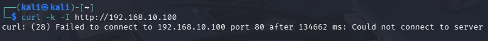

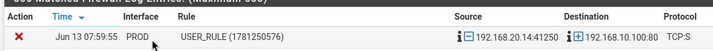

## Scans Nmap

### Scan TCP SYN

Le scan SYN envoie des paquets TCP avec le flag SYN. Il necessite generalement les privileges administrateur.

Depuis `KALI-admin` vers une machine PROD :

```bash
sudo nmap -sS -p 22,80,443,445 192.168.20.12
```

Resultat attendu :

| Port | Interpretation attendue |
| --- | --- |
| `22/tcp` | Visible comme autorise si SSH est permis |
| `80/tcp` | Peut etre bloque ou filtre selon les regles |
| `443/tcp` | Autorise si la regle HTTPS existe |
| `445/tcp` | Bloque si non autorise |

Visibilite dans pfSense :

- les paquets traversant pfSense peuvent apparaitre ;
- les ports bloques sont souvent plus visibles si les regles de blocage loguent ;
- les ports autorises peuvent generer peu de logs si la regle `Pass` ne journalise pas.

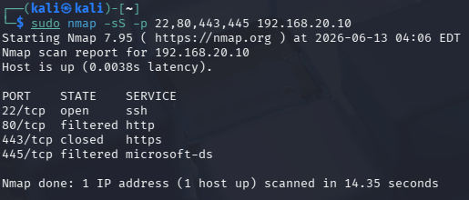

### Scan TCP Connect

Le scan TCP Connect tente une connexion TCP complete. Il peut etre lance sans privileges root.

Depuis `KALI-prod` vers une machine ADMIN :

```bash
nmap -sT -p 22,80,443,445 192.168.10.100
```

Resultat attendu :

| Port | Resultat attendu |
| --- | --- |
| `22/tcp` | Bloque |
| `80/tcp` | Bloque |
| `443/tcp` | Bloque |
| `445/tcp` | Bloque |

Dans les logs pfSense, ce scan doit etre visible si les regles `PROD -> ADMIN` ont le logging active. Les logs peuvent montrer plusieurs tentatives TCP depuis l'adresse de `KALI-prod` vers les ports testes.

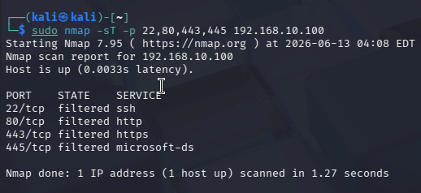

### Scan plus lent pour faciliter l'analyse

Pour eviter de produire trop de logs d'un coup :

```bash
sudo nmap -sS -p 22,80,443,445 -T2 --max-rate 5 192.168.20.12
```

Cette commande ralentit le scan et rend les evenements plus faciles a lire dans pfSense.

### Scan dans un meme VLAN

Un scan entre deux machines du meme VLAN reste local au segment. Il ne traverse pas pfSense et ne produit donc pas de log firewall attendu.

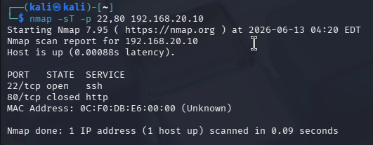

## Tentative simple de VLAN Hopping

Depuis `KALI-admin`, generer une trame double taguee avec Scapy :

```bash
sudo python3 - <<'PY'
from scapy.all import *

iface = "eth0"

pkt = (
    Ether(dst="ff:ff:ff:ff:ff:ff") /
    Dot1Q(vlan=10) /
    Dot1Q(vlan=20) /
    ARP(op="who-has", psrc="192.168.10.100", pdst="192.168.20.12")
)

pkt.show()
sendp(pkt, iface=iface, count=5, inter=1, verbose=True)
PY
```

Observation attendue :

| Outil | Observation |
| --- | --- |
| Wireshark cote ADMIN | La trame double taguee peut etre visible |
| Wireshark cote PROD | Aucune trame exploitable n'est attendue |
| Logs pfSense | Generalement rien de visible |

Explication : le VLAN Hopping se situe au niveau 2. pfSense journalise principalement des paquets IP traites par ses regles firewall. Une trame Ethernet double taguee peut donc etre visible dans Wireshark, mais absente des logs firewall pfSense.

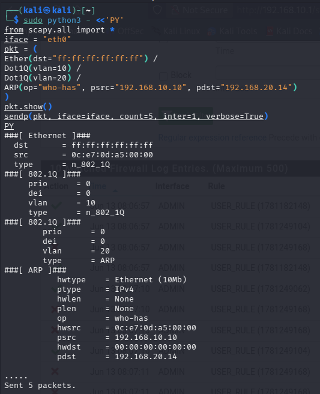

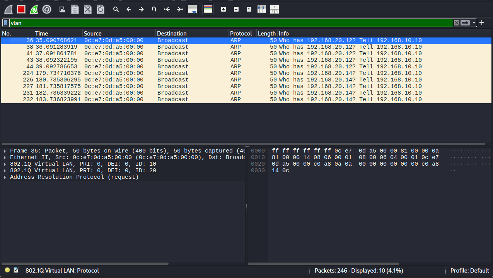

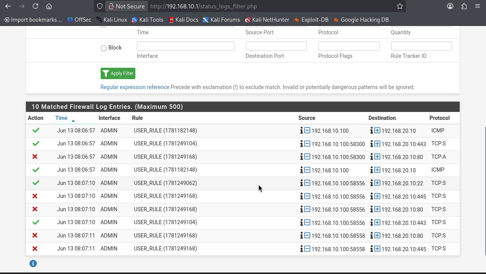


## Evenements observes

### Evenement 1 - Ping autorise ADMIN vers PROD

| Element | Valeur |
| --- | --- |
| Source | `192.168.10.100` |
| Destination | `192.168.20.12` |
| Protocole | ICMP |
| Action | Pass |
| Regle responsable | `ADMIN net -> PROD net ICMP Pass` |
| Comportement | Attendu |

Analyse : le ping traverse pfSense depuis l'interface `ADMIN` vers `PROD`. Il est autorise par la regle ICMP creee pour les tests de connectivite.

### Evenement 2 - SSH autorise ADMIN vers PROD

| Element | Valeur |
| --- | --- |
| Source | `192.168.10.100` |
| Destination | `192.168.20.12:22` |
| Protocole | TCP |
| Action | Pass |
| Regle responsable | `ADMIN net -> PROD net TCP/22 Pass` |
| Comportement | Attendu |

Analyse : l'administration de la production depuis le VLAN Administration est autorisee. Le flux est donc conforme a la politique de securite.

### Evenement 3 - HTTP bloque RH vers ADMIN

| Element | Valeur |
| --- | --- |
| Source | `192.168.30.100` |
| Destination | `192.168.10.100:80` |
| Protocole | TCP |
| Action | Block |
| Regle responsable | `RH net -> ADMIN net TCP/80 Block` |
| Comportement | Attendu |

Analyse : une machine RH ne doit pas initier d'acces HTTP vers le VLAN Administration. Le blocage correspond donc a la politique restrictive.

## Comparaison avec les regles pfSense

| Test | Resultat attendu | Visible dans les logs ? | Analyse |
| --- | --- | --- | --- |
| Ping ADMIN vers PROD | Autorise | Oui si logging active sur la regle ICMP | Conforme |
| SSH ADMIN vers PROD | Autorise | Oui si logging active sur la regle SSH | Conforme |
| SSH PROD vers ADMIN | Bloque | Oui si logging active sur la regle de blocage | Conforme |
| HTTP RH vers ADMIN | Bloque | Oui si logging active sur la regle de blocage | Conforme |
| Scan SYN ADMIN vers PROD | Partiellement autorise/bloque selon les ports | Oui pour les paquets traites par des regles loguees | Conforme |
| Scan Connect PROD vers ADMIN | Bloque | Oui si logging active sur `PROD -> ADMIN` | Conforme |
| VLAN Hopping Scapy | Pas d'acces exploitable | Generalement non | Normal, evenement L2 |

## Evenements inattendus ou absents

### Evenement absent possible : VLAN Hopping

Il est normal que la tentative de VLAN Hopping n'apparaisse pas dans les logs pfSense.

Raisons :

- le test agit au niveau Ethernet ;
- pfSense journalise surtout le filtrage L3/L4 ;
- les trames peuvent etre traitees ou ignorees par le switch avant d'atteindre pfSense ;
- Wireshark est plus adapte pour observer ce test.

### Evenement absent possible : scan dans le meme VLAN

Un scan entre deux machines du meme VLAN ne traverse pas pfSense. Exemple :

```bash
nmap -sT -p 22,80 192.168.20.13
```

si la source et la destination sont toutes les deux dans le VLAN 20.

Dans ce cas, pfSense ne voit pas le trafic, donc aucun log firewall n'est attendu.

### Evenement inattendu possible : DNS bloque

Si les machines utilisent un DNS non autorise, pfSense peut journaliser des blocages UDP/53 ou TCP/53.

Analyse a faire :

- verifier le serveur DNS donne par DHCP ;
- verifier les regles DNS dans pfSense ;
- verifier si la destination DNS est bien celle attendue.

## Visibilite des scans Nmap

| Type de scan | Commande | Visibilite attendue |
| --- | --- | --- |
| Ping scan | `nmap -sn 192.168.20.12` | Faible a moyenne selon ICMP et ARP |
| TCP SYN | `sudo nmap -sS -p 22,80,443,445 192.168.20.12` | Bonne si le trafic traverse pfSense |
| TCP Connect | `nmap -sT -p 22,80,443,445 192.168.10.100` | Bonne sur les ports bloques avec logging |
| UDP | `sudo nmap -sU -p 53,161 192.168.20.12` | Variable, parfois lent et peu lisible |
| Scan meme VLAN | `nmap -sT <machine_meme_vlan>` | Non visible dans pfSense |

## Limites de visibilite

Les logs pfSense ne montrent pas tout.

Limites identifiees :

- pfSense ne voit que le trafic qui le traverse ;
- les communications dans un meme VLAN restent invisibles pour pfSense ;
- les evenements de couche 2, comme DTP ou double tagging, ne sont pas journalises comme des logs firewall classiques ;
- une regle sans logging ne produit pas de ligne de log ;
- un scan rapide peut generer trop de lignes pour etre facilement interprete ;
- certains paquets UDP ne donnent pas toujours un resultat clair.

## Comment ameliorer l'analyse

Pour rendre les tests plus lisibles :

- activer le logging uniquement sur les regles importantes ;
- creer des regles specifiques pour les tests ;
- ralentir les scans Nmap avec `-T2` ou `--max-rate` ;
- filtrer les logs pfSense par interface, IP source ou port ;
- utiliser Wireshark en complement ;
- comparer les logs pfSense avec les captures reseau.

## Synthese personnelle

Cet atelier montre que les logs pfSense sont tres utiles pour analyser les flux qui traversent le pare-feu. Les flux inter-VLAN autorises ou bloques peuvent etre identifies avec leur source, leur destination, leur port et la regle responsable.

En revanche, pfSense ne remplace pas une capture reseau. Les scans dans un meme VLAN, les attaques de couche 2 et certaines tentatives de VLAN Hopping peuvent etre absents des logs. Pour comprendre completement un evenement reseau, il faut donc croiser les logs pfSense, les regles firewall, les commandes Kali et les captures Wireshark.

## Ressources

- pfSense Logging : <https://docs.netgate.com/pfsense/en/latest/monitoring/logs/>
- Nmap : <https://nmap.org/>
- Wireshark : <https://www.wireshark.org/>
