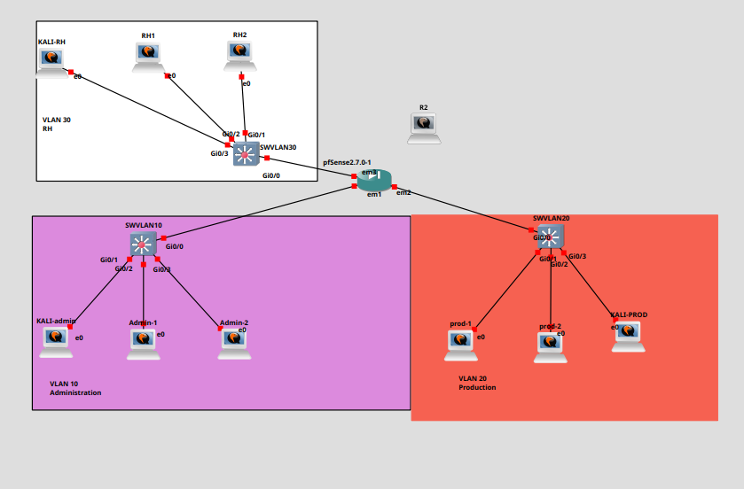

# Atelier 1 - Synthèse : VPN et architecture du TP

## Idée générale

Un VPN, pour Virtual Private Network, permet de créer une liaison réseau sécurisée à travers un réseau qui ne l'est pas forcément. L'exemple le plus courant est Internet : deux sites distants peuvent communiquer comme s'ils étaient reliés par un lien privé, alors que les paquets traversent en réalité une infrastructure publique ou partagée.

Le principe central est celui du tunnel chiffré. Les données originales sont encapsulées dans un nouveau flux, puis chiffrées avant de circuler entre les deux extrémités du VPN. Un équipement situé entre les deux sites peut voir qu'un échange VPN existe, mais ne doit pas pouvoir lire le contenu utile du trafic.

Dans cette itération, le VPN sera utilisé pour relier deux sites en mode site-à-site.

## À quoi sert un VPN ?

Un VPN répond à plusieurs besoins de sécurité et d'administration réseau :

- protéger les communications entre deux réseaux ;
- traverser un réseau non fiable, comme Internet ;
- interconnecter deux sites sans liaison physique dédiée ;
- donner accès à un réseau distant de manière contrôlée ;
- centraliser les règles de filtrage et de journalisation autour des points d'entrée du tunnel.

Il ne faut pas voir le VPN comme une simple option de confort. Dans une architecture professionnelle, il devient un composant de sécurité : il protège les flux, mais il doit aussi être encadré par du routage, des règles firewall, des journaux et une documentation claire.

## VPN site-à-site

Un VPN site-à-site relie deux réseaux complets. Ce ne sont pas les utilisateurs qui lancent individuellement une connexion VPN depuis leur poste : ce sont les équipements réseau des deux sites qui établissent le tunnel.

Dans le TP, le site principal correspond à l'infrastructure déjà travaillée dans les itérations précédentes :

- pfSense comme pare-feu ;
- VLAN 10 pour l'administration ;
- VLAN 20 pour la production ;
- VLAN 30 pour le réseau RH ;
- règles de filtrage entre zones ;
- journalisation des flux.

Le site distant sera simulé avec une machine Linux utilisée comme routeur VPN. Sur le plan GNS3, l'infrastructure principale est déjà organisée autour de pfSense et de trois switches de zone. La machine `R2`, encore isolée sur la capture, pourra représenter le futur routeur ou site distant selon la suite de l'itération.



L'architecture de départ se lit ainsi :

| Zone | Équipements visibles | Rôle |
| --- | --- | --- |
| VLAN 10 Administration | `KALI-admin`, `Admin-1`, `Admin-2`, `SWVLAN10` | Réseau d'administration et de tests |
| VLAN 20 Production | `prod-1`, `prod-2`, `KALI-PROD`, `SWVLAN20` | Réseau de production |
| VLAN 30 RH | `KALI-RH`, `RH1`, `RH2`, `SWVLAN30` | Réseau RH séparé |
| pfSense | `pfSense2.7.0-1` | Pare-feu central entre les zones |
| Routeur / site distant à préparer | `R2` | Futur équipement de routage ou extrémité distante du VPN |

Une fois le tunnel configuré, les machines du site principal pourront joindre le réseau distant seulement si trois conditions sont réunies :

- les routes vers le réseau distant existent ;
- le tunnel VPN est actif ;
- les règles pfSense autorisent les flux nécessaires.

## IPsec, OpenVPN et WireGuard

Il existe plusieurs technologies VPN. Elles répondent au même objectif général, mais avec des approches différentes.

| Technologie | Synthèse | Points forts | Points d'attention |
| --- | --- | --- | --- |
| IPsec | Standard historique très utilisé sur les routeurs et pare-feux professionnels. Il fonctionne au niveau IP. | Très répandu, intégré dans beaucoup d'équipements, adapté au site-à-site. | Configuration parfois complexe, surtout avec NAT et les politiques de chiffrement. |
| OpenVPN | VPN flexible basé sur TLS, souvent utilisé avec des certificats. Il fonctionne en espace utilisateur. | Très documenté, traverse bien NAT et firewalls, adapté aux labs et aux environnements mixtes. | Nécessite une gestion propre des certificats et des routes. |
| WireGuard | VPN moderne, léger et performant, basé sur un modèle de clés publiques simples. | Configuration concise, très bonnes performances, code réduit. | Moins ancien qu'IPsec, nécessite de bien gérer les clés et les routes autorisées. |

Dans cette itération, OpenVPN est retenu. Il permet de travailler concrètement les notions de tunnel, certificat, chiffrement, client, serveur, routage et règles firewall.

## Architecture du TP

Chaque groupe dispose de :

| Ressource | Rôle dans le TP |
| --- | --- |
| 4 machines Linux | Postes, serveurs ou machines de test |
| 1 routeur physique | Réseau amont ou transit selon la topologie |
| 1 machine Kali Linux | Tests réseau, vérifications et diagnostics |
| pfSense | Pare-feu du site principal |
| VLAN 10 | Réseau Administration |
| VLAN 20 | Réseau Production |
| VLAN 30 | Réseau RH |
| 1 machine Linux routeur VPN | Représentation du site distant |

Le point important est de bien distinguer les rôles. Les postes Kali servent aux tests depuis plusieurs zones, les switches isolent les VLANs, pfSense contrôle les flux inter-zones et `R2` prépare l'arrivée d'un second site. pfSense ne sera pas seulement une passerelle : il devra aussi filtrer les flux vers ou depuis le tunnel.

## Travail préparatoire

Avant de configurer OpenVPN, il faut établir une photographie fiable de l'existant. Cette étape évite de confondre un problème de VPN avec un problème plus simple de routage, de VLAN ou de firewall.

Les éléments à vérifier sont :

- l'adressage IP des machines ;
- les passerelles par défaut ;
- les VLANs utilisés ;
- les routes existantes ;
- les règles pfSense ;
- la connectivité entre les machines avant création du tunnel.

Dans le plan GNS3, il faut notamment vérifier que :

- `KALI-admin`, `Admin-1` et `Admin-2` sont bien dans le VLAN 10 ;
- `prod-1`, `prod-2` et `KALI-PROD` sont bien dans le VLAN 20 ;
- `KALI-RH`, `RH1` et `RH2` sont bien dans le VLAN 30 ;
- les trois switches sont bien raccordés à pfSense ;
- `R2` est identifié comme équipement à intégrer pour le site distant ou le réseau de transit VPN.

Commandes utiles sur Linux :

```bash
ip -br addr
ip route
ping -c 3 <adresse-cible>
traceroute <adresse-cible>
```

Commandes utiles pour tester un port :

```bash
nc -vz <adresse-cible> 22
nc -vz <adresse-cible> 1194
```

Le port `1194/udp` est le port classique d'OpenVPN, mais il peut être adapté selon la configuration.

## Rôle de pfSense

pfSense reste un élément central de l'architecture. Même si le VPN chiffre les échanges, il ne remplace pas le pare-feu.

pfSense devra permettre de répondre à plusieurs questions :

- quels flux sont autorisés à entrer dans le tunnel ?
- quels flux sont autorisés à sortir du tunnel ?
- quel VLAN peut joindre le site distant ?
- les connexions sont-elles visibles dans les logs ?
- les flux refusés sont-ils correctement bloqués et journalisés ?

La logique reste donc la même que dans l'itération précédente : on autorise explicitement ce qui est nécessaire, puis on bloque le reste.

## Ce qu'il faut documenter

La préparation de l'architecture doit produire une documentation simple, mais exploitable.

| Élément | À renseigner |
| --- | --- |
| Site principal | Réseaux VLAN 10 et VLAN 20, passerelles, rôle de pfSense |
| Site principal étendu | Réseau VLAN 30 RH et règles associées |
| Site distant | Réseau simulé, machine Linux ou `R2` comme routeur VPN, passerelle distante |
| Transit | Lien utilisé entre les deux sites ou réseau non fiable simulé |
| Tunnel VPN | Technologie retenue, port prévu, rôle serveur/client |
| Routage | Routes nécessaires pour joindre les réseaux distants |
| Filtrage | Règles pfSense nécessaires pour autoriser ou bloquer les flux |
| Tests | Ping, port OpenVPN, SSH ou autre service de validation |

Cette documentation servira de référence pour la suite. Si le tunnel ne fonctionne pas, elle permettra de savoir si le problème vient du VPN, du routage, de pfSense ou d'une machine mal adressée.

## Points clés à retenir

Un VPN ne crée pas seulement une connexion chiffrée. Il ajoute une nouvelle couche dans l'architecture réseau. Pour qu'il fonctionne correctement, il faut aligner plusieurs éléments :

- chiffrement et authentification du tunnel ;
- routes vers les réseaux distants ;
- règles firewall cohérentes ;
- passerelles correctement configurées ;
- tests de connectivité avant et après tunnel ;
- logs exploitables pour diagnostiquer.

Dans le TP, OpenVPN servira à relier un site principal protégé par pfSense à un site distant simulé par une machine Linux. La réussite ne dépendra donc pas seulement d'OpenVPN, mais de l'ensemble de l'architecture : VLANs, routage, filtrage et journalisation.

## Notions acquises

À la fin de cette introduction, les notions suivantes doivent être maîtrisées :

- VPN ;
- tunnel chiffré ;
- VPN site-à-site ;
- réseau non fiable ;
- routage inter-sites ;
- différence entre IPsec, OpenVPN et WireGuard ;
- rôle complémentaire du VPN et du pare-feu.

## Ressources

- OpenVPN Documentation : <https://openvpn.net/community-resources/>
- WireGuard : <https://www.wireguard.com/>
- IPsec overview : <https://www.rfc-editor.org/rfc/rfc4301>
