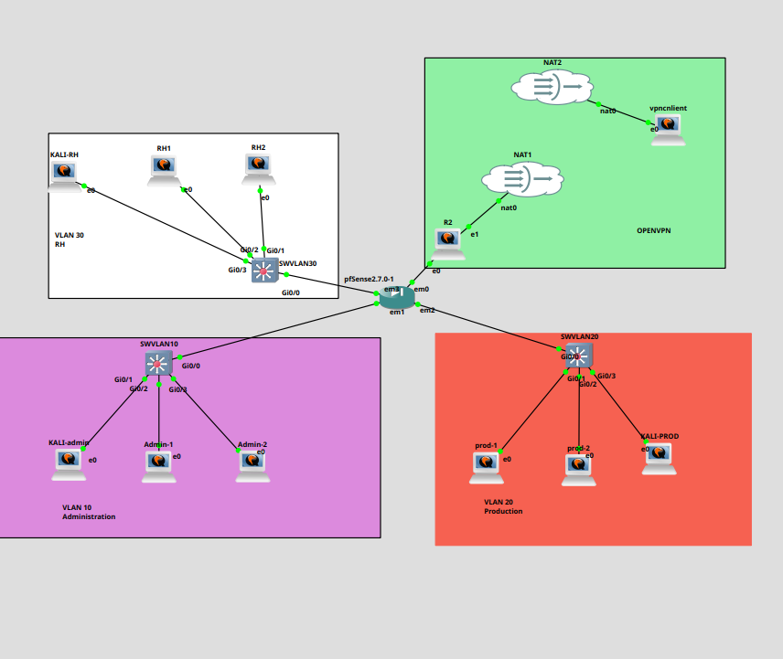
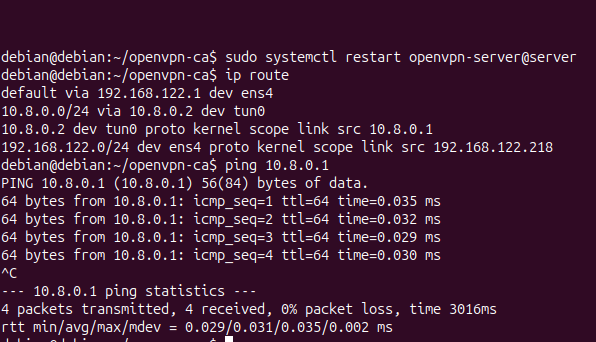
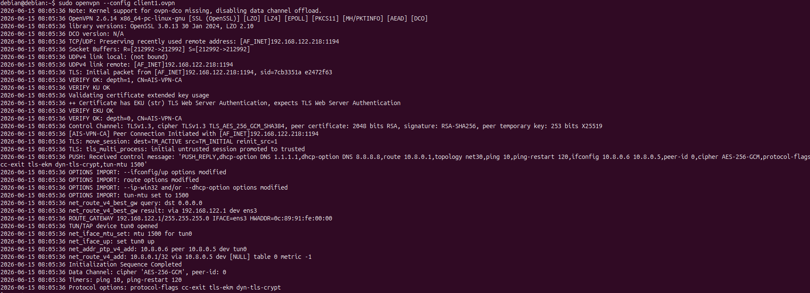
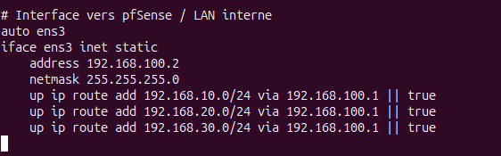
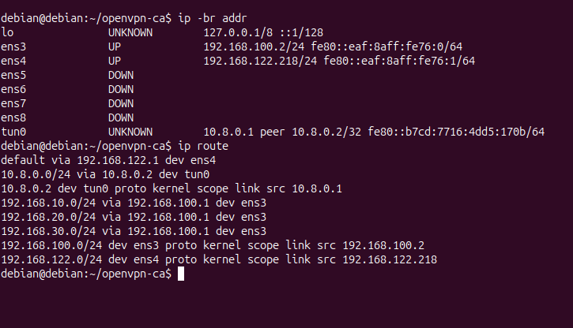
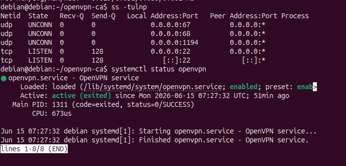
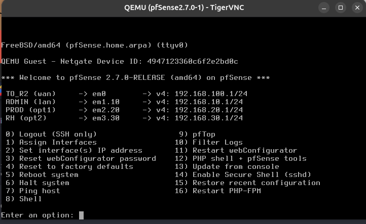
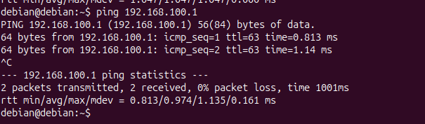

# Atelier 2 - Mise en place d'un VPN OpenVPN site-à-site

## Objectif

Durée indicative : 4 heures, par îlot.

L'objectif de cet atelier est de mettre en place un tunnel VPN OpenVPN entre deux sites et de vérifier que le routage réseau fonctionne correctement à travers ce tunnel.

Le VPN doit permettre la communication entre deux réseaux différents, tout en réutilisant l'infrastructure déjà construite :

- VLAN 10 Administration ;
- VLAN 20 Production ;
- VLAN 30 RH ;
- pfSense comme pare-feu central ;
- filtrage inter-VLAN déjà configuré ;
- une machine Linux représentant un routeur VPN distant.

## Architecture attendue

Le site principal correspond à l'infrastructure GNS3 existante. Le site distant est simulé par une machine Linux utilisée comme routeur VPN.

```text
Site principal                                      Site distant simulé

VLAN 10 ADMIN                                       Réseau distant
VLAN 20 PROD                                        192.168.40.0/24
VLAN 30 RH                                                |
      |                                             Routeur VPN Linux
   pfSense  ============ OpenVPN ============  Interface distante
      |
Réseau de transit / réseau non fiable
```

Le réseau du tunnel OpenVPN peut utiliser un réseau dédié, par exemple :

```text
Tunnel VPN : 10.8.0.0/24
Serveur VPN : 10.8.0.1
Client VPN : 10.8.0.2
```

Les adresses exactes devront être adaptées au lab réel.

### Variante réalisée dans le lab : accès distant vers les VLANs

Dans la réalisation ci-dessous, `R2` porte le serveur OpenVPN sous Debian. La machine `vpnclient` est placée à l'extérieur du réseau interne, derrière le réseau NAT, afin de simuler un client distant.

Le chemin attendu est donc :

```text
vpnclient -> NAT / réseau de transit -> R2 OpenVPN -> pfSense -> VLAN 10 / VLAN 20 / VLAN 30
```



Dans cette variante :

- `vpnclient` ne doit pas être placé dans un VLAN interne ;
- `R2` doit être joignable depuis `vpnclient` sur son adresse côté transit ;
- le serveur OpenVPN écoute sur `UDP/1194` ;
- le tunnel OpenVPN utilise le réseau `10.8.0.0/24` ;
- les routes poussées au client doivent viser uniquement les VLANs internes, pas tout Internet.

## Rôles des machines

| Rôle | Machine | Fonction |
| --- | --- | --- |
| pfSense | `pfSense2.7.0-1` | Pare-feu du site principal |
| Serveur OpenVPN | À définir selon le lab | Extrémité VPN côté site principal |
| Client OpenVPN | Routeur VPN Linux distant ou `R2` | Extrémité VPN côté site distant |
| Poste de test principal | Kali ou Linux côté VLAN 10 / 20 | Test depuis le site principal |
| Poste de test distant | Linux derrière le routeur VPN | Test depuis le site distant |

Selon le choix technique du groupe, OpenVPN peut être porté directement par pfSense ou par une machine Linux du site principal. Dans cette feuille, les commandes sont données pour une mise en place Linux serveur vers Linux client. Si pfSense porte le serveur OpenVPN, la logique reste la même : certificats, tunnel, routes et règles firewall.

## Préparation

### Vérifier les interfaces réseau

Sur les machines Linux concernées :

```bash
ip addr
ip -br addr
```

Relever :

- l'interface connectée au réseau de transit ;
- l'interface connectée au réseau local ;
- l'adresse IP de chaque interface ;
- la passerelle par défaut.

### Vérifier les routes existantes

```bash
ip route
```

Avant d'activer le VPN, noter les routes présentes. Elles serviront de comparaison après activation du tunnel.

### Vérifier la connectivité de base

Tester les passerelles et les machines proches :

```bash
ping -c 3 <passerelle-locale>
ping -c 3 <adresse-transit>
```

Il faut d'abord valider la connectivité de base. Si deux machines ne peuvent pas se joindre avant le VPN sur le réseau de transit, OpenVPN ne pourra pas établir le tunnel.

## Installation d'OpenVPN

Sur Debian ou Kali :

```bash
sudo apt update
sudo apt install openvpn easy-rsa
```

Vérifier l'installation :

```bash
openvpn --version
systemctl status openvpn
```

Selon la distribution, le service peut être inactif tant qu'aucune configuration n'a été créée. Ce n'est pas forcément une erreur.

## Génération des certificats

OpenVPN utilise TLS et des certificats pour authentifier les extrémités du tunnel.

Sur la machine serveur OpenVPN :

```bash
make-cadir ~/openvpn-ca
cd ~/openvpn-ca
```

Initialiser l'autorité de certification :

```bash
./easyrsa init-pki
./easyrsa build-ca
```

Générer le certificat serveur :

```bash
./easyrsa gen-req server nopass
./easyrsa sign-req server server
```

Générer le certificat client :

```bash
./easyrsa gen-req client1 nopass
./easyrsa sign-req client client1
```

Générer les paramètres Diffie-Hellman :

```bash
./easyrsa gen-dh
```

Générer une clé TLS supplémentaire :

```bash
openvpn --genkey secret ta.key
```

Fichiers importants :

| Fichier | Rôle |
| --- | --- |
| `ca.crt` | Certificat de l'autorité de certification |
| `server.crt` | Certificat du serveur OpenVPN |
| `server.key` | Clé privée du serveur |
| `client1.crt` | Certificat du client OpenVPN |
| `client1.key` | Clé privée du client |
| `dh.pem` | Paramètres Diffie-Hellman |
| `ta.key` | Clé TLS supplémentaire |

Les fichiers client nécessaires devront être copiés de manière sécurisée sur la machine cliente.

## Configuration du serveur OpenVPN

Créer le fichier :

```bash
sudo nano /etc/openvpn/server/site-to-site.conf
```

Exemple de configuration serveur :

```conf
port 1194
proto udp
dev tun

ca /etc/openvpn/server/ca.crt
cert /etc/openvpn/server/server.crt
key /etc/openvpn/server/server.key
dh /etc/openvpn/server/dh.pem
tls-auth /etc/openvpn/server/ta.key 0

server 10.8.0.0 255.255.255.0

client-config-dir /etc/openvpn/ccd
route 192.168.40.0 255.255.255.0

keepalive 10 120
persist-key
persist-tun

verb 3
```

Dans cet exemple :

- `10.8.0.0/24` est le réseau du tunnel ;
- `192.168.40.0/24` représente le réseau distant derrière le client VPN ;
- `client-config-dir` permet d'associer une route au client distant.

Créer le dossier CCD :

```bash
sudo mkdir -p /etc/openvpn/ccd
```

Créer le fichier du client. Le nom doit correspondre au Common Name du certificat client, ici `client1` :

```bash
sudo nano /etc/openvpn/ccd/client1
```

Contenu :

```text
iroute 192.168.40.0 255.255.255.0
```

Copier les certificats serveur au bon endroit :

```bash
sudo cp ~/openvpn-ca/pki/ca.crt /etc/openvpn/server/
sudo cp ~/openvpn-ca/pki/issued/server.crt /etc/openvpn/server/
sudo cp ~/openvpn-ca/pki/private/server.key /etc/openvpn/server/
sudo cp ~/openvpn-ca/pki/dh.pem /etc/openvpn/server/
sudo cp ~/openvpn-ca/ta.key /etc/openvpn/server/
```

### Configuration serveur réalisée sur R2

Dans le lab, le serveur a été configuré sur Debian avec le service :

```bash
sudo systemctl start openvpn-server@server
sudo systemctl status openvpn-server@server
```

Le fichier utilisé est :

```bash
/etc/openvpn/server/server.conf
```

Exemple adapté au lab :

```conf
port 1194
proto udp
dev tun

ca ca.crt
cert server.crt
key server.key
dh dh.pem
tls-auth ta.key 0

server 10.8.0.0 255.255.255.0
topology subnet

push "route 192.168.10.0 255.255.255.0"
push "route 192.168.20.0 255.255.255.0"
push "route 192.168.30.0 255.255.255.0"

keepalive 10 120
cipher AES-256-GCM
auth SHA256

user nobody
group nogroup

persist-key
persist-tun

status /var/log/openvpn-status.log
verb 3
```

Il ne faut pas pousser la route suivante dans ce lab :

```conf
push "redirect-gateway def1 bypass-dhcp"
```

Cette directive force tout le trafic du client dans le VPN. Elle peut donner l'impression que la machine cliente est bloquée, car sa route par défaut est remplacée par le tunnel.



Si OpenVPN refuse de démarrer avec une erreur sur `ta.key` ou `dh.pem`, vérifier que les fichiers existent puis les copier :

```bash
cd ~/openvpn-ca

openvpn --genkey secret ta.key
./easyrsa gen-dh

sudo cp pki/dh.pem /etc/openvpn/server/
sudo cp ta.key /etc/openvpn/server/
```

Vérification :

```bash
sudo ls -l /etc/openvpn/server/
sudo journalctl -u openvpn-server@server.service -n 80 --no-pager
```

## Configuration du client OpenVPN

Sur la machine routeur VPN distante, créer :

```bash
sudo nano /etc/openvpn/client/site-to-site.conf
```

Exemple de configuration client :

```conf
client
dev tun
proto udp

remote <IP_SERVEUR_OPENVPN> 1194

resolv-retry infinite
nobind
persist-key
persist-tun

ca /etc/openvpn/client/ca.crt
cert /etc/openvpn/client/client1.crt
key /etc/openvpn/client/client1.key
tls-auth /etc/openvpn/client/ta.key 1

verb 3
```

Remplacer `<IP_SERVEUR_OPENVPN>` par l'adresse IP joignable du serveur OpenVPN sur le réseau de transit.

Copier les fichiers nécessaires dans `/etc/openvpn/client/` :

```text
ca.crt
client1.crt
client1.key
ta.key
```

### Configuration client réalisée sur `vpnclient`

La machine cliente doit pouvoir joindre l'adresse de `R2` côté transit avant de lancer OpenVPN :

```bash
ping -c 3 <IP_TRANSIT_R2>
```

Dans le lab, le client contacte le serveur OpenVPN sur l'adresse de `R2` :

```conf
remote <IP_TRANSIT_R2> 1194
```

Exemple de fichier client :

```conf
client
dev tun
proto udp
remote <IP_TRANSIT_R2> 1194
resolv-retry infinite
nobind

persist-key
persist-tun

remote-cert-tls server
cipher AES-256-GCM
auth SHA256
verb 3

key-direction 1

<ca>
# contenu de ca.crt
</ca>

<cert>
# contenu de client1.crt
</cert>

<key>
# contenu de client1.key
</key>

<tls-auth>
# contenu de ta.key
</tls-auth>
```

Lancement manuel du client :

```bash
sudo openvpn --config client1.ovpn
```

La connexion est validée lorsque la sortie affiche :

```text
Initialization Sequence Completed
```



Après connexion, vérifier l'interface tunnel :

```bash
ip addr show tun0
ip route
```

Le client doit obtenir une adresse dans le réseau du tunnel, par exemple `10.8.0.x`.

## Activer le routage IP

Sur les machines qui jouent un rôle de routeur, activer le routage IP.

Activation temporaire :

```bash
sudo sysctl -w net.ipv4.ip_forward=1
```

Vérification :

```bash
sysctl net.ipv4.ip_forward
```

Pour rendre l'activation persistante :

```bash
sudo nano /etc/sysctl.conf
```

Ajouter ou décommenter :

```text
net.ipv4.ip_forward=1
```

Appliquer :

```bash
sudo sysctl -p
```

## Ajouter les routes nécessaires

### Côté site principal

Le site principal doit savoir joindre le réseau distant.

Exemple :

```bash
sudo ip route add 192.168.40.0/24 via 10.8.0.2
```

Si OpenVPN ajoute automatiquement la route grâce à la configuration serveur, cette commande peut ne pas être nécessaire. Vérifier avec :

```bash
ip route
```

### Côté site distant

Le site distant doit savoir joindre les réseaux du site principal.

Exemples :

```bash
sudo ip route add 192.168.10.0/24 via 10.8.0.1
sudo ip route add 192.168.20.0/24 via 10.8.0.1
sudo ip route add 192.168.30.0/24 via 10.8.0.1
```

Les routes exactes dépendent de l'architecture retenue et de l'emplacement réel du serveur OpenVPN.

## Règles firewall nécessaires

### Autoriser OpenVPN sur le réseau de transit

Le serveur OpenVPN doit recevoir les connexions UDP/1194 :

| Source | Destination | Protocole / port | Action |
| --- | --- | --- | --- |
| Client VPN distant | Serveur OpenVPN | UDP/1194 | Autoriser |

### Autoriser les flux dans le tunnel

Les flux entre le site principal et le site distant doivent être autorisés uniquement selon les besoins.

Exemple de politique :

| Source | Destination | Protocole | Décision | Justification |
| --- | --- | --- | --- | --- |
| VLAN 10 Administration | Réseau distant | ICMP | Autoriser | Diagnostic |
| VLAN 10 Administration | Réseau distant | SSH TCP/22 | Autoriser | Administration |
| VLAN 20 Production | Réseau distant | ICMP | Autoriser ou limiter | Test selon besoin |
| VLAN 30 RH | Réseau distant | Any | Bloquer par défaut | Pas de besoin identifié |
| Réseau distant | VLAN 10 | SSH TCP/22 | Bloquer | Éviter l'administration inverse |

Dans pfSense, les règles devront être placées sur l'interface par laquelle le trafic entre dans le pare-feu. Il faut aussi vérifier les logs pour confirmer si les flux passent ou sont bloqués.

## Démarrer OpenVPN

### Serveur

```bash
sudo systemctl start openvpn-server@site-to-site
sudo systemctl status openvpn-server@site-to-site
```

Activer au démarrage :

```bash
sudo systemctl enable openvpn-server@site-to-site
```

### Client

```bash
sudo systemctl start openvpn-client@site-to-site
sudo systemctl status openvpn-client@site-to-site
```

Activer au démarrage :

```bash
sudo systemctl enable openvpn-client@site-to-site
```

Selon la distribution, le nom exact du service peut varier. Si besoin, vérifier les unités disponibles :

```bash
systemctl list-unit-files | grep openvpn
```

## Vérifier le tunnel VPN

### Vérifier les interfaces

```bash
ip addr
```

Une interface `tun0` ou équivalente doit apparaître.

### Vérifier les routes

```bash
ip route
```

Comparer les routes avant et après activation du VPN.

### Vérifier les sockets réseau

```bash
ss -tulnp
```

Le serveur doit écouter sur le port OpenVPN configuré, généralement `1194/udp`.

### Vérifier les logs

```bash
journalctl -u openvpn-server@site-to-site -f
journalctl -u openvpn-client@site-to-site -f
```

Ou selon le service :

```bash
journalctl -u openvpn -f
```

## Tests de connectivité

### Tester le tunnel

Depuis le client VPN :

```bash
ping 10.8.0.1
```

Depuis le serveur VPN :

```bash
ping 10.8.0.2
```

### Tester entre les sites

Depuis le site principal vers le réseau distant :

```bash
ping -c 3 192.168.40.10
nc -vz 192.168.40.10 22
```

Depuis le site distant vers le site principal :

```bash
ping -c 3 192.168.10.100
ping -c 3 192.168.20.12
```

Ces tests doivent être interprétés avec les règles firewall. Un échec peut être normal si la politique de filtrage bloque le flux.

## Réalisation finale et problèmes rencontrés dans le lab

Cette partie documente la réalisation effective du lab avec `R2` comme serveur OpenVPN Debian, pfSense comme pare-feu central et `vpnclient` comme machine distante.

### 1. Topologie finale

La topologie finale place le client VPN à l'extérieur du réseau interne. Il rejoint `R2` par le réseau NAT, puis le trafic VPN est routé vers pfSense et les VLANs internes.


Le chemin logique validé est :

```text
vpnclient -> tunnel OpenVPN -> R2 -> pfSense -> VLAN 10 / VLAN 20 / VLAN 30
```

Les adresses importantes utilisées dans le lab sont :

| Élément | Adresse / réseau |
| --- | --- |
| Tunnel OpenVPN | `10.8.0.0/24` |
| R2 côté tunnel | `10.8.0.1` |
| Client VPN | `10.8.0.6` dans l'observation finale |
| pfSense côté R2 | `192.168.100.1/24` |
| R2 côté pfSense | `192.168.100.2/24` |
| VLAN 10 Administration | `192.168.10.0/24` |
| VLAN 20 Production | `192.168.20.0/24` |
| VLAN 30 RH | `192.168.30.0/24` |

### 2. Interface interne de R2

Une difficulté rencontrée était que l'interface `ens3` de `R2` n'était pas configurée. Elle doit porter l'adresse du réseau de transit vers pfSense.

Configuration utilisée dans `/etc/network/interfaces` :

```conf
auto ens3
iface ens3 inet static
    address 192.168.100.2
    netmask 255.255.255.0
    up ip route add 192.168.10.0/24 via 192.168.100.1 || true
    up ip route add 192.168.20.0/24 via 192.168.100.1 || true
    up ip route add 192.168.30.0/24 via 192.168.100.1 || true
```

Après redémarrage du réseau, `R2` possède bien ses interfaces de transit et de VPN.



La table de routage de `R2` doit contenir :

```text
192.168.10.0/24 via 192.168.100.1 dev ens3
192.168.20.0/24 via 192.168.100.1 dev ens3
192.168.30.0/24 via 192.168.100.1 dev ens3
```



### 3. Serveur OpenVPN sur R2

Le serveur OpenVPN est actif sur `R2`. Le tunnel crée l'interface `tun0` avec l'adresse serveur `10.8.0.1`.



Le fichier serveur doit pousser les routes vers les VLANs :

```conf
push "route 192.168.10.0 255.255.255.0"
push "route 192.168.20.0 255.255.255.0"
push "route 192.168.30.0 255.255.255.0"
```

Il ne faut pas pousser toute la route par défaut du client dans ce lab :

```conf
# push "redirect-gateway def1 bypass-dhcp"
```

Cette ligne avait pour effet de bloquer ou perturber la machine cliente, car tout son trafic passait dans le VPN.

### 4. Lancement du client OpenVPN

Sur le client, le lancement suivant fonctionne, mais garde le terminal occupé :

```bash
sudo openvpn --config client1.ovpn
```

Pour récupérer le terminal pendant les tests, le client a été lancé en mode démon :

```bash
sudo openvpn --config client1.ovpn --daemon
```

La connexion est correcte lorsque le client affiche `Initialization Sequence Completed`, que `tun0` est présent et que le ping vers `10.8.0.1` répond.


Les routes reçues côté client doivent montrer les VLANs internes via `tun0` :

```text
192.168.10.0/24 via 10.8.0.5 dev tun0
192.168.20.0/24 via 10.8.0.5 dev tun0
192.168.30.0/24 via 10.8.0.5 dev tun0
```


### 5. Réglages pfSense

pfSense possède une interface dédiée vers `R2` :

```text
TO_R2 : 192.168.100.1/24
```



La route retour est indispensable. Sans elle, pfSense reçoit les paquets du VPN, mais ne sait pas répondre vers le réseau `10.8.0.0/24`.

Dans pfSense :

```text
System > Routing > Gateways
```

Gateway :

```text
Interface : TO_R2
Gateway   : 192.168.100.2
Name      : GW_R2_OPENVPN
```

Puis :

```text
System > Routing > Static Routes
```

Route statique :

```text
Network : 10.8.0.0/24
Gateway : 192.168.100.2
```


Sur `Firewall > Rules > TO_R2`, une règle de test a été ajoutée pour autoriser les flux ICMP venant du tunnel :

```text
Action      Pass
Protocol    IPv4 ICMP
Source      10.8.0.0/24
Destination any
```

Pour le diagnostic, il peut être utile de désactiver sur l'interface `TO_R2` les options qui bloquent les réseaux privés ou bogon, car le VPN utilise un réseau privé `10.8.0.0/24`.

### 6. Diagnostic des erreurs rencontrées

Plusieurs problèmes ont été rencontrés pendant la mise en place :

| Problème | Cause | Correction |
| --- | --- | --- |
| OpenVPN ne démarre pas | Fichier `ta.key` ou `dh.pem` absent | Générer les fichiers puis les copier dans `/etc/openvpn/server/` |
| Le client semble bloqué après lancement | OpenVPN tourne au premier plan | Lancer avec `--daemon` ou ouvrir un second terminal |
| Le client perd sa connectivité | `redirect-gateway def1` pousse toute la route par défaut dans le VPN | Retirer cette directive et pousser seulement les VLANs |
| ADMIN ne ping pas R2 | Règle pfSense placée sur la mauvaise interface ou source inversée | Ajouter la règle sur `ADMIN` : `ADMIN net -> TO_R2 net` |
| Le client VPN ne ping pas les VLANs | Route retour absente dans pfSense | Ajouter `10.8.0.0/24 via 192.168.100.2` |
| `tcpdump -ni tun0 icmp` ne voit rien pour `192.168.100.2` | Le client n'a pas de route VPN vers `192.168.100.0/24` | Tester les VLANs ou pousser aussi `192.168.100.0/24` si nécessaire |

Le point important du diagnostic est de tester dans le bon ordre :

```bash
ping 10.8.0.1
ping 192.168.10.1
ping 192.168.20.1
ping 192.168.30.1
```

Le ping vers `192.168.100.2` n'est pas obligatoire depuis le client VPN, car ce réseau de transit n'était pas poussé au client au départ.



### 7. Validation finale

La validation finale montre que le client VPN peut joindre les passerelles des trois VLANs :

```bash
ping 192.168.10.1
ping 192.168.20.1
ping 192.168.30.1
```

Résultat obtenu :

```text
192.168.10.1 : réponses ICMP reçues
192.168.20.1 : réponses ICMP reçues
192.168.30.1 : réponses ICMP reçues
```


Le tunnel OpenVPN est donc fonctionnel :

- le client distant obtient une interface `tun0` ;
- les routes vers les VLANs sont bien poussées au client ;
- `R2` route le trafic VPN vers pfSense ;
- pfSense possède une route retour vers `10.8.0.0/24` ;
- les règles pfSense autorisent le trafic ICMP de test ;
- les passerelles VLAN 10, VLAN 20 et VLAN 30 répondent depuis le client VPN.

## Vérifier que les VLANs restent filtrés

Le VPN ne doit pas annuler la segmentation existante. Après activation du tunnel, vérifier que les règles précédentes restent valables :

| Test | Résultat attendu |
| --- | --- |
| VLAN 10 vers réseau distant en ICMP | Autorisé si prévu |
| VLAN 10 vers réseau distant en SSH | Autorisé si prévu |
| VLAN 20 vers VLAN 10 en SSH | Toujours bloqué |
| VLAN 30 vers VLAN 10 en HTTP ou SSH | Toujours bloqué |
| Réseau distant vers VLAN 10 en SSH | Bloqué sauf besoin explicite |

Dans pfSense :

```text
Status > System Logs > Firewall
```

Relever les logs correspondant aux flux VPN autorisés et bloqués.

## Ressources

- OpenVPN HOWTO : <https://openvpn.net/community-resources/how-to/>
- Linux IP Routing : <https://wiki.linuxfoundation.org/networking/iproute2>
