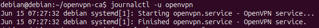
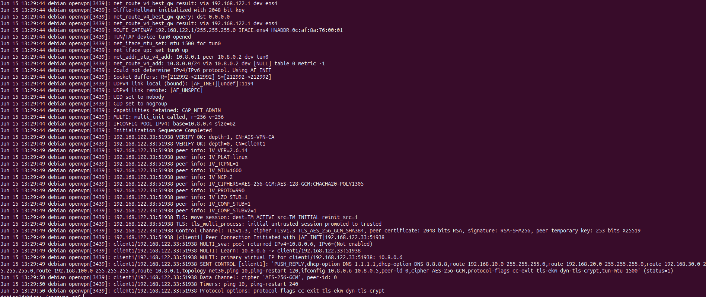

# Atelier 3 - Analyse du trafic OpenVPN avec Wireshark et les logs

## Objectif

Cet atelier a pour objectif d'observer le comportement réseau avant et après l'établissement d'un tunnel OpenVPN. Il permet de vérifier concrètement ce que le VPN protège, ce qui reste visible sur le réseau, et comment les logs OpenVPN permettent de diagnostiquer l'établissement du tunnel.

Le travail consiste à :

- capturer le trafic avant le VPN ;
- établir le tunnel OpenVPN ;
- capturer le trafic après le VPN ;
- comparer le trafic chiffré et non chiffré ;
- identifier les ports, protocoles et adresses IP visibles ;
- vérifier que les communications applicatives ne sont plus lisibles directement ;
- consulter les logs OpenVPN ;
- provoquer une erreur simple de configuration et analyser les logs générés.

## Architecture utilisée

L'atelier reprend l'architecture OpenVPN construite précédemment :

```text
vpnclient -> réseau NAT / transit -> R2 OpenVPN -> pfSense -> VLAN 10 / VLAN 20 / VLAN 30
```

Les éléments importants sont :

| Élément | Rôle |
| --- | --- |
| `vpnclient` | Machine distante qui lance le client OpenVPN |
| `R2` | Serveur OpenVPN Debian |
| `pfSense` | Pare-feu central et routeur des VLANs |
| VLAN 10 | Administration |
| VLAN 20 | Production |
| VLAN 30 | RH |
| Wireshark | Outil d'observation du trafic |
| Logs OpenVPN | Preuves d'établissement, d'authentification et d'erreurs |

## Points d'observation

Il faut choisir l'interface réseau en fonction de ce que l'on souhaite observer.

| Machine | Interface à capturer | Ce que l'on observe |
| --- | --- | --- |
| `vpnclient` | Interface physique, par exemple `ens3` | Trafic vers R2 avant chiffrement VPN côté réseau externe |
| `vpnclient` | `tun0` | Trafic clair à l'intérieur du tunnel côté client |
| `R2` | Interface externe, par exemple `ens4` | Flux OpenVPN chiffré entre client et serveur |
| `R2` | `tun0` | Trafic entrant dans le tunnel côté serveur |
| `R2` | Interface vers pfSense, par exemple `ens3` | Trafic routé vers les VLANs |
| pfSense | Interface `TO_R2` | Trafic venant du réseau VPN vers les VLANs |

Pour démontrer le chiffrement, l'observation la plus intéressante est souvent :

- capture sur l'interface physique du client ou de R2 ;
- capture sur `tun0` ;
- comparaison des deux captures.

## Préparation

### Vérifier les interfaces

Sur le client VPN :

```bash
ip -br addr
ip route
```

Sur R2 :

```bash
ip -br addr
ip route
```

Identifier :

- l'interface physique du client ;
- l'interface externe de R2 ;
- l'interface `tun0` ;
- l'interface de R2 vers pfSense ;
- les réseaux des VLANs.

### Vérifier l'état initial

Avant d'établir le VPN, vérifier que l'interface `tun0` n'est pas présente côté client :

```bash
ip addr show tun0
```

Si OpenVPN tourne déjà :

```bash
ps aux | grep openvpn
```

Arrêter temporairement le client VPN si nécessaire :

```bash
sudo pkill openvpn
```

## Capture avant établissement du VPN

### Lancer Wireshark

Sur le client VPN, lancer Wireshark sur l'interface physique utilisée pour joindre R2, par exemple :

```text
ens3
```

Filtres utiles avant VPN :

```text
icmp
arp
dns
udp.port == 1194
ip.addr == <IP_R2_EXTERNE>
```

Avant le VPN, les communications applicatives classiques ne passent pas encore dans le tunnel. Selon les tests réalisés, on peut observer :

- de l'ARP ;
- du DNS ;
- de l'ICMP ;
- des tentatives de connexion vers R2 ;
- aucun trafic `tun0`, car le tunnel n'existe pas encore.

### Test avant VPN

Depuis le client :

```bash
ping <IP_R2_EXTERNE>
ping 192.168.10.1
```

Résultat attendu :

| Test | Résultat attendu |
| --- | --- |
| Ping vers R2 côté transit | Réussite si la connectivité de base est correcte |
| Ping vers VLAN 10 / 20 / 30 | Échec avant VPN, sauf route ou accès particulier déjà présent |

Dans la capture réalisée avant l'établissement du tunnel, le trafic observé est encore du trafic classique sur le réseau de transit. On voit notamment de l'ICMP entre pfSense et R2 sur le réseau `192.168.100.0/24`.


Cette capture sert de référence : avant le tunnel, il n'y a pas encore d'encapsulation OpenVPN pour les communications vers les VLANs internes.

## Établissement du tunnel OpenVPN

Sur le client VPN :

```bash
sudo openvpn --config client1.ovpn
```

Ou en arrière-plan :

```bash
sudo openvpn --config client1.ovpn --daemon
```

Le fichier client contient les éléments nécessaires à l'authentification et au chiffrement :

- adresse du serveur OpenVPN ;
- port `1194/udp` ;
- certificat de l'autorité de certification ;
- certificat et clé du client ;
- clé TLS supplémentaire ;
- options de chiffrement.


La connexion est réussie lorsque les logs affichent :

```text
Initialization Sequence Completed
```

Vérifier ensuite :

```bash
ip addr show tun0
ip route
```

Résultat attendu :

```text
tun0 présent
adresse 10.8.0.x attribuée au client
routes vers 192.168.10.0/24, 192.168.20.0/24 et 192.168.30.0/24 via tun0
```

La capture suivante montre les logs côté client au moment de l'établissement du tunnel. On y retrouve notamment l'adresse attribuée au client, l'ajout des routes et la séquence d'initialisation terminée.


## Capture après établissement du VPN

### Capture sur l'interface physique

Sur l'interface physique du client ou de R2, le trafic applicatif n'est plus visible directement. On doit principalement voir le flux OpenVPN.

Filtre Wireshark :

```text
udp.port == 1194
```

Ce que l'on doit observer :

| Élément | Observation |
| --- | --- |
| Protocole | UDP |
| Port | `1194` par défaut |
| Source visible | IP physique du client VPN |
| Destination visible | IP externe de R2 |
| Contenu applicatif | Non lisible directement |
| Adresses VLAN internes | Normalement non visibles sur l'interface physique externe |

Dans la capture après activation du VPN, Wireshark affiche principalement du trafic OpenVPN entre :

```text
192.168.122.33  <->  192.168.122.218
```

Le protocole affiché est OpenVPN, avec des messages de type `P_DATA_V2`. Les paquets ICMP vers les VLANs ne sont pas visibles directement sur cette interface : ils sont encapsulés dans le tunnel.


Un filtre sur le port OpenVPN permet de confirmer que le trafic réseau visible sur l'interface physique correspond au tunnel :

```text
udp.port == 1194
```

La capture montre que les échanges utilisent OpenVPN sur le réseau de transit, entre l'adresse du client et l'adresse de `R2`.


### Capture sur `tun0`

Sur `tun0`, on observe le trafic qui circule à l'intérieur du tunnel après déchiffrement local.

Filtres utiles :

```text
icmp
ip.addr == 192.168.10.1
ip.addr == 192.168.20.1
ip.addr == 192.168.30.1
```

Tests :

```bash
ping 192.168.10.1
ping 192.168.20.1
ping 192.168.30.1
```

Sur `tun0`, Wireshark peut voir les paquets ICMP vers les VLANs, car cette interface représente le trafic avant encapsulation ou après décapsulation selon le côté observé.

Sur l'interface physique, ces mêmes communications doivent apparaître seulement comme du trafic OpenVPN chiffré.

La capture sur `tun0` montre le trafic interne du tunnel. Contrairement à la capture sur l'interface physique, les adresses internes sont visibles : on peut observer les échanges ICMP entre le client VPN et les passerelles des VLANs.


Dans le lab, les pings vers les passerelles VLAN ont été validés depuis le client VPN :

```bash
ping 192.168.10.1
ping 192.168.20.1
ping 192.168.30.1
```


## Comparaison avant / après VPN

| Critère | Avant VPN | Après VPN |
| --- | --- | --- |
| Interface `tun0` | Absente | Présente |
| Adresse VPN | Aucune | `10.8.0.x` côté client |
| Routes vers VLANs | Absentes | Présentes via `tun0` |
| Trafic vers R2 | Paquets directs visibles | Flux OpenVPN visible |
| Port principal | Selon le protocole testé | UDP/1194 |
| Contenu applicatif | Potentiellement visible si non chiffré | Non visible sur le réseau externe |
| Adresses VLAN internes sur interface externe | Non attendues ou non routées | Masquées par l'encapsulation OpenVPN |
| Lecture des pings VLAN | Impossible avant tunnel | Visible sur `tun0`, pas en clair sur l'interface physique |

Conclusion attendue :

```text
Après établissement du VPN, l'observateur placé sur le réseau de transit voit surtout un flux OpenVPN entre le client et R2. Il ne voit pas directement les communications applicatives vers les VLANs internes.
```

## Tests de chiffrement

Les tests de chiffrement servent à vérifier que le VPN masque les communications applicatives sur le réseau de transit. L'objectif n'est pas de casser ou mesurer mathématiquement le chiffrement, mais de prouver par observation que les échanges internes ne sont plus visibles directement hors du tunnel.

### Méthode utilisée

Trois captures sont comparées :

| Capture | Interface | Ce que l'on cherche |
| --- | --- | --- |
| Avant VPN | Interface physique | Trafic non encapsulé ou absence d'accès aux VLANs |
| Après VPN | Interface physique | Flux OpenVPN chiffré entre client et R2 |
| Après VPN | `tun0` | Trafic interne visible dans l'interface tunnel |

### Test 1 : observer le port OpenVPN

Sur l'interface physique du client ou de `R2`, appliquer le filtre :

```text
udp.port == 1194
```

Observation :

- le trafic visible est identifié comme OpenVPN ;
- les échanges se font entre les IP physiques du client VPN et de `R2` ;
- les messages affichés sont de type OpenVPN, par exemple `P_DATA_V2` ;
- les IP internes `192.168.10.1`, `192.168.20.1` et `192.168.30.1` ne sont pas visibles directement dans cette capture.

Conclusion :

```text
Sur le réseau de transit, l'observateur voit le tunnel OpenVPN, mais pas les communications applicatives internes en clair.
```

### Test 2 : comparer avec l'interface `tun0`

Sur `tun0`, appliquer un filtre ICMP :

```text
icmp
```

Puis générer du trafic :

```bash
ping 192.168.10.1
ping 192.168.20.1
ping 192.168.30.1
```

Observation :

- sur `tun0`, les IP internes des VLANs sont visibles ;
- les paquets ICMP request/reply sont lisibles ;
- cela correspond au trafic avant encapsulation ou après décapsulation ;
- la même communication n'apparaît pas en clair sur l'interface physique.

Conclusion :

```text
Le trafic applicatif existe bien, mais il est visible en clair uniquement dans l'interface tunnel. Sur l'interface physique, il est encapsulé et chiffré par OpenVPN.
```

### Test 3 : vérifier le chiffrement annoncé dans les logs

Dans les logs OpenVPN côté serveur, relever la ligne du canal de données :

```text
Data Channel: cipher 'AES-256-GCM'
```

Les logs montrent aussi le canal de contrôle TLS :

```text
Control Channel: TLSv1.3
```

Interprétation :

| Élément | Rôle |
| --- | --- |
| `TLSv1.3` | Protège l'établissement et le contrôle de la session |
| `AES-256-GCM` | Chiffre le canal de données du VPN |
| `VERIFY OK` | Confirme la validation des certificats |
| `PUSH_REPLY` | Confirme l'envoi des routes et paramètres au client |

Conclusion :

```text
Les captures réseau montrent l'encapsulation OpenVPN et les logs confirment le chiffrement utilisé par le tunnel.
```

### Synthèse des tests de chiffrement

| Point vérifié | Résultat observé | Conclusion |
| --- | --- | --- |
| Port OpenVPN visible | `UDP/1194` | Le tunnel est identifiable sur le réseau |
| Contenu applicatif sur interface physique | Non visible directement | Les échanges internes sont encapsulés |
| Trafic interne sur `tun0` | ICMP vers VLANs visible | Le trafic existe dans le tunnel |
| Chiffrement dans les logs | `AES-256-GCM` | Le canal de données est chiffré |
| Authentification | `VERIFY OK` | Les certificats sont validés |

Le chiffrement est donc validé par deux preuves complémentaires :

- Wireshark montre que le réseau de transit ne voit que du trafic OpenVPN ;
- les logs OpenVPN indiquent le chiffrement négocié pour le tunnel.

## Vérification des logs OpenVPN

### Logs côté client

Si OpenVPN est lancé au premier plan, les logs s'affichent directement dans le terminal.

Si OpenVPN est lancé en démon :

```bash
ps aux | grep openvpn
```

Selon la configuration, consulter :

```bash
journalctl -u openvpn-client@client1 -n 80 --no-pager
```

ou relancer temporairement au premier plan :

```bash
sudo pkill openvpn
sudo openvpn --config client1.ovpn
```

Éléments à identifier :

| Élément dans les logs | Signification |
| --- | --- |
| `TLS: Initial packet` | Début de l'échange TLS |
| `VERIFY OK` | Certificat validé |
| `Peer Connection Initiated` | Connexion établie avec le serveur |
| `PUSH_REPLY` | Paramètres poussés par le serveur |
| `ifconfig 10.8.0.x` | Adresse attribuée au client |
| `route ...` | Routes ajoutées côté client |
| `Initialization Sequence Completed` | Tunnel opérationnel |

Une première consultation avec l'unité générique `openvpn` ne donne pas assez de détails dans ce lab. Elle confirme seulement le démarrage et l'arrêt du service global :



Pour obtenir les informations utiles, il faut consulter l'unité du serveur :

```bash
sudo journalctl -u openvpn-server@server.service -n 100 --no-pager
```

### Logs côté serveur R2

Sur R2 :

```bash
sudo journalctl -u openvpn-server@server.service -n 100 --no-pager
```

Suivre les logs en direct :

```bash
sudo journalctl -u openvpn-server@server.service -f
```

Éléments à relever :

- connexion du client ;
- validation des certificats ;
- attribution de l'adresse VPN ;
- routes poussées au client ;
- messages d'erreur éventuels ;
- déconnexion du client.

La capture suivante montre un établissement correct du tunnel côté R2 :

- initialisation Diffie-Hellman ;
- ouverture de `tun0` ;
- écoute UDP sur le port `1194` ;
- validation du certificat client ;
- connexion du client `client1` ;
- attribution de l'adresse `10.8.0.6` ;
- envoi du `PUSH_REPLY` avec les routes vers les VLANs ;
- activation du canal de données chiffré en `AES-256-GCM`.



## Erreur volontaire de configuration

Pour apprendre à diagnostiquer OpenVPN, réaliser une erreur simple, l'observer, puis remettre la configuration correcte.

Dans le lab, l'erreur volontaire réalisée a consisté à ajouter une mauvaise option dans `server.conf`. OpenVPN indique alors clairement la ligne fautive :

```text
Options error: Unrecognized option or missing or extra parameter(s) in server.conf:16: ush
```

Le service échoue ensuite avec :

```text
Main process exited, code=exited, status=1/FAILURE
Failed to start openvpn-server@server.service
```


Après correction de la ligne fautive dans `server.conf`, le service redémarre correctement et les logs montrent à nouveau l'initialisation du serveur puis la connexion du client.

### Exemple 1 : mauvais port côté client

Dans `client1.ovpn`, remplacer temporairement :

```conf
remote <IP_R2_EXTERNE> 1194
```

par :

```conf
remote <IP_R2_EXTERNE> 1195
```

Relancer :

```bash
sudo pkill openvpn
sudo openvpn --config client1.ovpn
```

Résultat attendu :

- pas d'établissement du tunnel ;
- pas de `Initialization Sequence Completed` ;
- tentatives de contact vers le mauvais port ;
- absence de réponse du serveur.

Filtre Wireshark :

```text
udp.port == 1195
```

Remettre ensuite le port correct :

```conf
remote <IP_R2_EXTERNE> 1194
```

### Exemple 2 : mauvais nom de fichier `ta.key`

Sur le serveur ou le client, modifier temporairement le nom de la clé TLS dans la configuration :

```conf
tls-auth ta-fausse.key 0
```

ou côté client :

```conf
<tls-auth>
# clé incorrecte ou absente
</tls-auth>
```

Résultat attendu dans les logs :

```text
Cannot pre-load keyfile
Exiting due to fatal error
```

Remettre ensuite la configuration correcte.

### Exemple 3 : retrait temporaire d'une route poussée

Sur R2, commenter temporairement une route :

```conf
# push "route 192.168.20.0 255.255.255.0"
```

Redémarrer OpenVPN :

```bash
sudo systemctl restart openvpn-server@server
```

Reconnecter le client puis vérifier :

```bash
ip route
ping 192.168.20.1
```

Résultat attendu :

- la route vers `192.168.20.0/24` n'apparaît plus côté client ;
- le ping vers `192.168.20.1` échoue ;
- les autres VLANs peuvent encore fonctionner.

Remettre ensuite la route et redémarrer le service.

## Tableau d'observation à compléter

| Observation | Avant VPN | Après VPN | Preuve / capture |
| --- | --- | --- | --- |
| Interface `tun0` | À compléter | À compléter | Capture `ip addr` |
| Routes vers VLANs | À compléter | À compléter | Capture `ip route` |
| Trafic sur interface physique | À compléter | À compléter | Capture Wireshark |
| Port OpenVPN observé | À compléter | À compléter | Filtre `udp.port == 1194` |
| Adresses IP visibles | À compléter | À compléter | Capture Wireshark |
| Trafic applicatif visible en clair | À compléter | À compléter | Capture comparative |
| Logs d'authentification TLS | Sans objet | À compléter | Logs OpenVPN |
| Adresse VPN attribuée | Sans objet | À compléter | Logs / `ip addr` |
| Erreur volontaire | Sans objet | À compléter | Logs erreur |

## Captures à ajouter

Les captures suivantes pourront être insérées après réalisation :

| Capture | Emplacement conseillé |
| --- | --- |
| Wireshark avant VPN sur interface physique | Section "Capture avant établissement du VPN" |
| Connexion OpenVPN réussie côté client | Section "Établissement du tunnel OpenVPN" |
| Wireshark après VPN avec `udp.port == 1194` | Section "Capture sur l'interface physique" |
| Wireshark sur `tun0` avec ping vers VLANs | Section "Capture sur `tun0`" |
| Logs OpenVPN côté client | Section "Logs côté client" |
| Logs OpenVPN côté R2 | Section "Logs côté serveur R2" |
| Erreur volontaire et logs associés | Section "Erreur volontaire de configuration" |

Captures déjà intégrées dans ce compte rendu :

| Capture | Utilisation |
| --- | --- |
| `capture wireshark avant openvpn.png` | Observation du trafic avant tunnel |
| `captureavec vpn.png` | Observation du flux OpenVPN chiffré après tunnel |
| `capture réglageopenvpnclient.png` | Configuration client utilisée pour établir le tunnel |
| `wiresharkportopenvpn.png` | Filtre Wireshark sur le port OpenVPN `UDP/1194` |
| `capture tun0.png` | Observation du trafic interne visible sur l'interface tunnel |
| `capture openvpn client.png` | Logs et routes côté client |
| `logopenvpn.png` | Exemple de logs génériques peu détaillés |
| `logR2apreserreurde config.png` | Erreur volontaire dans `server.conf` |
| `logR2aprèscorrection.png` | Logs serveur après correction |
| `ping client to vlan.png` | Validation des communications vers VLAN 10, 20 et 30 |

## Synthèse attendue

À la fin de l'atelier, il faut pouvoir expliquer :

- quelles informations restent visibles sur le réseau de transit ;
- pourquoi le trafic applicatif n'est plus lisible directement après le VPN ;
- quel rôle joue le port `UDP/1194` ;
- quelles adresses IP sont visibles avant et après encapsulation ;
- comment les logs OpenVPN prouvent l'authentification et l'attribution d'adresse ;
- comment une erreur simple apparaît dans les logs ;
- pourquoi Wireshark doit être lancé sur la bonne interface pour interpréter correctement les captures.

## Ressources

- OpenVPN HOWTO : <https://openvpn.net/community-resources/how-to/>
- Wireshark User Guide : <https://www.wireshark.org/docs/wsug_html_chunked/>
- Filtres Wireshark : <https://wiki.wireshark.org/DisplayFilters>
