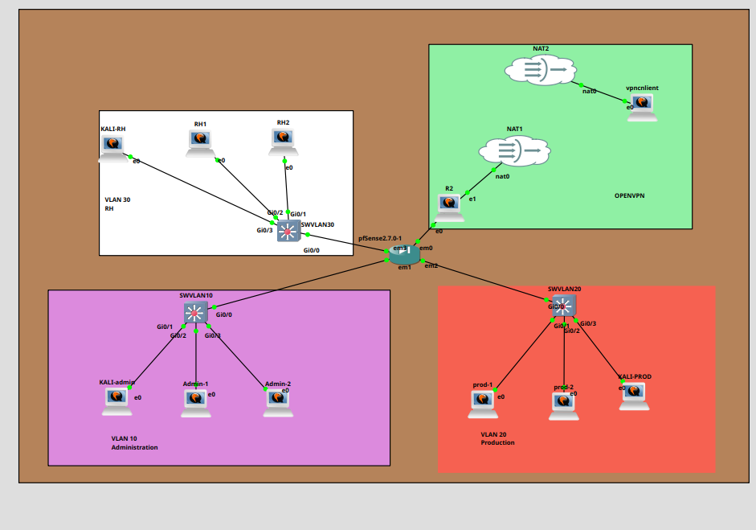
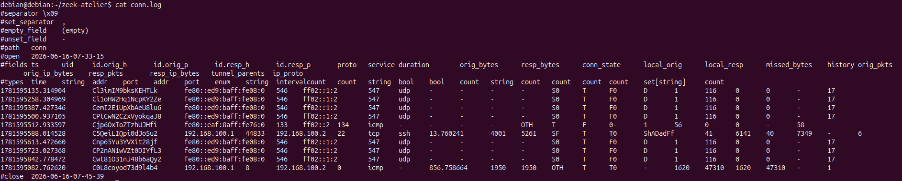
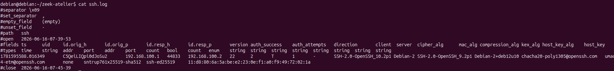

# Atelier 2 - Installation de Zeek et génération de logs réseau

## Objectif

Cet atelier a pour objectif d'installer Zeek sur une machine dédiée, de surveiller une interface réseau, puis de générer du trafic depuis Kali Linux afin d'observer les logs produits.

Zeek permet de transformer le trafic réseau en journaux exploitables. Il ne bloque pas les paquets comme un pare-feu : il observe les communications, les analyse et écrit des logs comme `conn.log`, `dns.log`, `http.log` ou `ssh.log`.

À la fin de l'atelier, il faut être capable de :

- installer Zeek sur une machine Linux ;
- identifier l'interface réseau à surveiller ;
- vérifier que l'interface reçoit du trafic ;
- lancer Zeek sur cette interface ;
- générer du trafic depuis Kali Linux ;
- lire et documenter les logs générés.

## plan GNS 3 de l'atelier



## Architecture de l'atelier

L'atelier utilise au minimum deux machines :

| Machine | Rôle |
| --- | --- |
| Machine Zeek | Capteur réseau chargé d'observer le trafic |
| Kali Linux | Machine utilisée pour générer du trafic réseau |

Exemple de logique attendue :

```text
Kali Linux  --->  réseau du lab  --->  machine Zeek
```

La machine Zeek doit être connectée au segment réseau à observer. Selon la topologie GNS3 ou physique, elle peut être placée dans un VLAN, sur un segment de test ou sur une interface permettant de voir le trafic.

## 1. Installer Zeek

Sur la machine dédiée à la surveillance réseau, installer Zeek :

```bash
sudo apt install gpg
echo 'deb http://download.opensuse.org/repositories/security:/zeek/Debian_12/ /' | sudo tee /etc/apt/sources.list.d/security:zeek.list
curl -fsSL https://download.opensuse.org/repositories/security:zeek/Debian_12/Release.key | gpg --dearmor | sudo tee /etc/apt/trusted.gpg.d/security_zeek.gpg > /dev/null
sudo apt update
sudo apt install zeek
```

Vérifier que Zeek est bien installé :

```bash
sudo /opt/zeek/bin/zeek --version
```

Si une version s'affiche, l'installation est fonctionnelle.

À documenter :

| Élément | Valeur |
| --- | --- |
| Système utilisé | Debian |
| Version de Zeek | 8.08 |
| Machine utilisée comme capteur | R2 |

## 2. Identifier l'interface réseau à surveiller

Lister les interfaces réseau disponibles :

```bash
ip a
```

ou :

```bash
ip link show
```

Il faut repérer l'interface connectée au réseau à surveiller.

Exemples de noms d'interfaces :

```text
eth0
ens33
enp0s3
wlan0
```

Pour afficher les interfaces de manière plus lisible :

```bash
ip -br addr
```

À documenter :

| Élément | Valeur |
| --- | --- |
| Interface surveillée | ens3, tun0 |
| Adresse IP de la machine Zeek | ens3(pfsense) : 192.168.100.2, ens4 (NAT): 192.168.122.218, tun0= 10.8.0.1 |
| Segment ou VLAN observé | VLAN10, 20 & 30 |
| Adresse IP de Kali Linux | 192.168.10.100 |

## 3. Vérifier que l'interface reçoit du trafic

Avant de lancer Zeek, vérifier que l'interface reçoit bien du trafic réseau.

Exemple avec `tcpdump` :

```bash
sudo tcpdump -i eth0
```

Remplacer `eth0` par le nom réel de l'interface.

Si des lignes apparaissent, l'interface reçoit du trafic.

Pour arrêter la capture :

```text
Ctrl + C
```

Il est aussi possible de limiter l'affichage :

```bash
sudo tcpdump -i eth0 -n
```

L'option `-n` évite la résolution DNS et rend l'affichage plus rapide.

## 4. Créer un dossier de travail

Créer un dossier dédié à l'atelier :

```bash
mkdir zeek-atelier
```

Entrer dans ce dossier :

```bash
cd zeek-atelier
```

Lorsque Zeek est lancé directement en ligne de commande, les logs sont générés dans le dossier courant.

## 5. Lancer Zeek sur l'interface choisie

Lancer Zeek en écoute sur l'interface réseau :

```bash
sudo /opt/zeek/bin/zeek -i ens3
```

Remplacer `eth0` par l'interface réellement utilisée.

Pendant que Zeek fonctionne, il analyse le trafic vu sur l'interface. Pour générer des logs intéressants, il faut laisser Zeek tourner pendant les tests effectués depuis Kali Linux.

Pour arrêter Zeek :

```text
Ctrl + C
```

Après l'arrêt, Zeek écrit les logs dans le dossier courant.

## 6. Générer du trafic depuis Kali Linux

Depuis Kali Linux, réaliser plusieurs actions réseau afin de produire des événements visibles par Zeek.

### Générer du trafic ICMP

Faire un ping vers une machine du lab :

```bash
ping <IP_machine_cible>
```

Exemple :

```bash
ping 192.168.1.20
```

Ce trafic doit apparaître dans `conn.log`.

### Générer une connexion SSH

Ouvrir une connexion SSH vers une machine accessible :

```bash
ssh utilisateur@<IP_cible>
```

Exemple :

```bash
ssh user@192.168.1.20
```

Ce trafic doit apparaître dans `conn.log` et, si Zeek identifie correctement le protocole, dans `ssh.log`.

### Générer du trafic HTTP

Faire une requête HTTP simple :

```bash
curl http://example.com
```

ou :

```bash
curl http://neverssl.com
```

Il est préférable d'utiliser un site en HTTP non chiffré pour obtenir des détails dans `http.log`.

Ce trafic doit apparaître dans `conn.log` et `http.log`.

### Générer une requête DNS

Effectuer une résolution DNS :

```bash
nslookup example.com
```

ou :

```bash
dig example.com
```

Ce trafic doit apparaître dans `dns.log`.

## 7. Vérifier les logs générés

Dans le dossier où Zeek a été lancé, afficher les fichiers générés :

```bash
ls
```

Les logs attendus sont notamment :

```text
conn.log
dns.log
http.log
ssh.log
packet_filter.log
loaded_scripts.log
```

Selon le trafic réellement observé, certains fichiers peuvent ne pas être présents. Par exemple, `http.log` ne sera créé que si Zeek observe du trafic HTTP.

## 8. Lire les logs Zeek

Lire le journal des connexions :

```bash
cat conn.log
```

Lire les logs DNS :

```bash
cat dns.log
```

Lire les logs HTTP :

```bash
cat http.log
```

Lire les logs SSH :

```bash
cat ssh.log
```

Pour une lecture plus confortable :

```bash
less conn.log
```

Pour afficher uniquement les dernières lignes :

```bash
tail conn.log
```

### Exemple de lecture de `conn.log`



La capture montre le résultat de la commande :

```bash
cat conn.log
```

Le fichier `conn.log` commence par des lignes de métadonnées Zeek :

- `#separator` indique le séparateur utilisé entre les champs ;
- `#path conn` indique que le fichier correspond au journal des connexions ;
- `#open` indique la date et l'heure d'ouverture du log ;
- `#fields` liste les colonnes présentes dans le journal ;
- `#types` indique le type de chaque colonne.

Dans les événements observés, on retrouve plusieurs communications :

| Élément observé | Interprétation |
| --- | --- |
| `192.168.100.1` vers `192.168.100.2` | Communication entre deux machines du lab |
| Port destination `22` | Connexion SSH détectée |
| Service `ssh` | Zeek a reconnu le protocole SSH |
| Protocole `tcp` | La connexion SSH utilise TCP |
| `conn_state` avec `SF` | Connexion établie et terminée normalement |
| Protocole `icmp` | Trafic de ping observé |
| Adresses IPv6 `fe80::...` | Trafic local IPv6 détecté sur le segment |

Ce log donne donc une vue globale des échanges réseau. Il permet d'identifier qui communique avec qui, sur quel port, avec quel protocole et pendant combien de temps.

### Exemple de lecture de `ssh.log`



La capture montre le résultat de la commande :

```bash
cat ssh.log
```

Le fichier `ssh.log` détaille uniquement les connexions SSH détectées par Zeek. Dans l'exemple, on observe une connexion :

| Champ observé | Valeur relevée | Interprétation |
| --- | --- | --- |
| `id.orig_h` | `192.168.100.1` | Machine qui initie la connexion SSH |
| `id.orig_p` | `44833` | Port source utilisé par le client |
| `id.resp_h` | `192.168.100.2` | Machine qui reçoit la connexion SSH |
| `id.resp_p` | `22` | Port SSH du serveur |
| `auth_success` | `T` | Authentification réussie |
| `auth_attempts` | `1` | Une tentative d'authentification |
| `client` | `SSH-2.0-OpenSSH_10.2p1 Debian-2` | Version du client SSH |
| `server` | `SSH-2.0-OpenSSH_9.2p1 Debian-2+deb12u10` | Version du serveur SSH |
| `cipher_alg` | `chacha20-poly1305@openssh.com` | Algorithme de chiffrement utilisé |
| `kex_alg` | `sntrup761x25519-sha512` | Algorithme d'échange de clés |

Ce log est plus précis que `conn.log` pour l'analyse SSH. Il permet de confirmer qu'une session SSH a eu lieu, de savoir si l'authentification a réussi et d'observer les paramètres cryptographiques négociés.

## 9. Comprendre les principaux logs

| Log Zeek | Description |
| --- | --- |
| `conn.log` | Liste les connexions réseau observées |
| `dns.log` | Contient les requêtes et réponses DNS |
| `http.log` | Contient les requêtes HTTP observées |
| `ssh.log` | Contient les connexions SSH détectées |
| `packet_filter.log` | Donne des informations sur le filtre de capture utilisé |
| `loaded_scripts.log` | Liste les scripts Zeek chargés au démarrage |

Le fichier `conn.log` est le plus important pour commencer. Il permet d'identifier :

- l'adresse IP source ;
- l'adresse IP destination ;
- le protocole utilisé ;
- le port source ;
- le port destination ;
- la durée de la connexion ;
- le volume de données échangé ;
- l'état de la connexion.

## 10. Événements attendus

| Action réalisée depuis Kali | Log attendu | Observation attendue |
| --- | --- | --- |
| `ping` | `conn.log` | Trafic ICMP détecté |
| `nslookup` ou `dig` | `dns.log` | Nom de domaine demandé |
| `curl http://...` | `http.log` | Requête HTTP, hôte, méthode GET |
| `ssh utilisateur@IP` | `ssh.log` | Connexion SSH détectée |

## 11. Documenter les résultats

Dans le compte rendu, documenter les éléments suivants :

| Élément | Valeur observée |
| --- | --- |
| Interface réseau utilisée | À compléter |
| Adresse IP de la machine Zeek | À compléter |
| Adresse IP de Kali Linux | À compléter |
| Commandes exécutées depuis Kali | À compléter |
| Logs générés | À compléter |
| Types d'événements observés | À compléter |
| Connexions détectées par Zeek | À compléter |

Exemple :

| Élément | Valeur observée |
| --- | --- |
| Interface réseau utilisée | `eth0` |
| Adresse IP de la machine Zeek | `192.168.1.20` |
| Adresse IP de Kali Linux | `192.168.1.30` |
| Logs générés | `conn.log`, `dns.log`, `http.log`, `ssh.log` |
| Événements observés | ICMP, DNS, HTTP, SSH |
| Connexions détectées | Ping, résolution DNS, requête HTTP, connexion SSH |

## 12. Analyse attendue

Après lecture des logs, expliquer ce qui a été observé.

Exemple d'analyse :

```text
Le ping lancé depuis Kali Linux a généré du trafic ICMP visible dans conn.log.

La requête DNS vers example.com a été enregistrée dans dns.log avec le nom de domaine demandé.

La requête HTTP vers neverssl.com a généré une entrée dans http.log, contenant notamment la méthode HTTP et l'hôte contacté.

La connexion SSH a été détectée dans conn.log avec le port 22 et dans ssh.log avec les informations propres au protocole SSH.
```

## Aller plus loin

Pour approfondir l'analyse :

- observer plus précisément les champs de `dns.log` ;
- comparer `conn.log` et `http.log` pour une même connexion ;
- capturer le même trafic avec Wireshark ;
- comparer les logs Zeek avec les paquets visibles dans Wireshark ;
- tester la différence entre HTTP et HTTPS ;
- vérifier quels logs sont créés selon le type de trafic généré.

## Conclusion

Dans cet atelier, Zeek a été installé sur une machine dédiée afin de surveiller une interface réseau. Après avoir identifié l'interface à analyser, Zeek a été lancé en écoute puis du trafic a été généré depuis Kali Linux.

Les actions réalisées, comme le ping, la connexion SSH, la requête HTTP et la résolution DNS, ont permis de produire plusieurs logs : `conn.log`, `dns.log`, `http.log` et `ssh.log`.

Ces fichiers permettent de comprendre les communications observées sur le réseau et de documenter les événements détectés par Zeek.
