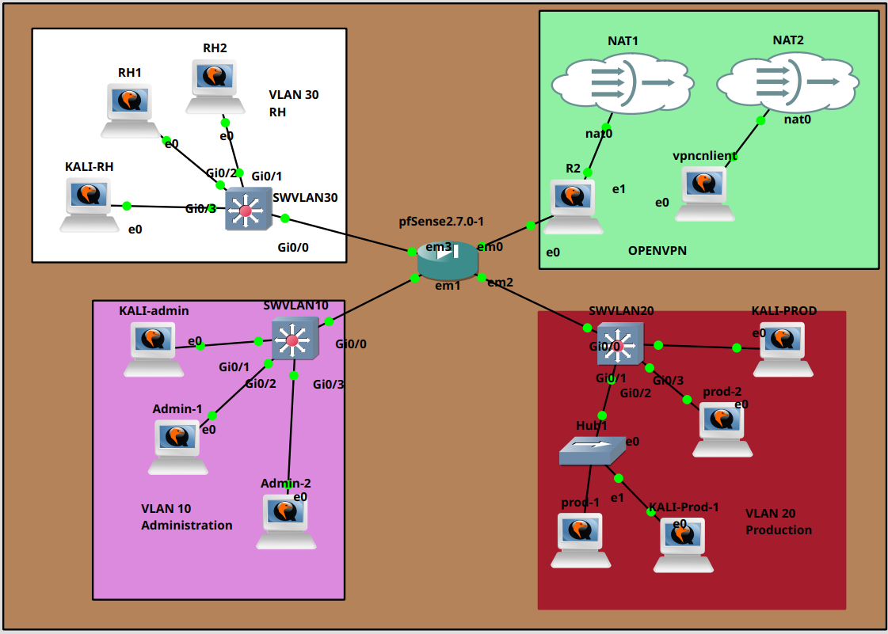
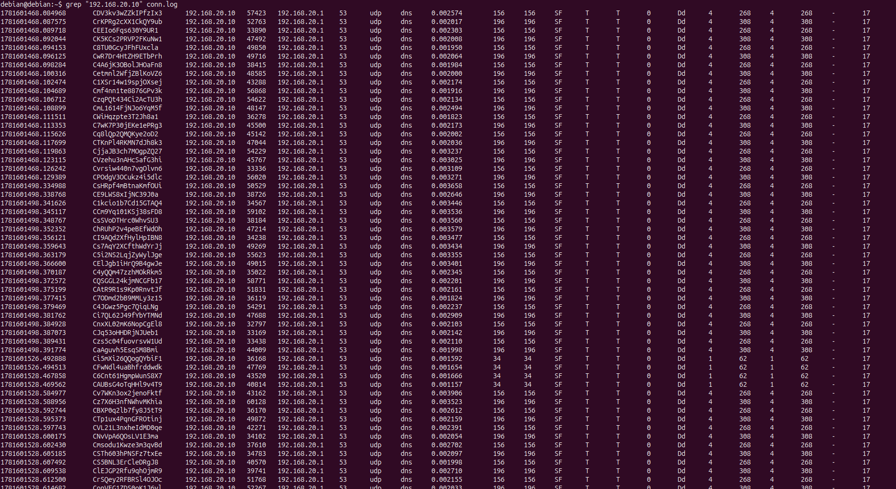
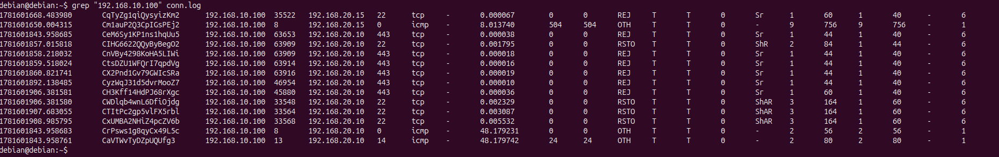
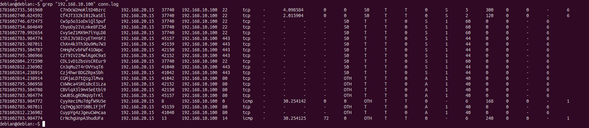

# Atelier 3 - Détection de scans et simulation de déni de service avec Zeek

## Objectif

Cet atelier a pour objectif d'observer comment Zeek détecte certains comportements réseau suspects, notamment des scans de ports et un début de déni de service.

Les tests sont réalisés depuis Kali Linux vers une machine cible du lab. Zeek doit rester actif pendant toute la durée des tests afin de générer les logs nécessaires à l'analyse.

À la fin de l'atelier, il faut être capable de :

- lancer Zeek sur une interface d'observation ;
- générer plusieurs types de scans avec Nmap ;
- simuler un SYN flood limité avec `hping3` ;
- analyser les logs Zeek générés ;
- comparer les observations entre Zeek, Wireshark et pfSense ;
- expliquer les limites de détection selon le placement du capteur.

## Précautions

Les tests doivent rester strictement limités à l'environnement de laboratoire.

Ne pas lancer de scan ou de simulation de déni de service vers une machine extérieure au lab.

La commande `hping3 --flood` génère beaucoup de paquets. Elle doit être arrêtée après quelques secondes avec :

```text
Ctrl + C
```

## Architecture de l'atelier

L'atelier repose sur trois éléments principaux :

| Élément | Rôle |
| --- | --- |
| Kali Linux | Machine utilisée pour générer les scans et le trafic de test |
| Machine cible | Machine testée, par exemple `192.168.20.10` |
| Machine Zeek | Capteur réseau chargé d'observer le trafic |

Exemple de logique attendue :

```text
Kali Linux  --->  pfSense / réseau du lab  --->  cible 192.168.20.10
                         |
                       Zeek
```

Zeek doit être placé à un endroit où il peut voir le trafic entre Kali Linux et la cible. Dans GNS3, l'utilisation d'un hub ou d'un lien de capture peut aider à rendre le trafic visible par Zeek et Wireshark.



Dans cette topologie, le VLAN 20 Production contient les machines de test ainsi qu'un hub. Le Kali utilisé pour les attaques est connecté sur ce segment, et la machine Debian avec Zeek est placée de manière à observer le trafic qui passe par le hub.

Ce placement est important : Zeek ne voit pas tout le réseau automatiquement. Il observe uniquement le trafic qui arrive sur son interface. Le hub permet donc de rendre visibles les échanges du VLAN 20 pour le capteur Zeek.

## 1. Vérifier que Zeek fonctionne

Sur la machine Zeek, se placer dans un dossier de travail :

```bash
mkdir -p ~/zeek-atelier3
cd ~/zeek-atelier3
```

Vérifier l'interface à utiliser :

```bash
ip -br addr
```

Vérifier que l'interface reçoit du trafic :

```bash
sudo tcpdump -i ens3 -n
```

Remplacer `ens3` par l'interface réellement utilisée.

Si du trafic apparaît, arrêter `tcpdump` :

```text
Ctrl + C
```

Lancer Zeek :

```bash
sudo /opt/zeek/bin/zeek -i ens3
```

Zeek doit rester actif pendant les scans et la simulation de déni de service.

Si Zeek est lancé avec `zeekctl`, les logs peuvent se trouver dans :

```bash
logs/current/
```

Si Zeek est lancé directement avec `zeek -i`, les logs peuvent être générés dans le dossier courant après l'arrêt de Zeek.

## 2. Préparer les observations

Pendant les tests, il faut observer trois sources d'information :

| Outil | Ce qu'il permet d'observer |
| --- | --- |
| Zeek | Connexions, services détectés, notices éventuelles, volumes de trafic |
| Wireshark | Paquets réseau précis, flags TCP, répétition des SYN |
| pfSense | Logs firewall, règles autorisées ou bloquées, source et destination |

Avant de commencer, noter :

| Élément | Valeur |
| --- | --- |
| IP de Kali Linux | À compléter |
| IP de la cible | `192.168.20.10` |
| Interface Zeek | À compléter |
| Interface capturée dans Wireshark | À compléter |
| Interface pfSense concernée | À compléter |

## 3. Scan TCP SYN avec Nmap

Depuis Kali Linux, lancer un scan TCP SYN :

```bash
sudo nmap -sS 192.168.20.10
```

Le scan SYN envoie des paquets TCP avec le flag `SYN` pour tester les ports. Si un port est ouvert, la cible répond généralement avec `SYN/ACK`. Si le port est fermé, elle répond souvent avec `RST`.

Ce scan est parfois appelé scan semi-ouvert, car Nmap ne termine pas toujours complètement la connexion TCP.

À observer dans Zeek :

```bash
cat conn.log
```

ou, selon le mode d'exécution :

```bash
cat logs/current/conn.log
```

Rechercher une notice éventuelle :

```bash
cat notice.log
```

ou :

```bash
cat logs/current/notice.log
```

À documenter :

| Élément | Observation |
| --- | --- |
| Type de scan | TCP SYN |
| Commande utilisée | `sudo nmap -sS 192.168.20.10` |
| Logs Zeek générés | À compléter |
| Événements visibles dans Zeek | À compléter |
| Éléments visibles dans Wireshark | Paquets SYN, SYN/ACK ou RST |
| Éléments visibles dans pfSense | Connexions autorisées ou bloquées selon les règles |
| Limites observées | À compléter |

## 4. Scan TCP Connect avec Nmap

Depuis Kali Linux, lancer un scan TCP Connect :

```bash
nmap -sT 192.168.20.10
```

Le scan TCP Connect tente d'établir une connexion TCP complète avec la cible. Il utilise le mécanisme classique en trois étapes :

```text
SYN -> SYN/ACK -> ACK
```

Ce scan est souvent plus visible qu'un scan SYN, car il crée davantage de connexions complètes.

À observer dans Zeek :

```bash
cat conn.log
```

Rechercher des notices :

```bash
grep -i scan notice.log
```

ou :

```bash
grep -i scan logs/current/notice.log
```

À documenter :

| Élément | Observation |
| --- | --- |
| Type de scan | TCP Connect |
| Commande utilisée | `nmap -sT 192.168.20.10` |
| Logs Zeek générés | À compléter |
| Événements visibles dans Zeek | À compléter |
| Éléments visibles dans Wireshark | Connexions TCP complètes ou refusées |
| Éléments visibles dans pfSense | Flux autorisés ou bloqués |
| Limites observées | À compléter |

## 5. Scan de ports sur une plage

Depuis Kali Linux, scanner les ports de `1` à `1024` :

```bash
nmap -p 1-1024 192.168.20.10
```

Ce scan teste un grand nombre de ports connus. Il peut générer beaucoup de lignes dans `conn.log`, car Zeek voit de nombreuses tentatives de connexion vers la même cible.

À observer dans Zeek :

```bash
cat conn.log
```

Compter ou repérer les connexions vers la cible :

```bash
grep "192.168.20.10" conn.log
```

ou :

```bash
grep "192.168.20.10" logs/current/conn.log
```

À documenter :

| Élément | Observation |
| --- | --- |
| Type de scan | Scan de ports `1-1024` |
| Commande utilisée | `nmap -p 1-1024 192.168.20.10` |
| Logs Zeek générés | À compléter |
| Nombre approximatif de connexions observées | À compléter |
| Ports visibles dans Zeek | À compléter |
| Éléments visibles dans Wireshark | Nombreuses tentatives TCP |
| Éléments visibles dans pfSense | Nombreux flux vers la même cible |
| Limites observées | À compléter |

### Exemple d'extraction utile dans `conn.log`



Le fichier `conn.log` peut devenir très long après plusieurs scans. Dans la capture, le fichier est filtré avec :

```bash
grep "192.168.20.10" conn.log
```

Cette méthode permet de ne garder que les lignes liées à une adresse IP précise.

Dans l'exemple, on observe de nombreuses connexions :

| Élément observé | Interprétation |
| --- | --- |
| `192.168.20.10` | Machine observée dans le VLAN 20 |
| `192.168.20.1` | Passerelle ou équipement réseau contacté |
| Port destination `53` | Trafic DNS |
| Protocole `udp` | DNS utilisé en UDP |
| Service `dns` | Zeek a reconnu le protocole DNS |
| État `SF` | Échange vu comme terminé correctement |

Cette capture montre qu'il faut filtrer les logs pour isoler les événements utiles. Sans filtrage, les connexions normales comme le DNS peuvent masquer les lignes intéressantes liées au scan ou à l'attaque.

Exemples de filtres utiles :

```bash
grep "192.168.20.10" conn.log
grep "192.168.10.100" conn.log
grep "192.168.20.10" conn.log | grep "tcp"
```

## 6. Simulation simple de déni de service

Depuis Kali Linux, lancer une simulation SYN flood limitée :

```bash
sudo hping3 -S --flood -p 80 192.168.20.10
```

Cette commande envoie rapidement des paquets TCP SYN vers le port `80` de la cible.

Arrêter le test après quelques secondes :

```text
Ctrl + C
```

Le but n'est pas de rendre le lab inutilisable, mais d'observer un volume anormal de paquets vers une même cible et un même port.

À observer dans Zeek :

```bash
cat conn.log
```

Rechercher des alertes éventuelles :

```bash
cat notice.log
```

ou :

```bash
grep -i scan notice.log
```

Selon la configuration, Zeek peut ne pas générer d'alerte explicite. Dans ce cas, l'anomalie se repère surtout par le nombre élevé de connexions ou de tentatives.

À observer dans Wireshark :

- nombreux paquets TCP avec le flag `SYN` ;
- même adresse IP source ;
- même adresse IP destination ;
- même port destination `80` ;
- répétition rapide des paquets.

À observer dans pfSense :

- logs firewall si la règle journalise le trafic ;
- nombreuses connexions depuis Kali vers la cible ;
- blocages éventuels si une règle bloque le trafic.

À documenter :

| Élément | Observation |
| --- | --- |
| Type de trafic | SYN flood limité |
| Commande utilisée | `sudo hping3 -S --flood -p 80 192.168.20.10` |
| Durée du test | À compléter |
| Port ciblé | `80` |
| Logs Zeek générés | À compléter |
| Volume de trafic observé | À compléter |
| Événements visibles dans Wireshark | À compléter |
| Événements visibles dans pfSense | À compléter |
| Comportement anormal identifié | À compléter |
| Limites de détection | À compléter |

### Exemple d'observation du flood dans `conn.log`



La capture montre un filtrage de `conn.log` sur l'adresse `192.168.10.100` :

```bash
grep "192.168.10.100" conn.log
```

On observe plusieurs connexions TCP entre `192.168.20.15` et `192.168.10.100`, notamment vers les ports `22`, `443` et `80`.

Les éléments importants sont :

| Élément observé | Interprétation |
| --- | --- |
| Nombreuses lignes proches dans le temps | Activité réseau concentrée sur une courte durée |
| Protocole `tcp` | Tentatives de connexion TCP |
| Port `80` | Trafic lié à la simulation de SYN flood HTTP |
| État `S0` | SYN vu par Zeek, mais pas de réponse complète observée |
| État `OTH` | Connexion incomplète ou état difficile à reconstruire |
| Historique `S` ou `A` | Zeek observe des paquets TCP isolés ou incomplets |

Dans un SYN flood, l'indicateur principal n'est pas forcément une alerte explicite dans `notice.log`. Le comportement suspect se voit surtout par la répétition rapide de nombreuses tentatives TCP vers une même cible et un même port.

### Exemple de trafic observé entre VLANs



Cette capture montre également un filtrage de `conn.log` sur `192.168.10.100`.

On observe des échanges entre :

```text
192.168.10.100
192.168.20.10
192.168.20.15
```

Plusieurs types de trafic apparaissent :

| Élément observé | Interprétation |
| --- | --- |
| Port `22` | Tentatives ou connexions SSH |
| Port `443` | Tentatives vers HTTPS |
| ICMP | Tests de connectivité ou ping |
| États `REJ` et `RSTO` | Connexions refusées ou réinitialisées |
| États `OTH` | Paquets vus sans échange complet |

Cette observation est utile pour comparer Zeek avec pfSense. Zeek décrit les connexions observées, alors que pfSense permet de savoir si ces flux ont été autorisés ou bloqués par les règles firewall.

## 7. Lire les logs utiles

Lire les connexions observées :

```bash
cat conn.log
```

ou :

```bash
cat logs/current/conn.log
```

Afficher les notices Zeek :

```bash
cat notice.log
```

ou :

```bash
cat logs/current/notice.log
```

Rechercher des mentions de scan :

```bash
grep -i scan notice.log
```

ou :

```bash
grep -i scan logs/current/notice.log
```

Observer les connexions SSH :

```bash
cat ssh.log
```

ou :

```bash
cat logs/current/ssh.log
```

Observer les connexions HTTP :

```bash
cat http.log
```

ou :

```bash
cat logs/current/http.log
```

## 8. Comparer Zeek, Wireshark et pfSense

Les trois outils n'ont pas le même rôle.

| Outil | Niveau d'observation | Exemple d'information visible |
| --- | --- | --- |
| Zeek | Analyse réseau et journaux structurés | Connexions, services, durées, notices |
| Wireshark | Paquets réseau détaillés | Flags TCP, contenu paquet par paquet |
| pfSense | Décisions firewall | Trafic autorisé ou bloqué par les règles |

Un événement peut donc apparaître dans un outil mais pas dans un autre.

Exemples :

- Wireshark peut voir les paquets SYN même si Zeek ne génère pas d'alerte.
- pfSense peut afficher un blocage si une règle firewall refuse le trafic.
- Zeek peut écrire les connexions dans `conn.log` sans forcément créer de `notice.log`.
- Si Zeek n'est pas placé sur le bon segment réseau, il peut ne pas voir le trafic.
- Si le trafic est chiffré, Zeek peut voir la connexion mais pas le contenu applicatif.

## 9. Observation importante

Zeek ne détecte pas automatiquement tous les comportements malveillants.

Selon la configuration, les scripts actifs, le trafic observé et la position du capteur réseau, certaines activités peuvent :

- être entièrement visibles ;
- être partiellement visibles ;
- générer uniquement des connexions dans `conn.log` ;
- ne pas générer d'alerte explicite dans `notice.log`.

Il faut donc toujours analyser les logs avec le contexte du lab.

Une absence d'alerte ne signifie pas forcément une absence d'activité suspecte.

## 10. Tableau de synthèse à compléter

| Test réalisé | Zeek | Wireshark | pfSense | Conclusion |
| --- | --- | --- | --- | --- |
| Scan TCP SYN | À compléter | À compléter | À compléter | À compléter |
| Scan TCP Connect | À compléter | À compléter | À compléter | À compléter |
| Scan ports `1-1024` | À compléter | À compléter | À compléter | À compléter |
| SYN flood limité | À compléter | À compléter | À compléter | À compléter |

## 11. Analyse attendue

Pour chaque scan, expliquer :

- le type de scan utilisé ;
- le comportement attendu ;
- les logs Zeek générés ;
- les événements visibles dans Wireshark ;
- les logs visibles dans pfSense ;
- les limites de détection observées.

Pour la simulation de déni de service, expliquer :

- le trafic généré ;
- le volume de trafic observé ;
- les événements visibles dans Zeek ;
- les logs visibles dans pfSense ;
- les paquets visibles dans Wireshark ;
- ce qui permet d'identifier un comportement anormal ;
- les différences de visibilité entre les trois outils.

## Aller plus loin

Pour approfondir l'atelier :

- tester un scan UDP avec Nmap ;
- réduire la vitesse du scan et observer les différences ;
- comparer un scan rapide et un scan lent ;
- comparer un SYN flood court et un SYN flood plus lent ;
- tester le même scan depuis un autre VLAN ;
- vérifier l'impact des règles firewall pfSense sur les logs observés.

## Conclusion

Cet atelier montre que Zeek permet d'observer des comportements réseau suspects comme des scans de ports ou une forte répétition de tentatives TCP.

Cependant, Zeek ne remplace ni Wireshark ni pfSense. Wireshark permet d'analyser les paquets en détail, pfSense montre les décisions firewall, et Zeek transforme le trafic observé en journaux structurés.

La qualité de l'analyse dépend donc du placement du capteur, du trafic réellement visible et des logs générés pendant les tests.
