# Atelier 4 - Corrélation des journaux Zeek, Wireshark, pfSense et OpenVPN

## Objectif

Cet atelier a pour objectif de corréler plusieurs sources d'observation réseau afin de reconstituer une chronologie d'événements.

L'analyse porte notamment sur :

- une activité réseau générée depuis Kali Linux ;
- les paquets visibles dans Wireshark ;
- les logs produits par Zeek ;
- les logs pfSense ;
- les logs OpenVPN si un tunnel VPN est actif ;
- l'analyse particulière d'un événement de déni de service.

Le but n'est pas seulement de constater qu'un événement a eu lieu, mais de comprendre comment il apparaît dans chaque outil.

## Outils utilisés

| Outil | Rôle dans l'analyse |
| --- | --- |
| Zeek | Générer des logs structurés à partir du trafic observé |
| Wireshark | Observer les paquets réseau en détail |
| pfSense | Vérifier les décisions firewall et les flux autorisés ou bloqués |
| OpenVPN | Observer les événements liés au tunnel VPN, si disponible |
| Kali Linux | Générer les activités réseau de test |

## Précautions

Les tests doivent rester limités à l'environnement de laboratoire.

Les scans et simulations de déni de service ne doivent jamais être lancés vers une machine extérieure au lab.

Pour la simulation de déni de service, arrêter rapidement le test :

```text
Ctrl + C
```

## 1. Préparer l'environnement

Avant de commencer, identifier les machines et les adresses IP utilisées.

| Élément | Valeur |
| --- | --- |
| Machine Kali Linux | Kali PROD1 |
| Adresse IP de Kali Linux | 192.168.20.15 |
| Machine cible | R2 & vpnclient |
| Adresse IP de la cible | R2 : `192.168.100.2` / vpnclient : `10.8.0.6` |
| Machine Zeek | Debian prod-1 & R2 |
| Interface Zeek utilisée | prod-1 : `ens3` / R2 : `tun0` |
| Interface Wireshark capturée | SWVLAN20 vers pfSense & R2 vers NAT |
| Interface pfSense concernée | tous |
| Tunnel OpenVPN actif | Oui |

Vérifier que Zeek est lancé :

```bash
sudo /opt/zeek/bin/zeek -i ens3
```

Remplacer `ens3` par l'interface réellement utilisée.

Vérifier que Wireshark capture sur le bon lien réseau.

Vérifier que les logs pfSense sont accessibles dans :

```text
Status > System Logs > Firewall
```

Si OpenVPN est utilisé, vérifier les logs dans :

```text
Status > System Logs > OpenVPN
```

## 2. Générer une activité réseau depuis Kali Linux

Depuis Kali Linux, réaliser plusieurs actions réseau afin de produire des événements observables.

### Scan réseau

Exemple de scan simple :

```bash
nmap -p 1-1024 <IP_cible>
```

### Connexion SSH

```bash
ssh utilisateur@<IP_cible>
```

### Connexion HTTP

```bash
curl http://<IP_cible>
```

ou vers un site HTTP si la sortie Internet fonctionne :

```bash
curl http://neverssl.com
```

### Simulation simple de déni de service

```bash
sudo hping3 -S --flood -p 80 <IP_cible>
```

Arrêter après quelques secondes :

```text
Ctrl + C
```

### Trafic VPN si disponible

Si OpenVPN est actif, générer du trafic à travers le tunnel :

```bash
ping <IP_distante_via_VPN>
```

ou :

```bash
ssh utilisateur@<IP_distante_via_VPN>
```

## 3. Capturer le trafic avec Wireshark

Dans Wireshark, capturer le trafic sur l'interface ou le lien concerné.

Filtres utiles :

```text
ip.addr == <IP_cible>
```

```text
ip.addr == <IP_Kali>
```

```text
tcp.flags.syn == 1
```

```text
tcp.port == 80
```

```text
icmp
```

Pour le déni de service, rechercher :

- une répétition rapide de paquets TCP SYN ;sudo nft add rule inet filter forward ip saddr 10.8.0.0/24 ip daddr 192.168.10.0/24 accept

- une même adresse source ;
- une même adresse destination ;
- un même port destination ;
- peu ou pas de réponses complètes.

## 4. Analyser les logs Zeek

Lire les connexions observées :

```bash
cat conn.log
```

Si les logs sont dans `logs/current/` :

```bash
cat logs/current/conn.log
```

Filtrer sur l'adresse de la cible :

```bash
grep "<IP_cible>" conn.log
```

Filtrer sur l'adresse de Kali :

```bash
grep "<IP_Kali>" conn.log
```

Filtrer sur le port 80 :

```bash
awk '$6=="80"' conn.log
```

Afficher les notices éventuelles :

```bash
cat notice.log
```

ou :

```bash
cat logs/current/notice.log
```

Logs Zeek utiles :

| Log | Utilité |
| --- | --- |
| `conn.log` | Connexions, IP, ports, protocole, durée, états |
| `notice.log` | Alertes ou événements notables si générés |
| `http.log` | Requêtes HTTP observées |
| `ssh.log` | Connexions SSH observées |
| `dns.log` | Requêtes DNS observées |

## 5. Analyser les logs pfSense

Dans pfSense, consulter les logs firewall :

```text
Status > System Logs > Firewall
```

Rechercher :

- l'adresse IP de Kali Linux ;
- l'adresse IP de la cible ;
- le port destination ;
- l'interface concernée ;
- l'action firewall : pass ou block ;
- l'heure de l'événement.

À documenter :

| Élément | Observation |
| --- | --- |
| Interface pfSense | À compléter |
| Source | À compléter |
| Destination | À compléter |
| Port | À compléter |
| Action | Pass / Block |
| Règle concernée | À compléter |
| Timestamp | À compléter |

## 6. Analyser les logs OpenVPN si disponibles

Si un tunnel OpenVPN est utilisé, consulter les logs OpenVPN.

Dans pfSense :

```text
Status > System Logs > OpenVPN
```

Sur une machine Linux :

```bash
journalctl -u openvpn
```

ou selon le service :

```bash
journalctl -u openvpn-server@server
```

À rechercher :

- connexion ou déconnexion d'un client VPN ;
- adresse IP attribuée dans le tunnel ;
- routes poussées ;
- erreurs éventuelles ;
- trafic généré pendant que le VPN est actif.

## 7. Résultats observés

Les captures suivantes montrent les résultats obtenus lors des tests : scan Nmap, connexion SSH, requête HTTP, tentative de VLAN hopping et trafic passant par le tunnel OpenVPN.

### Capture Wireshark entre R2 et le réseau NAT

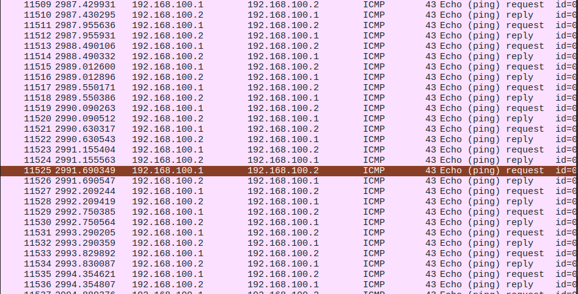

Cette capture Wireshark montre du trafic ICMP entre :

```text
192.168.100.1
192.168.100.2
```

Ces adresses correspondent au lien entre pfSense et R2.

On observe des paquets :

| Élément observé | Interprétation |
| --- | --- |
| `Echo (ping) request` | Requête ICMP envoyée vers une machine |
| `Echo (ping) reply` | Réponse ICMP reçue |
| `192.168.100.1` | pfSense côté réseau de transit |
| `192.168.100.2` | R2 côté réseau de transit |

Cette capture permet de vérifier que la communication entre pfSense et R2 fonctionne. Elle confirme que le routage de base entre les deux équipements est opérationnel.

### Logs Zeek sur R2

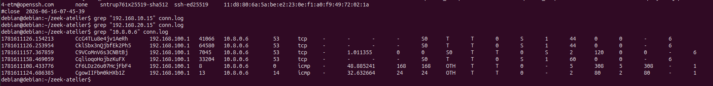

La capture montre un filtrage du fichier `conn.log` sur l'adresse :

```bash
grep "10.8.0.6" conn.log
```

On observe des connexions entre :

```text
192.168.100.1
10.8.0.6
```

Ce résultat indique que Zeek, lancé sur R2, observe du trafic entre pfSense et le client VPN.

| Élément observé | Interprétation |
| --- | --- |
| `192.168.100.1` | pfSense |
| `10.8.0.6` | vpnclient dans le tunnel OpenVPN |
| Port `53` | Tentatives ou flux liés au DNS |
| Protocole `tcp` | Connexions TCP observées |
| ICMP | Tests de connectivité |
| États `S0` et `OTH` | Connexions incomplètes ou paquets observés sans échange complet |

Cette capture est utile pour montrer que Zeek peut voir le trafic côté tunnel lorsque l'interface surveillée est bien placée.

### Logs Zeek côté VLAN 20

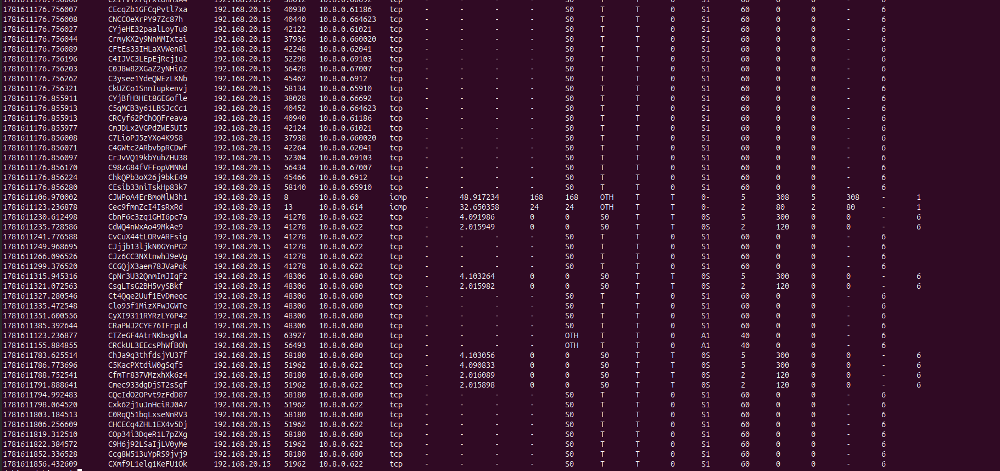

Cette capture montre des entrées `conn.log` observées côté VLAN 20.

On retrouve notamment :

```text
192.168.20.15
10.8.0.x
```

La machine `192.168.20.15` correspond à Kali PROD1. Les destinations en `10.8.0.x` correspondent au réseau OpenVPN.

| Élément observé | Interprétation |
| --- | --- |
| `192.168.20.15` | Source des tests depuis le VLAN 20 |
| `10.8.0.x` | Destination côté réseau VPN |
| Protocole `tcp` | Tentatives de connexion TCP |
| États `S0` | SYN vu, mais connexion non finalisée |
| États `S1` | Connexion partiellement établie |
| Ports multiples | Comportement compatible avec un scan ou plusieurs tentatives de connexion |

Cette observation montre que Zeek peut identifier de nombreuses tentatives TCP depuis le VLAN 20 vers le réseau VPN. Les états de connexion sont importants pour différencier une connexion complète d'une simple tentative.

### Capture Wireshark côté VLAN 20

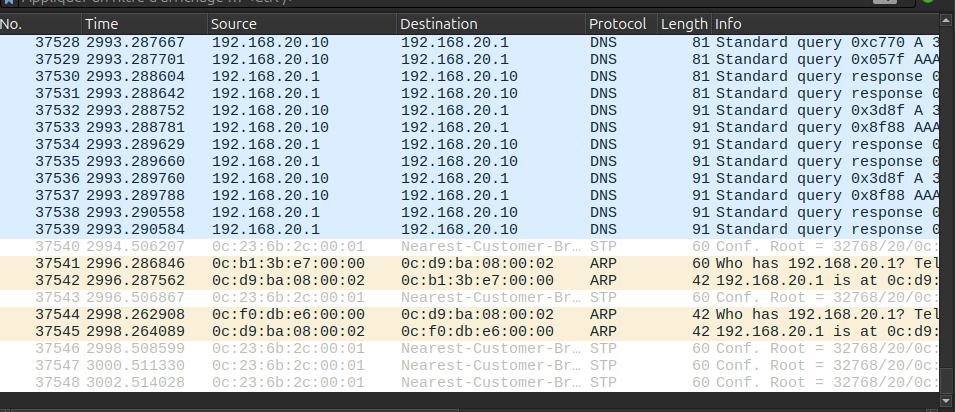

La capture Wireshark montre principalement du trafic DNS, ARP et STP sur le VLAN 20.

On observe :

| Élément observé | Interprétation |
| --- | --- |
| DNS entre `192.168.20.10` et `192.168.20.1` | Résolutions de noms via la passerelle ou le DNS du VLAN |
| ARP `Who has 192.168.20.1` | Recherche de l'adresse MAC de la passerelle |
| STP | Trafic de contrôle de niveau 2 généré par les équipements de commutation |

Cette capture illustre une limite importante : selon le point de capture choisi, Wireshark peut montrer du bruit réseau ou du trafic de contrôle, sans forcément montrer directement le SSH ou le HTTP attendu.

Pour voir le SSH ou HTTP de manière plus ciblée, il faut utiliser des filtres comme :

```text
tcp.port == 22
```

```text
tcp.port == 80
```

```text
ip.addr == 10.8.0.6
```

### Log DHCP observé par Zeek

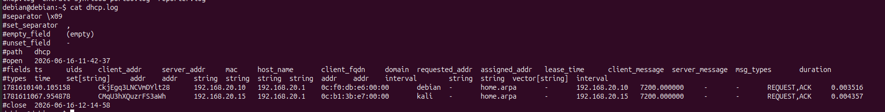

Cette capture affiche le fichier :

```bash
cat dhcp.log
```

On observe des événements DHCP pour des machines du VLAN 20 :

| Élément observé | Interprétation |
| --- | --- |
| `192.168.20.10` | Machine ayant reçu ou demandé une adresse DHCP |
| `192.168.20.15` | Kali PROD1 |
| `192.168.20.1` | Serveur DHCP ou relais/passerelle |
| `REQUEST,ACK` | Demande DHCP acceptée |
| `lease_time 7200` | Durée du bail DHCP |

Même si ce log ne correspond pas directement au SSH ou au HTTP, il donne du contexte sur les machines actives dans le VLAN 20 et confirme les adresses utilisées pendant les tests.

### Logs OpenVPN

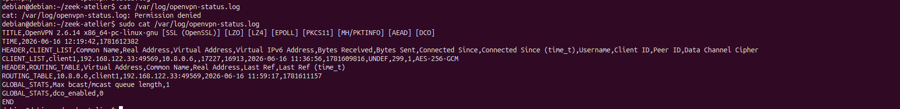

La capture montre le fichier de statut OpenVPN :

```bash
sudo cat /var/log/openvpn-status.log
```

On observe notamment :

| Élément observé | Interprétation |
| --- | --- |
| `client1` | Nom commun du client VPN connecté |
| `192.168.122.33:49569` | Adresse réelle du client côté réseau NAT |
| `10.8.0.6` | Adresse virtuelle attribuée au client VPN |
| `AES-256-GCM` | Chiffrement utilisé pour le canal de données |
| `ROUTING_TABLE` | Association entre l'IP virtuelle VPN et le client |

Ce log confirme que le client VPN est bien connecté et que l'adresse `10.8.0.6` lui est attribuée. Il permet de relier les observations Zeek et Wireshark au client OpenVPN réel.

### Logs firewall pfSense

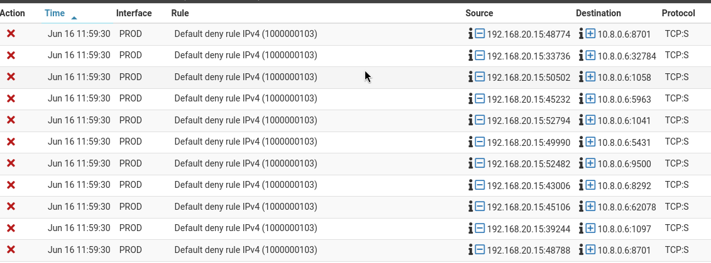

La capture pfSense montre plusieurs événements bloqués par la règle par défaut :

```text
Default deny rule IPv4
```

Les flux observés ont pour source :

```text
192.168.20.15
```

et pour destination :

```text
10.8.0.6
```

| Élément observé | Interprétation |
| --- | --- |
| Interface `PROD` | Trafic provenant du VLAN 20 |
| Source `192.168.20.15` | Kali PROD1 |
| Destination `10.8.0.6` | vpnclient |
| Protocole `TCP:S` | Paquets TCP SYN |
| Croix rouge | Trafic bloqué |
| `Default deny rule IPv4` | Aucune règle explicite n'autorise ce trafic |

Cette capture explique pourquoi certaines connexions SSH ou HTTP peuvent ne pas aboutir : pfSense bloque les paquets SYN avant que la connexion soit établie.

### Tentative de VLAN hopping depuis Kali PROD

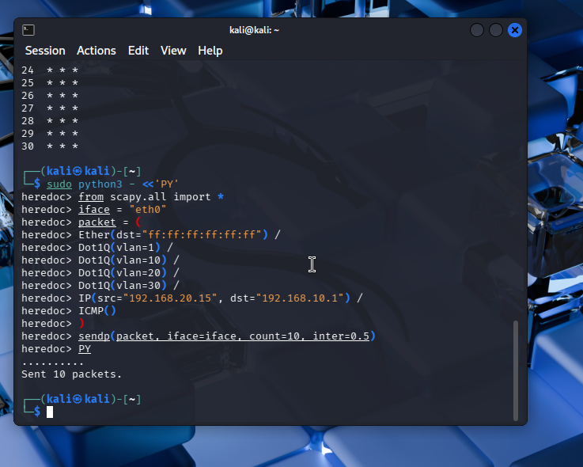

La capture montre l'envoi de paquets forgés avec Scapy depuis Kali PROD.

La machine source est :

```text
192.168.20.15
```

La destination testée est :

```text
192.168.10.1
```

Le paquet contient plusieurs en-têtes 802.1Q :

```python
Dot1Q(vlan=1) /
Dot1Q(vlan=10) /
Dot1Q(vlan=20) /
Dot1Q(vlan=30)
```

L'objectif du test est d'observer si un paquet émis depuis le VLAN 20 peut être interprété comme appartenant à un autre VLAN. Dans un réseau correctement configuré, cette tentative ne doit pas permettre d'accéder au VLAN cible.

### Observation Wireshark du VLAN hopping

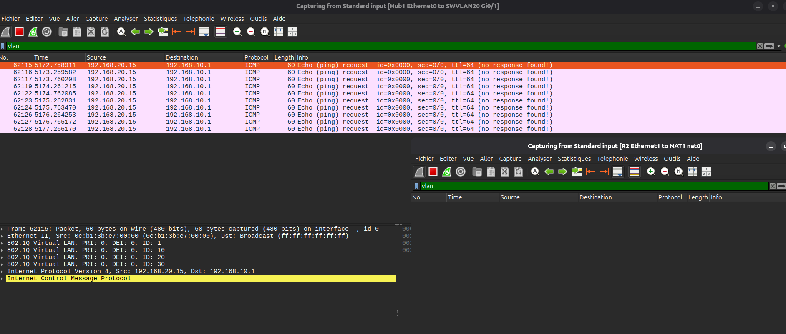

La capture Wireshark utilise le filtre :

```text
vlan
```

On observe des paquets ICMP envoyés depuis :

```text
192.168.20.15
```

vers :

```text
192.168.10.1
```

Dans le détail du paquet, Wireshark affiche plusieurs balises VLAN :

| VLAN observé | Interprétation |
| --- | --- |
| VLAN `1` | VLAN natif supposé ou premier tag injecté |
| VLAN `10` | VLAN cible testé |
| VLAN `20` | VLAN d'origine de Kali PROD |
| VLAN `30` | VLAN supplémentaire injecté dans le test |

Les lignes indiquent :

```text
no response found
```

Cela signifie que les paquets ICMP forgés sont visibles dans la capture, mais qu'aucune réponse ICMP n'est observée. Le test ne valide donc pas un accès réussi à un autre VLAN. Il montre surtout que les paquets tagués sont émis et visibles au point de capture.

### Logs pfSense pendant le test de hopping

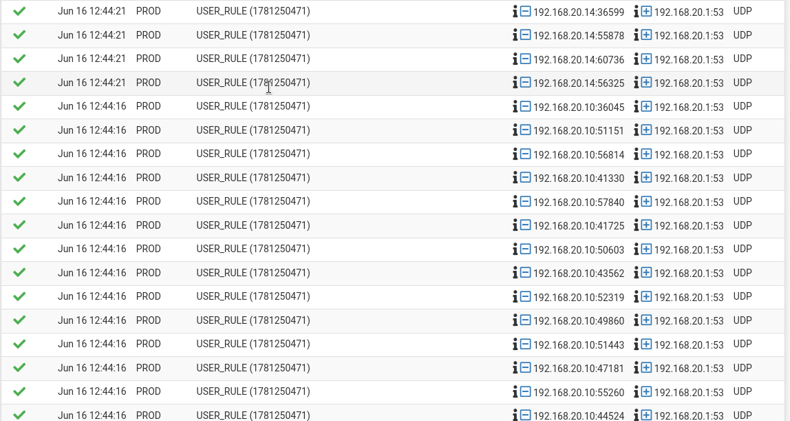

La capture pfSense montre principalement du trafic DNS autorisé depuis le VLAN PROD vers `192.168.20.1`.

On observe :

| Élément observé | Interprétation |
| --- | --- |
| Interface `PROD` | Trafic provenant du VLAN 20 |
| Sources `192.168.20.10` et `192.168.20.14` | Machines du VLAN 20 |
| Destination `192.168.20.1:53` | Service DNS côté passerelle |
| Action verte | Trafic autorisé par une règle utilisateur |

On ne voit pas d'accès réussi depuis `192.168.20.15` vers `192.168.10.1` dans cette capture. Cela confirme que la tentative de VLAN hopping n'apparaît pas comme une communication inter-VLAN valide dans les logs pfSense.

### Logs Zeek côté VLAN 20 pendant les tests

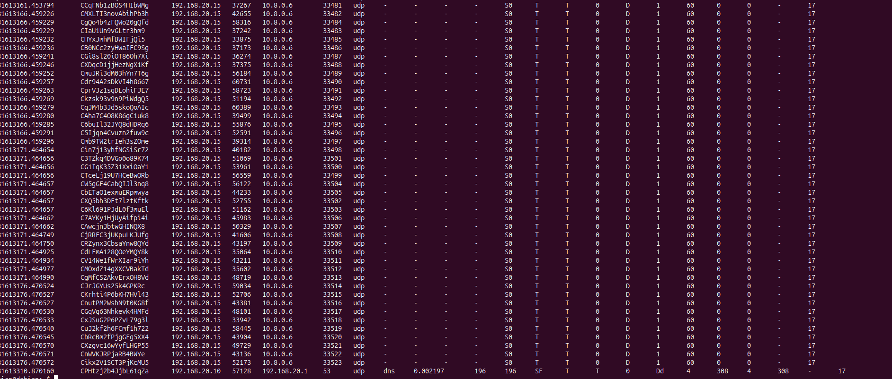

La capture Zeek montre des connexions observées côté VLAN 20.

On retrouve notamment :

```text
192.168.20.15 -> 10.8.0.6
```

avec de nombreux ports UDP successifs.

| Élément observé | Interprétation |
| --- | --- |
| `192.168.20.15` | Kali PROD |
| `10.8.0.6` | vpnclient |
| Protocole `udp` | Sondes ou tentatives UDP |
| Ports successifs `33481`, `33482`, etc. | Comportement proche d'un traceroute ou d'une série de sondes |
| État `S0` | Zeek observe l'envoi, sans réponse complète |

Cette capture n'indique pas un VLAN hopping réussi. Elle montre plutôt que Zeek observe les sondes ou tentatives envoyées depuis le VLAN 20 vers le réseau VPN.

### Logs Zeek sur R2 pendant le hopping


La capture montre une recherche dans `conn.log` sur R2 :

```bash
grep "10.8.0.6" conn.log
```

Aucune ligne n'est retournée.

Cela signifie que, pendant cette phase de test, Zeek sur R2 n'a pas observé de trafic correspondant à `10.8.0.6`. C'est cohérent avec une tentative de VLAN hopping qui reste visible côté VLAN 20 mais ne traverse pas correctement pfSense et R2 jusqu'au tunnel OpenVPN.

### Synthèse du test de VLAN hopping

Le test de VLAN hopping montre que les paquets forgés sont bien émis depuis Kali PROD et visibles dans Wireshark avec plusieurs balises 802.1Q.

Cependant, l'absence de réponse ICMP, l'absence de trace exploitable côté R2 et l'absence de communication inter-VLAN validée dans pfSense indiquent que la tentative ne permet pas d'atteindre réellement le VLAN cible.

Le résultat attendu dans un réseau correctement configuré est donc observé : le paquet de test est visible au point d'injection, mais le VLAN hopping ne réussit pas.

## 8. Corréler les événements

La corrélation consiste à relier les événements observés dans plusieurs outils.

Il faut comparer :

- les adresses IP source et destination ;
- les ports source et destination ;
- les protocoles ;
- les timestamps ;
- les interfaces réseau concernées ;
- les actions firewall ;
- les états de connexion Zeek ;
- les paquets visibles dans Wireshark.

Tableau de corrélation :

| Heure | Source | Destination | Port | Protocole | Zeek | Wireshark | pfSense | OpenVPN |
| --- | --- | --- | --- | --- | --- | --- | --- | --- |
| 11:59 environ | `192.168.20.15` | `10.8.0.6` | Plusieurs ports | TCP SYN | Connexions visibles dans `conn.log` | Visible selon le point de capture | Bloqué par `Default deny rule IPv4` | Client `10.8.0.6` connecté |
| Test ICMP | `192.168.100.1` | `192.168.100.2` | - | ICMP | Visible si Zeek surveille le lien | Echo request/reply visibles | Autorisé si règle ICMP présente | Non concerné |
| Connexion VPN | `192.168.122.33` | `192.168.122.218` | `1194` | UDP/OpenVPN | Visible comme trafic UDP si observé côté NAT | Visible comme UDP chiffré | Selon règles NAT/transit | Client `client1` connecté |
| VLAN hopping | `192.168.20.15` | `192.168.10.1` | - | ICMP avec tags 802.1Q | Peu ou pas visible selon interface Zeek | Paquets tagués visibles, pas de réponse | Pas de communication inter-VLAN validée | Non concerné |

## 9. Reconstituer la chronologie

Construire une chronologie claire des événements observés.

Chronologie observée dans les captures :

| Ordre | Événement | Source de log | Analyse |
| --- | --- | --- | --- |
| 1 | Le client OpenVPN se connecte | OpenVPN | `client1` reçoit l'adresse virtuelle `10.8.0.6` |
| 2 | Le lien pfSense-R2 est testé | Wireshark | ICMP entre `192.168.100.1` et `192.168.100.2` |
| 3 | Kali PROD1 génère du trafic vers le VPN | Zeek VLAN20 | Connexions TCP depuis `192.168.20.15` vers `10.8.0.x` |
| 4 | pfSense bloque certains flux | Logs pfSense | Paquets TCP SYN bloqués par la règle `Default deny rule IPv4` |
| 5 | Zeek sur R2 observe du trafic VPN | Zeek R2 | Flux entre `192.168.100.1` et `10.8.0.6` |
| 6 | Tentative de VLAN hopping | Scapy / Wireshark | Paquets ICMP avec plusieurs tags VLAN visibles, sans réponse |
| 7 | Vérification côté pfSense et R2 | pfSense / Zeek R2 | Pas de preuve d'un passage réussi vers le VLAN cible |

## 10. Analyse du déni de service

Pour l'événement de déni de service, documenter précisément :

| Élément | Observation |
| --- | --- |
| Commande utilisée | À compléter |
| Source de l'attaque | À compléter |
| Cible | À compléter |
| Port ciblé | À compléter |
| Durée approximative | À compléter |
| Volume observé | À compléter |
| Logs Zeek concernés | À compléter |
| Logs pfSense concernés | À compléter |
| Paquets visibles dans Wireshark | À compléter |
| Impact observé | À compléter |

Points d'analyse :

- Le trafic est-il concentré sur une seule cible ?
- Le trafic vise-t-il un seul port ?
- Observe-t-on une répétition rapide de paquets SYN ?
- Les connexions sont-elles complètes ou incomplètes ?
- pfSense autorise-t-il ou bloque-t-il le trafic ?
- Zeek génère-t-il une alerte ou seulement des entrées dans `conn.log` ?
- Wireshark montre-t-il plus de détails que Zeek ?

## 11. Limites de visibilité

Chaque outil a ses limites.

| Outil | Limite possible |
| --- | --- |
| Zeek | Ne voit que le trafic reçu sur son interface |
| Wireshark | Dépend du point de capture choisi |
| pfSense | Ne voit que le trafic qui traverse le firewall |
| OpenVPN | Peut montrer le tunnel sans détailler le trafic interne chiffré |

Exemples :

- Un trafic local au même VLAN peut ne pas passer par pfSense.
- Zeek peut ne pas générer de `notice.log` même si un comportement est suspect.
- Wireshark peut voir des paquets que pfSense ne journalise pas.
- pfSense peut voir une décision firewall sans montrer le détail paquet par paquet.
- OpenVPN peut montrer une connexion VPN active sans permettre de lire le contenu chiffré.

Dans les captures réalisées, les différences de visibilité sont les suivantes :

| Source | Ce qui est visible | Limite |
| --- | --- | --- |
| Wireshark côté VLAN 20 | DNS, ARP, STP, trafic local selon le filtre | Ne montre pas forcément le trafic VPN si le point de capture est mal choisi |
| Wireshark R2 vers NAT | Trafic entre R2 et le réseau NAT | Le contenu VPN est chiffré |
| Zeek VLAN 20 | Tentatives TCP depuis Kali PROD1 | Ne sait pas si pfSense bloque ensuite le flux |
| Zeek R2 | Flux liés au client VPN | Dépend de l'interface surveillée |
| pfSense | Autorisation ou blocage des paquets | Ne détaille pas le contenu applicatif |
| OpenVPN | Client connecté et IP virtuelle attribuée | Ne décrit pas chaque requête HTTP ou SSH |
| VLAN hopping | Visible surtout dans Wireshark au point d'injection | Un paquet visible ne prouve pas que l'attaque a réussi |

## 12. Outils les plus utiles selon l'analyse

| Besoin d'analyse | Outil le plus utile |
| --- | --- |
| Voir les paquets précisément | Wireshark |
| Identifier les connexions et services | Zeek |
| Vérifier si le firewall bloque ou autorise | pfSense |
| Vérifier l'état du tunnel VPN | Logs OpenVPN |
| Reconstituer une chronologie globale | Combinaison des outils |

## 13. Travail demandé

Dans le compte rendu, documenter :

- les événements observés ;
- leur chronologie ;
- les sources de logs utilisées ;
- l'analyse du comportement de déni de service ;
- les limites de visibilité rencontrées ;
- les outils les plus utiles selon le type d'analyse.

## Aller plus loin

Pour approfondir :

- comparer les timestamps entre Zeek, Wireshark, pfSense et OpenVPN ;
- identifier les différences de visibilité entre couche 2 et couches 3/4 ;
- comparer un trafic local au VLAN et un trafic qui traverse pfSense ;
- comparer un SYN flood court et un SYN flood plus lent ;
- analyser les différences entre trafic clair et trafic chiffré.

## Conclusion

Cet atelier montre qu'une analyse réseau fiable nécessite plusieurs sources d'observation.

Zeek fournit des logs structurés, Wireshark montre les paquets, pfSense indique les décisions firewall et OpenVPN permet de vérifier l'état du tunnel si celui-ci est utilisé.

La corrélation des adresses IP, des ports, des protocoles et des timestamps permet de reconstituer la chronologie des événements et de mieux comprendre un comportement suspect comme un début de déni de service.

## Ressource

- Zeek Documentation : <https://docs.zeek.org/>
