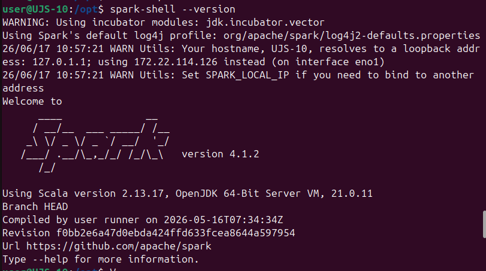
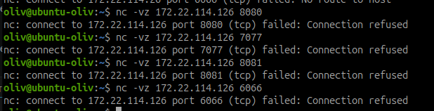
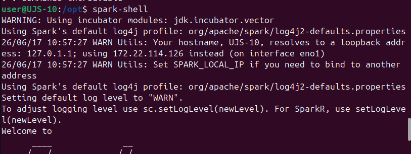
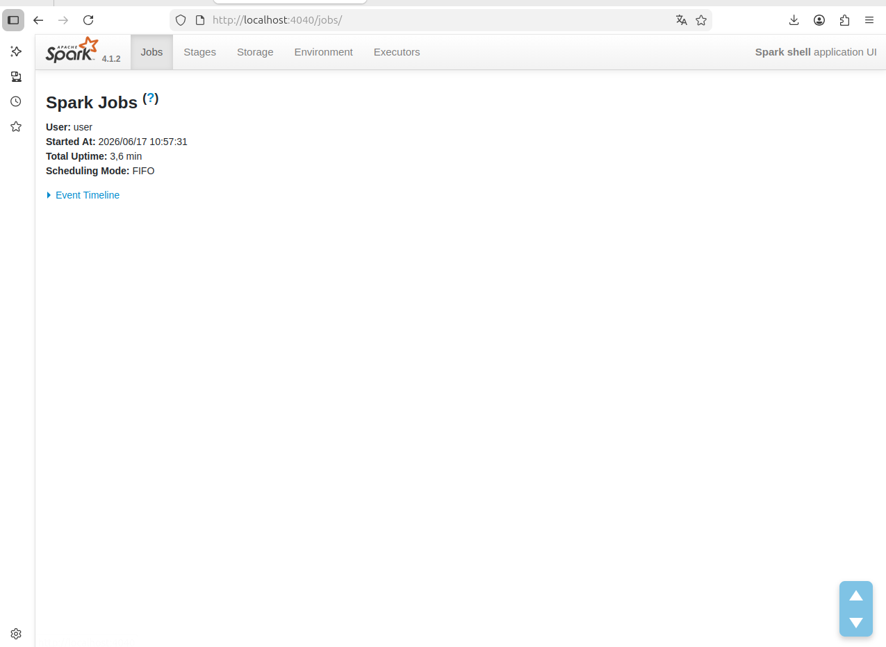
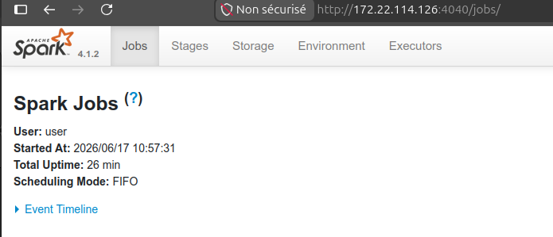
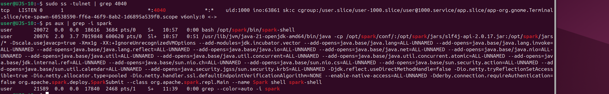
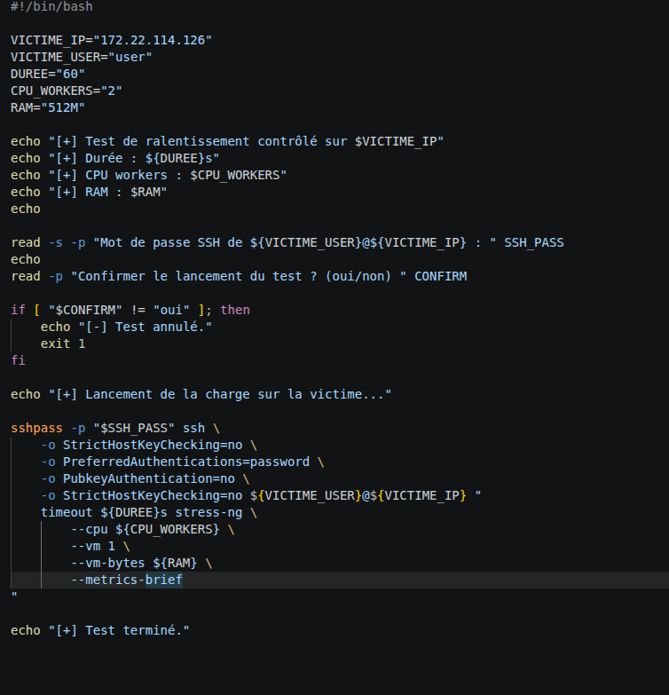
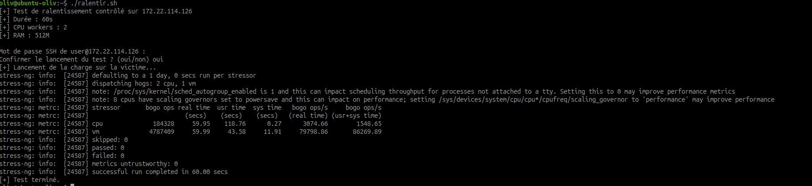
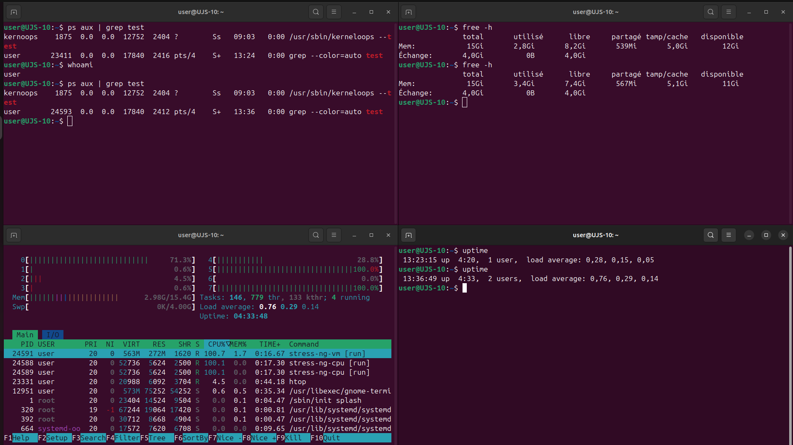

# Atelier 1 - Réponse à incident et sécurisation d'une installation Spark

## Objectif

Cet atelier a pour objectif d'analyser une installation Apache Spark insuffisamment sécurisée, d'identifier les risques associés, puis d'appliquer une démarche de remédiation inspirée des recommandations ANSSI.

Le scénario de départ est volontairement défavorable : Spark est installé avec une configuration proche des valeurs par défaut, plusieurs interfaces sont exposées et les protections de base ne sont pas appliquées.

À la fin de l'atelier, il faut être capable de :

- installer Spark sur une machine Linux ;
- identifier les services, ports et interfaces exposés ;
- repérer les risques liés à une configuration par défaut ;
- reproduire une situation vulnérable simple dans un lab ;
- analyser les processus, connexions réseau et logs ;
- appliquer une démarche de remédiation ;
- durcir l'installation Spark ;
- vérifier que les accès non autorisés ne fonctionnent plus ;
- rédiger un court rapport d'incident.

## Contexte d'incident

Une machine Linux utilisée pour l'analyse de données commence à présenter un comportement anormal :

- forte lenteur ;
- charge CPU élevée ;
- services qui répondent difficilement ;
- activité réseau inhabituelle ;
- interface Spark accessible depuis le réseau.

Hypothèse de départ :

```text
Une installation Spark laissée avec une configuration trop permissive a pu permettre une utilisation non autorisée du cluster.
```

Le but de l'atelier n'est pas d'attaquer un système réel. Tous les tests doivent rester strictement limités à l'environnement de laboratoire.

## Références de sécurité

La documentation officielle Spark rappelle plusieurs points importants :

- les fonctions de sécurité ne sont pas activées par défaut ;
- un cluster Spark ne doit pas être exposé directement sur Internet ou sur un réseau non fiable ;
- l'accès aux ports Spark doit être limité aux hôtes autorisés ;
- Spark peut exécuter du code soumis par des utilisateurs autorisés, ce qui impose un contrôle strict des accès ;
- en mode standalone, plusieurs ports sont sensibles, notamment `7077`, `8080`, `8081` et `6066`.

Références utilisées :

- Spark Security Documentation : <https://spark.apache.org/docs/latest/security.html>
- Spark Standalone Mode : <https://spark.apache.org/docs/latest/spark-standalone.html>
- ANSSI — Cyberattaques et remédiation : <https://messervices.cyber.gouv.fr/guides/cyberattaques-et-remediation-les-cles-de-decision>

## Architecture de l'atelier

| Élément | Rôle |
| --- | --- |
| PC dédié Spark | Machine Linux physique utilisée comme serveur Spark |
| Laptop personnel | Machine de test utilisée pour vérifier les accès réseau |
| Firewall local du PC Spark | Filtrage réseau avec `nftables` ou `ufw` |
| Wireshark / tcpdump | Observation réseau depuis le laptop ou le PC Spark |
| Logs système | Analyse de l'activité locale |

Dans cet atelier, Spark n'est pas installé dans GNS3. Il est installé sur un PC physique dédié, séparé de la machine principale. Le laptop sert de poste de test pour simuler un accès distant contrôlé.

```text
Laptop de test  --->  réseau local/lab  --->  PC dédié Spark
```

Environnement réellement utilisé pendant l'atelier :

| Élément | Valeur observée |
| --- | --- |
| Machine victime | PC dédié Spark |
| Adresse IP de la victime | `172.22.114.126` |
| Poste de test | Laptop personnel |
| Version Spark observée | `4.1.2` |
| Interface réseau utilisée par Spark | `eno1` |
| Interface Spark accessible | `http://172.22.114.126:4040/jobs/` |

Pour relever les adresses IP :

Sur le PC Spark :

```bash
ip -br addr
```

Sur le laptop :

```bash
ip -br addr
```

Dans les commandes suivantes, remplacer `IP_PC_SPARK` par l'adresse réelle du PC dédié Spark et `IP_LAPTOP` par l'adresse réelle du laptop.

## 1. Installer Spark sur la machine Linux

Mettre à jour la machine :

```bash
sudo apt update
sudo apt upgrade
```

Installer Java :

```bash
sudo apt install default-jdk curl tar
```

Vérifier Java :

```bash
java -version
```

Télécharger Spark depuis le site officiel Apache. Adapter la version selon celle fournie dans le lab :

```bash
export SPARK_VERSION=4.1.2
cd /opt
sudo curl -LO https://downloads.apache.org/spark/spark-${SPARK_VERSION}/spark-${SPARK_VERSION}-bin-hadoop3.tgz
sudo tar -xzf spark-${SPARK_VERSION}-bin-hadoop3.tgz
sudo ln -s spark-${SPARK_VERSION}-bin-hadoop3 spark
```

Définir les variables d'environnement :

```bash
echo 'export SPARK_HOME=/opt/spark' >> ~/.bashrc
echo 'export PATH=$PATH:$SPARK_HOME/bin:$SPARK_HOME/sbin' >> ~/.bashrc
source ~/.bashrc
```

Vérifier :

```bash
spark-shell --version
```

Si la version exacte n'est plus disponible sur le miroir Apache, récupérer la version proposée par la page officielle de téléchargement, puis adapter les noms de fichiers.

Dans l'atelier, Spark a été installé sur le PC victime puis ajouté au `PATH` afin de pouvoir lancer les commandes Spark directement depuis le terminal.



La capture montre que Spark `4.1.2` est bien installé. On observe aussi un avertissement important : le nom de machine résout vers `127.0.1.1`, donc Spark choisit l'adresse réseau `172.22.114.126` sur l'interface `eno1`. Ce comportement est pratique pour accéder à Spark depuis le réseau, mais il peut aussi exposer l'interface si aucun filtrage n'est appliqué.

## 2. Lancer Spark en mode standalone

Lancer le master Spark :

```bash
$SPARK_HOME/sbin/start-master.sh
```

Lancer un worker local :

```bash
$SPARK_HOME/sbin/start-worker.sh spark://<IP_SERVEUR_SPARK>:7077
```

Exemple :

```bash
$SPARK_HOME/sbin/start-worker.sh spark://IP_PC_SPARK:7077
```

Vérifier les processus :

```bash
ps aux | grep -i spark
```

Afficher les services systemd :

```bash
systemctl list-units --type=service
```

## 3. Identifier les ports et interfaces exposés

Lister les ports en écoute :

```bash
sudo ss -tulnp
```

Filtrer sur les ports Spark courants :

```bash
sudo ss -tulnp | grep -E '7077|8080|8081|6066|4040|18080'
```

Ports Spark importants :

| Port | Service | Risque si exposé |
| --- | --- | --- |
| `8080` | Web UI du master standalone | Consultation non autorisée de l'état du cluster |
| `8081` | Web UI du worker | Exposition d'informations sur les workers |
| `7077` | Port master standalone | Soumission de jobs si l'accès n'est pas contrôlé |
| `6066` | REST submission API si activée | Soumission distante via API |
| `4040` | Web UI d'une application | Exposition des détails d'un job |
| `18080` | History Server | Exposition d'historique d'applications |

Vérifier depuis la machine de test :

```bash
curl http://IP_PC_SPARK:8080
```

Si une page HTML Spark est retournée sans authentification, l'interface est exposée.

### Observation réelle sur le lab

Depuis le laptop, les ports Spark classiques ont été testés avec `nc` :

```bash
nc -vz 172.22.114.126 8080
nc -vz 172.22.114.126 7077
nc -vz 172.22.114.126 8081
nc -vz 172.22.114.126 6066
```



Résultat observé :

| Port testé | Service attendu | Résultat | Interprétation |
| --- | --- | --- | --- |
| `8080` | Spark Master Web UI | Refusé | Le master standalone n'est pas exposé |
| `7077` | Spark Master | Refusé | La soumission de jobs au master n'est pas accessible |
| `8081` | Spark Worker Web UI | Refusé | Le worker standalone n'est pas exposé |
| `6066` | REST submission API | Refusé | L'API REST de soumission n'est pas accessible |
| `4040` | Spark Application UI | Accessible via navigateur | Une interface applicative Spark est exposée |

Le constat est donc plus précis qu'une installation Spark totalement ouverte : les ports standalone sensibles sont fermés, mais l'interface applicative `4040` est accessible depuis le laptop.

Depuis le PC victime, le lancement de `spark-shell` ouvre l'interface applicative Spark :



Spark indique utiliser l'adresse `172.22.114.126`. Cela explique pourquoi l'interface `4040` est consultable depuis une autre machine du réseau.

Sur le PC victime, l'interface est visible localement :



Depuis le laptop, la même interface est accessible à distance :



Cette exposition ne permet pas forcément une exécution distante directe, mais elle constitue une fuite d'informations : nom de l'application, utilisateur, heure de démarrage, jobs, stages, stockage, environnement et executors.

## 4. Identifier les éléments dangereux

Analyser la configuration Spark :

```bash
ls -l $SPARK_HOME/conf
cat $SPARK_HOME/conf/spark-defaults.conf 2>/dev/null
cat $SPARK_HOME/conf/spark-env.sh 2>/dev/null
```

Éléments à rechercher :

| Élément problématique | Risque |
| --- | --- |
| Web UI accessible depuis tout le réseau | Fuite d'informations sur les jobs et workers |
| Pas d'authentification RPC | Soumission ou interaction non autorisée |
| REST API activée inutilement | Soumission distante de jobs |
| Ports `7077`, `8080`, `8081`, `6066` ouverts à tous | Surface d'attaque élevée |
| Spark lancé avec un utilisateur privilégié | Impact système plus grave en cas d'abus |
| Répertoires Spark trop permissifs | Modification de configuration ou de scripts |
| SSH ouvert largement | Accès distant trop permissif |
| Système non mis à jour | Vulnérabilités connues non corrigées |

Vérifier les permissions :

```bash
ls -ld /opt/spark
find /opt/spark/conf -maxdepth 1 -type f -exec ls -l {} \;
```

## 5. Reproduire une situation vulnérable simple

Cette reproduction doit rester limitée au lab.

### Accès non authentifié à la Web UI

Depuis la machine de test :

```bash
curl http://IP_PC_SPARK:8080
```

ou dans un navigateur :

```text
http://IP_PC_SPARK:8080
```

À documenter :

| Élément | Observation |
| --- | --- |
| URL testée | `http://IP_PC_SPARK:8080` |
| Authentification demandée | Oui / Non |
| Informations visibles | À compléter |
| Risque | Exposition d'informations |

Dans le cas observé, l'URL exposée n'est pas `8080` mais `4040` :

```text
http://172.22.114.126:4040/jobs/
```

Cette page ne demande pas d'authentification. Elle correspond à l'interface d'une application Spark lancée avec `spark-shell`.

### Soumission distante autorisée

Depuis une machine autorisée du lab, lancer un job d'exemple :

```bash
$SPARK_HOME/bin/spark-submit \
  --master spark://IP_PC_SPARK:7077 \
  --class org.apache.spark.examples.SparkPi \
  $SPARK_HOME/examples/jars/spark-examples_*.jar 10
```

Ce test montre que Spark accepte l'exécution de code soumis au cluster. Ce comportement est normal pour Spark, mais il devient dangereux si des machines non autorisées peuvent atteindre le master.

À documenter :

| Élément | Observation |
| --- | --- |
| Source du test | À compléter |
| Master ciblé | `spark://IP_PC_SPARK:7077` |
| Job lancé | `SparkPi` |
| Authentification exigée | Oui / Non |
| Risque | Exécution non autorisée si l'accès n'est pas filtré |

## 6. Analyser les traces système

### Capture réseau

Depuis le laptop, lancer Wireshark sur l'interface connectée au même réseau que le PC Spark, puis filtrer :

```text
ip.addr == IP_PC_SPARK
```

Filtres utiles :

```text
tcp.port == 8080
tcp.port == 7077
tcp.port == 6066
```

Sur le PC Spark, il est aussi possible d'utiliser `tcpdump` :

```bash
sudo tcpdump -i any host IP_LAPTOP and tcp
```

Cette capture permet de comparer :

- les accès HTTP à la Web UI ;
- les connexions vers le master Spark ;
- les tests avant et après filtrage réseau.

### Processus

```bash
ps aux | grep -i spark
top
```

À rechercher :

- processus Spark master ;
- processus Spark worker ;
- jobs en cours ;
- charge CPU anormale ;
- processus inconnus.

### Connexions réseau

```bash
sudo ss -tupna
```

Filtrer les ports Spark :

```bash
sudo ss -tupna | grep -E '7077|8080|8081|6066|4040'
```

Dans l'atelier, la commande suivante a confirmé que le port `4040` était en écoute :

```bash
sudo ss -tulnet | grep 4040
ps aux | grep -i spark
```



On observe :

- un port `4040` en écoute ;
- un processus `spark-shell` ;
- un processus Java lancé via `SparkSubmit` ;
- une écoute compatible IPv4/IPv6, donc visible depuis le réseau si le firewall l'autorise.

Ce point permet de relier l'interface visible dans le navigateur au processus réellement actif sur la machine victime.

### Logs Spark

```bash
ls -l $SPARK_HOME/logs
tail -n 100 $SPARK_HOME/logs/*
```

### Logs système

```bash
journalctl -n 100 --no-pager
journalctl -u ssh --no-pager -n 100
```

### Fichiers modifiés récemment

```bash
find /tmp /var/tmp /opt/spark -type f -mtime -1 2>/dev/null
```

## 7. Identifier les risques

| Risque | Cause probable | Impact |
| --- | --- | --- |
| Exécution de jobs non autorisés | Port `7077` accessible | Consommation CPU, cryptominage, exécution de code |
| Fuite d'informations | Web UI ouverte | Noms d'applications, workers, logs, chemins |
| Mouvement latéral | SSH trop ouvert ou Spark exposé | Accès à d'autres machines |
| Persistance | Fichiers ou services ajoutés | Redémarrage d'un outil malveillant |
| Déni de service | Jobs intensifs ou nombreux | Saturation CPU/mémoire |
| Exploitation d'une CVE | Version obsolète | Compromission ou élévation de privilèges |

Dans le cas réel observé, le risque principal identifié est la fuite d'informations via l'interface applicative `4040`.

Les ports `7077`, `8080`, `8081` et `6066` répondent en refus de connexion depuis le laptop. Le risque d'exécution distante via master standalone ou API REST n'a donc pas été confirmé pendant ce test. En revanche, l'accès non authentifié à `4040` reste problématique, car il donne des informations utiles pour une reconnaissance :

- utilisateur lançant l'application Spark ;
- heure de démarrage ;
- jobs et stages ;
- détails d'environnement ;
- executors ;
- comportement de l'application.

### Simulation contrôlée d'impact disponibilité

Pour compléter l'analyse, un ralentissement contrôlé de la victime a été réalisé depuis le laptop. L'objectif est de montrer l'impact qu'une consommation abusive de ressources pourrait avoir sur une machine Spark si un mécanisme d'exécution non autorisée était exposé.

Le script utilisé depuis le laptop exécute une charge limitée sur la victime via SSH :



Paramètres du test :

| Élément | Valeur |
| --- | --- |
| Cible | `172.22.114.126` |
| Durée | `60` secondes |
| Charge CPU | `2` workers |
| Charge mémoire | `512M` |
| Outil | `stress-ng` |
| Canal d'exécution | SSH authentifié |

Le lancement depuis le laptop confirme que le script demande le mot de passe SSH, demande une confirmation, puis exécute `stress-ng` pendant une durée limitée.



Sur la victime, les consoles de supervision montrent l'effet de la charge :



Observations :

- `htop` affiche deux processus `stress-ng-cpu` proches de `100 %` CPU ;
- un processus `stress-ng-vm` consomme de la mémoire ;
- `free -h` montre une hausse de la mémoire utilisée ;
- `uptime` montre une augmentation de la charge moyenne ;
- le test reste borné dans le temps et limité au laboratoire.

Cette manipulation ne prouve pas une compromission Spark. Elle sert à documenter le risque de disponibilité : si un attaquant pouvait soumettre des jobs ou exécuter du code, il pourrait provoquer une consommation CPU/RAM importante.

## 8. Démarche de remédiation inspirée ANSSI

La démarche utilisée suit une logique de reprise de contrôle :

```text
Identification -> Confinement -> Correction -> Durcissement -> Vérification
```

### Identification

Objectif : comprendre ce qui est exposé et ce qui s'est produit.

Actions :

```bash
sudo ss -tulnp
ps aux | grep -i spark
tail -n 100 $SPARK_HOME/logs/*
journalctl -n 100 --no-pager
```

### Confinement

Objectif : empêcher de nouveaux accès non autorisés.

Actions possibles :

- couper temporairement Spark ;
- limiter les ports Spark par firewall ;
- bloquer les sources inconnues ;
- isoler la machine du réseau non nécessaire.

Arrêter Spark :

```bash
$SPARK_HOME/sbin/stop-worker.sh
$SPARK_HOME/sbin/stop-master.sh
```

### Correction

Objectif : corriger la configuration dangereuse.

Actions :

- désactiver la REST API si inutile ;
- activer l'authentification Spark RPC ;
- limiter les interfaces d'écoute ;
- réduire les permissions ;
- exécuter Spark avec un utilisateur dédié ;
- mettre à jour le système.

### Durcissement

Objectif : réduire durablement la surface d'attaque.

Actions :

- règles nftables ;
- SSH limité aux administrateurs ;
- ports Spark accessibles seulement depuis les machines autorisées ;
- logs conservés ;
- monitoring de charge CPU et connexions.

### Vérification

Objectif : prouver que les accès non autorisés ne fonctionnent plus.

Tests :

```bash
curl http://IP_PC_SPARK:8080
nc -vz IP_PC_SPARK 7077
nc -vz IP_PC_SPARK 6066
nc -vz IP_PC_SPARK 4040
```

Depuis une machine non autorisée, les accès doivent échouer.

## 9. Sécuriser Spark

Créer un fichier de configuration :

```bash
cp $SPARK_HOME/conf/spark-defaults.conf.template $SPARK_HOME/conf/spark-defaults.conf
nano $SPARK_HOME/conf/spark-defaults.conf
```

Exemple de durcissement :

```properties
spark.authenticate true
spark.authenticate.secretFile /etc/spark/spark.secret
spark.network.crypto.enabled true
spark.network.crypto.authEngineVersion 2
spark.io.encryption.enabled true
spark.acls.enable true
spark.admin.acls sparkadmin
spark.ui.view.acls sparkadmin
spark.modify.acls sparkadmin
spark.master.rest.enabled false
```

Créer le secret :

```bash
sudo mkdir -p /etc/spark
sudo openssl rand -base64 48 | sudo tee /etc/spark/spark.secret >/dev/null
sudo chmod 600 /etc/spark/spark.secret
```

Créer un utilisateur dédié :

```bash
sudo useradd --system --home /opt/spark --shell /usr/sbin/nologin spark
sudo chown -R spark:spark /opt/spark-* /opt/spark
sudo chown -R spark:spark /etc/spark
```

Remarque : `spark.acls.enable` nécessite une authentification effective pour être utile. Les ACLs seules ne remplacent pas un contrôle réseau ou un mécanisme d'authentification.

## 10. Restreindre les accès réseau avec nftables

Exemple : autoriser uniquement le laptop de test `IP_LAPTOP` à joindre les ports Spark.

Créer un fichier :

```bash
sudo nano /etc/nftables.d/spark.nft
```

Contenu :

```nft
table inet spark_filter {
    chain input {
        type filter hook input priority 0; policy accept;

        ct state established,related accept
        iif "lo" accept

        tcp dport { 7077, 8080, 8081, 6066, 4040, 18080 } ip saddr IP_LAPTOP accept
        tcp dport { 7077, 8080, 8081, 6066, 4040, 18080 } drop
    }
}
```

Avant de charger le fichier, remplacer `IP_LAPTOP` par l'adresse réelle du laptop. Exemple :

```nft
tcp dport { 7077, 8080, 8081, 6066, 4040, 18080 } ip saddr 192.168.1.20 accept
```

Charger la règle :

```bash
sudo nft -f /etc/nftables.d/spark.nft
sudo nft list ruleset
```

Pour rendre la configuration persistante, intégrer ce fichier à la configuration nftables utilisée par la distribution.

Si l'objectif est de bloquer complètement l'accès distant à l'interface applicative Spark `4040`, il est aussi possible d'ajouter une règle dédiée :

```bash
sudo nft add rule inet spark_filter input tcp dport 4040 drop
```

Une autre approche consiste à lancer Spark en limitant l'écoute au loopback lorsque l'interface n'a pas besoin d'être consultée depuis le réseau :

```bash
SPARK_LOCAL_IP=127.0.0.1 spark-shell
```

Dans ce cas, l'interface `4040` doit rester accessible localement depuis le PC Spark, mais ne doit plus être accessible depuis le laptop.

## 11. Limiter SSH

Éditer :

```bash
sudo nano /etc/ssh/sshd_config
```

Exemple :

```text
PermitRootLogin no
PasswordAuthentication no
AllowUsers admin
```

Redémarrer SSH :

```bash
sudo systemctl restart ssh
```

Tester depuis un compte autorisé avant de fermer la session existante.

## 12. Mettre à jour et réduire les services

Mettre à jour :

```bash
sudo apt update
sudo apt upgrade
```

Lister les services :

```bash
systemctl list-units --type=service
```

Désactiver les services inutiles :

```bash
sudo systemctl disable --now <service>
```

Vérifier les ports restants :

```bash
sudo ss -tulnp
```

## 13. Vérifier la remédiation

Depuis une machine non autorisée :

```bash
curl http://IP_PC_SPARK:8080
nc -vz IP_PC_SPARK 7077
nc -vz IP_PC_SPARK 6066
nc -vz IP_PC_SPARK 4040
```

Résultat attendu :

```text
Connexion refusée ou timeout
```

Depuis une machine autorisée :

```bash
curl http://IP_PC_SPARK:8080
nc -vz IP_PC_SPARK 7077
```

Résultat attendu :

```text
Accès autorisé selon les règles définies
```

Vérifier les logs :

```bash
tail -n 100 $SPARK_HOME/logs/*
journalctl -n 100 --no-pager
sudo nft list ruleset
```

## 14. Rapport d'incident court

Modèle à compléter :

| Élément | Observation |
| --- | --- |
| Date de détection | 11h50 |
| Machine concernée | PC Spark : `IP_PC_SPARK` |
| Symptômes | Charge CPU, lenteur, interfaces Spark exposées |
| Ports exposés | `4040` observé accessible depuis le laptop |
| Interfaces accessibles | Spark Application UI : `http://172.22.114.126:4040/jobs/` |
| Accès non authentifié constaté | Oui, sur l'interface `4040` |
| Soumission distante possible | Non confirmée : `7077` et `6066` refusés |
| Impact disponibilité testé | Oui, charge contrôlée avec `stress-ng` via SSH |
| Logs observés | Spark, journalctl, ss, nftables, htop, uptime, free |
| Mesures de confinement | retirer la machine du réseau |
| Mesures de correction | nettoyage machine |
| Mesures de durcissement | blocage port, nettoyage machine |
| Risques résiduels | autre port exploitable, faille de sécurité sur l'OS |

### Analyse synthétique

```text
L'installation Spark était exposée avec une configuration proche des valeurs par défaut. Les ports Spark standalone 7077, 8080, 8081 et 6066 n'étaient pas accessibles depuis le laptop, mais l'interface applicative 4040 était consultable à distance sans authentification.

Le risque principal confirmé est la fuite d'informations via l'interface Web UI d'une application Spark. Le risque d'exécution non autorisée de jobs n'a pas été confirmé pendant ce test, mais il resterait critique si le master 7077 ou l'API REST 6066 étaient exposés.

Un test de charge contrôlé a également été réalisé depuis le laptop via SSH afin d'illustrer l'impact disponibilité. Les captures côté victime montrent une consommation CPU et mémoire mesurable pendant l'exécution de stress-ng, limitée à 60 secondes.

La remédiation a consisté à confiner l'accès réseau, désactiver les services inutiles, activer les protections disponibles, limiter SSH, mettre à jour le système et vérifier que les accès non autorisés échouent.
```

## 15. Travail demandé

Dans le compte rendu, documenter :

- les éléments de configuration dangereux identifiés ;
- les risques associés ;
- les traces observées sur le système ;
- les mesures de remédiation appliquées ;
- les mécanismes de sécurisation ajoutés ;
- les risques résiduels éventuels.

## Aller plus loin

Pour approfondir :

- ajouter des règles nftables plus restrictives ;
- tester une authentification via filtre HTTP devant la Web UI ;
- placer Spark derrière un reverse proxy authentifié ;
- centraliser les logs Spark ;
- surveiller la charge CPU et les nouveaux processus ;
- créer un script qui bloque automatiquement une IP après trop de tentatives sur les ports Spark.

## Conclusion

Spark est conçu pour exécuter du code distribué. Cette capacité devient un risque majeur si le cluster est accessible depuis un réseau non fiable ou sans contrôle d'accès.

Une installation Spark sécurisée doit donc combiner plusieurs protections : filtrage réseau, authentification, limitation des interfaces exposées, réduction des services, comptes dédiés, mises à jour et surveillance des logs.

La démarche de remédiation permet de passer d'une installation vulnérable à un état maîtrisé et documenté.
