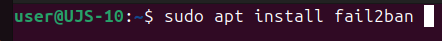
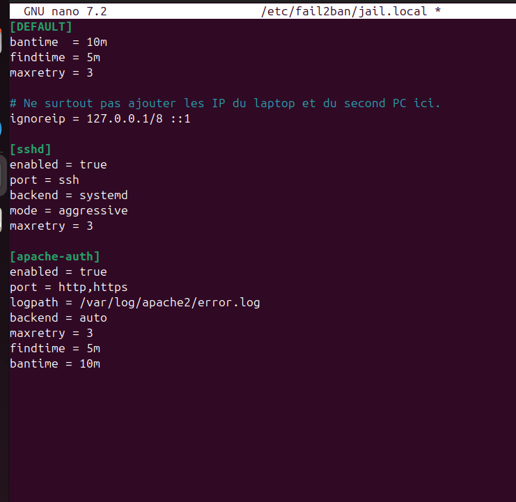
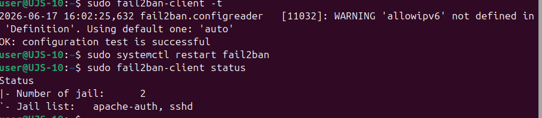
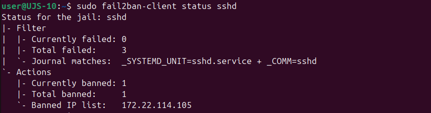
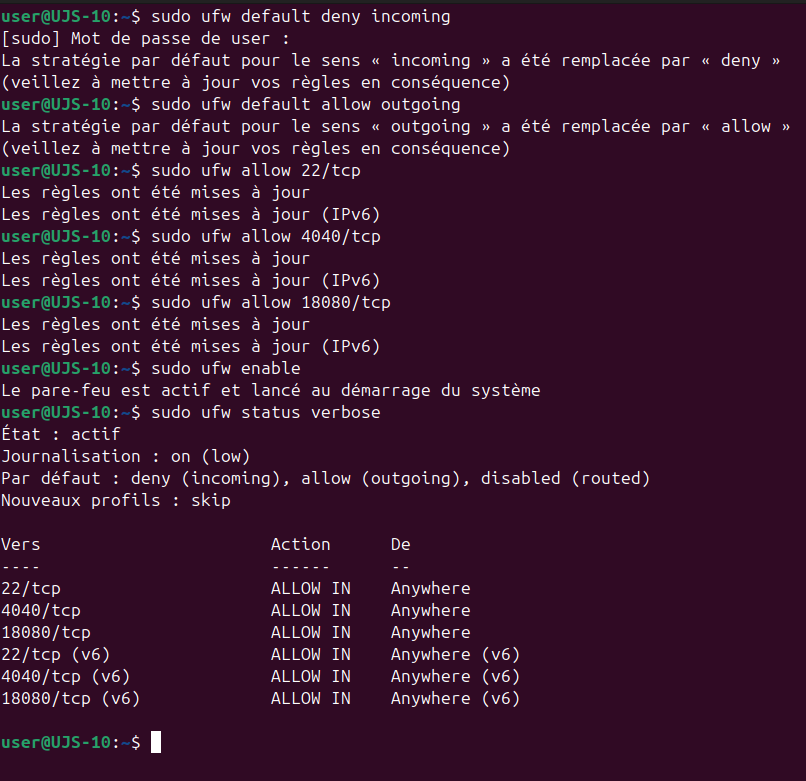
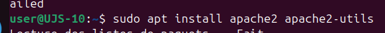
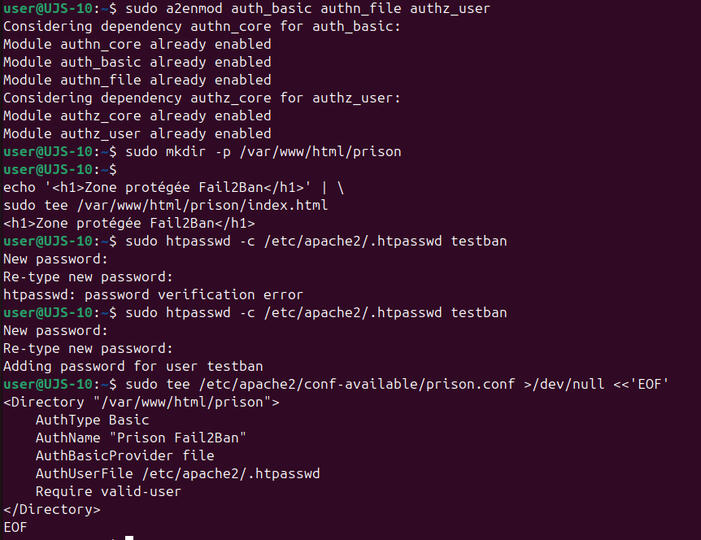
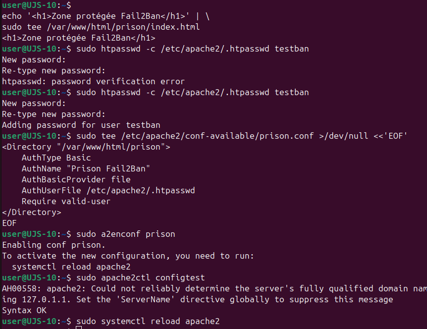

# Atelier 2 - Fail2ban SSH et script de bannissement IP

## Objectif

Cet atelier a pour objectif de mettre en place une protection automatique contre les tentatives de connexion SSH incorrectes, puis de créer un script simple permettant de bannir manuellement une adresse IP.

Le travail se fait toujours avec les deux mêmes machines :

| Machine | Rôle | Adresse IP |
| --- | --- | --- |
| Laptop | Poste de test, source des tentatives SSH | `172.22.114.129` |
| PC victime | Serveur SSH à protéger | `172.22.114.126` |

Le but est de vérifier qu'une machine qui échoue plusieurs fois à se connecter en SSH peut être bannie automatiquement, puis de documenter une méthode de bannissement manuel avec `nftables`.

Tous les tests doivent rester dans l'environnement de laboratoire.

## 1. Vérifier SSH sur la victime

Sur le PC victime :

```bash
sudo systemctl status ssh
sudo ss -tulnp | grep ':22'
```

Depuis le laptop :

```bash
ssh user@172.22.114.126
```

Si la connexion fonctionne avec le bon mot de passe, l'environnement est prêt.

À documenter :

| Élément | Observation |
| --- | --- |
| Service SSH actif | Oui / Non |
| Port SSH écouté | `22/tcp` |
| Connexion légitime depuis le laptop | Oui / Non |
| Utilisateur testé | `user` |

## 2. Installer Fail2ban sur la victime

Sur le PC victime :

```bash
sudo apt update
sudo apt install fail2ban
```



Vérifier le service :

```bash
sudo systemctl enable --now fail2ban
sudo systemctl status fail2ban
```

Fail2ban surveille des fichiers de logs. Lorsqu'il détecte trop d'échecs d'authentification, il peut bannir automatiquement l'adresse IP source.

## 3. Configurer Fail2ban pour SSH

Ne pas modifier directement le fichier `jail.conf`. Créer plutôt un fichier local :

```bash
sudo nano /etc/fail2ban/jail.local
```


Exemple de configuration :

```ini
[DEFAULT]
bantime = 10m
findtime = 5m
maxretry = 3
ignoreip = 127.0.0.1/8 ::1

[sshd]
enabled = true
port = ssh
backend = systemd
mode = aggressive
maxretry = 3
```

Explication :

| Paramètre | Rôle |
| --- | --- |
| `enabled = true` | Active la protection SSH |
| `maxretry = 3` | Bannit après 3 échecs |
| `findtime = 5m` | Compte les échecs sur une fenêtre de 5 minutes |
| `bantime = 10m` | Durée du bannissement |
| `backend = systemd` | Lit les logs via systemd si nécessaire |
| `mode = aggressive` | Rend la détection SSH plus stricte |
| `ignoreip` | Définit les IP à ne jamais bannir |

Configuration réellement utilisée :



Dans cette configuration, deux protections sont actives :

- `sshd` pour protéger SSH ;
- `apache-auth` pour protéger une zone Apache avec authentification.

Redémarrer Fail2ban :

```bash
sudo fail2ban-client -t
sudo systemctl restart fail2ban
sudo fail2ban-client status
sudo fail2ban-client status sshd
```



La validation indique que le test de configuration est réussi. Le statut montre également que deux jails sont chargées : `apache-auth` et `sshd`.

## 4. Simuler plusieurs tentatives incorrectes

Depuis le laptop, tenter plusieurs connexions SSH avec un mauvais mot de passe :

```bash
ssh mauvais_user@172.22.114.126
```

ou :

```bash
ssh user@172.22.114.126
```

Entrer volontairement un mauvais mot de passe plusieurs fois.

Après plusieurs échecs, vérifier sur la victime :

```bash
sudo fail2ban-client status sshd
```

Résultat attendu :

```text
Currently banned: 1
Banned IP list: <IP_DU_LAPTOP>
```

Résultat observé pendant l'atelier :



La jail `sshd` a détecté `3` échecs et a banni une adresse IP. Dans la capture, l'adresse bannie est `172.22.114.105`. Cela confirme que Fail2ban lit bien les événements SSH et applique automatiquement une action de bannissement.

Consulter les logs :

```bash
sudo journalctl -u fail2ban --no-pager -n 50
sudo journalctl -u ssh --no-pager -n 50
```

À documenter :

| Élément | Observation |
| --- | --- |
| IP bannie | `172.22.114.105` pendant le test observé |
| Nombre d'échecs | `3` |
| Durée du ban | `10m` |
| Service protégé | SSH |
| Preuve | `fail2ban-client status sshd` |

## 5. Débannir l'adresse IP si besoin

Si le laptop est bloqué et qu'il faut reprendre les tests :

```bash
sudo fail2ban-client set sshd unbanip <IP_DU_LAPTOP>
```

Exemple :

```bash
sudo fail2ban-client set sshd unbanip 172.22.114.X
```

Vérifier :

```bash
sudo fail2ban-client status sshd
```

## 6. Créer un script de bannissement IP

Le script suivant crée une table `nftables`, ajoute une IP dans une liste de bannissement, puis journalise l'action dans un fichier.

Sur le PC victime :

```bash
nano ban_ip.sh
```

Contenu :

```bash
#!/bin/bash

LOG_FILE="/var/log/ban_ip_lab.log"
TABLE="lab_filter"
CHAIN="input"
SET_NAME="banned_ips"
BAN_TIME="10m"

IP="$1"

if [ -z "$IP" ]; then
    echo "Usage: $0 <adresse_ip>"
    exit 1
fi

if ! [[ "$IP" =~ ^([0-9]{1,3}\.){3}[0-9]{1,3}$ ]]; then
    echo "Erreur: adresse IP invalide."
    exit 1
fi

IFS='.' read -r O1 O2 O3 O4 <<< "$IP"
for OCTET in "$O1" "$O2" "$O3" "$O4"; do
    if [ "$OCTET" -lt 0 ] || [ "$OCTET" -gt 255 ]; then
        echo "Erreur: adresse IP invalide."
        exit 1
    fi
done

sudo nft list table inet "$TABLE" >/dev/null 2>&1 || \
    sudo nft add table inet "$TABLE"

sudo nft list chain inet "$TABLE" "$CHAIN" >/dev/null 2>&1 || \
    sudo nft add chain inet "$TABLE" "$CHAIN" '{ type filter hook input priority 0; policy accept; }'

sudo nft list set inet "$TABLE" "$SET_NAME" >/dev/null 2>&1 || \
    sudo nft add set inet "$TABLE" "$SET_NAME" '{ type ipv4_addr; flags timeout; }'

sudo nft add element inet "$TABLE" "$SET_NAME" "{ $IP timeout $BAN_TIME }"

sudo nft list chain inet "$TABLE" "$CHAIN" | grep -q "$SET_NAME" || \
    sudo nft add rule inet "$TABLE" "$CHAIN" ip saddr @"$SET_NAME" drop

echo "$(date '+%Y-%m-%d %H:%M:%S') - IP bannie: $IP pendant $BAN_TIME" | sudo tee -a "$LOG_FILE" >/dev/null

echo "IP $IP bannie pendant $BAN_TIME."
echo "Log: $LOG_FILE"
```

Rendre le script exécutable :

```bash
chmod +x ban_ip.sh
```

## 7. Tester le script

Depuis la victime, bannir l'adresse IP du laptop :

```bash
./ban_ip.sh <IP_DU_LAPTOP>
```

Vérifier la règle :

```bash
sudo nft list ruleset
```

Depuis le laptop, tester l'accès SSH :

```bash
ssh user@172.22.114.126
```

Résultat attendu :

```text
Connexion bloquée ou timeout
```

Vérifier le log du script :

```bash
sudo cat /var/log/ban_ip_lab.log
```

Après `10` minutes, l'élément ajouté avec timeout doit disparaître automatiquement du set `nftables`.

## 8. Ajouter un filtrage pare-feu local

En complément de Fail2ban, un filtrage local permet de réduire la surface exposée de la victime. Dans le test réalisé, `ufw` est utilisé avec une politique restrictive sur les connexions entrantes.

Commandes appliquées :

```bash
sudo ufw default deny incoming
sudo ufw default allow outgoing
sudo ufw allow 22/tcp
sudo ufw allow 4040/tcp
sudo ufw allow 18080/tcp
sudo ufw enable
sudo ufw status verbose
```



Analyse :

| Règle | Rôle | Commentaire |
| --- | --- | --- |
| `deny incoming` | Bloquer les connexions entrantes par défaut | Réduit la surface d'attaque |
| `allow outgoing` | Autoriser les connexions sortantes | Permet les mises à jour et accès réseau sortants |
| `22/tcp` | SSH | Nécessaire pour l'administration distante |
| `4040/tcp` | Spark Application UI | À limiter aux postes autorisés si possible |
| `18080/tcp` | Spark History Server | À autoriser seulement si réellement utilisé |

Cette configuration améliore la posture de sécurité. Les ports `4040` et `18080` restent toutefois sensibles : ils doivent être justifiés, limités par IP source ou fermés lorsqu'ils ne sont pas nécessaires.

## 9. Aller plus loin : protéger Apache2 avec Fail2ban

Une protection supplémentaire a été testée sur Apache2 afin de montrer que Fail2ban peut surveiller d'autres services que SSH.

Installation d'Apache2 et des outils d'authentification :

```bash
sudo apt install apache2 apache2-utils
```



Création d'une zone protégée :

```bash
sudo a2enmod auth_basic authn_file authz_user
sudo mkdir -p /var/www/html/prison
echo '<h1>Zone protégée Fail2Ban</h1>' | sudo tee /var/www/html/prison/index.html
sudo htpasswd -c /etc/apache2/.htpasswd testban
```



Création de la configuration Apache :

```apache
<Directory "/var/www/html/prison">
    AuthType Basic
    AuthName "Prison Fail2Ban"
    AuthBasicProvider file
    AuthUserFile /etc/apache2/.htpasswd
    Require valid-user
</Directory>
```

Activation de la configuration :

```bash
sudo a2enconf prison
sudo apache2ctl configtest
sudo systemctl reload apache2
```



La jail `apache-auth` présente dans `jail.local` permet ensuite de surveiller les erreurs d'authentification Apache dans `/var/log/apache2/error.log`.

Extrait de configuration :

```ini
[apache-auth]
enabled = true
port = http,https
logpath = /var/log/apache2/error.log
backend = auto
maxretry = 3
findtime = 5m
bantime = 10m
```

Cette partie est facultative pour l'atelier, mais elle montre que la logique de Fail2ban peut être appliquée à plusieurs services : SSH, HTTP, VPN, applications internes ou interfaces d'administration.

## 10. Comparer Fail2ban et le script manuel

| Élément | Fail2ban | Script manuel |
| --- | --- | --- |
| Déclenchement | Automatique après échecs SSH | Manuel |
| Source de décision | Logs SSH | Adresse IP fournie par l'administrateur |
| Durée du ban | Définie par `bantime` | Définie par `BAN_TIME` |
| Risque d'erreur | Faible si bien configuré | Plus élevé si mauvaise IP saisie |
| Intérêt | Protection continue | Réaction rapide ou automatisation maison |

Fail2ban est adapté à la surveillance continue. Le script est utile pour comprendre le mécanisme de bannissement, réagir vite pendant un incident ou servir de base à une automatisation plus large.

## 11. Limites de l'approche

Limites de Fail2ban :

- dépend de la qualité des logs ;
- ne protège que les services configurés ;
- peut bannir une mauvaise IP si plusieurs utilisateurs partagent la même adresse publique ;
- ne remplace pas une politique SSH solide.

Limites du script :

- bannissement manuel ;
- pas de corrélation avec les logs ;
- risque de bloquer une adresse légitime ;
- configuration non persistante si les règles `nftables` ne sont pas sauvegardées ;
- ne détecte pas automatiquement une attaque.

## 12. Intégration dans une automatisation plus large

Le script pourrait être intégré dans :

- une tâche `cron` qui lit un fichier de logs ;
- un script de réponse à incident ;
- une alerte provenant de Zeek, pfSense ou d'un SIEM ;
- une interface d'administration interne ;
- un playbook Ansible ;
- une procédure de confinement temporaire.

Exemple de logique :

```text
Détection d'échecs SSH répétés
        |
        v
Extraction de l'adresse IP source
        |
        v
Validation de l'adresse IP
        |
        v
Ajout dans nftables avec timeout
        |
        v
Journalisation de l'action
```

## 13. Travail demandé

Dans le compte rendu, documenter :

- la configuration Fail2ban utilisée ;
- le nombre de tentatives incorrectes réalisées ;
- l'adresse IP bannie automatiquement ;
- les commandes de vérification ;
- les règles pare-feu locales appliquées ;
- la protection Apache2 si elle a été testée ;
- le fonctionnement du script de bannissement ;
- les limites de cette approche ;
- les pistes d'automatisation possibles.

## Conclusion

Fail2ban permet de réagir automatiquement aux tentatives SSH incorrectes en s'appuyant sur les logs système. Il constitue une protection simple et efficace contre les attaques par force brute basiques.

Le script de bannissement IP complète l'atelier en montrant comment une adresse peut être bloquée manuellement avec `nftables`, avec validation, timeout et log horodaté. Cette approche reste limitée si elle n'est pas intégrée à une vraie chaîne de détection.
