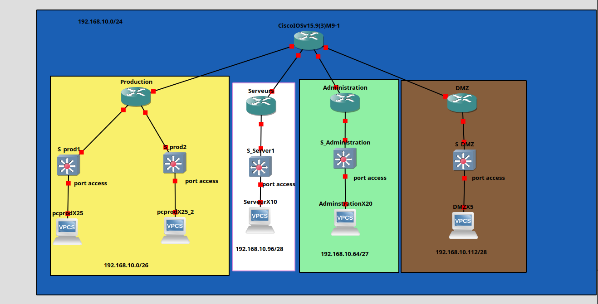

# Schémas réseau L1 / L2 / L3

## 1 · Les trois niveaux de représentation

| Niveau | Représente |
| --- | --- |
| L1 — Physique | Équipements nommés, liaisons physiques, numéros d'interface, types de câble |
| L2 — Liaison | VLAN, type de port access/trunk, domaine de broadcast, root bridge STP |
| L3 — Réseau | Adresses IP, masques CIDR, passerelles, délimitation des sous-réseaux |

### L1 — Physique

Le niveau L1 répond à la question : **qui est branché où ?**

À faire apparaître :

- noms des équipements ;
- ports physiques utilisés ;
- liaisons entre équipements ;
- type de câble si nécessaire ;
- emplacement physique si utile : baie, salle, bureau.

Exemple :

```text
PC-ADM-01 eth0 -> SW-ACC-01 Gi0/3
SW-ACC-01 Gi0/24 -> R1 Gi0/0
```

### L2 — Liaison

Le niveau L2 répond à la question : **qui partage le même domaine de broadcast ?**

À faire apparaître :

- VLAN ;
- ports access ;
- ports trunk ;
- domaines de broadcast ;
- root bridge STP si le protocole STP est étudié ou utilisé.

Exemple :

```text
VLAN 10 Administration
VLAN 20 Production
VLAN 30 Serveurs
VLAN 40 DMZ
Port Gi0/3 : access VLAN 10
Port Gi0/24 : trunk VLAN 10,20,30,40
```

### L3 — Réseau

Le niveau L3 répond à la question : **comment les sous-réseaux communiquent-ils entre eux ?**

À faire apparaître :

- adresses IP des interfaces actives ;
- masques CIDR ;
- passerelles ;
- sous-réseaux ;
- routeur ou équipement qui assure le routage ;
- routes si elles sont nécessaires à la compréhension.

Exemple :

```text
Administration : 192.168.10.64/27  GW 192.168.10.65
Production     : 192.168.10.0/26   GW 192.168.10.1
Serveurs       : 192.168.10.96/28  GW 192.168.10.97
DMZ            : 192.168.10.112/29 GW 192.168.10.113
```

## 2 · Ce qui doit toujours être présent

Un schéma réseau rendu comme livrable doit toujours contenir :

- le nom de chaque équipement ;
- les adresses IP de toutes les interfaces actives ;
- les masques CIDR ;
- la passerelle par défaut de chaque segment ;
- les VLAN si le schéma contient du L2 ;
- les numéros d'interface si le schéma contient du L1 ;
- une légende si des couleurs, icônes ou types de traits sont utilisés.

Tableau de contrôle :

| Élément | Obligatoire ? | Pourquoi |
| --- | --- | --- |
| Nom des équipements | Oui | Identifier précisément chaque élément |
| Interfaces | Oui en L1/L3 | Savoir où brancher et quoi configurer |
| VLAN | Oui en L2 | Comprendre les domaines de broadcast |
| IP et CIDR | Oui en L3 | Configurer et diagnostiquer le routage |
| Passerelle | Oui | Savoir comment sortir du segment |
| Légende | Recommandée | Rendre le schéma lisible par quelqu'un d'autre |

## 3 · Le seuil professionnel

!!! warning "Livrable professionnel"
    Un schéma sans adressage complet ou sans nommage n'est pas un livrable professionnel.

Un schéma professionnel doit permettre à une autre personne de comprendre l'infrastructure sans explication orale.

Avant de rendre un schéma, vérifier :

1. Chaque équipement a un nom.
2. Chaque lien important a ses interfaces indiquées.
3. Chaque réseau IP est écrit avec son CIDR.
4. Chaque segment possède une passerelle.
5. Les VLAN sont visibles si le schéma représente la couche L2.
6. Le schéma distingue clairement L1, L2 et L3, ou précise qu'il s'agit d'une vue mixte.

## 4 · Vue d'ensemble : les trois niveaux assemblés



**En regardant ce schéma, on identifie :**

### L1 — Qui est branché où ?

Physiquement, on voit :

- Les équipements : routeurs (R1, R2), commutateurs (SW-ACC-01, SW-CORE-01), PCs, serveurs
- Les liaisons entre eux : chaque trait = un câble
- Les interfaces utilisées : `Gi0/1`, `Gi0/24`, etc.

### L2 — Domaines de broadcast (VLAN)

Logiquement aux ports, on configure :

- VLAN 10 = interfaces qui partagent un domaine
- VLAN 20 = autre domaine
- Ports **access** = un seul VLAN
- Ports **trunk** = plusieurs VLAN

### L3 — Routage entre sous-réseaux

L'adressage définit :

- VLAN 10 → `192.168.10.64/27` avec GW `192.168.10.65`
- VLAN 20 → `192.168.10.0/26` avec GW `192.168.10.1`
- Les flux IP passent par le routeur (R1) qui connaît l'adresse de chaque sous-réseau

**Synthèse :** L1 dit le câblage, L2 dit le broadcast, L3 dit le routage.

## 5 · TP : Configuration L1/L2/L3 avec VLAN sur GNS3

### Topologie à mettre en place

```text
R1 (routeur)
├─ Gi0/0 → SW1 (switch L2)
│         ├─ Gi0/1-2 → PC-Admin (VLAN 10)
│         └─ Gi0/3   → PC-Prod (VLAN 20)
└─ Gi0/1 → SW2 (switch L2)
          ├─ Gi0/1 → PC-Serv1 (VLAN 30)
          └─ Gi0/2 → PC-DMZ1 (VLAN 40)
```

### Étape 1 · Câblage (L1 — Physique)

| Lien | Type | Interfaces |
| ------ | ------ | ------ |
| R1 → SW1 | Trunk (tous VLAN) | R1 Gi0/0 ↔ SW1 Gi0/24 |
| R1 → SW2 | Trunk (tous VLAN) | R1 Gi0/1 ↔ SW2 Gi0/24 |
| PC-Admin → SW1 | Access (VLAN 10) | PC eth0 ↔ SW1 Gi0/1 |
| PC-Prod → SW1 | Access (VLAN 20) | PC eth0 ↔ SW1 Gi0/2 |
| PC-Serv1 → SW2 | Access (VLAN 30) | PC eth0 ↔ SW2 Gi0/1 |
| PC-DMZ1 → SW2 | Access (VLAN 40) | PC eth0 ↔ SW2 Gi0/2 |

### Étape 2 · Configuration R1 (L3 — Réseau)

```bash
R1> enable
R1# configure terminal

! Interface vers SW1 (VLAN Admin et Prod)
R1(config)# interface GigabitEthernet0/0
R1(config-if)# ip address 192.168.10.65 255.255.255.224
R1(config-if)# description "Gateway VLAN 10 Admin"
R1(config-if)# no shutdown
R1(config-if)# exit

! Interface vers SW2 (VLAN Serveurs et DMZ)
R1(config)# interface GigabitEthernet0/1
R1(config-if)# ip address 192.168.10.1 255.255.255.192
R1(config-if)# description "Gateway VLAN 20 Prod"
R1(config-if)# no shutdown
R1(config-if)# exit

R1(config)# end
R1# write memory
```

**Adressage L3 :**

| VLAN | Segment | Gateway | Plage d'hôtes |
| ------ | --------- | --------- | -------------- |
| 10 | Admin | 192.168.10.65 | 192.168.10.66-94 |
| 20 | Prod | 192.168.10.1 | 192.168.10.2-62 |
| 30 | Serveurs | 192.168.10.97 | 192.168.10.98-126 |
| 40 | DMZ | 192.168.10.113 | 192.168.10.114-126 |

### Étape 3 · Configuration VLAN sur les switchs (L2 — Liaison)

**SW1:**

```bash
SW1# configure terminal

! Créer les VLAN
SW1(config)# vlan 10
SW1(config-vlan)# name Admin
SW1(config-vlan)# exit

SW1(config)# vlan 20
SW1(config-vlan)# name Production
SW1(config-vlan)# exit

! Configurer les ports access
SW1(config)# interface GigabitEthernet0/1
SW1(config-if)# switchport mode access
SW1(config-if)# switchport access vlan 10
SW1(config-if)# exit

SW1(config)# interface GigabitEthernet0/2
SW1(config-if)# switchport mode access
SW1(config-if)# switchport access vlan 20
SW1(config-if)# exit

! Configurer le port trunk vers R1
SW1(config)# interface GigabitEthernet0/24
SW1(config-if)# switchport mode trunk
SW1(config-if)# switchport trunk allowed vlan 10,20,30,40
SW1(config-if)# exit

SW1(config)# end
SW1# write memory
```

**SW2 :** (même logique avec VLAN 30 et 40)

### Étape 4 · Configurer les VPCS (L3 — Réseau)

**PC-Admin:**

```text
PC-Admin> ip 192.168.10.66/27 192.168.10.65
PC-Admin> save
```

**PC-Prod:**

```text
PC-Prod> ip 192.168.10.2/26 192.168.10.1
PC-Prod> save
```

**PC-Serv1:**

```text
PC-Serv1> ip 192.168.10.98/28 192.168.10.97
PC-Serv1> save
```

**PC-DMZ1:**

```text
PC-DMZ1> ip 192.168.10.114/29 192.168.10.113
PC-DMZ1> save
```

### Étape 5 · Tests et diagnostic

**Ping intra-VLAN :**

```text
PC-Admin> ping 192.168.10.67  ✓ OK (même VLAN 10)
```

**Ping inter-VLAN (via routeur) :**

```text
PC-Admin> ping 192.168.10.2   ✓ OK (VLAN 10 → R1 → VLAN 20)
PC-Admin> ping 192.168.10.98  ✓ OK (VLAN 10 → R1 → VLAN 30)
```

**⚠️ Ping échoue si :**

- L'IP est **hors sous-réseau** : `192.168.99.10/24` → PC ne trouve pas la gateway
- Le **port n'est pas en access** sur le bon VLAN
- Le **trunk n'autorise pas le VLAN** (allowed vlan)
- R1 **n'a pas d'IP** sur l'interface correspondante

### Points clés à vérifier

✓ **L1** : Tous les câbles sont connectés (`show interfaces`)  
✓ **L2** : Chaque port est en `access` ou `trunk` (pas en `dynamic`)  
✓ **L2** : Le trunk autorise tous les VLAN nécessaires  
✓ **L3** : R1 a une IP gateway pour **chaque** segment/VLAN  
✓ **L3** : Chaque PC est dans le bon **sous-réseau** et connaît sa **gateway**

## 6 · Exercice avancé : IP hors sous-réseau

### Scenario

Ajouter un 5e PC (PC-Test) branché sur SW1 en VLAN 10, mais avec une adresse **hors sous-réseau** intentionnellement.

### Configuration du PC-Test (❌ MAUVAISE)

```text
PC-Test> ip 192.168.99.10/24 192.168.10.65
PC-Test> save
```

**Analyse :**

- IP du PC : `192.168.99.10` avec masque `/24` → plage `192.168.99.0 - 192.168.99.255`
- Gateway : `192.168.10.65` (correcte, c'est la gateway VLAN 10)
- **Problème** : L'IP `192.168.99.10` n'est pas dans le sous-réseau `192.168.10.64/27`

### Pourquoi ça échoue ?

```text
PC-Test> ping 192.168.10.66  ❌ ÉCHEC

Diagnostic :
```

|Étape|Calcul|Résultat|
|-------|--------|---------|
|**Réseau local du PC**|`192.168.99.0/24`|`192.168.99.0 - 192.168.99.255`|
|**PC veut joindre**|`192.168.10.66`|Hors du réseau local|
|**Décision du PC**|"L'IP n'est pas chez moi"|→ Envoyer à la gateway|
|**L'adresse de la gateway**|`192.168.10.65`|Hors du réseau local du PC !|
|**Résultat**|PC ne connaît pas comment joindre `192.168.10.65`|❌ Impossible de faire un ARP|

### La bonne configuration (✅ CORRECTE)

```text
PC-Test> ip 192.168.10.67/27 192.168.10.65
PC-Test> save
```

**Vérification :**

- IP du PC : `192.168.10.67`
- Masque : `/27` → réseau `192.168.10.64 - 192.168.10.95`
- Gateway : `192.168.10.65` ← **dans le même réseau !**

```text
PC-Test> ping 192.168.10.66   ✓ OK
PC-Test> ping 192.168.10.2    ✓ OK (via R1 inter-VLAN)
```

### Leçon : la règle d'or

🔴 **ERREUR CLASSIQUE**

```text
IP : 192.168.99.10/24
Gateway : 192.168.10.65
↓
Le PC et la gateway ne sont pas dans le même sous-réseau !
```

🟢 **CORRECT**

```text
IP : 192.168.10.67/27
Gateway : 192.168.10.65
↓
Même sous-réseau : 192.168.10.64/27
Le PC peut faire un ARP pour atteindre la gateway
```

### Commandes de diagnostic

**Sur le PC pour vérifier son réseau :**

```text
PC-Test> show ip
```

**Sur le routeur pour vérifier l'accessibilité :**

```text
R1# ping 192.168.10.65
R1# ping 192.168.99.10  ❌ Impossible, R1 n'a pas de route vers 192.168.99.0/24
```

**Résumé du dépannage :**

| Problème | Cause | Solution |
| --------- | ----- | -------- |
| Ping vers gateway échoue | IP du PC hors du réseau de la gateway | Utiliser la même plage d'adresses |
| Ping inter-VLAN échoue | PC connecté au bon VLAN mais IP erronée | Vérifier `show ip` sur le PC |
| Aucune réponse ARP | Gateway inaccessible (hors réseau local) | Vérifier que gateway ∈ subnet du PC |

## Ressources

- draw.io : <https://app.diagrams.net>
- LibreOffice Draw : `libreoffice --draw`
- Icônes Cisco : <https://www.cisco.com/c/en/us/about/brand-center/network-topology-icons.html>
