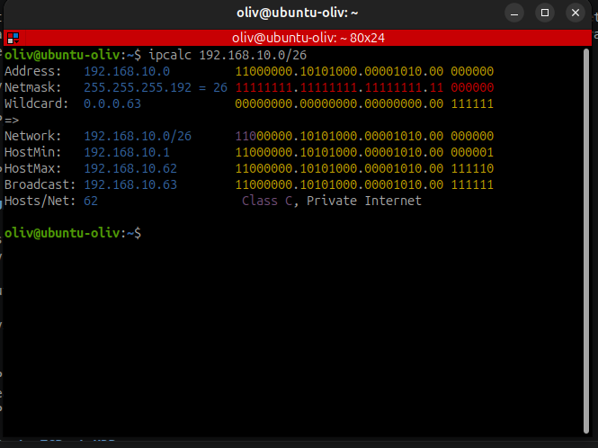

# Adressage IPv4 et subnetting

## Objectif

Comprendre la structure d'une adresse IPv4, lire un préfixe CIDR, identifier les adresses spéciales et calculer un sous-réseau adapté à un besoin en nombre d'hôtes.

## Structure d'une adresse IPv4

Une adresse IPv4 est composée de **32 bits**, découpés en **4 octets** écrits en décimal de 0 à 255.

```text
192 . 168 . 10 . 25
```

Le préfixe CIDR indique combien de bits appartiennent à la partie réseau.

```text
192.168.10.25/24
             ---
             24 bits réseau, 8 bits hôtes
```

Plus le préfixe est grand, plus le réseau est petit. Plus le préfixe est petit, plus le réseau contient d'adresses.

## Table CIDR de référence

| Préfixe | Masque | Bits hôtes | Hôtes utilisables |
| --- | --- | --- | --- |
| `/24` | `255.255.255.0` | 8 | 254 |
| `/25` | `255.255.255.128` | 7 | 126 |
| `/26` | `255.255.255.192` | 6 | 62 |
| `/27` | `255.255.255.224` | 5 | 30 |
| `/28` | `255.255.255.240` | 4 | 14 |
| `/29` | `255.255.255.248` | 3 | 6 |
| `/30` | `255.255.255.252` | 2 | 2 |

Formule :

```text
Hôtes utilisables = 2^(32 - préfixe) - 2
```

On retire 2 adresses : l'adresse réseau et l'adresse de broadcast.

## Adresses spéciales

Exemple avec `192.168.10.0/24` :

| Adresse | Rôle |
| --- | --- |
| `192.168.10.0` | Adresse réseau, non assignable |
| `192.168.10.1` | Souvent utilisée comme passerelle |
| `192.168.10.254` | Dernière adresse hôte utilisable |
| `192.168.10.255` | Adresse de broadcast, non assignable |

!!! warning "À ne pas assigner"
    L'adresse réseau et l'adresse de broadcast ne doivent pas être configurées sur une machine.

## Plages privées RFC 1918

Les plages privées ne sont pas routées directement sur Internet. Elles sont utilisées dans les réseaux internes, les labs, les entreprises et les réseaux domestiques.

| Plage | Préfixe | Usage courant |
| --- | --- | --- |
| `10.0.0.0` | `/8` | Grandes organisations |
| `172.16.0.0` à `172.31.255.255` | `/12` | Entreprises moyennes |
| `192.168.0.0` | `/16` | Réseaux locaux et labs |

## Calculer un sous-réseau

Méthode :

1. Identifier le nombre d'hôtes nécessaires.
2. Ajouter 2 adresses pour le réseau et le broadcast.
3. Trouver la puissance de 2 supérieure.
4. En déduire le nombre de bits hôtes.
5. Calculer le préfixe : `32 - bits hôtes`.
6. Vérifier avec `ipcalc`.

Exemple : créer un sous-réseau pour **50 hôtes** dans `192.168.10.0/24`.

```text
Besoin réel : 50 hôtes
Avec réseau + broadcast : 50 + 2 = 52
Puissance de 2 supérieure : 64
64 = 2^6, donc 6 bits hôtes
Préfixe : 32 - 6 = /26
Masque : 255.255.255.192
```

Premier sous-réseau obtenu :

| Élément | Valeur |
| --- | --- |
| Réseau | `192.168.10.0/26` |
| Masque | `255.255.255.192` |
| Première IP hôte | `192.168.10.1` |
| Dernière IP hôte | `192.168.10.62` |
| Broadcast | `192.168.10.63` |
| Hôtes utilisables | 62 |

Vérification :



## Découpage d'un /24 en /26

Un `/26` contient 64 adresses. Dans un `/24`, les sous-réseaux avancent donc par pas de 64.

| Sous-réseau | Plage hôte | Broadcast |
| --- | --- | --- |
| `192.168.10.0/26` | `.1` à `.62` | `.63` |
| `192.168.10.64/26` | `.65` à `.126` | `.127` |
| `192.168.10.128/26` | `.129` à `.190` | `.191` |
| `192.168.10.192/26` | `.193` à `.254` | `.255` |

## 1.4 · TP guidé · Calculs d'adressage

### Objectif du TP

Appliquer le subnetting sur un cas concret. Produire un tableau de plan d'adressage utilisé directement en mini-projet GNS3.

### Contexte

La PME **AlpesNet** dispose de `192.168.10.0/24` et a besoin de 4 segments isolés.

| Segment | Besoin |
| --- | --- |
| Administration | 20 postes |
| Production | 50 postes |
| Serveurs | 10 équipements |
| DMZ | 5 équipements |

### Méthode guidée

Pour choisir le bon préfixe, on part du besoin en hôtes. Il faut ajouter 2 adresses au besoin réel : une pour l'adresse réseau et une pour le broadcast.

```text
Capacité totale du bloc = hôtes utilisables + réseau + broadcast
Hôtes utilisables = 2^(bits hôtes) - 2
Préfixe CIDR = 32 - bits hôtes
```

### Étape 1 · Choisir les préfixes

#### Production

Besoin : 50 postes.

```text
50 + 2 = 52 adresses nécessaires
Puissance de 2 supérieure : 64
64 = 2^6
Bits hôtes : 6
Préfixe : 32 - 6 = /26
Capacité utile : 64 - 2 = 62 hôtes
```

Production doit donc être en `/26`.

#### Administration

Besoin : 20 postes.

```text
20 + 2 = 22 adresses nécessaires
Puissance de 2 supérieure : 32
32 = 2^5
Bits hôtes : 5
Préfixe : 32 - 5 = /27
Capacité utile : 32 - 2 = 30 hôtes
```

Administration doit donc être en `/27`.

#### Serveurs

Besoin : 10 équipements.

```text
10 + 2 = 12 adresses nécessaires
Puissance de 2 supérieure : 16
16 = 2^4
Bits hôtes : 4
Préfixe : 32 - 4 = /28
Capacité utile : 16 - 2 = 14 hôtes
```

Serveurs doit donc être en `/28`.

#### DMZ

Besoin : 5 équipements.

```text
5 + 2 = 7 adresses nécessaires
Puissance de 2 supérieure : 8
8 = 2^3
Bits hôtes : 3
Préfixe : 32 - 3 = /29
Capacité utile : 8 - 2 = 6 hôtes
```

DMZ doit donc être en `/29`.

Résumé :

| Segment | Besoin | Préfixe minimal | Capacité |
| --- | --- | --- | --- |
| Production | 50 postes | `/26` | 62 hôtes |
| Administration | 20 postes | `/27` | 30 hôtes |
| Serveurs | 10 équipements | `/28` | 14 hôtes |
| DMZ | 5 équipements | `/29` | 6 hôtes |

### Étape 2 · Découper le /24

On part de `192.168.10.0/24` et on place les blocs du plus grand au plus petit. C'est plus simple et cela évite de créer des trous difficiles à réutiliser.

```text
Production      /26 = 64 adresses
Administration  /27 = 32 adresses
Serveurs        /28 = 16 adresses
DMZ             /29 = 8 adresses
```

Découpage choisi :

```text
Production      192.168.10.0/26    -> .0 à .63
Administration  192.168.10.64/27   -> .64 à .95
Serveurs        192.168.10.96/28   -> .96 à .111
DMZ             192.168.10.112/29  -> .112 à .119
```

Les blocs se suivent et ne se chevauchent pas.

### Étape 3 · Tableau corrigé

| Segment | Adresse réseau | Masque CIDR | 1ère hôte | Dernière hôte | Broadcast | Capacité |
| --- | --- | --- | --- | --- | --- | --- |
| Administration | `192.168.10.64` | `/27` | `192.168.10.65` | `192.168.10.94` | `192.168.10.95` | 30 |
| Production | `192.168.10.0` | `/26` | `192.168.10.1` | `192.168.10.62` | `192.168.10.63` | 62 |
| Serveurs | `192.168.10.96` | `/28` | `192.168.10.97` | `192.168.10.110` | `192.168.10.111` | 14 |
| DMZ | `192.168.10.112` | `/29` | `192.168.10.113` | `192.168.10.118` | `192.168.10.119` | 6 |

Le tableau garde l'ordre demandé dans l'énoncé. Le calcul, lui, a été fait du plus grand réseau vers le plus petit.

### Étape 4 · Vérification avec ipcalc

```bash
ipcalc 192.168.10.0/26
ipcalc 192.168.10.64/27
ipcalc 192.168.10.96/28
ipcalc 192.168.10.112/29
```

Vérifications attendues :

- `192.168.10.0/26` va de `.0` à `.63` ;
- `192.168.10.64/27` va de `.64` à `.95` ;
- `192.168.10.96/28` va de `.96` à `.111` ;
- `192.168.10.112/29` va de `.112` à `.119` ;
- aucun bloc ne chevauche un autre ;
- le dernier broadcast utilisé est `192.168.10.119` ;
- il reste `192.168.10.120` à `192.168.10.255` pour de futurs besoins.

### Pour les profils avancés

Ajoute une colonne **Adresse de la passerelle**. Une convention simple consiste à utiliser la première adresse hôte de chaque sous-réseau.

| Segment | Adresse réseau | Masque CIDR | Passerelle proposée |
| --- | --- | --- | --- |
| Administration | `192.168.10.64` | `/27` | `192.168.10.65` |
| Production | `192.168.10.0` | `/26` | `192.168.10.1` |
| Serveurs | `192.168.10.96` | `/28` | `192.168.10.97` |
| DMZ | `192.168.10.112` | `/29` | `192.168.10.113` |

Question : si AlpesNet double de taille dans 2 ans, le plan résiste-t-il ?

Réponse : non. Les préfixes choisis sont minimaux. Ils répondent au besoin actuel, mais ils n'offrent pas assez de marge si tous les segments doublent.

| Segment | Besoin actuel | Besoin doublé | Préfixe actuel | Suffisant ? |
| --- | --- | --- | --- | --- |
| Administration | 20 | 40 | `/27` | Non |
| Production | 50 | 100 | `/26` | Non |
| Serveurs | 10 | 20 | `/28` | Non |
| DMZ | 5 | 10 | `/29` | Non |

Pour anticiper une croissance, il faudrait réserver des blocs plus grands dès le départ.

| Segment | Préfixe avec marge | Capacité |
| --- | --- | --- |
| Production | `/25` | 126 hôtes |
| Administration | `/26` | 62 hôtes |
| Serveurs | `/27` | 30 hôtes |
| DMZ | `/28` | 14 hôtes |

Ce plan avec marge consomme presque tout le `/24`. Si AlpesNet prévoit beaucoup d'évolution, il serait préférable de réserver une plage plus large, par exemple un second `/24` ou un bloc plus grand.

### Livrable de l'atelier

Tableau de plan d'adressage complété pour les 4 segments AlpesNet, justifiant chaque choix de préfixe. Ce tableau servira directement en séquence 1.6 pour le mini-projet GNS3 et alimentera le schéma annoté de l'autonomie 1.

### Notions acquises

- Découpage d'un `/24` en sous-réseaux non chevauchants.
- Justification d'un choix de préfixe à partir du besoin métier.
- Lecture des bornes d'un sous-réseau : réseau, première hôte, dernière hôte, broadcast.
- Vérification systématique avec `ipcalc`.

### Compétences

- Calculer un plan d'adressage IPv4 avec découpage CIDR — CA-02.

## Ressources

- RFC 1918 : adresses privées — <https://tools.ietf.org/html/rfc1918>
- RFC 4632 : CIDR — <https://tools.ietf.org/html/rfc4632>
- Calculateur en ligne : <https://www.subnet-calculator.com/>
