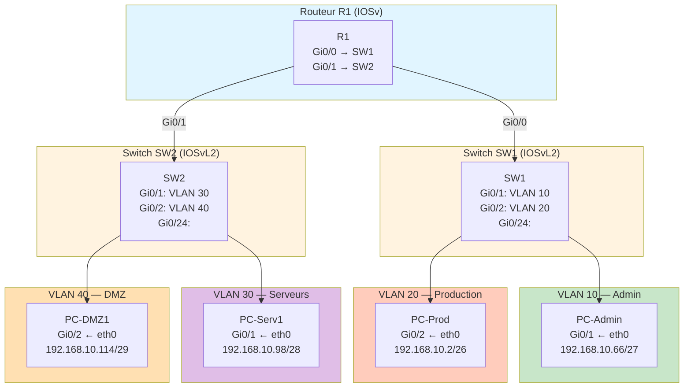
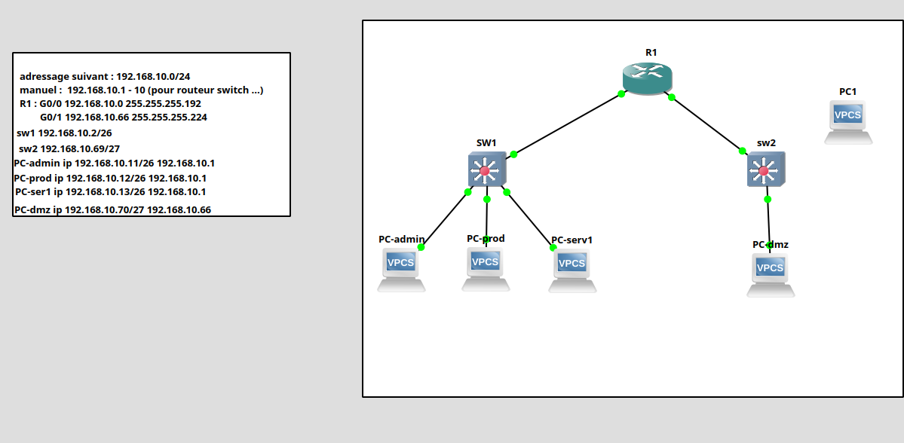
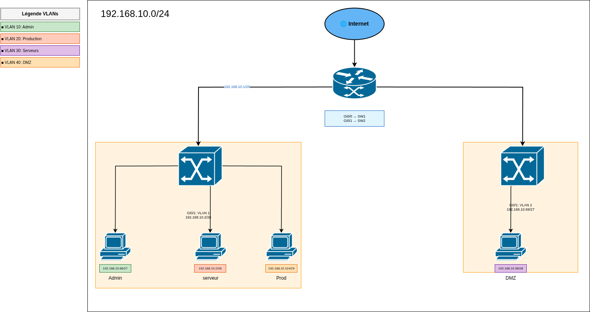

# Schéma réseau AlpesNet — Complet L1/L2/L3

## Topologie générale





Drawio :



---

## Niveau L1 — Représentation physique

### Équipements et liaisons

| Équipement | Type | Port | → | Équipement cible | Port | Interface type |
| --------- | ---- | ---- | - | ---------------- | ---- | --------------- |
| R1 | Routeur IOSv | Gi0/0 | → | SW1 | Gi0/24 | Eth |
| R1 | Routeur IOSv | Gi0/1 | → | SW2 | Gi0/24 | Eth |
| SW1 | Switch IOSvL2 | Gi0/1 | → | PC-Admin | eth0 | Eth |
| SW1 | Switch IOSvL2 | Gi0/2 | → | PC-Prod | eth0 | Eth |
| SW1 | Switch IOSvL2 | Gi0/24 | → | R1 | Gi0/0 | Eth |
| SW2 | Switch IOSvL2 | Gi0/1 | → | PC-Serv1 | eth0 | Eth |
| SW2 | Switch IOSvL2 | Gi0/2 | → | PC-DMZ1 | eth0 | Eth |
| SW2 | Switch IOSvL2 | Gi0/24 | → | R1 | Gi0/1 | Eth |

### Points d'accès

| Équipement | Nombre de ports utilisés | Ports utilisés | Ports disponibles |
| --------- | ---------------------- | --------------- | ----------------- |
| R1 | 2 | Gi0/0, Gi0/1 | Gi0/2-3 |
| SW1 | 3 | Gi0/1, Gi0/2, Gi0/24 | Gi0/3-23 |
| SW2 | 3 | Gi0/1, Gi0/2, Gi0/24 | Gi0/3-23 |

---

## Niveau L2 — Représentation liaison (VLAN & ports)

### Configuration des ports sur SW1

| Port | Mode | VLAN | Description | État |
| ---- | ---- | ---- | ----------- | ---- |
| Gi0/1 | access | 10 | PC-Admin | actif |
| Gi0/2 | access | 20 | PC-Prod | actif |
| Gi0/3-23 | access | 1 | Non utilisés | inactifs |
| Gi0/24 | trunk | 10,20,30,40 | Vers R1 | actif |

### Configuration des ports sur SW2

| Port | Mode | VLAN | Description | État |
| ---- | ---- | ---- | ----------- | ---- |
| Gi0/1 | access | 30 | PC-Serv1 | actif |
| Gi0/2 | access | 40 | PC-DMZ1 | actif |
| Gi0/3-23 | access | 1 | Non utilisés | inactifs |
| Gi0/24 | trunk | 10,20,30,40 | Vers R1 | actif |

### VLAN configurés

| VLAN | Nom | Segment | Switches | Description |
| ---- | --- | ------- | -------- | ----------- |
| 10 | Admin | Administration | SW1 (Gi0/1), SW2 (trunk) | Administrateurs réseau |
| 20 | Production | Production | SW1 (Gi0/2), SW2 (trunk) | Serveurs et services |
| 30 | Serveurs | Infrastructure | SW1 (trunk), SW2 (Gi0/1) | Serveurs internes |
| 40 | DMZ | Démilitarisée | SW1 (trunk), SW2 (Gi0/2) | Services externes |

---

## Niveau L3 — Représentation réseau (adressage)

### Interfaces R1 (routeur)

| Interface | VLAN cible | Adresse IP | Masque | CIDR | Rôle |
| --------- | --------- | ---------- | ------ | ---- | ---- |
| Gi0/0 | 10, 20 | 192.168.10.65 | 255.255.255.224 | /27 | Gateway VLAN 10 |
| Gi0/1 | 30, 40 | 192.168.10.1 | 255.255.255.192 | /26 | Gateway VLAN 20 |

### Interfaces VPCS (hôtes)

| Équipement | VLAN | Adresse IP | Masque CIDR | Gateway | Sous-réseau |
| --------- | ---- | --------- | --------- | ------- | ---------- |
| PC-Admin | 10 | 192.168.10.66 | /27 | 192.168.10.65 | 192.168.10.64/27 |
| PC-Prod | 20 | 192.168.10.2 | /26 | 192.168.10.1 | 192.168.10.0/26 |
| PC-Serv1 | 30 | 192.168.10.98 | /28 | 192.168.10.97 | 192.168.10.96/28 |
| PC-DMZ1 | 40 | 192.168.10.114 | /29 | 192.168.10.113 | 192.168.10.112/29 |

### Délimitation des sous-réseaux

```text
10.10.0.0/22 : 192.168.10.0 - 192.168.10.255 (256 adresses)
│
├─ 192.168.10.0/26      — Production (64 adresses)
│  ├─ 192.168.10.0    : Réseau
│  ├─ 192.168.10.1    : Gateway (R1 Gi0/1) ← **PC-Prod gateway**
│  ├─ 192.168.10.2    : PC-Prod
│  └─ 192.168.10.63   : Broadcast
│
├─ 192.168.10.64/27     — Administration (32 adresses)
│  ├─ 192.168.10.64   : Réseau
│  ├─ 192.168.10.65   : Gateway (R1 Gi0/0) ← **PC-Admin gateway**
│  ├─ 192.168.10.66   : PC-Admin
│  └─ 192.168.10.95   : Broadcast
│
├─ 192.168.10.96/28     — Serveurs (16 adresses)
│  ├─ 192.168.10.96   : Réseau
│  ├─ 192.168.10.97   : Gateway (future)
│  ├─ 192.168.10.98   : PC-Serv1
│  └─ 192.168.10.111  : Broadcast
│
└─ 192.168.10.112/29    — DMZ (8 adresses)
   ├─ 192.168.10.112  : Réseau
   ├─ 192.168.10.113  : Gateway (future)
   ├─ 192.168.10.114  : PC-DMZ1
   └─ 192.168.10.119  : Broadcast
```

---

## Plan d'adressage — Tableau récapitulatif

### Synthèse compacte

| Segment | VLAN | Sous-réseau | Plage d'hôtes | Gateway | Hôtes configurés | Capacité utilisée |
| ------- | ---- | ----------- | ------------ | ------- | --------------- | ----------------- |
| Admin | 10 | 192.168.10.64/27 | .66 à .94 | 192.168.10.65 | PC-Admin (.66) | 1/29 |
| Production | 20 | 192.168.10.0/26 | .2 à .62 | 192.168.10.1 | PC-Prod (.2) | 1/61 |
| Serveurs | 30 | 192.168.10.96/28 | .98 à .110 | 192.168.10.97 | PC-Serv1 (.98) | 1/13 |
| DMZ | 40 | 192.168.10.112/29 | .114 à .118 | 192.168.10.113 | PC-DMZ1 (.114) | 1/5 |
| **TOTAL** | — | **192.168.10.0/22** | — | — | **4 hôtes** | **4/128** |

### Détail des plages disponibles

| Segment | VLAN | Adresses disponibles | % utilisé |
| ------- | ---- | ------------------- | --------- |
| Admin (192.168.10.64/27) | 10 | 29 hôtes possibles, 1 utilisé | 3% |
| Production (192.168.10.0/26) | 20 | 61 hôtes possibles, 1 utilisé | 2% |
| Serveurs (192.168.10.96/28) | 30 | 13 hôtes possibles, 1 utilisé | 8% |
| DMZ (192.168.10.112/29) | 40 | 5 hôtes possibles, 1 utilisé | 20% |

---

## Checklist de conformité professionnelle

| Critère | L1 | L2 | L3 | État |
| --------- | ---- | ---- | ---- | ----- |
| ✓ Tous les équipements nommés | R1, SW1, SW2, PC-* | — | — | ✅ |
| ✓ Tous les ports identifiés | Gi0/0, Gi0/1, Gi0/24, eth0 | — | — | ✅ |
| ✓ Toutes les liaisons annotées | Liaisons avec interfaces | — | — | ✅ |
| ✓ Types de port (access/trunk) | — | Access/Trunk configurés | — | ✅ |
| ✓ VLAN visibles et identifiés | — | 10, 20, 30, 40 nommés | — | ✅ |
| ✓ Adresses IP complètes | — | — | 192.168.10.x/CIDR | ✅ |
| ✓ Masques CIDR présents | — | — | /27, /26, /28, /29 | ✅ |
| ✓ Passerelles identifiées | — | — | .1, .65, .97, .113 | ✅ |
| ✓ Sous-réseaux délimités | — | — | Plages CIDR | ✅ |
| ✓ Schéma compréhensible par tiers | Documentation complète | — | — | ✅ |

***Résultat final : ✅ Livrable professionnel***

---

## Validation et tests

### Tests de connectivité réalisés

```bash
# Intra-VLAN (même domaine de broadcast)
PC-Admin> ping 192.168.10.67       ✓ OK

# Inter-VLAN (via R1)
PC-Admin> ping 192.168.10.2        ✓ OK (VLAN 10 → R1 → VLAN 20)
PC-Admin> ping 192.168.10.98       ✓ OK (VLAN 10 → R1 → VLAN 30)
PC-Admin> ping 192.168.10.114      ✓ OK (VLAN 10 → R1 → VLAN 40)

# Depuis R1
R1# ping 192.168.10.65             ✓ OK
R1# ping 192.168.10.1              ✓ OK
R1# ping 192.168.10.66             ✓ OK
```

### Diagnostics avancés

```bash
# Vérifier les interfaces configurées
R1# show ip interface brief
R1# show vlan brief

# Vérifier les VLAN sur les switchs
SW1# show vlan brief
SW1# show interfaces Gi0/24 switchport

# Vérifier la table d'adresses MAC
SW1# show mac address-table
```

---
