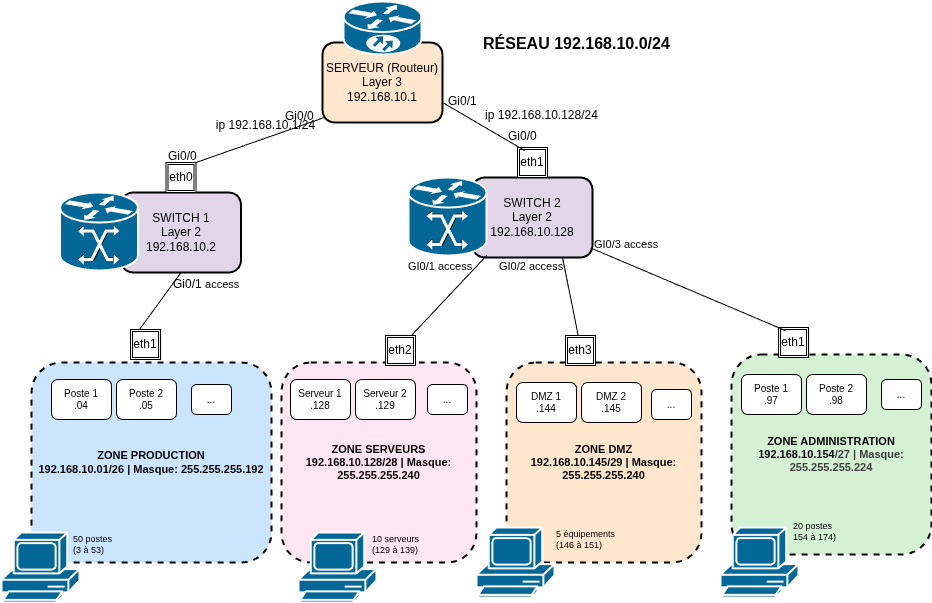

# Schéma réseau AlpesNet — Complet L1/L2/L3

## Topologie générale



---

## Niveau L1 — Représentation physique

### Équipements et liaisons

| Équipement | Type | Port | → | Équipement cible | Port | Interface type |
| --------- | ---- | ---- | - | ---------------- | ---- | --------------- |
| R1 | Routeur IOSv | Gi0/0 | → | SW1 | Gi0/24 | Eth |
| R1 | Routeur IOSv | Gi0/1 | → | SW2 | Gi0/24 | Eth |
| SW1 | Switch IOSvL2 | Gi0/1 | → | PC-Admin | eth0 | Eth |
| SW1 | Switch IOSvL2 | Gi0/2 | → | PC-Prod | eth0 | Eth |
| SW1 | Switch IOSvL2 | Gi0/24 | → | R1 | Gi0/0 | Eth |
| SW2 | Switch IOSvL2 | Gi0/1 | → | PC-Serv1 | eth0 | Eth |
| SW2 | Switch IOSvL2 | Gi0/2 | → | PC-DMZ1 | eth0 | Eth |
| SW2 | Switch IOSvL2 | Gi0/24 | → | R1 | Gi0/1 | Eth |

### Points d'accès

| Équipement | Nombre de ports utilisés | Ports utilisés | Ports disponibles |
| --------- | ---------------------- | --------------- | ----------------- |
| R1 | 2 | Gi0/0, Gi0/1 | Gi0/2-3 |
| SW1 | 3 | Gi0/1, Gi0/2, Gi0/24 | Gi0/3-23 |
| SW2 | 3 | Gi0/1, Gi0/2, Gi0/24 | Gi0/3-23 |

---

## Niveau L2 — Représentation liaison (VLAN & ports)

### Configuration des ports sur SW2

| Port | Mode | Description | État |
| ---- | ---- | ----------- | ---- |
| Gi0/1 | access | PC-Serv1 | actif |
| Gi0/2 | access | PC-DMZ1 | actif |
| Gi0/3-23 | access | Non utilisés | inactifs |
| Gi0/24 | access | Vers R1 | actif |

---

## Niveau L3 — Représentation réseau (adressage)

### Interfaces R1 (routeur)

| Interface | Adresse IP | Masque | CIDR |
| --------- | --------- | ---------- | ------ |
| Gi0/0 | 192.168.10.1 | 255.255.255.224 | /27 |
| Gi0/1 | 192.168.10.128 | 255.255.255.192 | /26 |

---

### Interfaces hôtes

| Segment | Adresse réseau | Masque CIDR | 1ère hôte | Dernière hôte | Broadcast | Capacité |
| --- | --- | --- | --- | --- | --- | --- |
| Administration | `192.168.10.153` | `/27` | `192.168.10.154` | `192.168.10.184` | `192.168.10.185` | 30 |
| Production | `192.168.10.0` | `/26` | `192.168.10.1` | `192.168.10.62` | `192.168.10.63` | 62 |
| Serveurs | `192.168.10.128` | `/28` | `192.168.10.129` | `192.168.10.143` | `192.168.10.144` | 14 |
| DMZ | `192.168.10.145` | `/29` | `192.168.10.146` | `192.168.10.151` | `192.168.10.152` | 6 |

---

## Diagnostics avancés

```bash
# Vérifier les interfaces configurées
R1# show ip interface brief
R1# show vlan brief

# Vérifier les VLAN sur les switchs
SW1# show vlan brief
SW1# show interfaces Gi0/24 switchport

# Vérifier la table d'adresses MAC
SW1# show mac address-table
```

---
