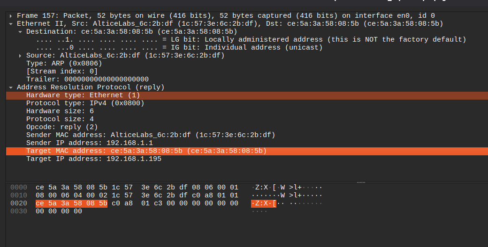
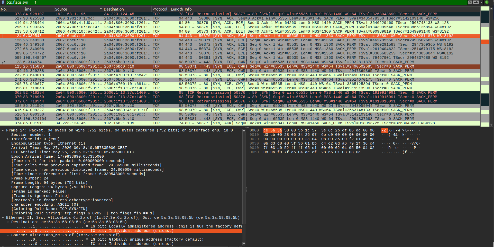
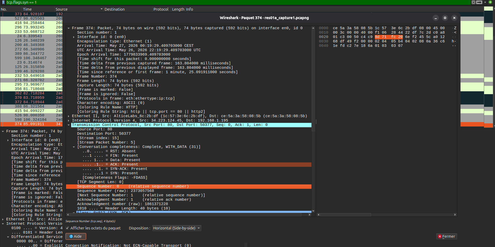
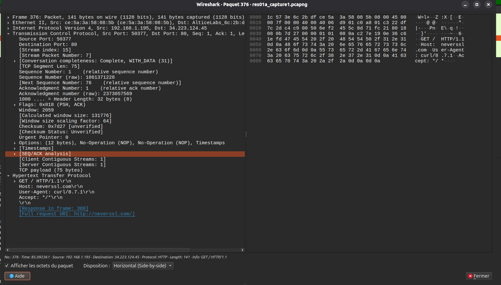

# Exercices Wireshark

## Objectif

Observer dans Wireshark les protocoles fondamentaux vus dans le modèle TCP/IP : ARP, ICMP, TCP, DNS et l'encapsulation. Les exercices se font à partir d'une capture déjà fournie.

## Déroulement

Ouvrir la capture dans Wireshark, appliquer le filtre demandé, cliquer sur un paquet correspondant, puis déplier les couches dans le panneau central.

### Exercice 1 — ARP

Filtre :

```text
arp
```



À observer dans un **ARP Request** :

- Dans **Ethernet II**, l'adresse MAC de destination est `ff:ff:ff:ff:ff:ff`.
- Cette adresse correspond à un broadcast : la question est envoyée à tout le réseau local.
- Dans **Address Resolution Protocol**, l'IP recherchée est `192.168.1.1`.

À observer dans l'**ARP Reply** :

- La machine `192.168.1.1` répond.
- Son adresse MAC est `1c:57:3e:6c:2b:df`.
- La réponse est envoyée à la machine `192.168.1.195`, dont la MAC est `ce:5a:3a:58:08:5b`.

Résumé :

| Élément | Valeur observée |
| --- | --- |
| IP recherchée | `192.168.1.1` |
| MAC qui répond | `1c:57:3e:6c:2b:df` |
| IP du demandeur | `192.168.1.195` |
| MAC du demandeur | `ce:5a:3a:58:08:5b` |

### Exercice 2 — ICMP

Filtre :

```text
icmp
```

.png)

Sur un **Echo Request** local observé :

- IP source : `192.168.1.195`
- IP destination : `192.168.1.1`
- TTL : `64`
- Type ICMP : `8`, Echo Request

Sur la réponse correspondante :

- IP source : `192.168.1.1`
- IP destination : `192.168.1.195`
- TTL : `64`
- Type ICMP : `0`, Echo Reply

Autre observation visible dans la capture : les requêtes vers `8.8.8.8` partent avec un TTL de `64`, tandis que les réponses de `8.8.8.8` reviennent avec un TTL de `114`. Cela montre que les paquets ont traversé plusieurs routeurs.

### Exercice 3 — TCP : le handshake

Filtre :

```text
tcp.flags.syn == 1
```



Le filtre affiche les paquets contenant le drapeau SYN, donc les SYN et les SYN-ACK.

Exemple de connexion HTTP observée :

| Étape | Source | Destination | Ports | Flags | Seq | Ack |
| --- | --- | --- | --- | --- | --- | --- |
| SYN | `192.168.1.195` | `34.223.124.45` | `50377 -> 80` | SYN | `0` | absent |
| SYN-ACK | `34.223.124.45` | `192.168.1.195` | `80 -> 50377` | SYN, ACK | `0` | `1` |

Dans Wireshark, les numéros de séquence sont affichés en relatif par défaut. Le SYN du client a donc `Seq=0`, et le SYN-ACK du serveur répond avec `Ack=1`, car un SYN consomme un numéro de séquence.

Valeurs brutes visibles dans le détail du SYN-ACK :

- port source : `80`
- port destination : `50377`
- sequence number relatif : `0`
- sequence number brut : `2373057568`
- acknowledgment number relatif : `1`
- acknowledgment number brut : `1861371228`

Formule à retenir :

```text
ACK du SYN-ACK = ISN du client + 1
```

### Exercice 4 — DNS

Filtre :

```text
dns
```




Exemple de réponse DNS observée :

- protocole de transport : UDP
- port source : `53`
- port destination : `26266`
- nom demandé : `claude.ai`
- type de requête : `AAAA`
- classe : `IN`
- adresse retournée : `2607:6bc0::10`
- temps de réponse : `2.915 ms`

Comme il s'agit d'une réponse DNS, le serveur DNS répond depuis le port `53` vers un port client temporaire. Pour la requête initiale, le port destination est donc `53`.

Résumé :

| Élément | Valeur observée |
| --- | --- |
| Transport | UDP |
| Port DNS | `53` |
| Nom demandé | `claude.ai` |
| Type | `AAAA` |
| Réponse | `2607:6bc0::10` |

### Exercice 5 — Encapsulation

Cliquer sur un paquet HTTP ou TCP lié à HTTP, puis compter les couches visibles.



Dans l'exemple observé :

```text
Frame
Ethernet II
Internet Protocol
Transmission Control Protocol
HTTP
```

Les couches visibles correspondent à l'encapsulation :

```text
HTTP
TCP
IP
Ethernet
Frame
```

Si on supprime la couche IP, le paquet ne peut pas traverser un routeur. Ethernet permet seulement la livraison locale sur un lien ou un réseau local, alors qu'IP porte les adresses logiques nécessaires au routage entre réseaux.

## Filtres utilisés

| Exercice | Filtre |
| --- | --- |
| ARP | `arp` |
| ICMP | `icmp` |
| TCP handshake | `tcp.flags.syn == 1` |
| DNS | `dns` |
| HTTP | `http` ou `tcp.port == 80` |

## Ressources

- Guide Wireshark : <https://www.wireshark.org/docs/wsug_html_chunked/>
- Référence des filtres d'affichage : <https://www.wireshark.org/docs/dfref/>
