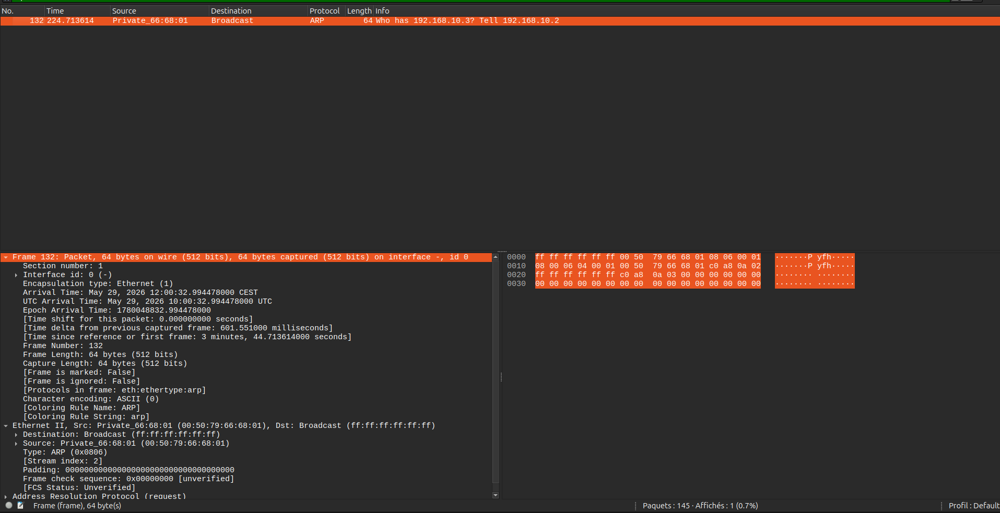

# TP guidé · GNS3 — Tables MAC, ARP & Spanning Tree

---

## Environnement

| Équipement | Interface SW1 | Adresse IP | Adresse MAC |
| --- | --- | --- | --- |
| PC-1 | Gi0/1 | 192.168.10.1/24 | — (observateur Wireshark) |
| PC-2 | Gi0/1 | 192.168.10.2/24 | `0050.7966.6801` |
| PC-3 | Gi0/2 | 192.168.10.3/24 | `0050.7966.6802` |

> Sonde Wireshark placée sur le lien **SW1 ↔ PC-1** pour observer tout ce que le switch envoie vers ce port.

---

## Phase 2 — Observation ARP



### Analyse de la capture

La trame capturée est un **ARP Request** (broadcast) :

| Champ | Valeur observée |
| --- | --- |
| **Émetteur** | `00:50:79:66:68:01` — PC-2 (`192.168.10.2`) |
| **Destination MAC** | `ff:ff:ff:ff:ff:ff` — broadcast |
| **Question posée** | *"Who has 192.168.10.3 ? Tell 192.168.10.2"* |
| **Type Ethernet** | `0x0806` — ARP |
| **Taille** | 64 bytes |

### Interprétation de l'exercice observer arp

PC-2 ne connaît pas la MAC de PC-3 → il envoie un **ARP Request en broadcast** sur tout le segment.  
Le switch **flood** cette trame sur tous ses ports (dont le lien vers PC-1), c'est pourquoi la sonde sur PC-1 la capture — alors que ce message ne lui est pas destiné.

En réponse, PC-3 renvoie un **ARP Reply en unicast** contenant sa propre adresse MAC (`0050.7966.6802`) directement vers PC-2. Le switch apprend au passage les deux MACs et met à jour sa table.

---

## Phase 3 — Observation de la table MAC


### Avant le ping

```text
Switch> show mac address-table
    → Table vide : le switch n'a encore rien appris
```

### Après le ping

```text
Vlan    Mac Address         Type      Ports
----    -----------         -----     -----
   1    0050.7966.6801      DYNAMIC   Gi0/1   ← PC-2
   1    0050.7966.6802      DYNAMIC   Gi0/2   ← PC-3
Total Mac Addresses : 2
```

### Interprétation de l'exercice observer table MAC

| Observation | Explication |
| --- | --- |
| Les entrées sont de type `DYNAMIC` | Apprises automatiquement par le switch via les trames reçues |
| PC-2 apparaît sur `Gi0/1` | Le switch a vu une trame venant de `0050.7966.6801` sur ce port |
| PC-3 apparaît sur `Gi0/2` | Idem lors de l'ARP Reply de PC-3 |
| La table était vide avant le ping | Aucune trame n'avait encore transité — rien à apprendre |

---

## Phase 4 — Démonstration du flooding

Après `clear mac address-table dynamic`, la table est vidée. Lors du ping suivant de PC-2 vers PC-3 :

1. Le switch reçoit la trame de PC-2 → **MAC destination inconnue**
2. Il ne sait pas sur quel port se trouve PC-3 → **flooding sur tous les ports**
3. La sonde sur le lien PC-1 **capture la trame** alors que PC-1 n'est pas la destination

> C'est exactement ce que montre la capture Wireshark : le trafic entre PC-2 et PC-3 est visible depuis PC-1 **uniquement parce que la table MAC était vide**.  
> Une fois la table re-peuplée après quelques échanges, le switch repasse en **unicast forwarding** et PC-1 ne voit plus ce trafic.

---

## Phase 5 (avancée) — Spanning Tree sur deux switches

### Switch 1


| Champ | Valeur |
| --- | --- |
| **Root ID** | Priorité `32769` · MAC `0cb4.e9b1.0000` |
| **Bridge ID** | Priorité `32769` · MAC `0cb4.e9b1.0000` |
| **Root Bridge ?** | ✅ **Oui** — *"This bridge is the root"* |
| **État de tous les ports** | `Desg FWD` (Designated Forwarding) |

Tous les ports sont en rôle **Designated** : SW1 étant le root bridge, tous ses ports sont les ports de référence pour chaque segment — aucun n'a besoin d'être bloqué de son côté.

---

### Switch 2


| Champ | Valeur |
| --- | --- |
| **Root ID** | Priorité `32769` · MAC `0cb4.e9b1.0000` ← celui de SW1 |
| **Bridge ID** | Priorité `32769` · MAC `0cbd.baa9.0000` ← propre à SW2 |
| **Root Bridge ?** | ❌ Non |
| **Port `Gi0/0`** | Rôle `Root FWD` ← port vers le root bridge |
| **Autres ports** | `Desg FWD` |

SW2 connaît le root bridge (MAC différente du sien) et a désigné `Gi0/0` comme **Root Port** — c'est le port par lequel il atteint SW1 avec le coût le plus faible (coût = 4).

---

### Conclusion

| Critère | SW1 | SW2 |
| --- | --- | --- |
| Rôle | **Root Bridge** | Switch non-root |
| Root ID = Bridge ID ? | ✅ Oui | ❌ Non |
| Root Port | — (c'est lui le root) | `Gi0/0` |
| Ports en Forwarding | Tous (`Desg`) | Tous (`Root` ou `Desg`) |
| Ports bloqués | Aucun | Aucun (topologie linéaire sans redondance) |

> Dans cette topologie (SW1 → SW2 en cascade sans lien redondant), STP n'a pas besoin de bloquer de port. Les ports bloqués n'apparaissent que s'il existe **plusieurs chemins** entre deux switches — ce qui n'est pas le cas ici.

---

## Bilan des notions acquises

| Notion | Démonstration réalisée |
| --- | --- |
| ARP Request = broadcast | Wireshark : destination `ff:ff:ff:ff:ff:ff` |
| ARP Reply = unicast | Réponse de PC-3 directement vers PC-2 |
| Apprentissage MAC dynamique | Table vide → peuplée après le ping |
| Flooding sur table vide | Trame PC-2→PC-3 visible sur PC-1 |
| STP — élection du root bridge | SW1 élu (priorité + MAC la plus basse) |
| STP — Root Port | `Gi0/0` de SW2 pointe vers SW1 |
