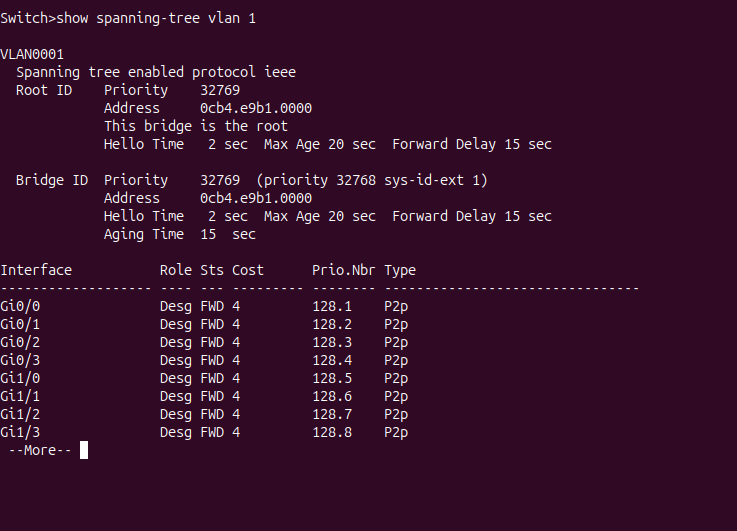
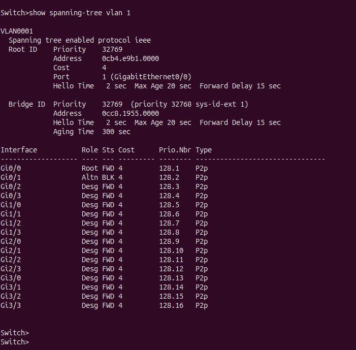
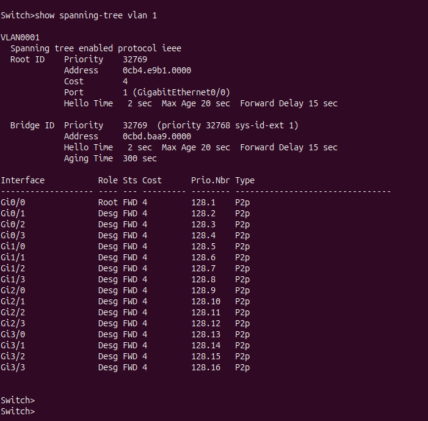

# STP Avancé — Élection du Root Bridge & Reconvergence

> **Facultatif · Profils avancés** · Topologie : 3 switches IOSvL2 en anneau dans GNS3

---

## 1. Rappel — pourquoi un anneau pose problème

Avec 3 switches interconnectés en anneau, il existe **plusieurs chemins** entre chaque paire de switches. Sans STP, cela crée une boucle de commutation permanente → tempête de broadcast → réseau inutilisable en quelques secondes.

```text
        SW1
       /   \
     SW2 — SW3
```

STP résout cela en **bloquant un port redondant** pour casser la boucle, tout en gardant le lien disponible pour une reprise en cas de panne.

---

## 2. Topologie GNS3

| Lien | Interface SW1 | Interface SW2/SW3 |
| --- | --- | --- |
| SW1 ↔ SW2 | `Gi0/0` | `Gi0/0` |
| SW1 ↔ SW3 | `Gi0/1` | `Gi0/0` |
| SW2 ↔ SW3 | `Gi0/1` | `Gi0/1` |

---

## 3. Observation initiale — Élection du Root Bridge

### Commande sur chaque switch

SW1# show spanning-tree vlan 1



SW2# show spanning-tree vlan 1



SW3# show spanning-tree vlan 1



### Ce qu'il faut identifier

| Information | Où la trouver | Signification |
| --- | --- | --- |
| **Root Bridge** | `This bridge is the root` ou Root ID = Bridge ID | Le switch élu comme référence STP |
| **Root Port** | Rôle `Root` en `FWD` | Port du chemin le moins coûteux vers le root |
| **Designated Port** | Rôle `Desg` en `FWD` | Port actif sur un segment |
| **Alternate Port** | Rôle `Altn` en `BLK` | Port bloqué — casse la boucle |

### Résultat attendu (priorités par défaut = 32768)

Le switch avec la **MAC address la plus basse** remporte l'élection (à priorité égale, le BID le plus petit gagne).

```text
Exemple :
  SW1 (MAC 0cb4.e9b1.0001) → Root Bridge  ← MAC la plus basse
  SW2 (MAC 0cb4.e9b1.0002) → Root Port sur Gi0/0 (vers SW1)
  SW3 (MAC 0cb4.e9b1.0003) → Root Port sur Gi0/0 (vers SW1)
                              Alternate Port sur Gi0/1 → BLK  ← boucle cassée ici
```

> Le port bloqué se trouve sur un lien redondant. En cas d'égalité de coût, STP départage avec les priorités et les identifiants de ports.

---

## 4. Forcer le changement de Root Bridge

### Objectif

Faire élire **SW3** comme nouveau root bridge en abaissant sa priorité STP.

```bash
SW3(config)# spanning-tree vlan 1 priority 4096
```

> La priorité doit être un **multiple de 4096** (valeurs valides : 0, 4096, 8192, 16384…).  
> Avec `4096 < 32768`, SW3 devient automatiquement le root bridge.

### Ce qui se passe ensuite — reconvergence STP classique (802.1D)

```text
SW3 envoie des BPDUs avec sa nouvelle priorité
        │
        ▼
SW1 et SW2 détectent un meilleur root bridge
        │
        ▼
Recalcul des chemins et des rôles de ports
        │
        ▼
Les ports passent par les états : Blocking → Listening (15s) → Learning (15s) → Forwarding
        │
        ▼
Nouveau port bloqué : sur SW1 ou SW2, côté lien redondant
```

| Phase | Durée (STP classique 802.1D) |
| --- | --- |
| Détection du changement | ~1-2 s |
| État Listening | 15 s |
| État Learning | 15 s |
| **Total reconvergence** | **~30 à 50 s** |

> Pendant toute cette durée, **le réseau est partiellement indisponible**. C'est le principal défaut du STP classique.

### Vérification après reconvergence

```bash
# Sur les 3 switches :
SW1# show spanning-tree vlan 1
SW2# show spanning-tree vlan 1
SW3# show spanning-tree vlan 1

# SW3 doit maintenant afficher :
# "This bridge is the root"
# Root ID Priority = 4097 (4096 + sys-id-ext 1)
```

---

## 5. Comparaison avec Rapid STP (802.1w)

### Activation sur tous les switches

```bash
SW1(config)# spanning-tree mode rapid-pvst
SW2(config)# spanning-tree mode rapid-pvst
SW3(config)# spanning-tree mode rapid-pvst
```

> Il faut activer Rapid STP **sur tous les switches concernés**. Un switch resté en mode classique peut ralentir la reconvergence sur son segment.

### Différences clés

| Critère | STP classique (802.1D) | Rapid STP (802.1w) |
| --- | --- | --- |
| Temps de reconvergence | **30 à 50 s** | **< 5 s** |
| États des ports | Blocking / Listening / Learning / Forwarding | Discarding / Learning / Forwarding |
| Mécanisme | Attente des timers | Négociation active entre switches (handshake) |
| Rôle Alternate Port | Bloqué, reprise lente | Prêt à prendre le relais immédiatement |
| Compatibilité | Standard IEEE 802.1D | Standard IEEE 802.1w (rétrocompatible) |

### Nouveaux rôles de ports Rapid STP

| Rôle | Description |
| --- | --- |
| **Root Port** | Meilleur chemin vers le root bridge |
| **Designated Port** | Port actif sur un segment |
| **Alternate Port** | Backup du Root Port — bascule instantanément |
| **Backup Port** | Backup d'un Designated Port sur le même segment |

---

## 6. Schéma récapitulatif — Avant / Après changement de root

```text
── Topologie initiale (SW1 = root) ──────────────────

        SW1 (root)
       /           \
   Gi0/0 FWD    Gi0/1 FWD
     /                 \
   SW2                 SW3
  Gi0/0 Root FWD      Gi0/0 Root FWD
  Gi0/1 Desg FWD      Gi0/1 Altn BLK  ← port bloqué

── Après priority 4096 sur SW3 (SW3 = root) ─────────

        SW3 (root)
       /           \
   Gi0/0 FWD    Gi0/1 FWD
     /                 \
   SW1                 SW2
  Gi0/1 Root FWD      Gi0/1 Root FWD
  Gi0/0 Altn BLK      Gi0/0 Desg FWD  ← port bloqué déplacé
```

---

## 7. Bilan

| Notion | Ce que le TP démontre |
| --- | --- |
| Élection du root bridge | Le switch avec la priorité/MAC la plus basse est élu |
| Port bloqué (Alternate) | Sur un lien redondant, côté switch non-root |
| Reconvergence STP classique | ~30-50 s — risque d'indisponibilité réseau |
| Forcer l'élection | `spanning-tree vlan 1 priority 4096` |
| Rapid STP | Reconvergence < 5 s grâce à la négociation active |

---

***Sources : IEEE 802.1D · IEEE 802.1w · Cisco STP Guide · Cisco Rapid STP Guide · Cisco BPDU Guard***
