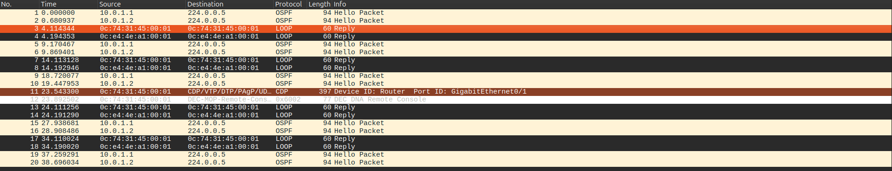
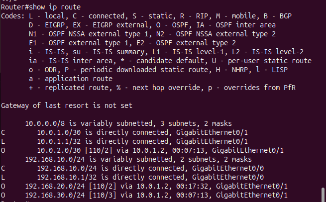
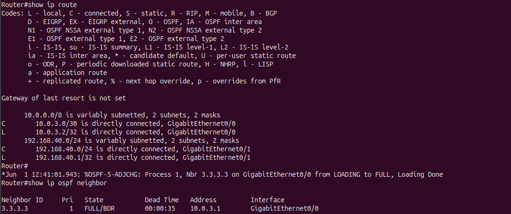

# Routage dynamique avec OSPF

## Pourquoi le routage dynamique ?

Le routage statique fonctionne bien sur une petite topologie, mais il devient vite lourd à maintenir.

Avec du routage statique :

- chaque route est écrite à la main ;
- chaque routeur doit connaître tous les réseaux distants ;
- ajouter un site oblige à modifier plusieurs routeurs ;
- en cas de panne, le routeur ne recalcule pas automatiquement un autre chemin.

Dans un réseau de 50 sites, ajouter un nouveau site signifie configurer des routes sur tous les autres routeurs. Si un lien tombe, il faut souvent une intervention manuelle pour rediriger le trafic.

Le routage dynamique règle ce problème : les routeurs échangent leurs informations, apprennent les réseaux automatiquement, calculent les meilleurs chemins et convergent après une panne.

---

## OSPF : Open Shortest Path First

OSPF est un protocole de routage dynamique très utilisé dans les réseaux d'entreprise. Il est ouvert, standardisé et adapté aux petites comme aux grandes infrastructures.

OSPF signifie **Open Shortest Path First** :

- **Open** : protocole ouvert, non limité à un seul constructeur ;
- **Shortest Path First** : il calcule le meilleur chemin avec l'algorithme de Dijkstra ;
- **Link-state** : il partage l'état des liens, pas seulement une distance.

OSPF est différent de RIP. RIP annonce surtout une distance en nombre de sauts. OSPF, lui, permet aux routeurs de construire une carte logique du réseau.

---

## Principe link-state

Avec OSPF, chaque routeur annonce l'état de ses liens aux autres routeurs de la même zone.

Le fonctionnement général :

1. Chaque routeur annonce ses interfaces et leur état avec des **LSA**.
2. Les LSA sont partagées entre les routeurs OSPF.
3. Chaque routeur construit une **LSDB**, c'est-à-dire une base de données de la topologie.
4. Chaque routeur lance l'algorithme de **Dijkstra**.
5. La table de routage est remplie avec les meilleurs chemins.

Vocabulaire important :

| Terme | Signification |
| --- | --- |
| LSA | Link State Advertisement : annonce de l'état d'un lien. |
| LSDB | Link State Database : base de données de topologie OSPF. |
| SPF | Shortest Path First : calcul du plus court chemin. |
| Router ID | Identifiant unique d'un routeur dans OSPF. |

Résultat : tous les routeurs d'une même zone OSPF ont la même vision de la topologie. Si un lien tombe, l'information est propagée et les routes sont recalculées automatiquement.

---

## Les adjacences OSPF

Avant d'échanger complètement leurs informations, deux routeurs OSPF doivent devenir voisins puis établir une adjacence.

Les états principaux :

| État | Signification |
| --- | --- |
| Down | Aucun échange, aucun paquet Hello reçu. |
| Init | Un Hello est reçu, mais le routeur local n'est pas encore cité dedans. |
| 2-Way | Les deux routeurs se reconnaissent mutuellement. |
| ExStart | Négociation du rôle master/slave pour l'échange de la base OSPF. |
| Exchange | Échange des résumés de LSA. |
| Loading | Demande des LSA manquantes. |
| Full | Adjacence complète, bases synchronisées, routage opérationnel. |

À retenir : l'état important à obtenir est **Full**. C'est lui qui indique que l'adjacence OSPF fonctionne correctement.

---

## Les paquets Hello

Les routeurs OSPF envoient régulièrement des paquets **Hello** pour découvrir et surveiller leurs voisins.

Par défaut sur beaucoup de liens Cisco :

- Hello interval : `10` secondes ;
- Dead interval : `40` secondes ;
- adresse multicast OSPF : `224.0.0.5`.

Si un routeur ne reçoit plus de Hello pendant le dead interval, il considère que le voisin est perdu. OSPF recalcule alors les routes.

Dans Wireshark :

```text
Filtre : ospf
```

À observer :

- paquets OSPF Type 1 : Hello ;
- destination multicast : `224.0.0.5` ;
- paquets OSPF Type 4 : Link State Update, visibles lors d'un changement de topologie.

---

## Le coût OSPF

OSPF ne choisit pas un chemin au hasard. Il choisit le chemin avec le **coût total le plus faible**.

Sur Cisco IOS, le coût par défaut est calculé avec :

```text
Coût = 100 000 000 / bande passante en bps
```

Exemples :

| Interface | Bande passante | Coût par défaut |
| --- | --- | --- |
| Serial T1 | `1 544 000` bps | `64` |
| FastEthernet | `100 000 000` bps | `1` |
| GigabitEthernet | `1 000 000 000` bps | `1` |
| 10 Gigabit Ethernet | `10 000 000 000` bps | `1` |

Problème : avec la référence par défaut, FastEthernet, GigabitEthernet et 10 Gigabit peuvent tous avoir un coût de `1`. OSPF ne les différencie donc pas correctement.

Pour adapter le calcul, on peut modifier la référence :

```bash
R1(config)# router ospf 1
R1(config-router)# auto-cost reference-bandwidth 10000
```

Ici, `10000` signifie que la nouvelle référence est `10 Gbps`.

---

## Les zones OSPF

OSPF peut organiser le réseau en **zones**. Cela limite la taille de la base LSDB et réduit la quantité d'informations propagées partout.

La zone principale est la **zone 0**, appelée aussi **backbone area**.

À retenir :

- la zone 0 est obligatoire dans une architecture OSPF multi-zones ;
- les autres zones doivent être connectées à la zone 0 ;
- dans un petit réseau, une seule zone 0 suffit ;
- dans une grande infrastructure, plusieurs zones permettent de mieux scaler.

Pour un lab comme AlpesNet, tout peut être placé en `area 0`.

---

## Configurer OSPF en zone 0

Exemple sur R1 :

```bash
R1(config)# router ospf 1
R1(config-router)# router-id 1.1.1.1
R1(config-router)# network 192.168.10.0 0.0.0.255 area 0
R1(config-router)# network 10.0.1.0 0.0.0.3 area 0
R1(config-router)# end
```

Explication :

- `router ospf 1` active le processus OSPF numéro `1` ;
- `router-id 1.1.1.1` identifie R1 dans OSPF ;
- `network 192.168.10.0 0.0.0.255 area 0` active OSPF sur le LAN de R1 ;
- `network 10.0.1.0 0.0.0.3 area 0` active OSPF sur le lien WAN R1-R2.

La syntaxe est :

```bash
network <adresse_réseau> <wildcard> area <numéro_zone>
```

Le wildcard mask est l'inverse du masque :

| Masque classique | Wildcard |
| --- | --- |
| `255.255.255.0` | `0.0.0.255` |
| `255.255.255.252` | `0.0.0.3` |

Si le router-id n'est pas configuré manuellement, OSPF choisit généralement la plus haute IP de loopback, ou sinon la plus haute IP d'interface active.

---

## Commandes de vérification

Voir les voisins OSPF :

```bash
R1# show ip ospf neighbor
```

À vérifier : les voisins doivent être en état `Full`.

Voir les routes apprises par OSPF :

```bash
R1# show ip route ospf
```

Les routes OSPF apparaissent avec le code `O`.

Voir la base de données OSPF :

```bash
R1# show ip ospf database
```

Voir les détails OSPF d'une interface :

```bash
R1# show ip ospf interface GigabitEthernet0/1
```

Cette commande permet de vérifier les timers Hello/Dead, le coût OSPF, l'état de l'interface et les informations de voisinage.

---

## Mise en pratique : remplacer le statique par OSPF

Objectif : supprimer les routes statiques configurées à la main, activer OSPF sur les trois routeurs, puis observer l'apprentissage automatique des routes et la convergence en cas de panne.

### 1. Supprimer les routes statiques

Avant d'activer OSPF, on retire les routes statiques ajoutées pendant l'exercice précédent.

Exemple sur R1 :

```bash
R1(config)# no ip route 192.168.20.0 255.255.255.0 10.0.1.2
R1(config)# no ip route 192.168.30.0 255.255.255.0 10.0.1.2
```

On répète la même logique sur R2 et R3 : chaque route statique existante est supprimée avec `no ip route`.

Vérification :

```bash
R1# show ip route
```

À ce stade, il ne doit plus y avoir de routes `S` pour les LANs distants.

### 2. Configurer OSPF sur chaque routeur

Chaque routeur annonce uniquement ses réseaux directement connectés. OSPF se charge ensuite d'apprendre les autres réseaux.

Sur R1 :

```bash
R1(config)# router ospf 1
R1(config-router)# router-id 1.1.1.1
R1(config-router)# network 192.168.10.0 0.0.0.255 area 0
R1(config-router)# network 10.0.1.0 0.0.0.3 area 0
```

Sur R2 :

```bash
R2(config)# router ospf 1
R2(config-router)# router-id 2.2.2.2
R2(config-router)# network 192.168.20.0 0.0.0.255 area 0
R2(config-router)# network 10.0.1.0 0.0.0.3 area 0
R2(config-router)# network 10.0.2.0 0.0.0.3 area 0
```

Sur R3 :

```bash
R3(config)# router ospf 1
R3(config-router)# router-id 3.3.3.3
R3(config-router)# network 192.168.30.0 0.0.0.255 area 0
R3(config-router)# network 10.0.2.0 0.0.0.3 area 0
```

Résumé des annonces OSPF :

| Routeur | Réseaux annoncés en OSPF |
| --- | --- |
| R1 | `192.168.10.0/24`, `10.0.1.0/30` |
| R2 | `192.168.20.0/24`, `10.0.1.0/30`, `10.0.2.0/30` |
| R3 | `192.168.30.0/24`, `10.0.2.0/30` |

### 3. Vérifier les adjacences

Après quelques secondes, les voisins OSPF doivent passer en état `Full`.

```bash
R1# show ip ospf neighbor
R2# show ip ospf neighbor
R3# show ip ospf neighbor
```

Sur R1, on voit le voisin R2, identifié par le router-id `2.2.2.2` :


Sur R2, on voit les deux voisins : R1 (`1.1.1.1`) et R3 (`3.3.3.3`) :


Sur R3, on voit le voisin R2, identifié par le router-id `2.2.2.2` :


À retenir : si l'état est `Full`, l'adjacence est opérationnelle. Si la table est vide, il faut vérifier les interfaces, les masques, les `network`, l'area et les timers Hello/Dead.

### 4. Observer les paquets Hello dans Wireshark

Avec le filtre Wireshark suivant :

```text
ospf
```

on observe les paquets OSPF envoyés entre les routeurs.


On voit notamment :

- des paquets `Hello Packet` ;
- la destination multicast `224.0.0.5` ;
- les sources `10.0.1.1` et `10.0.1.2` sur le lien R1-R2 ;
- un envoi régulier, environ toutes les 10 secondes.

Sans filtre, on voit que les paquets OSPF cohabitent avec d'autres protocoles présents dans le lab :



### 5. Vérifier la table de routage

Une fois les adjacences établies, les routes apprises par OSPF apparaissent dans la table avec le code `O`.

```bash
R1# show ip route
```

Sur R1, les réseaux distants sont appris automatiquement :



Lecture des lignes importantes :

| Code | Réseau | Via | Signification |
| --- | --- | --- | --- |
| `O` | `10.0.2.0/30` | `10.0.1.2` | Réseau WAN R2-R3 appris par OSPF. |
| `O` | `192.168.20.0/24` | `10.0.1.2` | LAN du site 2 appris par OSPF. |
| `O` | `192.168.30.0/24` | `10.0.1.2` | LAN du site 3 appris par OSPF. |

La différence avec le routage statique est nette : les routes ne sont plus en `S`, elles sont en `O`.

### 6. Tester la convergence

Pour simuler une panne, on coupe le lien entre R2 et R3 :

```bash
R2(config)# interface GigabitEthernet0/2
R2(config-if)# shutdown
```

Après la coupure, R2 ne voit plus R3 comme voisin OSPF. Sur R1, il ne reste que l'adjacence avec R2 :


Ce qu'il faut observer :

- le voisin R3 disparaît après le dead interval ;
- la route vers le site 3 disparaît si aucun autre chemin n'existe ;
- quand l'interface est remise en service, OSPF reforme l'adjacence automatiquement.

Remise en service :

```bash
R2(config-if)# no shutdown
```

La convergence prend environ `40` secondes avec les timers par défaut : `10` secondes pour Hello et `40` secondes pour Dead. C'est précisément l'intérêt du routage dynamique : le réseau réagit seul, sans réécrire toutes les routes à la main.

---

## Profil avancé : authentification MD5 OSPF

Par défaut, OSPF peut accepter les paquets d'un routeur voisin présent sur le même lien si les paramètres OSPF correspondent. Sans authentification, un routeur malveillant branché sur le réseau pourrait essayer de former une adjacence OSPF et d'injecter de fausses routes.

L'authentification MD5 ajoute une protection : les routeurs OSPF doivent partager la même clé sur le lien pour accepter les messages OSPF.

Exemple sur R1, interface vers R2 :

```bash
R1(config)# interface GigabitEthernet0/1
R1(config-if)# ip ospf message-digest-key 1 md5 MonMotDePasse
R1(config-if)# ip ospf authentication message-digest
```

Il faut configurer la même clé sur l'interface en face, côté R2 :

```bash
R2(config)# interface GigabitEthernet0/1
R2(config-if)# ip ospf message-digest-key 1 md5 MonMotDePasse
R2(config-if)# ip ospf authentication message-digest
```

À documenter :

- la clé doit être identique des deux côtés du lien ;
- le numéro de clé `1` doit correspondre ;
- si un seul côté est configuré, l'adjacence OSPF tombe ;
- l'objectif est d'empêcher un routeur non autorisé de participer à OSPF et d'annoncer de fausses routes.

Vérification :

```bash
R1# show ip ospf neighbor
R1# show ip ospf interface GigabitEthernet0/1
```

L'adjacence doit rester en état `Full` après activation de l'authentification sur les deux routeurs.

---

## Extension : ajout de R4 et du site 4

Objectif : ajouter un quatrième site avec le LAN `192.168.40.0/24`, puis vérifier que R1, R2 et R3 apprennent automatiquement ce nouveau réseau grâce à OSPF.

Nouvelle topologie :

- R4 LAN site 4 : `192.168.40.0/24`, passerelle `192.168.40.1`.
- PC4 : `192.168.40.10/24`, gateway `192.168.40.1`.
- Lien R3-R4 : `10.0.3.0/30`.
- R3 côté R4 : `10.0.3.1/30`.
- R4 côté R3 : `10.0.3.2/30`.

### 1. Configurer les interfaces de R4

Sur R4 :

```bash
R4(config)# interface GigabitEthernet0/0
R4(config-if)# ip address 10.0.3.2 255.255.255.252
R4(config-if)# description "WAN-vers-R3"
R4(config-if)# no shutdown

R4(config)# interface GigabitEthernet0/1
R4(config-if)# ip address 192.168.40.1 255.255.255.0
R4(config-if)# description "LAN-vers-site4"
R4(config-if)# no shutdown
```

Sur R3, il faut que le nouveau lien vers R4 existe aussi :

```bash
R3(config)# interface GigabitEthernet0/2
R3(config-if)# ip address 10.0.3.1 255.255.255.252
R3(config-if)# description "WAN-vers-R4"
R3(config-if)# no shutdown
```

### 2. Activer OSPF pour le nouveau site

Sur R4, on configure OSPF avec un router-id unique et on annonce ses réseaux connectés :

```bash
R4(config)# router ospf 1
R4(config-router)# router-id 4.4.4.4
R4(config-router)# network 192.168.40.0 0.0.0.255 area 0
R4(config-router)# network 10.0.3.0 0.0.0.3 area 0
```

Sur R3, si ce n'est pas déjà fait, il faut ajouter le nouveau lien dans le processus OSPF existant :

```bash
R3(config)# router ospf 1
R3(config-router)# network 10.0.3.0 0.0.0.3 area 0
```

À partir de là, R3 et R4 peuvent devenir voisins OSPF sur le lien `10.0.3.0/30`.

### 3. Vérifier le voisinage R3-R4

Sur R4, la table de routage montre d'abord ses réseaux directement connectés, puis l'adjacence OSPF avec R3 passe en état `Full`.



Lecture de la capture :

- `C 10.0.3.0/30` : lien WAN R3-R4 directement connecté ;
- `C 192.168.40.0/24` : LAN du site 4 directement connecté ;
- voisin OSPF `3.3.3.3` : R3 est vu depuis R4 ;
- état `FULL/BDR` : l'adjacence est opérationnelle.

Une fois l'adjacence formée, R4 annonce `192.168.40.0/24` à R3. R3 propage ensuite cette information à R2, puis R2 à R1. C'est là que l'intérêt d'OSPF devient visible : les anciens routeurs apprennent le nouveau site sans ajouter de routes statiques.

### 4. Tester depuis PC4

PC4 est configuré dans le LAN du site 4 :

```text
PC4> ip 192.168.40.10 192.168.40.1
```

Les pings vers les autres sites fonctionnent :


Lecture des tests :

| Test | Résultat | Ce que ça prouve |
| --- | --- | --- |
| `PC4 -> 192.168.30.10` | Réponse reçue | Le site 4 atteint le site 3 via R4-R3. |
| `PC4 -> 192.168.20.10` | Réponse reçue | Le site 4 atteint le site 2 via R4-R3-R2. |
| `PC4 -> 192.168.10.10` | Réponse reçue | Le site 4 atteint le site 1 via R4-R3-R2-R1. |

Pour qu'un ping fonctionne, il faut aussi le chemin retour. Ces tests confirment donc que les autres routeurs ont appris la route vers `192.168.40.0/24`.

### 5. Simuler une double panne

Dans cette topologie, les routeurs sont en chaîne :

```text
R1 --- R2 --- R3 --- R4
```

Il n'y a pas de lien de secours. OSPF peut détecter la panne et supprimer les routes invalides, mais il ne peut pas inventer un chemin alternatif s'il n'existe pas physiquement.

Exemple de double panne :

```bash
R2(config)# interface GigabitEthernet0/2
R2(config-if)# shutdown

R3(config)# interface GigabitEthernet0/2
R3(config-if)# shutdown
```

Effet attendu :

| Panne | Conséquence |
| --- | --- |
| Lien R2-R3 coupé | R1/R2 ne peuvent plus atteindre les sites 3 et 4. R3/R4 ne peuvent plus atteindre les sites 1 et 2. |
| Lien R3-R4 coupé | R4 est isolé. Les routes vers `192.168.40.0/24` disparaissent de R1/R2/R3. |
| Les deux liens coupés | Le réseau est découpé en plusieurs morceaux. OSPF retire les routes impossibles, mais ne peut pas rétablir la connectivité sans lien redondant. |

Commandes utiles pour observer :

```bash
R1# show ip ospf neighbor
R1# show ip route ospf
R2# show ip ospf neighbor
R3# show ip ospf neighbor
R4# show ip route ospf
```

Conclusion : OSPF s'adapte automatiquement en supprimant les routes qui ne sont plus valides. Mais pour que le trafic continue malgré une panne, il faut une topologie redondante, par exemple un lien supplémentaire R1-R4 ou R2-R4.

---

## À retenir

- Le routage statique ne passe pas bien à l'échelle.
- OSPF apprend automatiquement les réseaux annoncés par les autres routeurs.
- Les routeurs OSPF échangent des Hello pour former des adjacences.
- L'état attendu pour une adjacence opérationnelle est `Full`.
- OSPF choisit le chemin avec le coût total le plus faible.
- En cas de panne, OSPF converge automatiquement et recalcule les routes.

## Ressource

***[ANSSI — Recommandations sécurité routeurs](ssi.gouv.fr/guide)***
***[CERT-FR — Bulletins Cisco IOS](cert.ssi.gouv.fr/alerte)***
***[Cisco OSPF Authentication](https://www.cisco.com/c/en/us/tech/ip/ip-routing/tsd-technology-support-troubleshooting-technotes-list.html)***
***[RFC 2328 (OSPF v2, 1998)](tools.ietf.org/html/rfc2328)***
