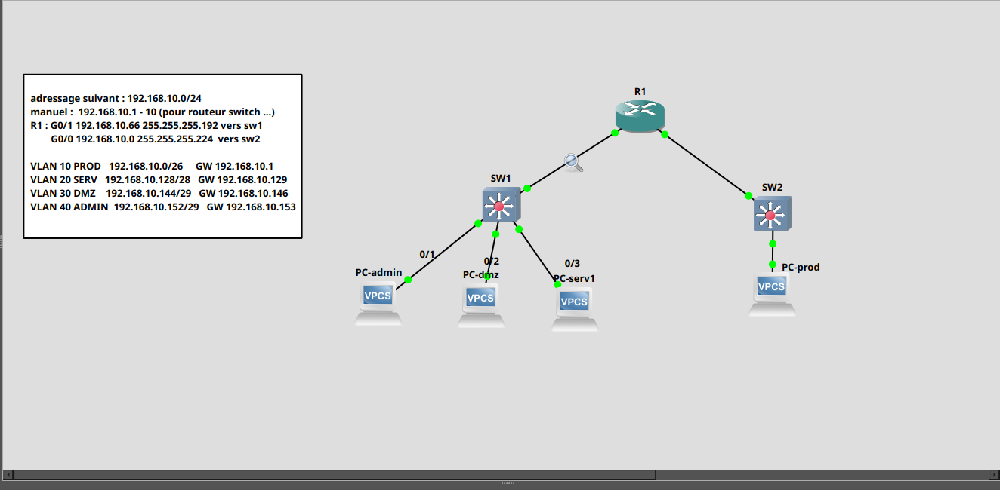
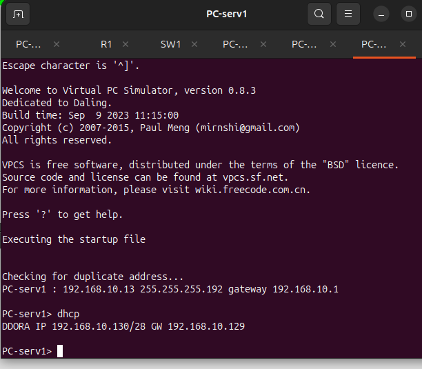
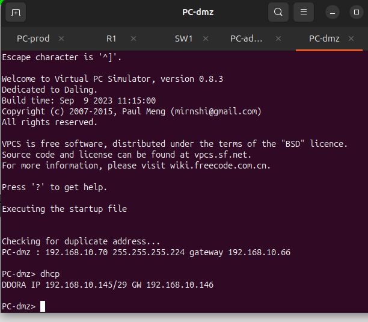
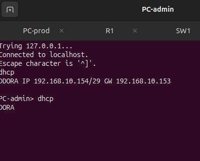
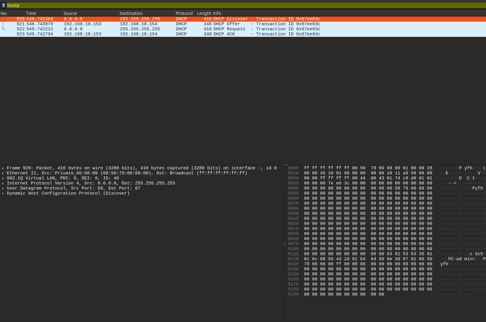

# TP — DHCP par VLAN depuis R1

## Objectif

Mettre en place un serveur DHCP directement sur `R1` pour distribuer automatiquement les adresses IP aux postes de plusieurs segments :

- `PROD` ;
- `SERV` ;
- `DMZ` ;
- `ADMIN`.

Le premier test a montré que le DHCP fonctionnait en branchement direct sur le routeur. Le blocage venait donc du switch : une fois le switch remplacé et les VLANs configurés, le processus DORA est bien apparu.

---

## Topologie finale



```text
                         R1
                    /          \
             lien trunk       lien access
              vers SW1         vers SW2
                |                |
               SW1              SW2
          /     |     \           |
     ADMIN     DMZ    SERV       PROD
```

Dans le lab, les câbles `ADMIN` et `SERV` ont été inversés physiquement. La correction s'est donc faite au niveau des ports du switch : ce qui compte, c'est que chaque port access soit placé dans le bon VLAN.

---

## Plan d'adressage

Le réseau de départ est `192.168.10.0/24`, découpé en plusieurs sous-réseaux.

| VLAN | Nom | Réseau | Passerelle | Usage |
| --- | --- | --- | --- | --- |
| `10` | `PROD` | `192.168.10.0/26` | `192.168.10.1` | Poste production |
| `20` | `SERV` | `192.168.10.128/28` | `192.168.10.129` | Serveur |
| `30` | `DMZ` | `192.168.10.144/29` | `192.168.10.146` | DMZ |
| `40` | `ADMIN` | `192.168.10.152/29` | `192.168.10.153` | Administration |

Adresses obtenues pendant le test :

| Poste | Adresse DHCP reçue | Masque | Passerelle |
| --- | --- | --- | --- |
| `PC-prod` | `192.168.10.11` | `/26` | `192.168.10.1` |
| `PC-serv1` | `192.168.10.130` | `/28` | `192.168.10.129` |
| `PC-dmz` | `192.168.10.145` | `/29` | `192.168.10.146` |
| `PC-admin` | `192.168.10.154` | `/29` | `192.168.10.153` |

!!! warning "Point important"
    Une passerelle doit toujours être dans le même sous-réseau que le poste. Par exemple, `PC-admin` en `192.168.10.154/29` doit utiliser une passerelle dans `192.168.10.152/29`, donc ici `192.168.10.153`.

---

## Configuration de R1

### Interface vers PROD

Le réseau `PROD` est relié à `SW2`. Il peut être configuré simplement sur une interface physique de R1.

```bash
R1# configure terminal

R1(config)# interface GigabitEthernet0/0
R1(config-if)# description Vers-SW2-PROD
R1(config-if)# ip address 192.168.10.1 255.255.255.192
R1(config-if)# no shutdown
R1(config-if)# exit
```

### Interface trunk vers SW1

Les réseaux `SERV`, `DMZ` et `ADMIN` passent par le même lien entre `R1` et `SW1`. On utilise donc des sous-interfaces avec `encapsulation dot1Q`.

```bash
R1(config)# interface GigabitEthernet0/1
R1(config-if)# description Trunk-vers-SW1
R1(config-if)# no ip address
R1(config-if)# no shutdown
R1(config-if)# exit

R1(config)# interface GigabitEthernet0/1.20
R1(config-subif)# encapsulation dot1Q 20
R1(config-subif)# ip address 192.168.10.129 255.255.255.240
R1(config-subif)# exit

R1(config)# interface GigabitEthernet0/1.30
R1(config-subif)# encapsulation dot1Q 30
R1(config-subif)# ip address 192.168.10.146 255.255.255.248
R1(config-subif)# exit

R1(config)# interface GigabitEthernet0/1.40
R1(config-subif)# encapsulation dot1Q 40
R1(config-subif)# ip address 192.168.10.153 255.255.255.248
R1(config-subif)# exit
```

---

## Pools DHCP sur R1

Les adresses de passerelle sont exclues pour éviter qu'elles soient distribuées à un client.

```bash
R1(config)# ip dhcp excluded-address 192.168.10.1 192.168.10.10
R1(config)# ip dhcp excluded-address 192.168.10.129
R1(config)# ip dhcp excluded-address 192.168.10.146
R1(config)# ip dhcp excluded-address 192.168.10.153
```

### Pool PROD

```bash
R1(config)# ip dhcp pool LAN-Production
R1(dhcp-config)# network 192.168.10.0 255.255.255.192
R1(dhcp-config)# default-router 192.168.10.1
R1(dhcp-config)# dns-server 192.168.10.5
R1(dhcp-config)# domain-name alpesnet.local
R1(dhcp-config)# lease 0 8 0
R1(dhcp-config)# exit
```

### Pool SERV

```bash
R1(config)# ip dhcp pool SERV
R1(dhcp-config)# network 192.168.10.128 255.255.255.240
R1(dhcp-config)# default-router 192.168.10.129
R1(dhcp-config)# dns-server 192.168.10.5
R1(dhcp-config)# domain-name alpesnet.local
R1(dhcp-config)# lease 0 8 0
R1(dhcp-config)# exit
```

### Pool DMZ

```bash
R1(config)# ip dhcp pool DMZ
R1(dhcp-config)# network 192.168.10.144 255.255.255.248
R1(dhcp-config)# default-router 192.168.10.146
R1(dhcp-config)# dns-server 192.168.10.5
R1(dhcp-config)# domain-name alpesnet.local
R1(dhcp-config)# lease 0 8 0
R1(dhcp-config)# exit
```

### Pool ADMIN

```bash
R1(config)# ip dhcp pool ADMIN
R1(dhcp-config)# network 192.168.10.152 255.255.255.248
R1(dhcp-config)# default-router 192.168.10.153
R1(dhcp-config)# dns-server 192.168.10.5
R1(dhcp-config)# domain-name alpesnet.local
R1(dhcp-config)# lease 0 8 0
R1(dhcp-config)# exit
```

---

## Configuration de SW1

`SW1` transporte plusieurs VLANs vers R1. Le port vers R1 doit donc être en trunk.

```bash
SW1# configure terminal

SW1(config)# vlan 20
SW1(config-vlan)# name SERV
SW1(config-vlan)# exit

SW1(config)# vlan 30
SW1(config-vlan)# name DMZ
SW1(config-vlan)# exit

SW1(config)# vlan 40
SW1(config-vlan)# name ADMIN
SW1(config-vlan)# exit
```

### Port trunk vers R1

```bash
SW1(config)# interface GigabitEthernet0/0
SW1(config-if)# description Trunk-vers-R1
SW1(config-if)# switchport trunk encapsulation dot1q
SW1(config-if)# switchport mode trunk
SW1(config-if)# switchport trunk allowed vlan 20,30,40
SW1(config-if)# no shutdown
SW1(config-if)# exit
```

### Ports access vers les PC

Adapter les numéros de ports à la topologie réelle. Dans le lab, `ADMIN` et `SERV` ont été inversés physiquement : la solution consiste simplement à mettre chaque port dans le VLAN correspondant au poste branché.

```bash
SW1(config)# interface GigabitEthernet0/1
SW1(config-if)# description PC-admin
SW1(config-if)# switchport mode access
SW1(config-if)# switchport access vlan 40
SW1(config-if)# spanning-tree portfast
SW1(config-if)# no shutdown
SW1(config-if)# exit

SW1(config)# interface GigabitEthernet0/2
SW1(config-if)# description PC-dmz
SW1(config-if)# switchport mode access
SW1(config-if)# switchport access vlan 30
SW1(config-if)# spanning-tree portfast
SW1(config-if)# no shutdown
SW1(config-if)# exit

SW1(config)# interface GigabitEthernet0/3
SW1(config-if)# description PC-serv1
SW1(config-if)# switchport mode access
SW1(config-if)# switchport access vlan 20
SW1(config-if)# spanning-tree portfast
SW1(config-if)# no shutdown
SW1(config-if)# exit
```

---

## Configuration de SW2

Pour `PROD`, un simple VLAN access suffit si le lien vers R1 est dédié à ce réseau.

```bash
SW2# configure terminal

SW2(config)# vlan 10
SW2(config-vlan)# name PROD
SW2(config-vlan)# exit

SW2(config)# interface GigabitEthernet0/0
SW2(config-if)# description Vers-R1-PROD
SW2(config-if)# switchport mode access
SW2(config-if)# switchport access vlan 10
SW2(config-if)# no shutdown
SW2(config-if)# exit

SW2(config)# interface GigabitEthernet0/1
SW2(config-if)# description PC-prod
SW2(config-if)# switchport mode access
SW2(config-if)# switchport access vlan 10
SW2(config-if)# spanning-tree portfast
SW2(config-if)# no shutdown
SW2(config-if)# exit
```

---

## Tests sur les VPCS

Sur chaque poste, on remet l'IP à zéro puis on demande une adresse DHCP.

```bash
PC> ip 0.0.0.0
PC> dhcp
```

Résultats observés :

```text
PC-prod> dhcp
DORA IP 192.168.10.11/26 GW 192.168.10.1
```

```text
PC-serv1> dhcp
DORA IP 192.168.10.130/28 GW 192.168.10.129
```



```text
PC-dmz> dhcp
DORA IP 192.168.10.145/29 GW 192.168.10.146
```



```text
PC-admin> dhcp
DORA IP 192.168.10.154/29 GW 192.168.10.153
```



---

## Vérifications sur R1

### Statistiques DHCP

```bash
R1# show ip dhcp server statistics
```


Observation du lab :

```text
Address pools        4
Automatic bindings   4

Message              Received
DHCPDISCOVER         10
DHCPREQUEST          6

Message              Sent
DHCPOFFER            6
DHCPACK              6
DHCPNAK              0
```

Lecture :

- les 4 pools existent ;
- les 4 postes ont reçu une adresse ;
- les `DHCPOFFER` et `DHCPACK` confirment que R1 répond correctement ;
- `DHCPNAK` à `0` indique qu'il n'y a pas eu de refus DHCP.

### Baux DHCP

```bash
R1# show ip dhcp binding
```


Observation du lab :

```text
IP address       Client-ID           Type
192.168.10.11    0100.5079.6668.01   Automatic
192.168.10.130   0100.5079.6668.02   Automatic
192.168.10.145   0100.5079.6668.03   Automatic
192.168.10.154   0100.5079.6668.00   Automatic
```

Les 4 adresses correspondent bien aux 4 sous-réseaux attendus.

### État des pools

```bash
R1# show ip dhcp pool
```


Résumé observé :

| Pool | Plage | Total | Louées |
| --- | --- | --- | --- |
| `LAN-Production` | `192.168.10.1 - 192.168.10.62` | 62 | 1 |
| `SERV` | `192.168.10.129 - 192.168.10.142` | 14 | 1 |
| `DMZ` | `192.168.10.145 - 192.168.10.150` | 6 | 1 |
| `ADMIN` | `192.168.10.153 - 192.168.10.158` | 6 | 1 |

### Conflits DHCP

```bash
R1# show ip dhcp conflict
```


Observation :

```text
IP address     Detection method     Detection time     VRF
```

Aucune adresse n'apparaît : aucun conflit DHCP n'a été détecté.

---

## Observation Wireshark

Filtre utilisé :

```text
bootp
```

La capture montre bien les 4 messages DORA pour `PC-admin` :



```text
DHCP Discover   0.0.0.0        -> 255.255.255.255
DHCP Offer      192.168.10.153 -> 192.168.10.154
DHCP Request    0.0.0.0        -> 255.255.255.255
DHCP ACK        192.168.10.153 -> 192.168.10.154
```

Dans le paquet `DHCP ACK`, les options importantes confirment la configuration :


| Option | Valeur observée | Signification |
| --- | --- | --- |
| `53` | `ACK (5)` | Confirmation DHCP |
| `54` | `192.168.10.153` | Serveur DHCP / passerelle du VLAN ADMIN |
| `51` | `8 hours` | Durée du bail |
| `1` | `255.255.255.248` | Masque `/29` |
| `3` | `192.168.10.153` | Routeur / passerelle |
| `6` | DNS fourni | Serveur DNS |
| `15` | Domaine fourni | Domaine local |

---

## Méthode de dépannage retenue

1. Tester le DHCP en direct entre le PC et R1.
2. Si DORA fonctionne en direct mais pas avec le switch, suspecter la couche 2.
3. Vérifier que le port vers R1 et le port vers le PC sont dans le bon VLAN.
4. Pour plusieurs VLANs sur un seul lien routeur-switch, utiliser un trunk et des sous-interfaces.
5. Vérifier les baux avec `show ip dhcp binding`.
6. Vérifier les compteurs avec `show ip dhcp server statistics`.
7. Confirmer DORA dans Wireshark avec le filtre `bootp`.

---

## Commandes utiles

Sur R1 :

```bash
show ip interface brief
show ip dhcp binding
show ip dhcp pool
show ip dhcp conflict
show ip dhcp server statistics
```

Sur les switches :

```bash
show vlan brief
show interfaces trunk
show interfaces status
show mac address-table
```

Sur VPCS :

```bash
ip 0.0.0.0
dhcp
show ip
```

---

## À retenir

- Le DHCP peut fonctionner sur plusieurs VLANs si R1 possède une interface ou sous-interface dans chaque réseau.
- Un switch non configuré ou défectueux peut bloquer entièrement DORA.
- Le message `Can't find dhcp server` signifie souvent que le `DHCP Discover` n'arrive pas jusqu'au routeur.
- Les ports utilisateurs doivent être en `access`.
- Le lien entre le switch multi-VLAN et R1 doit être en `trunk`.
- Chaque pool DHCP doit correspondre exactement au sous-réseau de sa passerelle.
