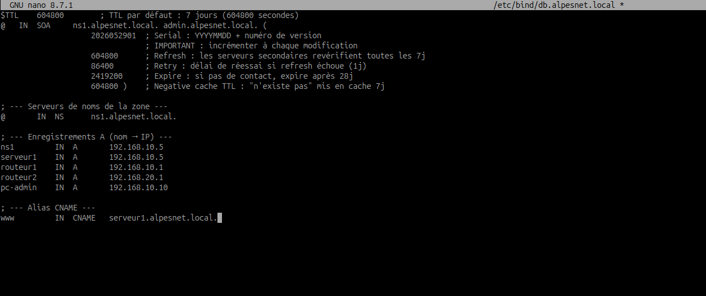

# Finalisation - Infrastructure AlpesNet complete

## Objectif

Finaliser et documenter l'infrastructure AlpesNet complete dans GNS3 :

- 4 sites relies par routage dynamique OSPF ;
- DHCP actif sur chaque site ;
- NAT/PAT vers le reseau Internet simule ;
- DNS interne avec Bind9 ;
- livrable propre avec les configurations et la documentation.

La validation finale doit prouver que les postes obtiennent une IP automatiquement, que les machines internes peuvent joindre le serveur public, et que les noms internes sont resolus par le DNS `alpesnet.local`.

---

## Architecture attendue

L'infrastructure finale contient :

| Element | Attendu |
| --- | --- |
| Sites | 4 sites AlpesNet |
| Routage | OSPF actif entre les routeurs |
| DHCP | 1 service DHCP par segment ou relais DHCP selon la topologie |
| NAT/PAT | Sortie vers le reseau Internet simule |
| DNS | Zone `alpesnet.local` servie par Bind9 |
| Serveur public | Machine Debian/Ubuntu joignable en `203.0.113.2` dans le lab |


---

## Ce qui doit fonctionner

### 1. DHCP actif sur chaque site

Sur un VPCS de chaque site, lancer :

```text
ip dhcp
show ip
```

Chaque VPCS doit recevoir :

- une adresse IP dans la bonne plage ;
- le bon masque ;
- la bonne passerelle ;
- l'adresse du serveur DNS.

Exemple de preuve DHCP :


Verification cote routeur :

```cisco
show ip dhcp binding
show ip dhcp pool
show ip dhcp conflict
show running-config | section ip dhcp pool
```

Exemples de captures utiles :


---

### 2. NAT/PAT vers le reseau Internet simule

Depuis un PC interne, tester le ping vers le serveur public :

```text
ping 203.0.113.2
```

Le test vers `8.8.8.8` n'est valide que si GNS3 est relie a Internet reel via un noeud NAT ou Cloud correctement configure.

Preuve attendue :


Verification sur le routeur NAT :

```cisco
show ip nat translations
show ip nat statistics
show running-config | include ip nat|access-list|ip route
```

Preuve attendue :


---

### 3. Resolution DNS de 3 noms internes

Le serveur DNS Bind9 doit repondre pour la zone :

```text
alpesnet.local
```

Les 3 enregistrements `A` minimum sont :

| Nom | Exemple d'IP | Role |
| --- | --- | --- |
| `routeur1.alpesnet.local` | `192.168.10.1` | R1 |
| `pc-admin.alpesnet.local` | `192.168.10.10` | PC interne |
| `serveur1.alpesnet.local` | `192.168.10.5` | Serveur interne |

Depuis un VPCS :

```text
nslookup routeur1.alpesnet.local 203.0.113.2
nslookup pc-admin.alpesnet.local 203.0.113.2
nslookup serveur1.alpesnet.local 203.0.113.2
```

Depuis le serveur DNS, les tests `dig` sont aussi acceptes :

```bash
dig @203.0.113.2 routeur1.alpesnet.local A
dig @203.0.113.2 pc-admin.alpesnet.local A
dig @203.0.113.2 serveur1.alpesnet.local A
```

Exemples de preuves DNS :




Dans Wireshark, utiliser le filtre :

```text
dns
```

On doit voir :

- une requete DNS de type `A` ;
- une reponse DNS contenant l'adresse IP du nom demande.


---

## Ce qui doit etre livre

Le rendu final doit contenir :

```text
alpesnet-livrable/
├── configurations/
│   ├── R1.cfg
│   ├── R2.cfg
│   ├── R3.cfg
│   ├── R4.cfg
│   ├── R-Internet.cfg
│   └── SWx.cfg
└── documentation_alpesnet.txt
```

Adapter les noms selon les equipements reels de la maquette.

---

## 1. Dossier de configurations

Creer un dossier :

```text
configurations/
```

Il faut un fichier `.cfg` par equipement reseau :

```text
R1.cfg
R2.cfg
R3.cfg
R4.cfg
R-Internet.cfg
SW1.cfg
SW2.cfg
...
```

Sur chaque routeur ou switch Cisco :

```cisco
terminal length 0
show running-config
```

Copier le resultat dans le fichier `.cfg` correspondant.

Chaque fichier doit commencer par un en-tete obligatoire :

```text
! ============================================================
! ALPESNET - CONFIGURATION EQUIPEMENT
! Equipement : R1
! Role       : Routeur site 1 / NAT / DHCP / OSPF
! Date       : 2026-06-03
! Auteur     : Olivier
! ============================================================
```

Puis coller la configuration complete sous l'en-tete.

Exemple :

```text
! ============================================================
! ALPESNET - CONFIGURATION EQUIPEMENT
! Equipement : R1
! Role       : Routeur principal / DHCP / NAT / OSPF
! Date       : 2026-06-03
! Auteur     : Olivier
! ============================================================

version ...
hostname R1
...
```

---

## 2. Fichier `documentation_alpesnet.txt`

Creer le fichier :

```text
documentation_alpesnet.txt
```

Il doit contenir la synthese complete de l'infrastructure.

Modele a remplir :

```text
=== DOCUMENTATION INFRASTRUCTURE ALPESNET ===
Date : 2026-06-03  ·  Auteur : Olivier

--- Plan d'adressage ---
Equipement | Interface | IP | Masque | Role
R1 | G0/0 | 192.168.10.1 | 255.255.255.128 | LAN Administration
R1 | G0/1.20 | 192.168.10.129 | 255.255.255.240 | VLAN Production
R1 | G0/1.30 | 192.168.10.146 | 255.255.255.248 | VLAN Serveurs
R1 | G0/1.40 | 192.168.10.153 | 255.255.255.248 | VLAN DMZ
R1 | G0/2 | 10.0.0.1 | 255.255.255.252 | Lien vers R-Internet
R-Internet | G0/0 | 10.0.0.2 | 255.255.255.252 | Lien vers R1
R-Internet | G0/1 | 203.0.113.1 | 255.255.255.252 | Lien serveur public
Serveur-Public | ens3 | 203.0.113.2 | 255.255.255.252 | DNS / serveur public

--- Plages DHCP par segment ---
Administration : pool [debut-fin] · exclusions [...]
Production : pool [debut-fin] · exclusions [...]
Serveurs : pool [debut-fin] · exclusions [...]
DMZ : pool [debut-fin] · exclusions [...]
Site 2 : pool [debut-fin] · exclusions [...]
Site 3 : pool [debut-fin] · exclusions [...]
Site 4 : pool [debut-fin] · exclusions [...]

--- Routage OSPF ---
Process ID : [numero]
Router-id R1 : [...]
Router-id R2 : [...]
Router-id R3 : [...]
Router-id R4 : [...]
Reseaux annonces : [...]
Verification : show ip ospf neighbor / show ip route ospf

--- Configuration NAT ---
Routeur NAT : R1
Interface inside : G0/0, G0/1.20, G0/1.30, G0/1.40
Interface outside : G0/2
ACL utilisee : access-list 1 permit [...]
Commande PAT : ip nat inside source list 1 interface GigabitEthernet0/2 overload
Route par defaut : ip route 0.0.0.0 0.0.0.0 10.0.0.2
Translation verifiee : show ip nat translations
[copier ici le resultat]

--- Enregistrements DNS configures ---
Zone : alpesnet.local
routeur1.alpesnet.local A 192.168.10.1
pc-admin.alpesnet.local A 192.168.10.10
serveur1.alpesnet.local A 192.168.10.5
Serveur DNS : 203.0.113.2
Verification : nslookup / dig

--- Tests de verification ---
DHCP site 1 : [resultat de ip dhcp + show ip]
DHCP site 2 : [resultat de ip dhcp + show ip]
DHCP site 3 : [resultat de ip dhcp + show ip]
DHCP site 4 : [resultat de ip dhcp + show ip]
OSPF : [resultat de show ip ospf neighbor]
NAT vers Internet : [resultat de ping 203.0.113.2 depuis PC interne]
NAT translations : [resultat de show ip nat translations]
DNS routeur1 : [resultat de nslookup routeur1.alpesnet.local 203.0.113.2]
DNS pc-admin : [resultat de nslookup pc-admin.alpesnet.local 203.0.113.2]
DNS serveur1 : [resultat de nslookup serveur1.alpesnet.local 203.0.113.2]
Wireshark DNS : [requete A + reponse A observees avec filtre dns]
```

---

## Commandes de verification finales

### OSPF

Sur chaque routeur :

```cisco
show ip ospf neighbor
show ip route ospf
show ip protocols
```

Il faut voir les voisins OSPF en etat `FULL` et les routes apprises en `O`.

### DHCP

Sur les routeurs qui distribuent le DHCP :

```cisco
show ip dhcp binding
show ip dhcp pool
show ip dhcp conflict
show running-config | section ip dhcp pool
```

Sur chaque VPCS :

```text
ip dhcp
show ip
```

### NAT/PAT

Depuis un PC interne :

```text
ping 203.0.113.2
```

Sur `R1` :

```cisco
show ip nat translations
show ip nat statistics
```

### DNS

Depuis un VPCS :

```text
nslookup routeur1.alpesnet.local 203.0.113.2
nslookup pc-admin.alpesnet.local 203.0.113.2
nslookup serveur1.alpesnet.local 203.0.113.2
```

Depuis le serveur Bind9 :

```bash
sudo named-checkconf
sudo named-checkzone alpesnet.local /etc/bind/db.alpesnet.local
sudo systemctl status bind9
```

Avec Wireshark :

```text
dns
```

---

## Checklist avant rendu

1. Les 4 sites ont une connectivite IP.
2. Les voisins OSPF sont etablis.
3. Chaque VPCS obtient une IP par DHCP.
4. Les passerelles DHCP sont correctes.
5. Le DHCP distribue bien le DNS `203.0.113.2`.
6. Un PC interne ping le serveur public `203.0.113.2`.
7. `show ip nat translations` montre une translation.
8. Les 3 noms DNS internes resolvent correctement.
9. Wireshark montre une requete et une reponse DNS.
10. Tous les fichiers `.cfg` ont un en-tete.
11. `documentation_alpesnet.txt` est complet.
