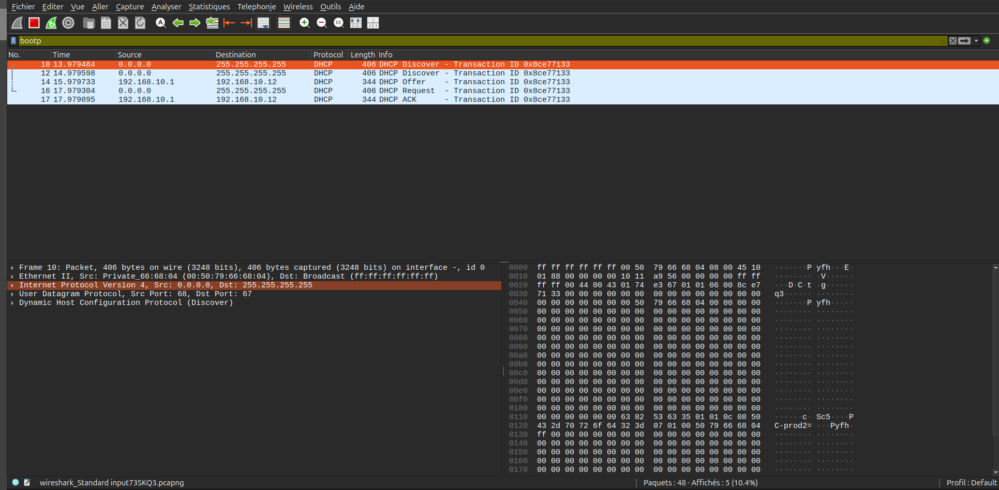
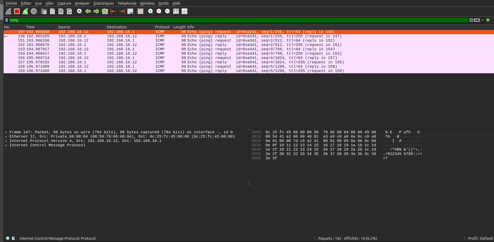
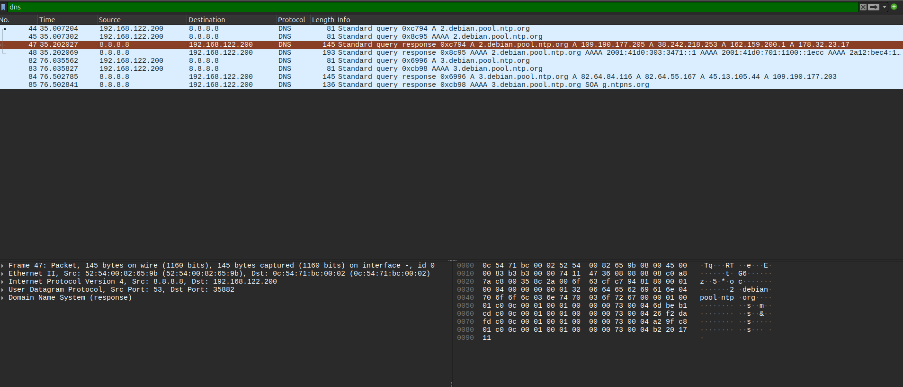

# TP · Wireshark sur GNS3 et réseau physique

## Objectif

Maîtriser Wireshark sur deux environnements :

- un réseau **simulé** dans GNS3 ;
- un réseau **physique** réel.

Le but est aussi de comprendre les différences entre une capture propre et contrôlée en laboratoire, et une capture réelle souvent plus bruitée.

## Fichiers disponibles dans l'espace de partage

| Fichier | Rôle |
| --- | --- |
| [`res01a_capture1.pcapng`](../../assets/img/admin-reseau/it-5/res01a_capture1.pcapng) | Trafic basique, déjà vu en séquence 1.2 |
| [`res01a_capture2_AlpesNet.pcapng`](../../assets/img/admin-reseau/it-5/res01a_capture2_AlpesNet.pcapng) | Trafic AlpesNet avancé : OSPF, DHCP, ICMP inter-sites |
| [`laptop.pcapng`](../../assets/img/admin-reseau/it-5/laptop.pcapng) | Capture physique de salle depuis un poste Ubuntu branché au switch |

Capture OSPF isolée :

- [`res01a_capture2_only_ospf.pcapng`](../../assets/img/admin-reseau/it-5/res01a_capture2_only_ospf.pcapng)

## Lecture rapide des captures

Les fichiers peuvent être inspectés avec Wireshark, ou en ligne de commande avec `capinfos` et `tcpdump`.

```bash
capinfos docs/assets/img/admin-reseau/it-5/laptop.pcapng
tcpdump -nn -r docs/assets/img/admin-reseau/it-5/laptop.pcapng arp
tcpdump -nn -r docs/assets/img/admin-reseau/it-5/laptop.pcapng udp port 5353
tcpdump -nn -r docs/assets/img/admin-reseau/it-5/laptop.pcapng port 67 or port 68
```

Synthèse observée :

| Capture | Volume | Durée | Observations principales |
| --- | ---: | ---: | --- |
| `res01a_capture2_AlpesNet.pcapng` | 874 paquets | 20 min 09 s | Capture GNS3 maîtrisée : DHCP, ARP, ICMP, STP/CDP/DTP Cisco |
| `res01a_capture2_only_ospf.pcapng` | 138 paquets | 2 min 00 s | Capture OSPF dédiée : Hello vers `224.0.0.5`, lien `10.0.11.1/10.0.11.2` |
| `laptop.pcapng` | 24 623 paquets | 9 min 37 s | Capture physique sur `wlp14s0` : DHCP, ARP, mDNS, IPv6, HTTPS, IEEE1905.1 |

## Partie A — Analyse avancée sur GNS3

Topologie utilisée : **AlpesNet complète**, avec une sonde placée sur le lien **R1 ↔ R2**.

Pour chaque protocole :

1. générer le trafic demandé ;
2. appliquer le filtre Wireshark ;
3. identifier les champs importants ;
4. noter ce que la capture prouve.

| Protocole | Filtre Wireshark | Comment générer le trafic | Points à identifier |
| --- | --- | --- | --- |
| OSPF Hello | `ospf` | Attendre 30 secondes, trafic automatique | Type 1, router-id, destination `224.0.0.5`, hello/dead timers |
| DHCP DORA | `bootp` | Faire une demande `ip dhcp` sur un VPCS | 4 messages DORA, options 53, 1, 3, 6, 51 |
| ICMP inter-sites | `icmp` | Ping depuis le site 1 vers le site 4 | TTL décrémenté à chaque saut |
| DNS | `dns` | `nslookup serveur1.alpesnet.local` | Query + Response, type A, TTL DNS |

## Analyse OSPF

Filtre utilisé :

```text
ospf
```

À observer :

- les paquets **OSPF Hello** ;
- le champ **router-id** ;
- l'adresse de destination multicast `224.0.0.5` ;
- les timers **hello** et **dead** ;
- les changements de voisinage lors d'une coupure de lien.


Dans `res01a_capture2_only_ospf.pcapng`, on observe notamment :

```text
IP 10.0.11.2 > 224.0.0.5: OSPFv2, Hello
IP 10.0.11.1 > 224.0.0.5: OSPFv2, Hello
IP 10.0.11.1 > 10.0.11.2: OSPFv2, Hello
```

## Analyse DHCP DORA

Filtre utilisé :

```text
bootp
```

La séquence attendue est :

1. **Discover** : le client cherche un serveur DHCP.
2. **Offer** : le serveur propose une adresse IP.
3. **Request** : le client demande officiellement l'adresse proposée.
4. **Ack** : le serveur confirme le bail.

Options importantes à identifier :

| Option | Signification |
| --- | --- |
| 53 | Type de message DHCP |
| 1 | Masque de sous-réseau |
| 3 | Passerelle par défaut |
| 6 | Serveur DNS |
| 51 | Durée du bail |



Dans `res01a_capture2_AlpesNet.pcapng`, le client VPCS utilise une MAC typique de laboratoire :

```text
0.0.0.0.68 > 255.255.255.255.67: BOOTP/DHCP, Request from 00:50:79:66:68:04
192.168.10.1.67 > 192.168.10.12.68: BOOTP/DHCP, Reply
```

## Analyse ICMP inter-sites

Filtre utilisé :

```text
icmp
```

À observer :

- les paquets **Echo request** et **Echo reply** ;
- l'adresse IP source et destination ;
- le TTL ;
- la diminution du TTL à chaque saut de routage.



Exemples issus de la capture basique :


Dans `res01a_capture2_AlpesNet.pcapng`, on retrouve des échanges ICMP entre `192.168.10.12` et `192.168.10.1` :

```text
192.168.10.12 > 192.168.10.1: ICMP echo request
192.168.10.1 > 192.168.10.12: ICMP echo reply
```

## Analyse DNS

Filtre utilisé :

```text
dns
```

Commande de génération :

```bash
nslookup serveur1.alpesnet.local
```

À observer :

- la requête DNS ;
- la réponse DNS ;
- le type d'enregistrement, par exemple **A** ;
- le TTL DNS ;
- le serveur DNS interrogé.



Exemple issu de la capture basique :


## Reconvergence OSPF visible

Procédure :

- Ouvrir la capture Wireshark sur le lien **R1 ↔ R2**.
- Sur R2, couper l'interface vers un autre routeur

```text
R2(config)# interface GigabitEthernet0/2
R2(config-if)# shutdown
```

- Observer dans Wireshark les paquets OSPF de type **4 LSUpdate** qui propagent le changement de topologie.
- Réactiver l'interface :

```text
R2(config-if)# no shutdown
```

- Observer la reconvergence :

- nouveaux paquets **Hello** ;
- échange de LSDB ;
- LSUpdate ;
- retour de l'adjacence OSPF.

## Partie B — Capture réseau physique de salle

Fichier de référence :

- [`laptop.pcapng`](../../assets/img/admin-reseau/it-5/laptop.pcapng)

Sur un poste Ubuntu branché sur le switch de salle :

```bash
# Identifier l'interface réseau
ip link show

# Lancer Wireshark
sudo wireshark
```

Dans Wireshark :

1. choisir l'interface Ethernet dans la liste ;
2. lancer une capture courte ;
3. observer le trafic sans rien générer volontairement.

Filtres utiles :

```text
arp
mdns
bootp
eth.dst == ff:ff:ff:ff:ff:ff
ip.dst == 224.0.0.251
```

Questions d'observation :

- Des broadcasts ARP passent-ils même sans action de l'utilisateur ?
- Des paquets mDNS vers `224.0.0.251` sont-ils visibles ?
- Des DHCP Discover apparaissent-ils ?
- Voit-on des protocoles non attendus par rapport à une capture GNS3 ?

Observations dans `laptop.pcapng` :

```text
ARP, Request who-has 192.168.2.3 tell 192.168.2.3
ARP, Reply 192.168.2.18 is-at 24:b2:b9:d1:e5:c7
192.168.2.24.5353 > 224.0.0.251.5353: mDNS
fe80::...5353 > ff02::fb.5353: mDNS IPv6
0.0.0.0.68 > 255.255.255.255.67: BOOTP/DHCP Request
```

La capture physique montre aussi du trafic HTTPS réel vers Internet, par exemple vers des adresses publiques sur le port `443`. Ce bruit de fond n'existe pas dans une capture GNS3 contrôlée, sauf si on le génère volontairement.
