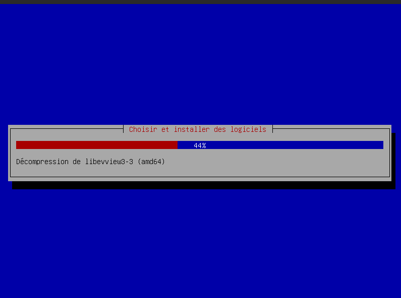
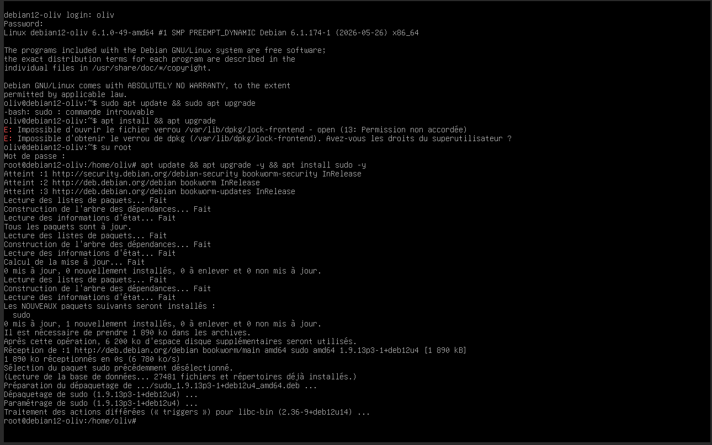
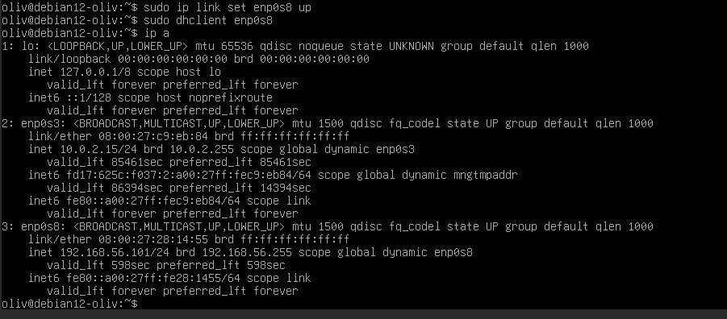
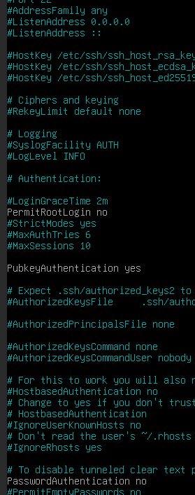
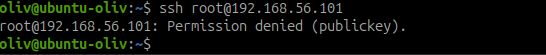
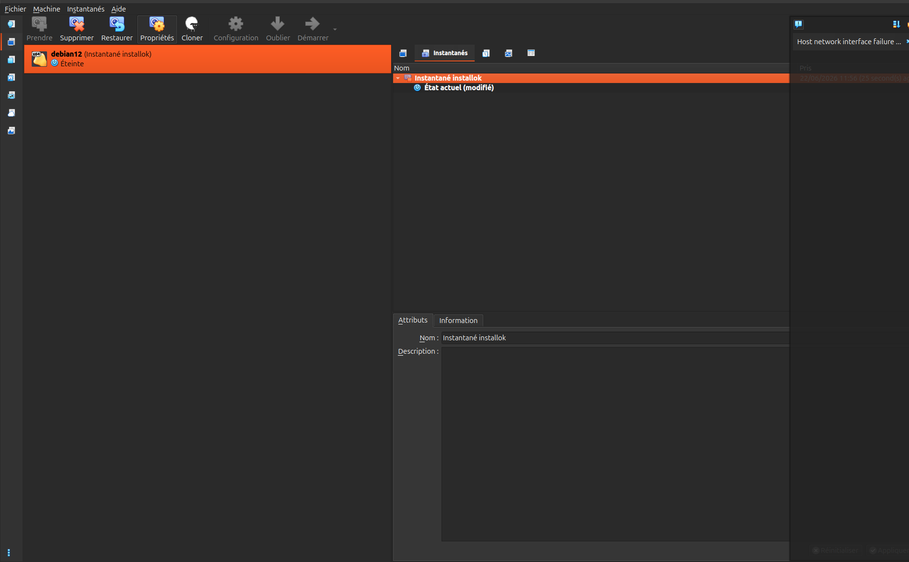
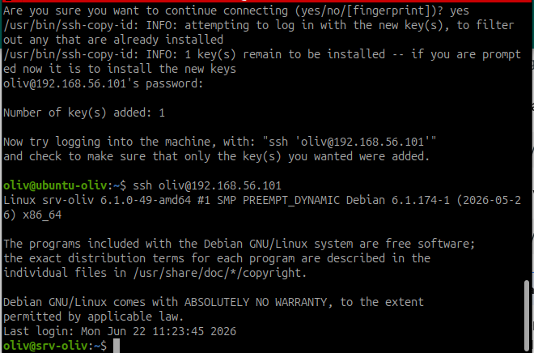

# Atelier 1 - KI - Installer et configurer l'environnement de travail

## Objectif de l'atelier

Ce kit d'installation se réalise une seule fois, en J1 matin. Il sert à préparer l'environnement de travail pour tout le module **Administration des systèmes — Linux**.

L'objectif est de disposer d'une VM Debian 12 fonctionnelle dans VirtualBox, installée sur un poste Ubuntu 24.04, avec un accès SSH par clé, un premier niveau de durcissement et un snapshot de référence.

Tout tourne localement : aucun serveur campus ni réseau particulier n'est nécessaire.

## Vue d'ensemble

| Élément | Configuration attendue |
| --- | --- |
| Hôte | Ubuntu 24.04 |
| Hyperviseur | VirtualBox |
| VM | Debian 12 |
| Nom de la VM | `debian12-[prenom]` |
| Nom d'hôte Debian | `srv-[prenom]` |
| Domaine | `alpesnet.local` |
| RAM VM | 2048 Mo |
| CPU VM | 2 vCPU |
| Disque | VDI 20 Go |
| Réseau 1 | NAT pour Internet |
| Réseau 2 | Host-Only pour SSH |
| Snapshot | `post-install` |
| Alias SSH | `srv-sys01a` |

## Étape 1 - Vérifier les prérequis du poste Ubuntu

Avant d'installer quoi que ce soit, il faut vérifier que le poste peut héberger correctement la VM.

### Vérifier la mémoire disponible

```bash
free -h
```

Point de contrôle : viser **8 Go de RAM disponibles ou plus**. La logique est simple : environ 4 Go pour l'hôte, 2 Go pour la VM et une marge de confort.

### Vérifier l'espace disque

```bash
df -h ~
```

Point de contrôle : prévoir **25 Go libres minimum** pour l'ISO, le disque virtuel, les snapshots et les fichiers de travail.

### Vérifier la virtualisation matérielle

```bash
grep -E "vmx|svm" /proc/cpuinfo | wc -l
```

Point de contrôle : le résultat doit être supérieur à `0`.

Si le résultat vaut `0`, la virtualisation matérielle est désactivée. Il faut redémarrer le poste, entrer dans le BIOS/UEFI, puis activer **Intel VT-x** ou **AMD-V** selon le processeur.

## Étape 2 - Installer VirtualBox

VirtualBox permet de créer et d'exécuter la VM Debian 12.

Actions à réaliser :

1. Ajouter le dépôt Oracle VirtualBox pour Ubuntu.
2. Installer `virtualbox-7.0`.
3. Ajouter son utilisateur au groupe `vboxusers`.
4. Redémarrer la session si nécessaire.
5. Vérifier que VirtualBox est bien installé.

Commande de vérification :

```bash
vboxmanage --version
```

Point de contrôle : la commande doit retourner une version de VirtualBox, par exemple `7.0.x`.

## Étape 3 - Télécharger et vérifier l'ISO Debian 12

Télécharger l'ISO **Debian 12 netinstall** depuis le site officiel Debian.

Après téléchargement, vérifier son empreinte SHA-256 :

```bash
sha256sum debian-12.*-amd64-netinst.iso
```

Point de contrôle : le hash obtenu doit correspondre au hash officiel fourni par Debian.

Cette vérification permet de confirmer que l'image ISO n'a pas été corrompue ou modifiée.

## Étape 4 - Créer la VM Debian 12

Dans VirtualBox, créer une nouvelle machine virtuelle avec les paramètres suivants :

| Paramètre | Valeur |
| --- | --- |
| Nom | `debian12-[prenom]` |
| Type | Linux |
| Version | Debian 64-bit |
| Mémoire | 2048 Mo |
| Processeurs | 2 |
| Disque | VDI, 20 Go |

Configurer ensuite le réseau :

| Adaptateur | Mode | Rôle |
| --- | --- | --- |
| Adaptateur 1 | NAT | Accès Internet pour installer les paquets |
| Adaptateur 2 | Host-Only | Accès SSH depuis le poste Ubuntu |

### Créer le réseau Host-Only si nécessaire

Si VirtualBox affiche un message du type **aucune interface privée hôte n'est spécifiée**, cela signifie qu'aucun réseau Host-Only n'a encore été créé.

Dans VirtualBox :

1. Ouvrir **File** → **Tools** → **Network Manager**.
2. Aller dans l'onglet **Host-only Networks**.
3. Cliquer sur **Create**.
4. Garder ou noter le nom de l'interface créée, par exemple `vboxnet0`.
5. Revenir dans les paramètres de la VM.
6. Dans **Network** → **Adapter 2**, choisir :
   - **Enable Network Adapter** ;
   - **Attached to** : `Host-only Adapter` ;
   - **Name** : `vboxnet0`.

En ligne de commande, la vérification peut se faire avec :

```bash
vboxmanage list hostonlyifs
```

Point de contrôle : au moins une interface Host-Only, souvent `vboxnet0`, doit apparaître.

Point de contrôle : la VM doit démarrer sur l'ISO Debian 12 en mode **Graphical Install**.

## Étape 5 - Installer Debian 12

Pendant l'installation, utiliser les informations suivantes :

| Élément | Valeur |
| --- | --- |
| Hostname | `srv-[prenom]` |
| Domaine | `alpesnet.local` |
| Partitionnement | Manuel |
| Logiciels | SSH server uniquement |

### Partitionnement manuel

Créer les partitions suivantes :

| Point de montage | Taille | Rôle |
| --- | --- | --- |
| `/boot` | 500 Mo | Fichiers de démarrage |
| `swap` | 1 Go | Mémoire d'échange |
| `/` | Reste du disque, environ 19 Go | Système principal |



Point de contrôle : à la fin de l'installation, Debian doit démarrer sans l'ISO et proposer une connexion locale.

## Étape 6 - Préparer Debian au premier lancement

Au premier démarrage, se connecter directement dans la console VirtualBox avec le compte créé pendant l'installation. Cette étape sert à rendre Debian administrable proprement avant de travailler en SSH.

### Passer temporairement en root

Si `sudo` n'est pas encore disponible, passer en root :

```bash
su -
```

!!! warning "Bien utiliser `su -`"
    Le tiret est important. `su -` charge l'environnement complet de root, dont le chemin `/usr/sbin` où se trouvent des commandes d'administration comme `usermod`.

### Mettre à jour la liste des paquets

```bash
apt update
apt upgrade -y
```

Point de contrôle : le système doit être à jour avant l'installation des outils.

### Installer les paquets indispensables de base

Installer les premiers outils nécessaires à l'administration :

```bash
apt install -y sudo openssh-server vim curl wget git ca-certificates gnupg lsb-release
```

Rôle des paquets :

| Paquet | Rôle |
| --- | --- |
| `sudo` | Permettre l'administration sans utiliser directement le compte root |
| `openssh-server` | Activer l'accès SSH à la VM |
| `vim` | Éditer les fichiers de configuration |
| `curl`, `wget` | Télécharger ou tester des ressources HTTP |
| `git` | Récupérer et versionner des fichiers |
| `ca-certificates` | Vérifier les certificats TLS/HTTPS |
| `gnupg` | Gérer les clés de dépôts ou signatures |
| `lsb-release` | Identifier proprement la version Debian |



### Ajouter l'utilisateur au groupe sudo

Remplacer `utilisateur` par le compte créé pendant l'installation :

```bash
/usr/sbin/usermod -aG sudo utilisateur
```

Vérifier l'appartenance aux groupes :

```bash
groups utilisateur
```

Point de contrôle : le groupe `sudo` doit apparaître dans la liste.

Exemple avec l'utilisateur `oliv` :

```bash
/usr/sbin/usermod -aG sudo oliv
groups oliv
```

!!! note "Important"
    Après l'ajout au groupe `sudo`, il faut ouvrir une nouvelle session pour que le changement soit pris en compte.

### Vérifier le service SSH

Activer et démarrer SSH :

```bash
systemctl enable --now ssh
systemctl status ssh
```

Point de contrôle : le service doit être `active (running)`.

### Vérifier le nom de la machine

```bash
hostnamectl
```

Si le hostname n'est pas correct :

```bash
hostnamectl set-hostname srv-[prenom]
```

Point de contrôle : le hostname doit être `srv-[prenom]`.

### Corriger `/etc/hosts` après changement de hostname

Après un changement de hostname, `sudo` peut afficher une erreur du type :

```text
sudo: impossible de résoudre l'hôte srv-[prenom]: Échec temporaire dans la résolution du nom
```

Cela signifie que le nom de la machine n'est pas déclaré dans `/etc/hosts`.

Éditer le fichier :

```bash
sudo vim /etc/hosts
```

Vérifier ou ajouter une ligne de ce type :

```text
127.0.1.1   srv-[prenom]
```

Exemple avec `srv-oliv` :

```text
127.0.1.1   srv-oliv
```

Point de contrôle :

```bash
hostname
getent hosts srv-[prenom]
sudo whoami
```

`getent hosts` doit retourner une ligne pour le hostname, et `sudo whoami` doit retourner `root` sans message d'erreur.

### Vérifier la date et le fuseau horaire

```bash
timedatectl
```

Si nécessaire, régler le fuseau horaire :

```bash
timedatectl set-timezone Europe/Paris
```

Point de contrôle : la date et l'heure doivent être cohérentes. C'est important pour les logs, les certificats, les sauvegardes et les analyses d'incident.

### Redémarrer proprement

```bash
reboot
```

Après redémarrage, se reconnecter avec l'utilisateur normal et vérifier `sudo` :

```bash
sudo whoami
```

Point de contrôle : la commande doit retourner `root`.

## Étape 7 - Repérer l'adresse IP host-only

Une fois Debian démarrée, repérer l'adresse IP de l'interface host-only.

Sur Debian :

```bash
ip a
```

Point de contrôle : noter l'adresse IP utilisée pour la connexion SSH depuis Ubuntu. Elle devra apparaître dans la fiche de configuration.

!!! warning "Ne pas utiliser l'adresse NAT pour SSH depuis Ubuntu"
    L'adresse `10.0.2.15` correspond souvent à l'adaptateur NAT VirtualBox. Elle sert à donner Internet à la VM, mais ce n'est généralement pas l'adresse à utiliser depuis le poste Ubuntu pour se connecter en SSH. Pour SSH depuis l'hôte, utiliser l'adresse de l'adaptateur Host-Only, souvent en `192.168.56.x`.

### Si l'interface Host-Only est DOWN

Dans `ip a`, l'adaptateur Host-Only peut apparaître sans adresse IP, par exemple :

```text
3: enp0s8: <BROADCAST,MULTICAST> ... state DOWN
```

Cela signifie que VirtualBox a bien présenté la carte réseau à Debian, mais que Debian ne l'a pas activée.

Activation immédiate pour tester :

```bash
sudo ip link set enp0s8 up
sudo dhclient enp0s8
ip a
```

Point de contrôle : `enp0s8` doit obtenir une adresse, souvent en `192.168.56.x`.



Pour rendre l'activation persistante, éditer le fichier réseau :

```bash
sudo vim /etc/network/interfaces
```

Ajouter à la fin :

```text
allow-hotplug enp0s8
iface enp0s8 inet dhcp
```

Puis redémarrer le service réseau ou la VM :

```bash
sudo systemctl restart networking
ip a
```

Si aucune adresse n'est obtenue, vérifier dans VirtualBox que le réseau Host-Only a bien un serveur DHCP activé. Sinon, configurer une IP statique sur `enp0s8`, par exemple :

```text
allow-hotplug enp0s8
iface enp0s8 inet static
    address 192.168.56.10
    netmask 255.255.255.0
```

## Étape 8 - Configurer l'accès SSH par clé

Sur le poste Ubuntu, générer une clé SSH Ed25519 si elle n'existe pas déjà :

```bash
ssh-keygen -t ed25519
```

Déployer la clé publique vers la VM :

```bash
ssh-copy-id utilisateur@IP_HOST_ONLY
```

Exemple avec l'utilisateur `oliv` :

```bash
ssh-copy-id oliv@192.168.56.x
```

!!! note "Utilisateur cible"
    Copier la clé sur le compte utilisateur normal, par exemple `oliv`, puis utiliser `sudo` une fois connecté. Ne pas copier la clé sur `root` : l'accès SSH root sera désactivé dans l'étape de durcissement.

Tester la connexion :

```bash
ssh utilisateur@IP_HOST_ONLY
```

Point de contrôle : la connexion SSH doit fonctionner sans saisir le mot de passe du compte Debian.

### Copier-coller dans la VM

Sur une Debian serveur sans interface graphique, le copier-coller VirtualBox n'est pas fiable dans la console TTY. La bonne méthode est de se connecter en SSH depuis le poste Ubuntu, puis de copier-coller directement dans le terminal Ubuntu.

Depuis Ubuntu :

```bash
ssh oliv@IP_HOST_ONLY
```

Une fois connecté en SSH, les commandes saisies s'exécutent sur Debian, mais le copier-coller est celui du terminal Ubuntu.

Si une interface graphique Debian est installée, le copier-coller VirtualBox nécessite les **Guest Additions** :

1. Dans VirtualBox : **Devices** → **Insert Guest Additions CD image**.
2. Dans Debian, vérifier le CD :

```bash
lsblk
```

3. Monter le CD si nécessaire :

```bash
sudo mkdir -p /mnt/cdrom
sudo mount /dev/cdrom /mnt/cdrom
```

Si `/dev/cdrom` n'existe pas, essayer :

```bash
sudo mount /dev/sr0 /mnt/cdrom
```

4. Lancer l'installation :

```bash
sudo sh /mnt/cdrom/VBoxLinuxAdditions.run
```

5. Redémarrer :

```bash
sudo reboot
```

Dans VirtualBox, activer ensuite :

- **Devices** → **Shared Clipboard** → **Bidirectional** ;
- **Devices** → **Drag and Drop** → **Bidirectional** si besoin.

!!! note "À retenir"
    Pour ce module, la VM Debian est surtout administrée en SSH. Même si les Guest Additions sont installées, le confort de travail principal vient de `ssh oliv@IP_HOST_ONLY`, pas de la console VirtualBox.

## Étape 9 - Créer l'alias SSH `srv-sys01a`

Sur le poste Ubuntu, éditer le fichier `~/.ssh/config` :

```ssh-config
Host srv-sys01a
    HostName IP_HOST_ONLY
    User utilisateur
    IdentityFile ~/.ssh/id_ed25519
```

Tester l'alias :

```bash
ssh srv-sys01a
```

Point de contrôle : l'alias doit ouvrir une session SSH sur la VM Debian.

## Étape 10 - Durcir SSH

Sur Debian, éditer la configuration SSH :

```bash
sudo vim /etc/ssh/sshd_config
```

Paramètres attendus :

```ssh-config
PermitRootLogin no
PasswordAuthentication no
PubkeyAuthentication yes
```



Tester la configuration avant de redémarrer :

```bash
sudo sshd -t
```

Si la commande ne retourne rien, la configuration est valide.

Si elle affiche une erreur, lire la ligne indiquée, corriger `/etc/ssh/sshd_config`, puis relancer :

```bash
sudo sshd -t
```

En cas de doute, afficher les erreurs du service :

```bash
sudo systemctl status ssh --no-pager -l
sudo journalctl -u ssh -n 50 --no-pager
```

Redémarrer ensuite le service SSH :

```bash
sudo systemctl restart ssh
```

Vérifier l'état du service :

```bash
sudo systemctl status ssh
```

!!! warning "Point de vigilance"
    Garder la session SSH actuelle ouverte pendant les tests. Ouvrir un nouveau terminal pour vérifier que la connexion par clé fonctionne encore et que l'accès root est refusé.

Tests attendus depuis Ubuntu :

```bash
ssh srv-sys01a
ssh root@IP_HOST_ONLY
```

Point de contrôle : l'utilisateur normal doit pouvoir se connecter par clé, mais `root` doit être refusé.



## Étape 11 - Créer le snapshot `post-install`

Dans VirtualBox :

1. Sélectionner la VM `debian12-[prenom]`.
2. Ouvrir l'onglet **Snapshots**.
3. Cliquer sur **Take Snapshot**.
4. Nommer le snapshot `post-install`.
5. Ajouter la description : `Debian 12 fraîche, avant SSH et outils`.

Vérifier le snapshot en ligne de commande :

```bash
vboxmanage snapshot "debian12-[prenom]" list
```

Point de contrôle : le snapshot `post-install` doit apparaître dans la liste.



## Étape 12 - Installer les outils du module

Sur Debian, installer les outils qui seront utilisés pendant le module :

```bash
sudo apt update
sudo apt install -y vim curl wget git tree htop lsof net-tools acl rsyslog logrotate ufw fail2ban nfs-kernel-server samba rsync nginx
```

Rôle des principaux outils :

| Outil | Utilisation dans le module |
| --- | --- |
| `vim` | Édition de fichiers de configuration |
| `curl`, `wget` | Téléchargements et tests HTTP |
| `git` | Versionnement et récupération de ressources |
| `tree` | Visualisation d'arborescences |
| `htop`, `lsof` | Diagnostic processus et fichiers ouverts |
| `net-tools` | Commandes réseau classiques |
| `acl` | Gestion des ACL avec `setfacl` et `getfacl` |
| `rsyslog`, `logrotate` | Logs système et rotation |
| `ufw`, `fail2ban` | Sécurisation locale |
| `nfs-kernel-server`, `samba` | Services de fichiers |
| `rsync` | Synchronisation et sauvegarde |
| `nginx` | Serveur web |

Point de contrôle : les paquets doivent s'installer sans erreur.



## Étape 13 - Produire la fiche de configuration

La fiche de configuration documente l'installation. Elle doit respecter le standard d'en-tête utilisé pendant le module.

Informations minimales à inclure :

- nom de la VM : `debian12-[prenom]` ;
- nom d'hôte : `srv-[prenom]` ;
- domaine : `alpesnet.local` ;
- adresse IP host-only ;
- partitionnement : `/boot`, `swap`, `/` ;
- version de Debian ;
- version de VirtualBox ;
- état SSH : clé active, root désactivé, mot de passe désactivé ;
- nom du snapshot : `post-install` ;
- liste des outils installés.

Commandes utiles pour récupérer les informations :

```bash
hostnamectl
ip a
lsblk
df -h
ssh -V
vboxmanage --version
```

## Livrables attendus

- VM `debian12-[prenom]` dans VirtualBox.
- Partitionnement manuel conforme : `/boot`, `swap`, `/`.
- SSH actif et accessible par clé depuis Ubuntu.
- Alias SSH `srv-sys01a` fonctionnel.
- Connexion SSH root refusée.
- Authentification SSH par mot de passe désactivée.
- Snapshot `post-install` créé.
- Outils du module installés.
- Fiche de configuration complète avec en-tête standard.

## Convention de nommage

Le fichier de fiche de configuration doit respecter le format suivant :

```text
[Nom]-[Prénom]-[Site]-KitInstall-FicheConfig
```

Exemple :

```text
Dupont-Alice-AlpesNet-KitInstall-FicheConfig
```

## Ressources

- VirtualBox Documentation officielle : <https://www.virtualbox.org/manual/ch01.html>
- VirtualBox Téléchargements Ubuntu : <https://www.virtualbox.org/wiki/Linux_Downloads>
- Debian 12 Guide d'installation officiel : <https://www.debian.org/releases/stable/amd64/install.fr.pdf>
- VirtualBox Virtual Networking : <https://www.virtualbox.org/manual/ch06.html>
- OpenSSH Manual : <https://www.openssh.com/manual.html>
- ANSSI - Recommandations pour la configuration d'un service OpenSSH : <https://www.ssi.gouv.fr/guide/recommandations-pour-la-configuration-dun-service-openssh/>

## Synthèse à retenir

Cet atelier met en place la base de travail du module Linux. La VM Debian 12 sert de serveur d'entraînement pour toute la suite : utilisateurs, permissions, logs, scripts, services, durcissement, sauvegarde et incident.

Les points les plus importants sont le partitionnement manuel, l'accès SSH par clé, la désactivation de l'accès root, la désactivation des mots de passe SSH et la création du snapshot `post-install`. Ce snapshot est le point de retour propre en cas d'erreur pendant les prochains ateliers.
