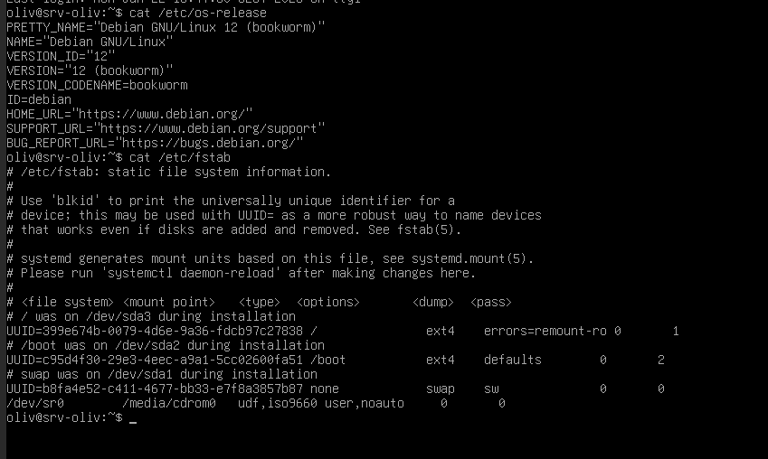

# Atelier 2 - FHS - Comprendre l'arborescence Linux

## Déclencheur - L'incident qui coûte 1,5 M€

En 2023, un hébergeur français subit une exfiltration de **200 000 dossiers clients**. Le rapport CERT-FR anonymisé identifie plusieurs causes évitables :

- un compte de service avec `UID 0` laissé actif après le départ d'un prestataire ;
- un accès SSH root activé, sans authentification par clés, sur le port `22` public ;
- Bob, développeur parti 6 mois plus tôt, avait encore `sudo NOPASSWD ALL` dans `/etc/sudoers`.

Résultat : **1,5 M€ d'amende CNIL**.

Ce kit apprend à éviter ces trois erreurs dans l'ordre : comprendre l'arborescence, localiser les fichiers critiques, puis vérifier les comptes, les accès SSH et les droits sudo.

## Objectif

Naviguer dans la hiérarchie FHS (**Filesystem Hierarchy Standard**) et localiser les fichiers de configuration critiques sans tâtonner.

Sur Linux, tout part d'une racine unique : `/`. Il n'y a pas de lecteur `C:` ou `D:`. Savoir où se trouve quoi permet :

- de retrouver rapidement un fichier de configuration ;
- d'identifier les logs utiles pendant un incident ;
- de repérer un fichier placé au mauvais endroit ;
- de mieux comprendre les services installés sur le système.

## Pourquoi connaître le FHS ?

Le FHS donne une organisation commune aux systèmes Linux. Même si chaque distribution a ses particularités, les grands emplacements restent stables.

Exemple : quand on cherche la configuration SSH, on pense immédiatement à `/etc/ssh/sshd_config`. Quand on enquête sur une tentative de connexion, on va vers `/var/log/auth.log`. Quand on cherche le dossier d'un utilisateur, on va dans `/home`.

Connaître cette logique évite de perdre du temps et aide à repérer les mauvaises pratiques.

## Les répertoires à connaître

| Répertoire | Rôle dans le module |
| --- | --- |
| `/etc` | Configuration du système et des services : `sshd_config`, `rsyslog.conf`, `sudoers`, `exports`... |
| `/var/log` | Journaux système et applicatifs : `auth.log`, `syslog`, logs Nginx... |
| `/home` | Répertoires personnels des utilisateurs : `/home/alice.martin`, `/home/bob.dupont`... |
| `/root` | Répertoire personnel de `root` uniquement. À ne pas utiliser pour le travail quotidien. |
| `/usr/bin` | Binaires des programmes installés, par exemple `nginx`, `rsync`, `vim`. |
| `/sbin` | Binaires d'administration, par exemple `useradd`, `fdisk`, `ip`. |
| `/tmp` | Fichiers temporaires. Ne jamais y stocker de données persistantes. |
| `/proc` | Système de fichiers virtuel : processus, noyau, état temps réel du système. |
| `/sys` | Système de fichiers virtuel : matériel, périphériques, noyau. |

## Étape 1 - Explorer `/etc`

Lister les premiers fichiers de configuration :

```bash
ls -la /etc | head -20
```

Afficher l'arborescence de premier niveau :

```bash
tree /etc -L 1
```

Point de contrôle : repérer au moins trois fichiers ou dossiers inconnus dans `/etc`.


## Étape 2 - Identifier la version du système

Afficher les informations de distribution :

```bash
cat /etc/os-release
```

Point de contrôle : confirmer que la VM est bien en **Debian GNU/Linux 12 (bookworm)**.

## Étape 3 - Lire le fichier de montage

Afficher les partitions et points de montage déclarés :

```bash
cat /etc/fstab
```

Point de contrôle : retrouver les partitions créées à l'installation, notamment `/`, `/boot` et `swap`.



## Étape 4 - Rechercher les fichiers `.conf`

Lister quelques fichiers de configuration :

```bash
find /etc -name "*.conf" | head -10
```

Compter les fichiers `.conf` :

```bash
find /etc -name "*.conf" | wc -l
```

Point de contrôle : noter le nombre obtenu dans le carnet de bord.

## Étape 5 - Repérer les binaires utiles

Localiser les programmes qui seront utilisés dans le module :

```bash
which useradd nginx rsync
```

Si une commande ne retourne rien, le paquet associé n'est peut-être pas encore installé.

Point de contrôle : noter le chemin de chaque binaire trouvé.

## Étape 6 - Observer les logs récents

Lister les fichiers de logs les plus récents :

```bash
ls -lt /var/log | head
```

Point de contrôle : relever les trois logs les plus récents.


Exemples de logs importants :

| Fichier | Utilité |
| --- | --- |
| `/var/log/auth.log` | Connexions SSH, sudo, authentification |
| `/var/log/syslog` | Messages système généraux |
| `/var/log/nginx/` | Journaux du serveur web Nginx |

## Exercice - Explorer l'arborescence de la VM

Créer un carnet de bord avec l'en-tête standard du module, puis renseigner :

- trois fichiers ou répertoires inconnus trouvés dans `/etc` ;
- une hypothèse de rôle pour chacun ;
- le nombre de fichiers `.conf` dans `/etc` ;
- les chemins des binaires `useradd`, `nginx` et `rsync` ;
- les trois logs les plus récents dans `/var/log`.

Commandes de départ :

```bash
ls -la /etc | head -20
tree /etc -L 1
cat /etc/os-release
cat /etc/fstab
find /etc -name "*.conf" | head -10
find /etc -name "*.conf" | wc -l
which useradd nginx rsync
ls -lt /var/log | head
```

## Ressources

- FHS 3.0 - Spécification officielle : <https://refspecs.linuxfoundation.org/FHS_3.0/fhs/index.html>
- Debian Handbook - Organisation du système de fichiers : <https://www.debian.org/doc/manuals/debian-handbook/unix-services.fr.html>
- `man hier` - description des répertoires Linux
- `man find` - recherche de fichiers dans l'arborescence

## Synthèse à retenir

Le FHS est la carte mentale d'un système Linux. `/etc` contient la configuration, `/var/log` contient les traces, `/home` contient les utilisateurs, `/root` est réservé à l'administrateur, et `/usr/bin` ou `/sbin` contiennent les commandes.

Pour administrer et sécuriser une machine, il faut savoir où chercher avant même de savoir quoi modifier. C'est cette habitude qui permet ensuite d'auditer les comptes, SSH et sudo sans passer à côté d'un fichier critique.
