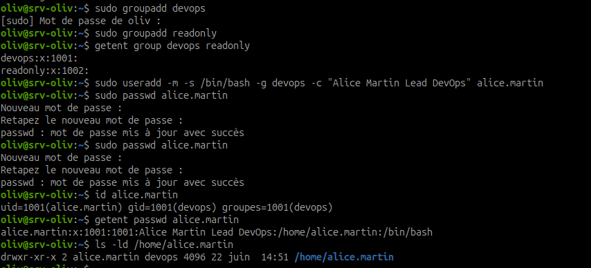
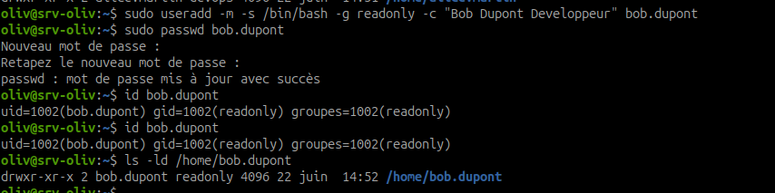
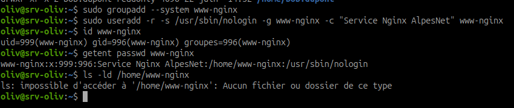
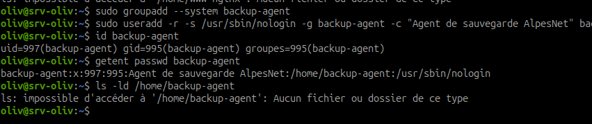

# Atelier 4 - Comptes AlpesNet - Créer et administrer les identités

## Objectif

Créer tous les comptes de l'infrastructure AlpesNet avec les bonnes options, configurer `sudo` avec une restriction explicite, puis vérifier chaque résultat avant de passer à l'étape suivante.

Les comptes créés ici seront réutilisés dans les kits 2 à 6. Il faut donc les créer proprement dès maintenant.

!!! warning "Règle non négociable"
    Ne jamais travailler en root permanent. Chaque action d'administration doit être exécutée avec `sudo`, commande par commande.

## Infrastructure AlpesNet à créer

| Compte | Type | Groupe principal | Rôle dans AlpesNet |
| --- | --- | --- | --- |
| `alice.martin` | Utilisateur humain | `devops` | Lead DevOps - droits sudo restreints |
| `bob.dupont` | Utilisateur humain | `readonly` | Développeur - accès lecture uniquement |
| `www-nginx` | Compte service | `www-nginx` | Processus Nginx - shell `nologin`, pas de home |
| `backup-agent` | Compte service | `backup-agent` | Agent de sauvegarde - shell `nologin`, pas de home |

## Étape 1 - Créer les groupes humains

Créer les groupes principaux des utilisateurs humains :

```bash
sudo groupadd devops
sudo groupadd readonly
```

Vérifier :

```bash
getent group devops readonly
```

Point de contrôle : les groupes `devops` et `readonly` doivent apparaître.

## Étape 2 - Créer le compte `alice.martin`

Créer le compte humain avec un home, un shell Bash et un commentaire :

```bash
sudo useradd -m -s /bin/bash -g devops -c "Alice Martin Lead DevOps" alice.martin
```

Définir un mot de passe temporaire :

```bash
sudo passwd alice.martin
```

Vérifier :

```bash
id alice.martin
getent passwd alice.martin
ls -ld /home/alice.martin
```

Point de contrôle :

- le groupe principal doit être `devops` ;
- le home `/home/alice.martin` doit exister ;
- le shell doit être `/bin/bash`.



## Étape 3 - Créer le compte `bob.dupont`

Créer le compte humain avec un home et un shell Bash :

```bash
sudo useradd -m -s /bin/bash -g readonly -c "Bob Dupont Developpeur" bob.dupont
```

Définir un mot de passe temporaire :

```bash
sudo passwd bob.dupont
```

Vérifier :

```bash
id bob.dupont
getent passwd bob.dupont
ls -ld /home/bob.dupont
```

Point de contrôle :

- le groupe principal doit être `readonly` ;
- le home `/home/bob.dupont` doit exister ;
- le shell doit être `/bin/bash`.



## Étape 4 - Créer le compte service `www-nginx`

Un compte service ne doit pas ouvrir de session interactive. Il n'a donc pas besoin de home, et son shell doit être `nologin`.

Créer le groupe service :

```bash
sudo groupadd --system www-nginx
```

Créer le compte service :

```bash
sudo useradd -r -s /usr/sbin/nologin -g www-nginx -c "Service Nginx AlpesNet" www-nginx
```

Vérifier :

```bash
id www-nginx
getent passwd www-nginx
ls -ld /home/www-nginx
```

Point de contrôle :

- l'UID doit être inférieur à `1000` ;
- le shell doit être `/usr/sbin/nologin` ;
- `/home/www-nginx` ne doit pas exister.

!!! note "Si `ls` indique que le home n'existe pas"
    C'est le résultat attendu pour un compte service créé sans option `-m`.



## Étape 5 - Créer le compte service `backup-agent`

Créer le groupe service :

```bash
sudo groupadd --system backup-agent
```

Créer le compte service :

```bash
sudo useradd -r -s /usr/sbin/nologin -g backup-agent -c "Agent de sauvegarde AlpesNet" backup-agent
```

Vérifier :

```bash
id backup-agent
getent passwd backup-agent
ls -ld /home/backup-agent
```

Point de contrôle :

- l'UID doit être inférieur à `1000` ;
- le shell doit être `/usr/sbin/nologin` ;
- `/home/backup-agent` ne doit pas exister.



## Étape 6 - Ajouter des groupes secondaires si nécessaire

Pour ajouter un utilisateur à un groupe secondaire, toujours utiliser `usermod -aG`.

Exemple :

```bash
sudo usermod -aG sudo alice.martin
```

!!! warning "Ne pas oublier `-a`"
    `usermod -G groupe utilisateur` remplace les groupes secondaires existants. `usermod -aG groupe utilisateur` ajoute le groupe sans supprimer les autres.

Dans cet atelier, les droits administrateur d'Alice seront plutôt gérés avec un fichier sudoers restreint.

## Étape 7 - Configurer sudo restreint pour `alice.martin`

Créer un fichier sudoers dédié avec `visudo` :

```bash
sudo visudo -f /etc/sudoers.d/alice
```

Ajouter les droits suivants :

```sudoers
alice.martin ALL=(root) /bin/systemctl, /usr/bin/apt, /usr/sbin/useradd, /usr/sbin/usermod, /usr/sbin/userdel, /usr/sbin/groupadd
```

Vérifier les permissions du fichier :

```bash
sudo chmod 440 /etc/sudoers.d/alice
sudo visudo -cf /etc/sudoers.d/alice
```

Point de contrôle : `visudo` doit indiquer que le fichier est valide.


## Étape 8 - Vérifier les droits sudo d'Alice

Afficher les droits sudo d'Alice :

```bash
sudo -l -U alice.martin
```

Point de contrôle : seules les commandes autorisées doivent apparaître :

- `systemctl` ;
- `apt` ;
- `useradd` ;
- `usermod` ;
- `userdel` ;
- `groupadd`.

## Étape 9 - Tester en tant qu'Alice

Ouvrir une session avec Alice :

```bash
su - alice.martin
```

Tester une commande autorisée :

```bash
sudo systemctl status ssh
```

Résultat attendu : la commande fonctionne.


Tester une commande interdite :

```bash
sudo rm -rf /
```

Résultat attendu : la commande est refusée par `sudo`.


Revenir à l'utilisateur initial :

```bash
exit
```

!!! danger "Ne jamais tester une suppression réelle"
    Ici, l'objectif est de vérifier que `sudo` refuse la commande. Ne jamais ajouter d'option permettant de contourner les protections de `rm`.

## Étape 10 - Vérification globale

Lister les comptes AlpesNet :

```bash
grep -E "alice|bob|www-nginx|backup" /etc/passwd
```

Vérifier les groupes :

```bash
getent group devops readonly www-nginx backup-agent
```

Vérifier les identités :

```bash
id alice.martin
id bob.dupont
id www-nginx
id backup-agent
```

Point de contrôle :

- Alice appartient au groupe principal `devops`.
- Bob appartient au groupe principal `readonly`.
- `www-nginx` est un compte service avec UID inférieur à `1000`.
- `backup-agent` est un compte service avec UID inférieur à `1000`.
- Les comptes service ont un shell `nologin`.


## Synthèse à retenir

Un compte Linux doit être créé selon son usage réel. Un utilisateur humain a généralement un home et un shell interactif. Un compte service doit être limité : pas de shell interactif, pas de home inutile, UID système et droits minimaux.

La règle importante est le moindre privilège : donner uniquement les droits nécessaires, puis vérifier. C'est ce qui évite les comptes oubliés, les comptes root cachés et les droits sudo trop larges.
