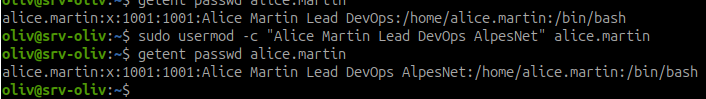
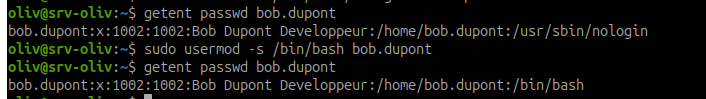
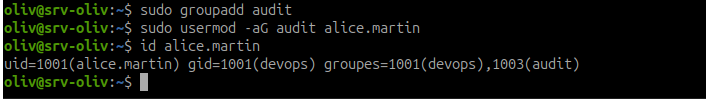
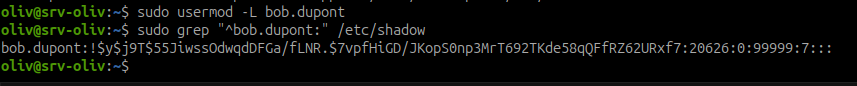
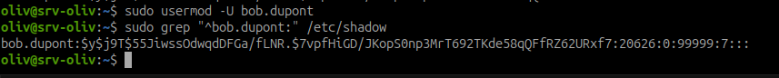
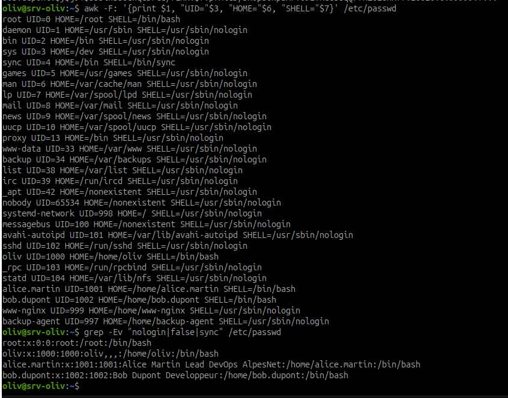
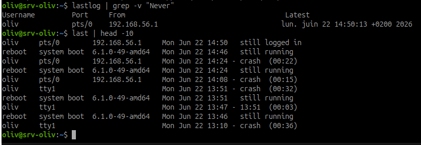

# Atelier 5 - Cycle de vie des comptes Linux

## Contexte

Un système Linux en production n'est jamais figé. Des prestataires arrivent et repartent, des postes changent, des droits évoluent, et certains comptes doivent être désactivés sans être supprimés.

Supprimer immédiatement un compte peut faire perdre de la traçabilité ou compliquer l'accès aux fichiers historiques. Dans une infrastructure professionnelle, on privilégie souvent le verrouillage du compte, la conservation des fichiers et la documentation de l'action réalisée.

Dans cet atelier, tu pratiques les gestes d'administration courants sur l'infrastructure AlpesNet.

## Objectif

Savoir modifier, verrouiller, diagnostiquer et documenter le cycle de vie d'un compte Linux.

À la fin de l'atelier, tu dois savoir :

- modifier les informations d'un compte avec `usermod` ;
- ajouter un groupe secondaire sans écraser les groupes existants ;
- verrouiller un compte sans le supprimer ;
- vérifier l'état d'un compte dans `/etc/shadow` ;
- consulter les dernières connexions ;
- documenter un départ de prestataire.

## Étape 1 - Modifier le commentaire d'un compte

Le champ commentaire d'un compte est visible dans `/etc/passwd`. Il peut contenir un nom complet, un rôle ou une information métier.

Afficher le compte :

```bash
getent passwd alice.martin
```

Modifier le commentaire :

```bash
sudo usermod -c "Alice Martin Lead DevOps AlpesNet" alice.martin
```

Vérifier :

```bash
getent passwd alice.martin
```

Point de contrôle : le cinquième champ de la ligne doit contenir le nouveau commentaire.



## Étape 2 - Modifier le shell d'un compte

Le shell détermine si un utilisateur peut ouvrir une session interactive.

Afficher le shell actuel :

```bash
getent passwd bob.dupont
```

Changer le shell :

```bash
sudo usermod -s /bin/bash bob.dupont
```

Vérifier :

```bash
getent passwd bob.dupont
```

Point de contrôle : le dernier champ doit être `/bin/bash`.



!!! note "Compte service"
    Pour un compte service, le shell attendu est plutôt `/usr/sbin/nologin`. Un service n'a normalement pas besoin d'ouvrir une session interactive.

## Étape 3 - Ajouter un groupe secondaire

Créer un groupe d'exemple si besoin :

```bash
sudo groupadd audit
```

Ajouter Alice au groupe secondaire `audit` :

```bash
sudo usermod -aG audit alice.martin
```

Vérifier :

```bash
id alice.martin
```

Point de contrôle : le groupe `audit` doit apparaître dans la liste des groupes d'Alice.



!!! warning "Erreur courante"
    Ne pas utiliser `usermod -G audit alice.martin` seul. Sans `-a`, l'option `-G` remplace les groupes secondaires existants et peut supprimer des droits.

## Étape 4 - Verrouiller un compte sans le supprimer

Bob Dupont quitte temporairement ou définitivement AlpesNet. On veut empêcher la connexion sans supprimer le compte.

Verrouiller le compte :

```bash
sudo usermod -L bob.dupont
```

Vérifier dans `/etc/shadow` :

```bash
sudo grep "^bob.dupont:" /etc/shadow
```

Point de contrôle : le hash du mot de passe doit commencer par `!`.

Exemple :

```text
bob.dupont:!$y$j9T$...
```

Le `!` indique que le mot de passe est verrouillé.



## Étape 5 - Déverrouiller un compte

Si le compte doit être réactivé :

```bash
sudo usermod -U bob.dupont
```

Vérifier :

```bash
sudo grep "^bob.dupont:" /etc/shadow
```

Point de contrôle : le `!` ajouté devant le hash ne doit plus être présent.



!!! warning "Compte sans mot de passe"
    Ne pas déverrouiller un compte qui n'a pas de mot de passe valide. `usermod -U` doit être utilisé avec prudence.

## Étape 6 - Diagnostiquer les comptes locaux

Afficher les comptes avec leur UID, leur home et leur shell :

```bash
awk -F: '{print $1, "UID="$3, "HOME="$6, "SHELL="$7}' /etc/passwd
```

Afficher uniquement les comptes avec shell interactif :

```bash
grep -Ev "nologin|false|sync" /etc/passwd
```

Point de contrôle : repérer les comptes humains et les comptes qui peuvent ouvrir une session.



## Étape 7 - Consulter les dernières connexions

Afficher les dernières connexions connues :

```bash
lastlog | grep -v "Never"
```

Afficher les dernières sessions :

```bash
last | head -10
```

Point de contrôle : identifier les comptes actifs, les comptes jamais utilisés et les comptes potentiellement inutilisés.



## Étape 8 - Scénario : départ de prestataire chez AlpesNet

Bob Dupont quitte AlpesNet. Il faut désactiver son accès sans supprimer son compte ni ses fichiers.

### Vérifier son identité

```bash
id bob.dupont
getent passwd bob.dupont
```

Observation attendue : Bob existe toujours et appartient au groupe `readonly`.

### Vérifier ses droits sudo

```bash
sudo -l -U bob.dupont
```

Observation attendue : Bob ne doit pas disposer de droits sudo.

### Vérifier ses connexions

```bash
lastlog -u bob.dupont
last | grep bob.dupont | head
```

Observation attendue : noter la dernière connexion ou l'absence de connexion.

### Verrouiller le compte

```bash
sudo usermod -L bob.dupont
```

### Vérifier le verrouillage

```bash
sudo grep "^bob.dupont:" /etc/shadow
```

Point de contrôle : le champ mot de passe doit commencer par `!`.

### Tester la connexion locale

```bash
su - bob.dupont
```

Résultat attendu : la connexion doit être refusée si le compte est verrouillé.

### Lister les fichiers de Bob

```bash
sudo find / -user bob.dupont -ls 2>/dev/null
```

Point de contrôle : conserver la liste des fichiers pour traçabilité avant toute suppression ou archivage.


## Exercice - Départ de Bob Dupont

Documenter dans le carnet de bord :

- date de l'action ;
- raison : départ de prestataire ;
- commandes exécutées ;
- résultat de `id bob.dupont` ;
- résultat de `sudo -l -U bob.dupont` ;
- résultat de `lastlog -u bob.dupont` ;
- preuve du verrouillage dans `/etc/shadow` ;
- résultat du test `su - bob.dupont` ;
- liste ou emplacement des fichiers appartenant à Bob ;
- observation finale.

## Résultat attendu

À la fin de l'atelier :

- Bob Dupont existe toujours dans `/etc/passwd` ;
- son compte est verrouillé ;
- ses fichiers ne sont pas supprimés ;
- ses droits sudo sont inexistants ou explicitement vérifiés ;
- l'action est documentée dans le carnet de bord.

## Synthèse à retenir

Gérer un compte, ce n'est pas seulement le créer. Il faut aussi savoir le modifier, le verrouiller, vérifier ses droits, conserver les traces et documenter les décisions.

Dans un contexte professionnel, verrouiller un compte est souvent préférable à une suppression immédiate : on coupe l'accès tout en gardant les fichiers, les UID, les journaux et la traçabilité.
