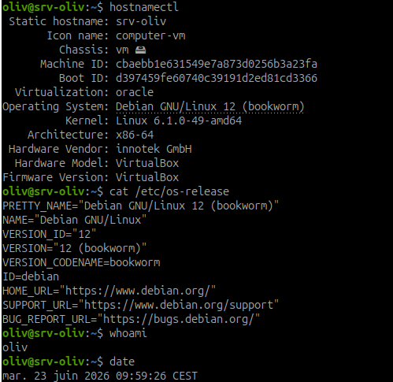
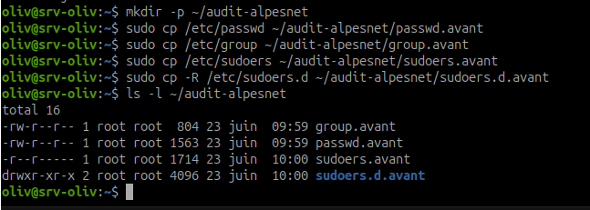
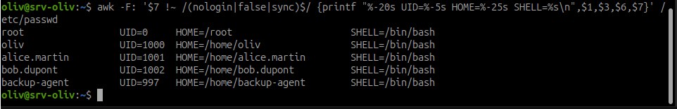
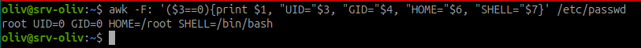
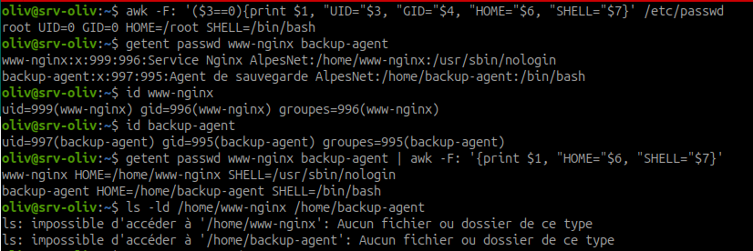
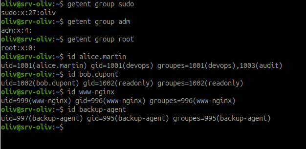
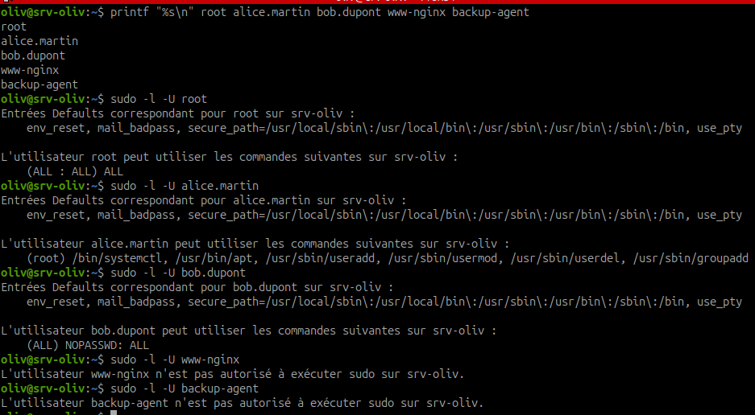
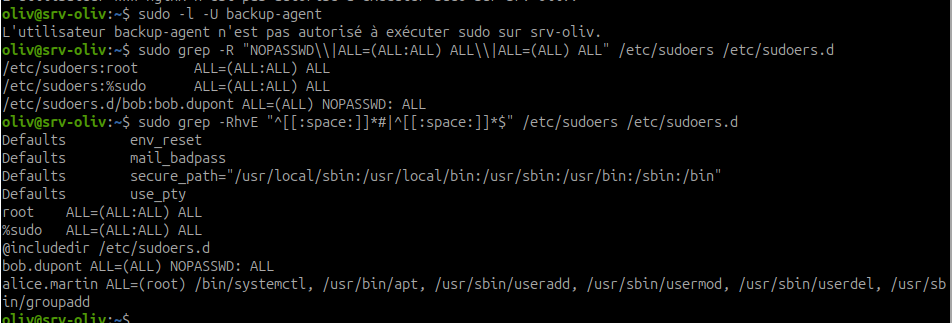

# Audit AlpesNet

| en tête | audit alpesNet |
| --- | --- |
| Nom | HIMBLOT |
| Prénom | Olivier |
| Site | AlpesNet |
| Module | Administration des systèmes - Linux |
| Atelier | Audit des comptes et des droits sudo AlpesNet |
| Date | 23 juin 2026 |
| Machine | srv-oliv |
| Distribution | Debian GNU/Linux 12 (bookworm) |
| Objet | Audit des comptes locaux, UID 0, comptes service et droits sudo |

## Contexte de l'audit

Le DSI d'AlpesNet demande un audit complet des comptes locaux et des droits `sudo` avant la mise en production du serveur.  
L'objectif est d'identifier qui peut ouvrir une session, qui peut obtenir des droits administrateur, et si ces droits sont cohérents avec le rôle de chaque compte.

Ce rapport présente uniquement l'audit réalisé. Aucune correction n'a été appliquée pendant les étapes de contrôle. Les écarts et les corrections recommandées sont listés à la fin du document.

## Étape 1 - Préparation du rapport

L'en-tête standard du rapport a été créé avec les informations d'identification, le module, la machine auditée, la distribution et l'objet de l'audit.

Cette étape permet de rendre le rapport relisible par une personne extérieure à l'intervention.

## Étape 2 - Identification du serveur audité

Commandes utilisées :

```bash
hostnamectl
cat /etc/os-release
whoami
date
```



Résumé :

- la machine auditée est `srv-oliv` ;
- le serveur fonctionne sous Debian GNU/Linux 12 `bookworm` ;
- le noyau Linux affiché est `6.1.0-49-amd64` ;
- la machine est une VM VirtualBox ;
- l'audit est exécuté par l'utilisateur `oliv` ;
- la date relevée est le 23 juin 2026 à 09:59:26 CEST.

Conclusion de l'étape : le contexte technique de l'audit est identifié correctement.

## Étape 3 - Sauvegarde des fichiers sensibles

Commandes utilisées :

```bash
mkdir -p ~/audit-alpesnet
sudo cp /etc/passwd ~/audit-alpesnet/passwd.avant
sudo cp /etc/group ~/audit-alpesnet/group.avant
sudo cp /etc/sudoers ~/audit-alpesnet/sudoers.avant
sudo cp -R /etc/sudoers.d ~/audit-alpesnet/sudoers.d.avant
ls -l ~/audit-alpesnet
```



Résumé :

- le dossier `~/audit-alpesnet` a été créé ;
- les fichiers `/etc/passwd`, `/etc/group`, `/etc/sudoers` et le dossier `/etc/sudoers.d` ont été sauvegardés ;
- la commande `ls -l` confirme la présence des fichiers `passwd.avant`, `group.avant`, `sudoers.avant` et du dossier `sudoers.d.avant`.

Conclusion de l'étape : l'état initial des fichiers sensibles est sauvegardé avant analyse.

## Étape 4 - Liste des comptes avec shell actif

Commande utilisée :

```bash
awk -F: '$7 !~ /(nologin|false|sync)$/ {printf "%-20s UID=%-5s HOME=%-25s SHELL=%s\n",$1,$3,$6,$7}' /etc/passwd
```



Résumé :

| Compte | UID | Home | Shell | Analyse |
| --- | --- | --- | --- | --- |
| `root` | `0` | `/root` | `/bin/bash` | Compte administrateur système légitime |
| `oliv` | `1000` | `/home/oliv` | `/bin/bash` | Compte utilisateur local légitime |
| `alice.martin` | `1001` | `/home/alice.martin` | `/bin/bash` | Compte humain AlpesNet légitime |
| `bob.dupont` | `1002` | `/home/bob.dupont` | `/bin/bash` | Compte humain AlpesNet à contrôler |
| `backup-agent` | `997` | `/home/backup-agent` | `/bin/bash` | Écart : compte service avec shell interactif |

Conclusion de l'étape : les comptes humains ont un shell actif, ce qui est normal. En revanche, `backup-agent` est un compte service et ne devrait pas disposer d'un shell `/bin/bash`.

## Étape 5 - Recherche des comptes avec UID 0

Commande utilisée :

```bash
awk -F: '($3==0){print $1, "UID="$3, "GID="$4, "HOME="$6, "SHELL="$7}' /etc/passwd
```



Résumé :

- seul le compte `root` possède l'UID `0` ;
- aucun autre compte ne dispose des privilèges équivalents à `root`.

Conclusion de l'étape : contrôle conforme. Aucun compte root caché n'a été détecté.

## Étape 6 - Vérification des comptes service

Commandes utilisées :

```bash
getent passwd www-nginx backup-agent
id www-nginx
id backup-agent
getent passwd www-nginx backup-agent | awk -F: '{print $1, "HOME="$6, "SHELL="$7}'
ls -ld /home/www-nginx /home/backup-agent
```



Résumé :

| Compte service | UID | GID | Home déclaré | Shell | Analyse |
| --- | --- | --- | --- | --- | --- |
| `www-nginx` | `999` | `996` | `/home/www-nginx` | `/usr/sbin/nologin` | Shell conforme, home déclaré à revoir |
| `backup-agent` | `997` | `995` | `/home/backup-agent` | `/bin/bash` | Non conforme : shell interactif |

La commande `ls -ld /home/www-nginx /home/backup-agent` indique que les dossiers `/home/www-nginx` et `/home/backup-agent` n'existent pas.

Conclusion de l'étape : `www-nginx` ne peut pas ouvrir de session interactive, mais son home déclaré n'est pas idéal pour un compte service. `backup-agent` est non conforme car il possède un shell interactif `/bin/bash`.

## Étape 7 - Vérification des groupes sensibles

Commandes utilisées :

```bash
getent group sudo
getent group adm
getent group root
id alice.martin
id bob.dupont
id www-nginx
id backup-agent
```



Résumé :

- le groupe `sudo` contient uniquement `oliv` ;
- le groupe `adm` ne contient aucun utilisateur listé ;
- le groupe `root` ne contient aucun utilisateur listé ;
- `alice.martin` appartient aux groupes `devops` et `audit` ;
- `bob.dupont` appartient uniquement au groupe `readonly` ;
- `www-nginx` appartient uniquement à son groupe de service ;
- `backup-agent` appartient uniquement à son groupe de service.

Conclusion de l'étape : aucun compte service n'est membre du groupe `sudo`. Les groupes visibles sont cohérents avec les rôles attendus.

## Étape 8 - Vérification des droits sudo compte par compte

Commandes utilisées :

```bash
printf "%s\n" root alice.martin bob.dupont www-nginx backup-agent
sudo -l -U root
sudo -l -U alice.martin
sudo -l -U bob.dupont
sudo -l -U www-nginx
sudo -l -U backup-agent
```



Résumé :

| Compte | Droits sudo observés | Analyse |
| --- | --- | --- |
| `root` | `(ALL : ALL) ALL` | Normal pour le compte administrateur |
| `alice.martin` | Commandes limitées : `systemctl`, `apt`, `useradd`, `usermod`, `userdel`, `groupadd` | Conforme au rôle Lead DevOps avec sudo restreint |
| `bob.dupont` | `(ALL) NOPASSWD: ALL` | Écart critique : droits complets sans mot de passe |
| `www-nginx` | Non autorisé à exécuter sudo | Conforme pour un compte service |
| `backup-agent` | Non autorisé à exécuter sudo | Conforme pour un compte service |

Conclusion de l'étape : `bob.dupont` possède une règle `NOPASSWD: ALL`, ce qui est contraire à la consigne. Alice a des droits sudo limités et les comptes service n'ont pas de droits sudo.

## Étape 9 - Recherche des règles sudo dangereuses

Commandes utilisées :

```bash
sudo grep -R "NOPASSWD\|ALL=(ALL:ALL) ALL\|ALL=(ALL) ALL" /etc/sudoers /etc/sudoers.d
sudo grep -RhvE "^[[:space:]]*#|^[[:space:]]*$" /etc/sudoers /etc/sudoers.d
```



Résumé :

- `/etc/sudoers` contient les règles classiques pour `root` et le groupe `%sudo` ;
- `/etc/sudoers.d/bob` contient la règle `bob.dupont ALL=(ALL) NOPASSWD: ALL` ;
- une règle dédiée à `alice.martin` limite ses droits à une liste de commandes précises.

Conclusion de l'étape : la règle dangereuse concernant `bob.dupont` est confirmée dans `/etc/sudoers.d/bob`.

## Synthèse des écarts identifiés

| Écart | Compte concerné | Risque | Gravité |
| --- | --- | --- | --- |
| Compte service avec shell interactif `/bin/bash` | `backup-agent` | Connexion interactive possible avec un compte non humain | Élevée |
| Compte service avec home déclaré sous `/home` | `backup-agent` | Configuration non conforme au rôle de service | Moyenne |
| Compte service avec home déclaré sous `/home` | `www-nginx` | Configuration perfectible, même si le dossier n'existe pas | Faible à moyenne |
| Règle `NOPASSWD: ALL` | `bob.dupont` | Élévation complète en administrateur sans mot de passe | Critique |

## Corrections recommandées

Les corrections suivantes n'ont pas été appliquées pendant l'audit. Elles sont proposées pour mise en conformité.

### Correction 1 - Sécuriser le compte `backup-agent`

Objectif : empêcher toute session interactive avec le compte service.

Commandes recommandées :

```bash
sudo usermod -s /usr/sbin/nologin backup-agent
sudo usermod -d /nonexistent backup-agent
```

Commandes de vérification :

```bash
getent passwd backup-agent
id backup-agent
```

Résultat attendu :

```text
backup-agent:x:997:995:Agent de sauvegarde AlpesNet:/nonexistent:/usr/sbin/nologin
```

### Correction 2 - Ajuster le home déclaré de `www-nginx`

Objectif : éviter qu'un compte service pointe vers un home utilisateur dans `/home`.

Commande recommandée :

```bash
sudo usermod -d /nonexistent www-nginx
```

Commande de vérification :

```bash
getent passwd www-nginx
```

Résultat attendu :

```text
www-nginx:x:999:996:Service Nginx AlpesNet:/nonexistent:/usr/sbin/nologin
```

### Correction 3 - Supprimer le droit `NOPASSWD: ALL` de `bob.dupont`

Objectif : retirer les droits administrateur complets sans mot de passe.

Commande recommandée :

```bash
sudo visudo -f /etc/sudoers.d/bob
```

Action à effectuer dans le fichier :

```text
Supprimer ou commenter la ligne :
bob.dupont ALL=(ALL) NOPASSWD: ALL
```

Commandes de vérification :

```bash
sudo visudo -cf /etc/sudoers.d/bob
sudo -l -U bob.dupont
sudo grep -R "NOPASSWD.*ALL" /etc/sudoers /etc/sudoers.d
```

Résultat attendu :

```text
L'utilisateur bob.dupont n'est pas autorisé à exécuter sudo sur srv-oliv.
```

## État final attendu après correction

Après application des corrections recommandées :

- seuls les comptes humains légitimes doivent avoir un shell interactif ;
- seul `root` doit posséder l'UID `0` ;
- `www-nginx` et `backup-agent` doivent avoir `/usr/sbin/nologin` ;
- les comptes service ne doivent pas avoir de home actif sous `/home` ;
- `bob.dupont` ne doit plus avoir de règle `NOPASSWD: ALL` ;
- `alice.martin` peut conserver ses droits sudo restreints.

## Conclusion

L'audit montre que le serveur est globalement structuré, avec des comptes AlpesNet identifiés et des groupes cohérents. Deux points importants empêchent cependant une mise en production en l'état : le compte service `backup-agent` dispose d'un shell interactif, et le compte `bob.dupont` possède un droit sudo complet sans mot de passe.

La mise en conformité nécessite donc de désactiver l'interactivité de `backup-agent`, d'ajuster les homes déclarés des comptes service, et de supprimer la règle `NOPASSWD: ALL` de `bob.dupont`.
