# Carnet de bord itération 1

## Objectif du carnet de bord

Ce carnet de bord sert à centraliser les réponses des exercices sur :

- l'arborescence Linux et le FHS ;
- les fichiers `/etc/passwd`, `/etc/shadow` et `/etc/group` ;
- les comptes AlpesNet créés ;
- les commandes utilisées ;
- les observations de sécurité.

Le livrable attendu est un fichier texte avec en-tête standard.

## En-tête standard

À placer au début du fichier rendu :

```text
Nom :
Prénom :
Site :
Module : Administration des systèmes - Linux
Ateliers : FHS, identités Linux et comptes AlpesNet
Date :
Machine : srv-[prenom]
Distribution : Debian GNU/Linux 12 (bookworm)
```

## Partie 1 - FHS et arborescence Linux

### Commandes utilisées

```bash
ls -la /etc | head -20
tree /etc -L 1
cat /etc/os-release
cat /etc/fstab
find /etc -name "*.conf" | head -10
find /etc -name "*.conf" | wc -l
which useradd nginx rsync
ls -lt /var/log | head
```

### Trois fichiers ou répertoires inconnus dans `/etc`

| Élément relevé | Hypothèse de rôle | Vérification éventuelle |
| --- | --- | --- |
| `/etc/adduser.conf` | Configuration par défaut utilisée lors de la création d'utilisateurs avec `adduser` | Fichier visible dans `ls -la /etc` |
| `/etc/alternatives` | Gestion des alternatives Debian pour choisir la commande par défaut entre plusieurs programmes | Répertoire présent dans `/etc` |
| `/etc/apt` | Configuration du gestionnaire de paquets APT : dépôts, préférences, sources | Répertoire critique pour `apt update` et `apt install` |

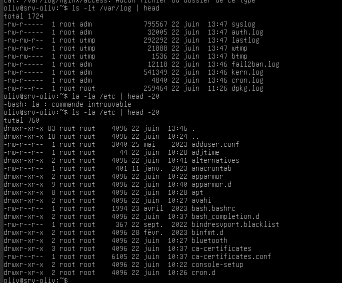

### Nombre de fichiers `.conf`

Commande :

```bash
find /etc -name "*.conf" | wc -l
```

Résultat :

```text
Nombre de fichiers .conf : 232
```

Observation : une recherche sans `sudo` peut afficher une erreur de permission sur certains répertoires sensibles, par exemple `/etc/ssl/private`. La commande avec `sudo` donne le comptage complet.

### Chemins des trois binaires

Commande :

```bash
which useradd nginx rsync
```

Résultats :

| Binaire | Chemin |
| --- | --- |
| `useradd` | Non retourné par `which` dans la capture, car le binaire d'administration est généralement dans `/usr/sbin/useradd` |
| `nginx` | Non retourné par `which` dans la capture, à vérifier après installation du paquet `nginx` |
| `rsync` | `/usr/bin/rsync` |

### Trois logs les plus récents

Commande :

```bash
ls -lt /var/log | head
```

Résultats :

| Log | Observation |
| --- | --- |
| `auth.log` | Log d'authentification : connexions, `sudo`, SSH |
| `syslog` | Log système général |
| `lastlog` | Informations sur les dernières connexions utilisateurs |

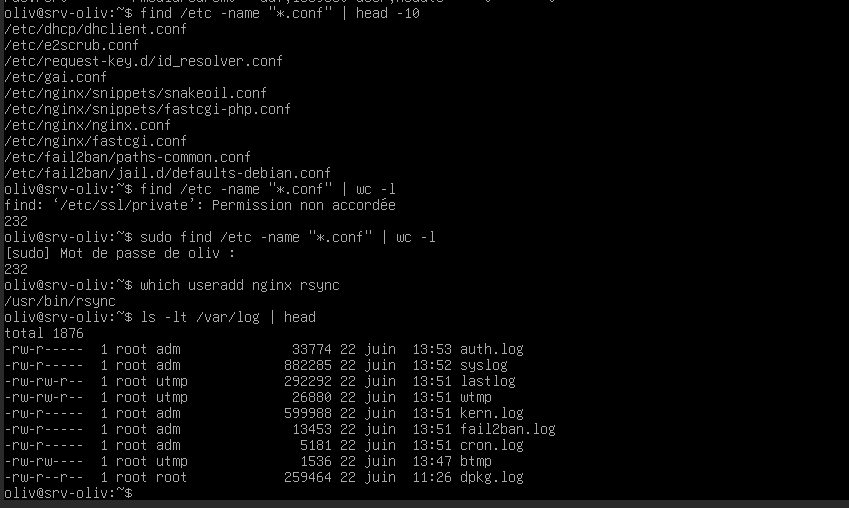

## Partie 2 - Audit des identités Linux

### Commandes utilisées partie 2

```bash
grep -Ev "nologin|false|sync" /etc/passwd
awk -F: '($3==0){print "UID 0 :",$1}' /etc/passwd
cat /etc/shadow
sudo head /etc/shadow
sudo awk -F: '($2=="" || $2=="!*"){print "SANS MOT DE PASSE :",$1}' /etc/shadow
cat /etc/group | grep -E "^sudo|^devops|^readonly"
awk -F: '($3 < 100){print $1,$3}' /etc/group
id root
id adm-[prenom]
```

Si le compte `adm-[prenom]` n'existe pas encore, comparer avec le compte utilisateur de la VM :

```bash
id root
id oliv
```

### Comptes avec shell actif

Commande :

```bash
grep -Ev "nologin|false|sync" /etc/passwd
```

Réponse :

```text
Comptes avec shell actif :
- root:/root:/bin/bash
- oliv:/home/oliv:/bin/bash
```

Observation :

```text
Les comptes avec shell actif sont ceux qui peuvent potentiellement ouvrir une session interactive.
Sur la capture, seuls root et oliv ont un shell interactif avant la création des comptes AlpesNet.
```

### Détection des UID 0

J'exécute la commande suivante sur ma VM pour rechercher tous les comptes qui possèdent l'UID `0` dans `/etc/passwd`. Elle permet de vérifier qu'aucun compte autre que `root` ne dispose des privilèges administrateur complets.

Commande :

```bash
awk -F: '($3==0){print "UID 0 :",$1}' /etc/passwd
```

Réponse :

```text
UID 0 : root
```

Observation attendue :

```text
Seul root doit avoir UID 0. Aucun second compte root caché n'est visible dans la capture.
Un résultat autre que root serait une alerte critique, car Linux se base sur l'UID pour attribuer les droits. Un compte avec UID 0 a les mêmes privilèges que root, même s'il porte un autre nom.
```

### Détection des comptes sans mot de passe

Commande :

```bash
sudo awk -F: '($2=="" || $2=="!*"){print "SANS MOT DE PASSE :",$1}' /etc/shadow
```

Réponse :

```text
Comptes sans mot de passe :
SANS MOT DE PASSE : systemd-network
```

Observation :

```text
systemd-network est un compte système. Aucun compte humain actif n'apparaît comme sans mot de passe dans la capture.
```

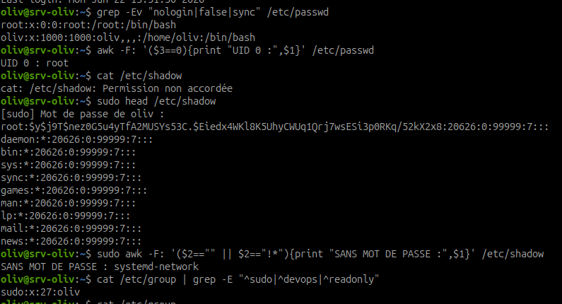

### Groupes système avec GID inférieur à 100

Commande :

```bash
awk -F: '($3 < 100){print $1,$3}' /etc/group
```

Réponse :

```text
Groupes système relevés :
- root 0
- daemon 1
- bin 2
- sys 3
- adm 4
- tty 5
- disk 6
- lp 7
- mail 8
- news 9
- uucp 10
- sudo 27
- www-data 33
```

Observation :

```text
Les groupes système servent aux services, aux droits techniques et à l'administration locale.
Le groupe sudo est particulièrement sensible, car ses membres peuvent obtenir des droits administrateur.
```

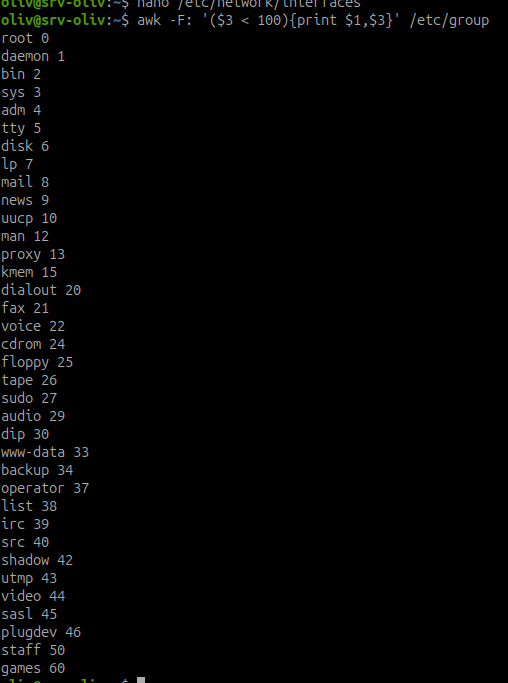

### Groupes sensibles

Commande :

```bash
cat /etc/group | grep -E "^sudo|^devops|^readonly"
```

Réponse :

```text
Groupes sensibles :
sudo:x:27:oliv
```

Observation :

```text
Le groupe sudo est sensible car il donne des droits d'administration via sudo.
Dans la capture, oliv appartient au groupe sudo.
```

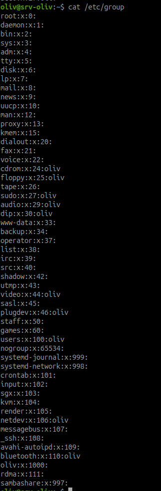

### Comparaison `id root` et `id adm-[prenom]`

Commandes :

```bash
id root
id adm-[prenom]
```

ou :

```bash
id root
id oliv
```

Réponses :

```text
id root :
uid=0(root) gid=0(root) groupes=0(root)

id oliv :
uid=1000(oliv) gid=1000(oliv) groupes=1000(oliv),24(cdrom),25(floppy),27(sudo),29(audio),30(dip),44(video),46(plugdev),100(users),106(netdev),110(bluetooth)
```

Observations :

```text
root a uid=0 et gid=0.
oliv a uid=1000 : ce n'est pas root.
oliv appartient au groupe sudo, donc il peut administrer avec sudo, mais il reste différent de root.
```

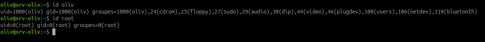

## Partie 3 - Comptes AlpesNet créés

### Commandes utilisées partie 3

```bash
id alice.martin
id bob.dupont
id www-nginx
id backup-agent
sudo -l -U alice.martin
getent passwd alice.martin bob.dupont www-nginx backup-agent
```

### Sortie de `id` pour chaque compte

Commande :

```bash
id alice.martin
id bob.dupont
id www-nginx
id backup-agent
```

Réponses :

```text
id alice.martin :
uid=1001(alice.martin) gid=1001(devops) groupes=1001(devops)

id bob.dupont :
uid=1002(bob.dupont) gid=1002(readonly) groupes=1002(readonly)

id www-nginx :
uid=999(www-nginx) gid=996(www-nginx) groupes=996(www-nginx)

id backup-agent :
uid=997(backup-agent) gid=995(backup-agent) groupes=995(backup-agent)
```

Observations :

```text
alice.martin a bien devops comme groupe principal.
bob.dupont a bien readonly comme groupe principal.
www-nginx et backup-agent sont bien des comptes service avec UID inférieur à 1000.
```

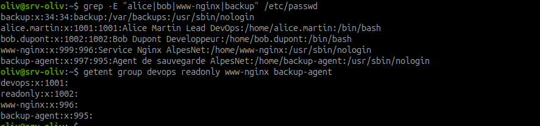

### Lecture détaillée du compte `alice.martin`

Je montre les sorties de `id alice.martin` et `getent passwd alice.martin` pour vérifier l'identité Unix complète du compte.

Commandes :

```bash
id alice.martin
getent passwd alice.martin
```

Réponses :

```text
id alice.martin :
uid=1001(alice.martin) gid=1001(devops) groupes=1001(devops)

getent passwd alice.martin :
alice.martin:x:1001:1001:Alice Martin Lead DevOps:/home/alice.martin:/bin/bash
```

Explication des champs :

| Élément | Valeur | Explication |
| --- | --- | --- |
| UID | `1001` | Identifiant numérique de l'utilisateur `alice.martin`. Il est différent de `0`, donc Alice n'est pas root. |
| GID | `1001` | Groupe principal du compte. Ici, il correspond au groupe `devops`. |
| Home | `/home/alice.martin` | Répertoire personnel d'Alice, créé avec l'option `-m`. |
| Shell | `/bin/bash` | Shell interactif autorisant Alice à ouvrir une session terminal. |

Observation :

```text
alice.martin est un compte humain correctement créé : UID non root, groupe principal devops, home personnel et shell interactif.
```

### Lecture détaillée du compte service `www-nginx`

Je montre la sortie de `id www-nginx` pour vérifier que le compte de service possède bien un UID système et son propre groupe.

Commande :

```bash
id www-nginx
```

Réponse :

```text
id www-nginx :
uid=999(www-nginx) gid=996(www-nginx) groupes=996(www-nginx)
```

Observation :

```text
www-nginx est un compte service avec un UID inférieur à 1000.
Il sert à exécuter un processus, pas à ouvrir une session humaine.
Un service ne doit pas avoir de shell interactif, car cela augmenterait le risque en cas de compromission.
Un service ne doit pas avoir de home inutile, car cela ajoute un espace d'écriture et de persistance qui n'est pas nécessaire.
```

### Droits sudo de `alice.martin`

Commande :

```bash
sudo -l -U alice.martin
```

Réponse :

```text
Sortie sudo -l -U alice.martin :
alice.martin peut exécuter uniquement les commandes explicitement prévues dans /etc/sudoers.d/alice :
- /bin/systemctl
- /usr/bin/apt
- /usr/sbin/useradd
- /usr/sbin/usermod
- /usr/sbin/userdel
- /usr/sbin/groupadd
```

Observation :

```text
alice.martin doit uniquement avoir les droits sudo explicitement autorisés : systemctl, apt, useradd, usermod, userdel et groupadd.
Le test sudo systemctl status ssh fonctionne.
Le test sudo rm /etc/passwd est refusé.
```

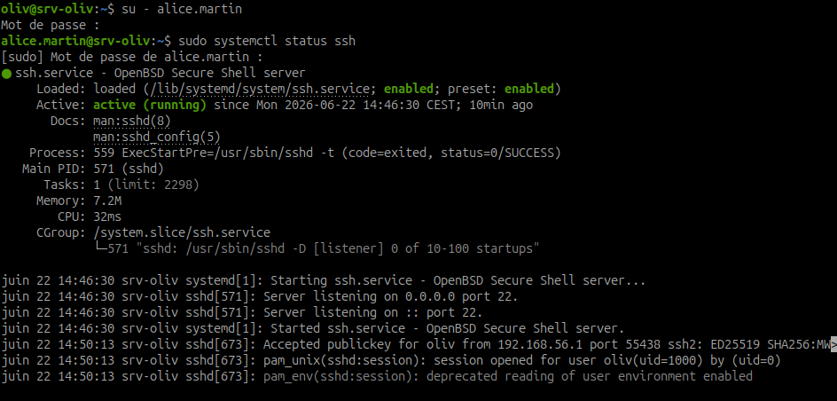

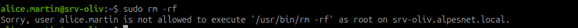

### Démonstration live des droits sudo d'Alice

Je démontre que les droits sudo d'Alice sont limités : une commande prévue dans le sudoers fonctionne, mais une commande dangereuse non autorisée est refusée.

Commande autorisée :

```bash
su - alice.martin
sudo systemctl status ssh
```

Résultat :

```text
La commande fonctionne : Alice peut consulter l'état du service SSH avec systemctl.
```

Commande interdite :

```bash
sudo rm /etc/passwd
```

Résultat :

```text
La commande est refusée : Alice n'est pas autorisée à exécuter rm en tant que root.
```

!!! danger "Commande volontairement dangereuse"
    Ce test ne doit être lancé qu'après avoir vérifié avec `sudo -l -U alice.martin` que `rm` n'est pas dans la liste des commandes autorisées. Si `rm` était autorisé par erreur, supprimer `/etc/passwd` casserait la base locale des comptes.

### Présence des comptes dans `getent passwd`

Commande :

```bash
getent passwd alice.martin bob.dupont www-nginx backup-agent
```

Réponse :

```text
Sortie getent passwd :
alice.martin:x:1001:1001:Alice Martin Lead DevOps:/home/alice.martin:/bin/bash
bob.dupont:x:1002:1002:Bob Dupont Developpeur:/home/bob.dupont:/bin/bash
www-nginx:x:999:996:Service Nginx AlpesNet:/home/www-nginx:/usr/sbin/nologin
backup-agent:x:997:995:Agent de sauvegarde AlpesNet:/home/backup-agent:/usr/sbin/nologin
```

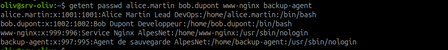

Point de contrôle :

```text
Les quatre comptes doivent apparaître :
- alice.martin
- bob.dupont
- www-nginx
- backup-agent
```

Observations :

```text
Les comptes humains doivent avoir un home et un shell /bin/bash.
Les comptes service doivent avoir un shell /usr/sbin/nologin.
Les quatre comptes AlpesNet sont présents dans getent passwd.
```

## Partie 4 - Départ de Bob Dupont

### Contexte

Bob Dupont quitte AlpesNet. Je verrouille son compte sans le supprimer afin de conserver ses fichiers, son UID et la traçabilité des actions.

| Élément | Valeur |
| --- | --- |
| Date | 22 juin 2026 |
| Raison | Départ de prestataire |
| Compte concerné | `bob.dupont` |
| Action | Verrouillage du compte, conservation des fichiers |

### Commandes utilisées partie 4

```bash
id bob.dupont
getent passwd bob.dupont
sudo -l -U bob.dupont
lastlog -u bob.dupont
last | grep bob.dupont | head
sudo usermod -L bob.dupont
sudo grep "^bob.dupont:" /etc/shadow
su - bob.dupont
sudo find / -user bob.dupont -ls 2>/dev/null
```

### Vérifications avant verrouillage

```text
id bob.dupont :
uid=1002(bob.dupont) gid=1002(readonly) groupes=1002(readonly)

getent passwd bob.dupont :
bob.dupont:x:1002:1002:Bob Dupont Developpeur:/home/bob.dupont:/bin/bash

sudo -l -U bob.dupont :
L'utilisateur bob.dupont n'est pas autorisé à exécuter sudo sur srv-oliv.
```

Observation :

```text
Bob existe toujours comme compte humain, appartient au groupe readonly et ne dispose pas de droits sudo.
```

### Connexions de Bob

```text
lastlog -u bob.dupont :
bob.dupont : **Never logged in**

last | grep bob.dupont | head :
aucune session relevée dans la capture.
```

Observation :

```text
Aucune connexion interactive de Bob n'est visible dans les commandes de vérification.
```

### Verrouillage du compte

Commande :

```bash
sudo usermod -L bob.dupont
sudo grep "^bob.dupont:" /etc/shadow
```

Vérification :

```text
bob.dupont:!$y$j9T$...
```

Observation :

```text
Le caractère ! devant le hash dans /etc/shadow confirme que le mot de passe du compte est verrouillé.
```

### Test de connexion

Commande :

```bash
su - bob.dupont
```

Résultat :

```text
su : Échec de l'authentification
```

Observation :

```text
Le compte verrouillé ne permet plus d'ouvrir une session avec le mot de passe.
```

### Fichiers appartenant à Bob

Commande :

```bash
sudo find / -user bob.dupont -ls 2>/dev/null
```

Résultat observé :

```text
/home/bob.dupont
/home/bob.dupont/.profile
/home/bob.dupont/.bash_logout
/home/bob.dupont/.bashrc
```

Observation finale :

```text
Le compte bob.dupont est verrouillé, ses fichiers sont conservés et l'action est documentée. Aucune suppression n'est réalisée afin de garder la traçabilité.
```

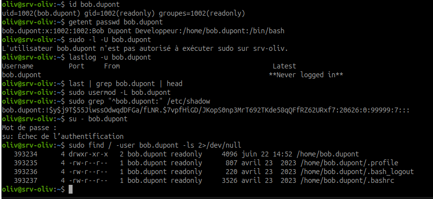

## Synthèse personnelle

À compléter en quelques lignes :

```text
Ce que j'ai compris :
Les fichiers /etc/passwd, /etc/shadow et /etc/group permettent d'auditer les identités locales.
L'UID est plus important que le nom du compte : un UID 0 donne les droits root.
Les comptes service doivent être limités et ne pas disposer d'un shell interactif.

Risques repérés :
Un compte UID 0 autre que root serait critique.
Un compte humain sans mot de passe serait dangereux.
Un sudo trop large, par exemple NOPASSWD ALL, donnerait trop de pouvoir à un utilisateur.

Bonnes pratiques à retenir :
Créer les comptes avec le bon groupe principal.
Utiliser /usr/sbin/nologin pour les comptes service.
Limiter sudo aux commandes strictement nécessaires.
Vérifier chaque création avec id, getent et sudo -l.
```

## Résultat attendu

Le carnet de bord final doit contenir :

- l'en-tête standard ;
- les trois fichiers ou répertoires inconnus de `/etc` avec hypothèses ;
- le nombre de fichiers `.conf` ;
- les chemins de `useradd`, `nginx` et `rsync` ;
- les trois logs les plus récents ;
- les réponses de l'exercice sur `/etc/passwd`, `/etc/shadow` et `/etc/group` ;
- la sortie de `id` pour chaque compte AlpesNet créé ;
- la sortie de `sudo -l -U alice.martin` ;
- la présence de tous les comptes AlpesNet dans `getent passwd` ;
- les commandes utilisées ;
- les observations de sécurité.
