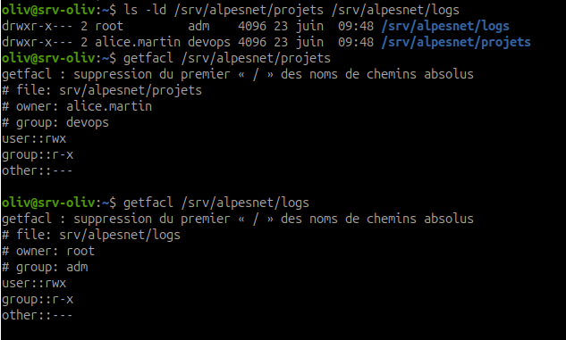
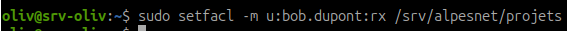
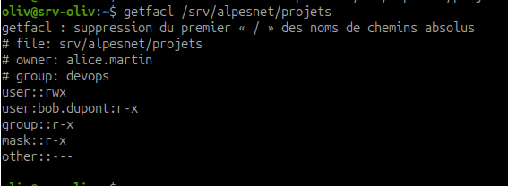
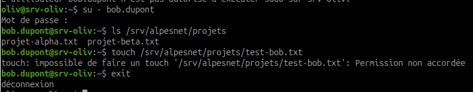
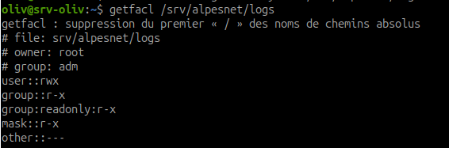
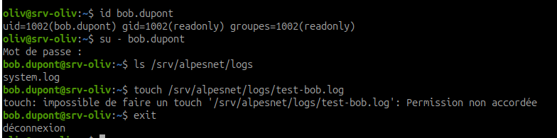
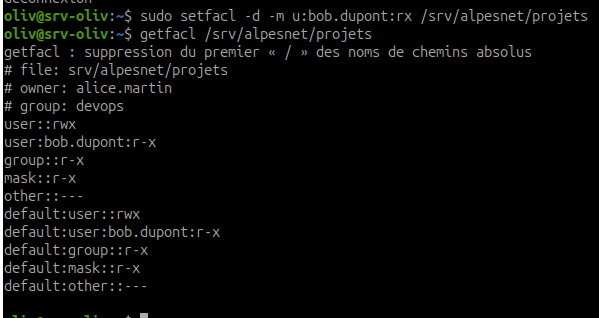
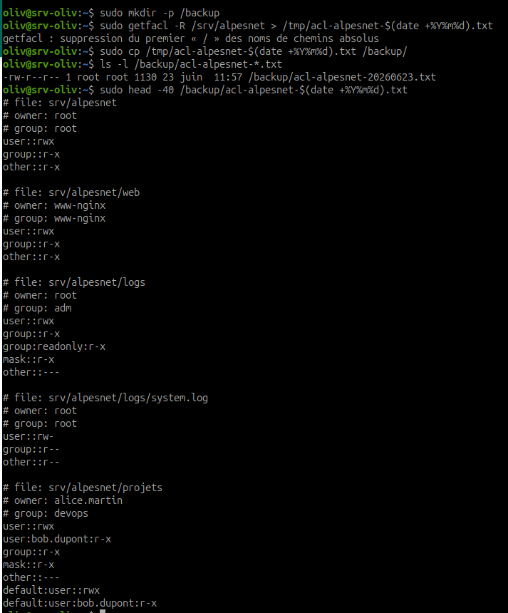

# Atelier - ACL Linux sur l'infrastructure AlpesNet

## Objectif

Comprendre la limite des permissions POSIX classiques, appliquer des ACL avec `setfacl`, les lire avec `getfacl`, configurer des ACL par défaut, puis sauvegarder les ACL de l'infrastructure AlpesNet.

Les ACL permettent d'ajouter des droits fins sans remplacer le propriétaire, le groupe propriétaire et les permissions POSIX de base.

## Pourquoi les ACL sont utiles

Les permissions POSIX classiques ont une limite : un fichier ou un répertoire possède seulement :

- un propriétaire ;
- un groupe propriétaire ;
- des droits pour les autres.

En production, ce modèle devient parfois trop limité. On peut avoir besoin de règles plus précises :

```text
alice peut lire
bob peut écrire
le groupe audit peut lire
les autres n'ont aucun droit
```

Les ACL répondent à ce besoin. Elles permettent d'ajouter des permissions pour des utilisateurs ou des groupes précis, sans changer toute la structure POSIX.

## Prérequis

Vérifier que les commandes ACL sont disponibles :

```bash
which setfacl
which getfacl
```

Si les commandes ne sont pas trouvées :

```bash
sudo apt update
sudo apt install acl
```

Vérifier l'arborescence AlpesNet :

```bash
ls -la /srv/alpesnet/
```

Répertoires attendus :

```text
projets
logs
secrets
web
```

## Étape 1 - Lire les permissions avant modification

Avant d'ajouter des ACL, afficher les permissions POSIX existantes :

```bash
ls -ld /srv/alpesnet/projets /srv/alpesnet/logs
```

Lire les ACL actuelles :

```bash
getfacl /srv/alpesnet/projets
getfacl /srv/alpesnet/logs
```



À observer :

- le propriétaire ;
- le groupe propriétaire ;
- les droits `user::`, `group::`, `other::` ;
- la présence ou non de lignes ACL spécifiques.

Observation : avant modification, `projets` appartient à `alice.martin:devops` et `logs` à `root:adm`. Aucune ACL spécifique pour `bob.dupont` ou `readonly` n'est encore visible.

## Étape 2 - Donner un accès à bob.dupont sur projets

Objectif : permettre à `bob.dupont` de lire et traverser `/srv/alpesnet/projets`.

Commande :

```bash
sudo setfacl -m u:bob.dupont:rx /srv/alpesnet/projets
```



Explication :

| Élément | Rôle |
| --- | --- |
| `setfacl` | modifie les ACL |
| `-m` | ajoute ou modifie une entrée ACL |
| `u:bob.dupont:rx` | donne à l'utilisateur `bob.dupont` les droits lecture et exécution |
| `/srv/alpesnet/projets` | répertoire ciblé |

Pourquoi `rx` ?

- `r` permet de lister le contenu ;
- `x` permet d'entrer dans le répertoire ;
- pas de `w`, car Bob ne doit pas modifier les projets.

## Étape 3 - Vérifier l'ACL de projets

Commande :

```bash
getfacl /srv/alpesnet/projets
```



Résultat attendu :

```text
# file: srv/alpesnet/projets
# owner: alice.martin
# group: devops
user::rwx
user:bob.dupont:r-x
group::r-x
mask::r-x
other::---
```

Point important : la ligne suivante doit apparaître :

```text
user:bob.dupont:r-x
```

La ligne `mask::r-x` limite les droits effectifs des ACL utilisateur et groupe nommés. Ici, elle autorise bien `r-x`.

## Étape 4 - Tester avec bob.dupont

Ouvrir une session avec Bob :

```bash
su - bob.dupont
```

Tester l'accès :

```bash
ls /srv/alpesnet/projets
```

Résultat attendu : Bob peut lister le répertoire.

Tester qu'il ne peut pas écrire :

```bash
touch /srv/alpesnet/projets/test-bob.txt
```



Résultat attendu :

```text
Permission denied
```

Revenir au compte initial :

```bash
exit
```

Conclusion : Bob peut lire et traverser `projets`, mais ne peut pas écrire. Le moindre privilège est respecté.

## Étape 5 - Donner un accès au groupe readonly sur logs

Objectif : permettre au groupe `readonly` de lire les logs sans lui donner de droit d'écriture.

Commande :

```bash
sudo setfacl -m g:readonly:r-x /srv/alpesnet/logs
```


Explication :

- `g:readonly:r-x` cible le groupe `readonly` ;
- `r` permet de lister le contenu ;
- `x` permet d'entrer dans le répertoire ;
- aucun `w` n'est donné.

!!! note "Pourquoi pas seulement r ?"
    Sur un répertoire, `r` seul ne suffit pas à travailler proprement. Il faut aussi `x` pour entrer dans le répertoire et accéder à ses entrées.

## Étape 6 - Vérifier l'ACL de logs

Commande :

```bash
getfacl /srv/alpesnet/logs
```



Résultat attendu :

```text
# file: srv/alpesnet/logs
# owner: root
# group: adm
user::rwx
group::r-x
group:readonly:r-x
mask::r-x
other::---
```

Ligne importante :

```text
group:readonly:r-x
```

Interprétation :

| Ligne | Signification |
| --- | --- |
| `user::rwx` | le propriétaire `root` a tous les droits |
| `group::r-x` | le groupe propriétaire peut lire et entrer |
| `group:readonly:r-x` | le groupe `readonly` peut lire et entrer grâce à l'ACL |
| `mask::r-x` | limite maximale des droits effectifs des groupes et utilisateurs nommés |
| `other::---` | les autres n'ont aucun droit |

## Étape 7 - Tester l'accès au groupe readonly

Bob appartient au groupe `readonly`. Vérifier :

```bash
id bob.dupont
```

Tester avec Bob :

```bash
su - bob.dupont
ls /srv/alpesnet/logs
touch /srv/alpesnet/logs/test-bob.log
exit
```



Résultat attendu :

- `ls /srv/alpesnet/logs` fonctionne ;
- `touch /srv/alpesnet/logs/test-bob.log` est refusé ;
- Bob peut lire ou lister, mais ne peut pas écrire.

## Étape 8 - Configurer une ACL par défaut

Une ACL classique s'applique au répertoire existant. Une ACL par défaut s'applique aux nouveaux fichiers et sous-répertoires créés ensuite dans ce répertoire.

Objectif : faire hériter les nouveaux éléments de `/srv/alpesnet/projets` d'un accès en lecture/traversée pour Bob.

Commande :

```bash
sudo setfacl -d -m u:bob.dupont:rx /srv/alpesnet/projets
```

Lire le résultat :

```bash
getfacl /srv/alpesnet/projets
```



Résultat attendu : une ligne commençant par `default:` doit apparaître.

Exemple :

```text
default:user:bob.dupont:r-x
```

!!! warning "ACL par défaut"
    Une ACL par défaut ne modifie pas automatiquement les fichiers déjà présents. Elle s'applique aux nouveaux éléments créés après sa configuration.

## Étape 9 - Sauvegarder les ACL

Créer le dossier de sauvegarde si besoin :

```bash
sudo mkdir -p /backup
```

Sauvegarder les ACL avec une date :

```bash
sudo getfacl -R /srv/alpesnet > /tmp/acl-alpesnet-$(date +%Y%m%d).txt
sudo cp /tmp/acl-alpesnet-$(date +%Y%m%d).txt /backup/
```

Vérifier :

```bash
ls -l /backup/acl-alpesnet-*.txt
```

Lire le début du fichier :

```bash
sudo head -40 /backup/acl-alpesnet-$(date +%Y%m%d).txt
```



Résultat attendu : le fichier de sauvegarde contient les sorties `getfacl` de `/srv/alpesnet` et de ses sous-répertoires.

## Étape 10 - Commandes utiles de diagnostic

Afficher les ACL d'un répertoire :

```bash
getfacl /srv/alpesnet/projets
```

Supprimer une ACL utilisateur :

```bash
sudo setfacl -x u:bob.dupont /srv/alpesnet/projets
```

Supprimer une ACL groupe :

```bash
sudo setfacl -x g:readonly /srv/alpesnet/logs
```

Supprimer toutes les ACL étendues d'un chemin :

```bash
sudo setfacl -b /srv/alpesnet/projets
```

Restaurer des ACL depuis une sauvegarde :

```bash
sudo setfacl --restore=/backup/acl-alpesnet-YYYYMMDD.txt
```

## Résultat attendu

À la fin de l'exercice :

- `getfacl /srv/alpesnet/projets` montre une ACL pour `bob.dupont` ;
- `bob.dupont` peut lister `/srv/alpesnet/projets` ;
- `bob.dupont` ne peut pas écrire dans `/srv/alpesnet/projets` ;
- `getfacl /srv/alpesnet/logs` montre une ACL pour le groupe `readonly` ;
- le groupe `readonly` peut lire ou traverser `/srv/alpesnet/logs` ;
- le groupe `readonly` ne peut pas écrire dans `/srv/alpesnet/logs` ;
- un fichier `/backup/acl-alpesnet-[date].txt` est créé.

## Ressources

- `man setfacl`
- `man getfacl`
- `man acl`
- [POSIX ACL HowTo](https://tldp.org/HOWTO/html_single/POSIX-ACL-HOWTO/)
- [ANSSI - Recommandations de sécurité relatives à un système GNU/Linux](https://www.ssi.gouv.fr/guide/recommandations-de-securite-relatives-a-un-systeme-gnulinux/)

## Synthèse à retenir

Les permissions POSIX fixent la base : propriétaire, groupe, autres. Les ACL ajoutent des exceptions maîtrisées pour des utilisateurs ou groupes précis.

Une ACL doit rester lisible, minimale et documentée. Si elle devient incompréhensible, elle devient un risque de sécurité.
