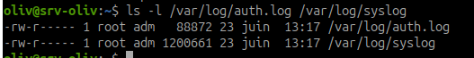
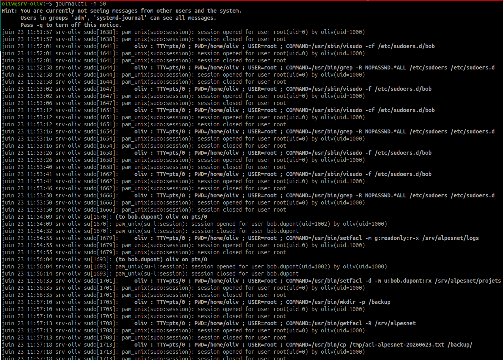
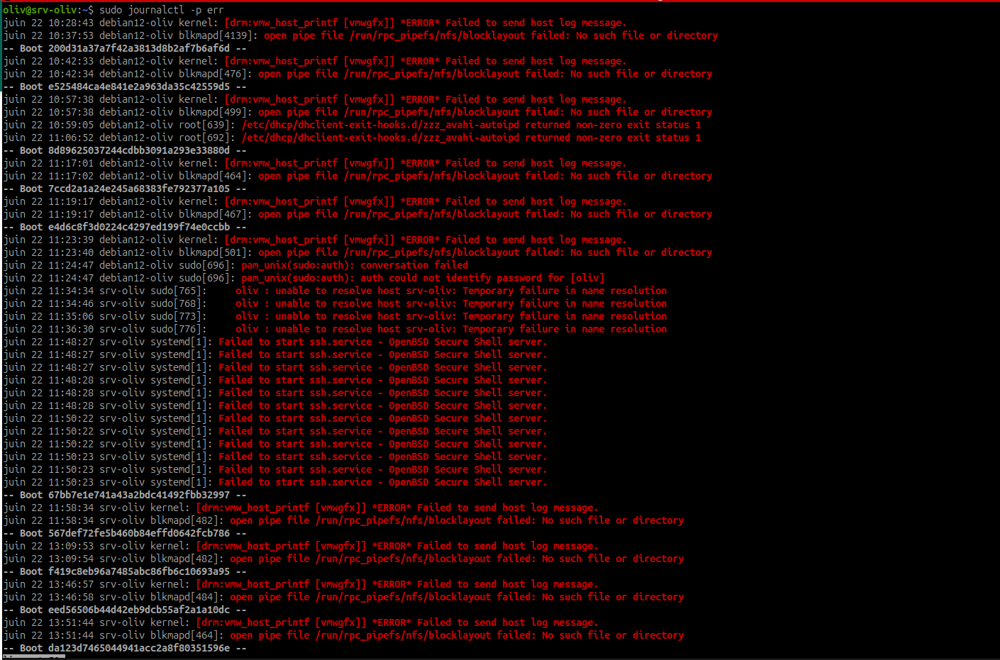
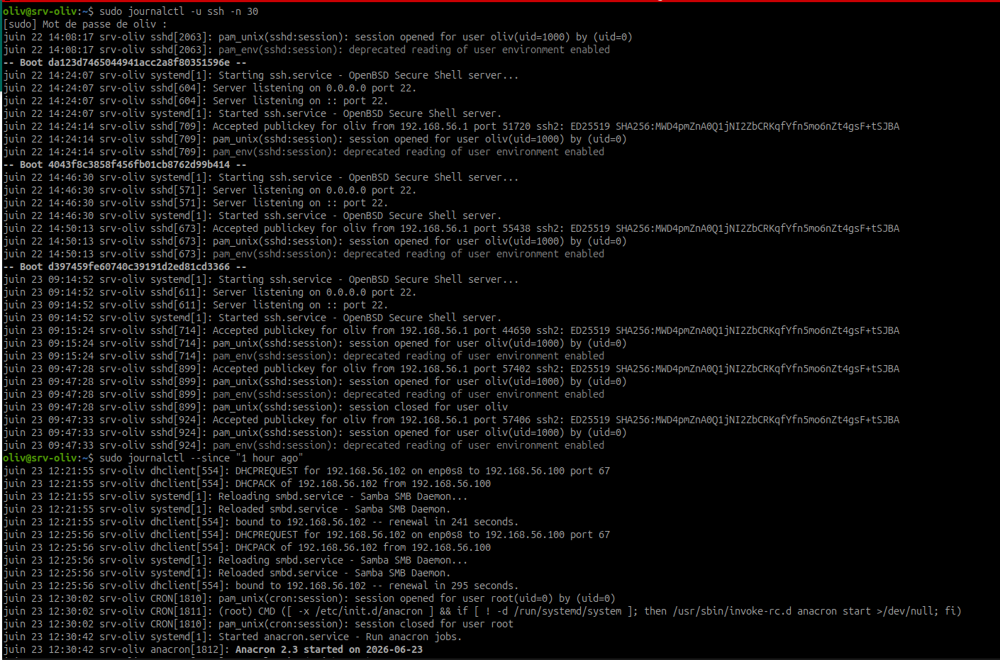
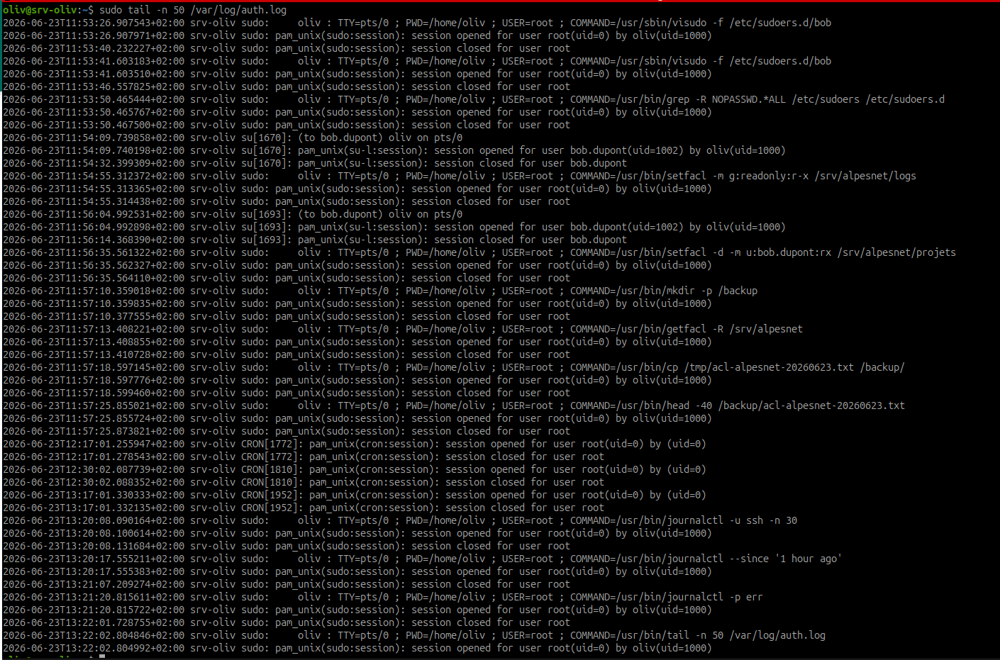
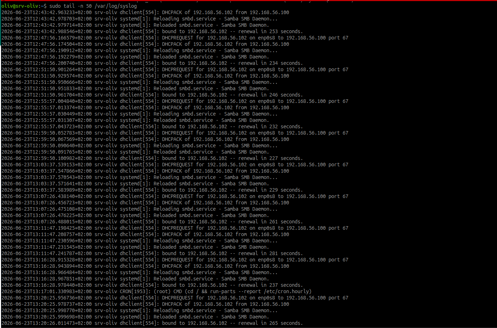
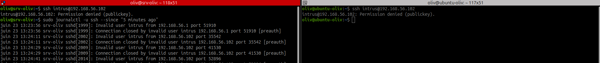
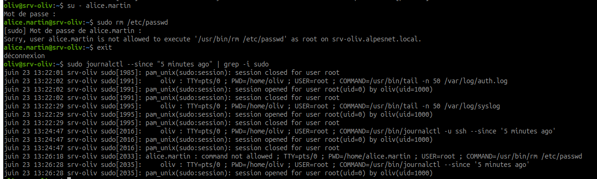
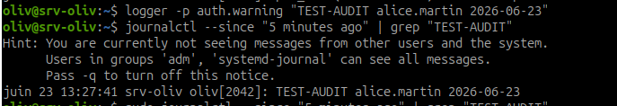

# Atelier - Logs système et journalctl AlpesNet

## Objectif

Comprendre que les logs sont la mémoire du système, provoquer des événements de sécurité, les retrouver avec `journalctl` ou les fichiers `/var/log`, puis interpréter les lignes observées.

La compétence attendue est simple :

```text
Provoquer un événement -> le retrouver dans les logs -> l'interpréter.
```

## Contexte

Lors de l'incident déclencheur, un attaquant a opéré pendant plusieurs mois sans être vu, car personne ne surveillait les journaux d'authentification.

Sur Linux, les logs permettent de répondre à des questions essentielles :

- qui a tenté de se connecter ?
- quel compte a utilisé `sudo` ?
- quelle commande a été refusée ?
- quel service a généré une erreur ?
- à quelle heure l'événement s'est produit ?

## À retenir

Les logs ne servent pas seulement après un incident. Ils servent aussi à vérifier qu'une action administrative a bien eu lieu, qu'un refus de sécurité fonctionne, ou qu'un service se comporte normalement.

## Étape 1 - Identifier les sources de logs

Sur Debian, deux sources sont très utiles :

| Source | Usage |
| --- | --- |
| `journalctl` | consulter le journal systemd |
| `/var/log/auth.log` | consulter les événements d'authentification |
| `/var/log/syslog` | consulter les événements système généraux |

Vérifier les fichiers présents :

```bash
ls -l /var/log/auth.log /var/log/syslog
```



Observation : les fichiers `/var/log/auth.log` et `/var/log/syslog` existent et appartiennent à `root:adm`.

Si un fichier n'existe pas, utiliser `journalctl`, qui est disponible sur les systèmes avec `systemd`.

## Étape 2 - Explorer journalctl

Afficher les derniers événements :

```bash
journalctl -n 50
```



Suivre les logs en temps réel :

```bash
journalctl -f
```

Afficher les logs depuis une période récente :

```bash
journalctl --since "1 hour ago"
```

Afficher les erreurs :

```bash
journalctl -p err
```



Lire les logs du service SSH :

```bash
journalctl -u ssh -n 30
```



!!! note "Nom du service SSH"
    Selon les distributions, le service peut s'appeler `ssh` ou `sshd`. Sur Debian, le nom courant est `ssh`.

## Étape 3 - Explorer les fichiers classiques

Lire les dernières lignes du journal d'authentification :

```bash
sudo tail -n 50 /var/log/auth.log
```



Suivre `auth.log` en temps réel :

```bash
sudo tail -f /var/log/auth.log
```

Lire les dernières lignes de `syslog` :

```bash
sudo tail -n 50 /var/log/syslog
```



Suivre `syslog` en temps réel :

```bash
sudo tail -f /var/log/syslog
```

Pour quitter un suivi en temps réel :

```text
Ctrl+C
```

## Étape 4 - Provoquer une tentative SSH avec un utilisateur inexistant

Objectif : générer volontairement un événement d'authentification échoué.

Depuis la VM ou depuis une autre machine qui peut joindre le serveur, tenter une connexion SSH avec un compte inexistant :

```bash
ssh intrus@srv-oliv
```

Si le nom DNS ne fonctionne pas, utiliser l'adresse IP du serveur :

```bash
ssh intrus@IP_DU_SERVEUR
```

Faire trois tentatives avec un mauvais mot de passe.



Observation : la tentative SSH avec l'utilisateur inexistant `intrus` est refusée, puis retrouvée côté serveur avec `journalctl -u ssh --since "5 minutes ago"`.

!!! warning "Exercice contrôlé"
    L'objectif est de générer un événement de test sur ta VM. Ne jamais faire ce type de test sur une machine qui ne t'appartient pas.

## Étape 5 - Retrouver la tentative SSH dans journalctl

Rechercher les événements SSH récents :

```bash
journalctl -u ssh --since "5 minutes ago"
```

Si rien n'apparaît, essayer :

```bash
sudo tail -n 50 /var/log/auth.log
```

ou :

```bash
journalctl --since "5 minutes ago" | grep -i ssh
```

Ligne attendue possible :

```text
sshd[1234]: Invalid user intrus from 192.168.1.50 port 54321
```

Interprétation :

| Champ | Signification |
| --- | --- |
| date et heure | moment de la tentative |
| hôte | serveur qui a journalisé l'événement |
| `sshd` | service SSH |
| PID | identifiant du processus |
| `Invalid user intrus` | compte inexistant utilisé |
| adresse IP | origine de la tentative |

## Étape 6 - Provoquer un refus sudo avec alice.martin

Objectif : vérifier que les droits sudo restreints d'Alice génèrent une trace lorsqu'une commande interdite est tentée.

Ouvrir une session Alice :

```bash
su - alice.martin
```

Tenter une commande interdite :

```bash
sudo rm /etc/passwd
```

Résultat attendu : la commande doit être refusée.

Revenir au compte initial :

```bash
exit
```

!!! danger "Commande sensible"
    Ne jamais contourner les protections de `rm`. Ici, le but est uniquement de vérifier que `sudo` refuse l'action.



Observation : `alice.martin` tente `sudo rm /etc/passwd`, la politique sudo refuse l'action, puis l'événement est retrouvé avec une recherche `journalctl` filtrée sur `sudo`.

## Étape 7 - Retrouver le refus sudo dans les logs

Rechercher les événements sudo récents :

```bash
journalctl --since "5 minutes ago" | grep -i sudo
```

Ou dans `auth.log` :

```bash
sudo tail -n 80 /var/log/auth.log | grep -i sudo
```

Ligne attendue possible :

```text
sudo: alice.martin : command not allowed ; TTY=pts/0 ; PWD=/home/alice.martin ; USER=root ; COMMAND=/usr/bin/rm /etc/passwd
```

Interprétation :

| Champ | Signification |
| --- | --- |
| `sudo` | programme qui journalise l'événement |
| `alice.martin` | compte qui a tenté l'action |
| `command not allowed` | commande refusée par la politique sudo |
| `TTY` | terminal utilisé |
| `PWD` | répertoire courant |
| `USER=root` | utilisateur cible demandé |
| `COMMAND` | commande réellement demandée |

## Étape 8 - Injecter un événement de test avec logger

Objectif : créer volontairement une ligne de log identifiable.

Commande :

```bash
logger -p auth.warning "TEST-AUDIT alice.martin 2026-06-23"
```



Observation : le message `TEST-AUDIT alice.martin 2026-06-23` est injecté avec `logger`, puis retrouvé dans les logs avec `journalctl`.

Explication :

| Élément | Rôle |
| --- | --- |
| `logger` | envoie un message dans les logs |
| `-p auth.warning` | facility `auth`, priorité `warning` |
| `TEST-AUDIT...` | message reconnaissable dans les journaux |

## Étape 9 - Retrouver l'événement logger

Rechercher le message :

```bash
journalctl --since "5 minutes ago" | grep "TEST-AUDIT"
```

Ou :

```bash
sudo grep "TEST-AUDIT" /var/log/auth.log /var/log/syslog
```

Ligne attendue possible :

```text
srv-oliv oliv: TEST-AUDIT alice.martin 2026-06-23
```

Interprétation :

| Champ | Signification |
| --- | --- |
| date et heure | moment de l'injection |
| hôte | machine qui a reçu le log |
| utilisateur ou programme | émetteur du message |
| `TEST-AUDIT` | marqueur choisi pour retrouver facilement l'événement |
| `alice.martin` | compte concerné par le test |
| date dans le message | date métier indiquée dans le contenu |

## Résultat attendu

À la fin de l'exercice :

- une tentative SSH avec utilisateur inexistant a été provoquée ;
- l'événement SSH est retrouvé avec `journalctl` ou `auth.log` ;
- une commande `sudo` interdite a été tentée avec `alice.martin` ;
- le refus sudo est retrouvé et interprété ;
- un message `TEST-AUDIT` est injecté avec `logger` ;
- le message est retrouvé dans les logs ;
- trois lignes de logs sont copiées dans le carnet avec interprétation.

## Ressources

- `man journalctl`
- `man systemd-journald`
- [DigitalOcean - How To Use Journalctl](https://www.digitalocean.com/community/tutorials/how-to-use-journalctl-to-view-and-manipulate-systemd-logs)
- [RFC 5424 - The Syslog Protocol](https://datatracker.ietf.org/doc/html/rfc5424)

## Synthèse à retenir

Un log n'a de valeur que s'il est lu et compris. Dans un contexte de sécurité, savoir provoquer un événement, le retrouver et l'interpréter permet de vérifier que les traces existent avant d'en avoir besoin en situation réelle.
