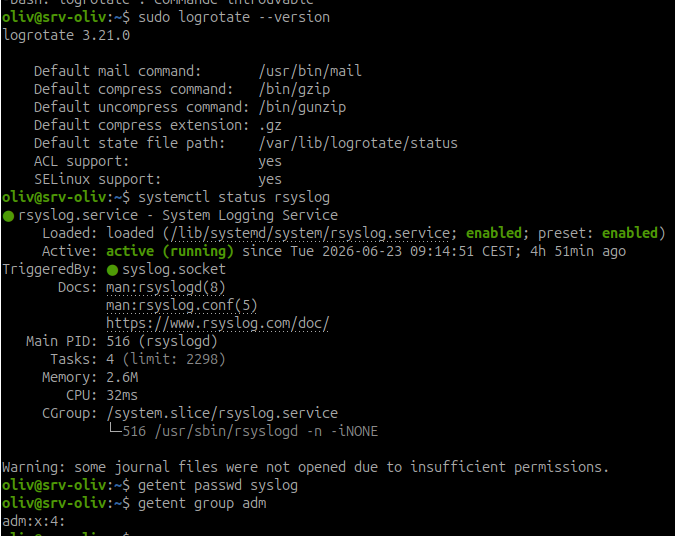
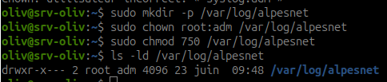
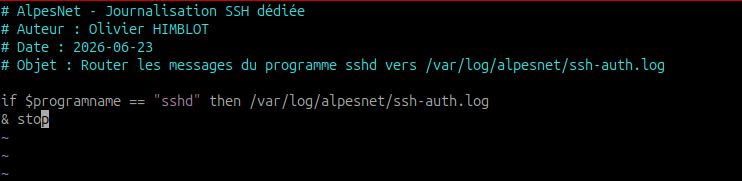
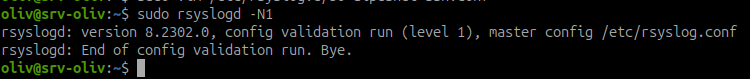
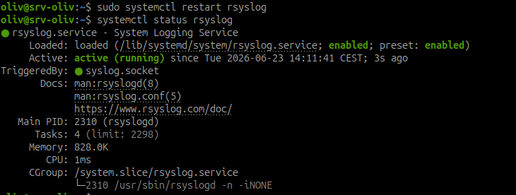
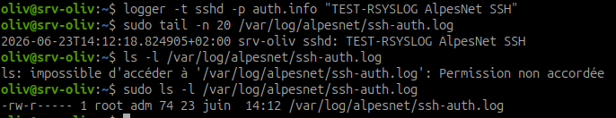
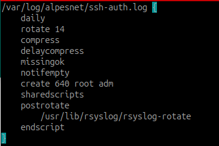
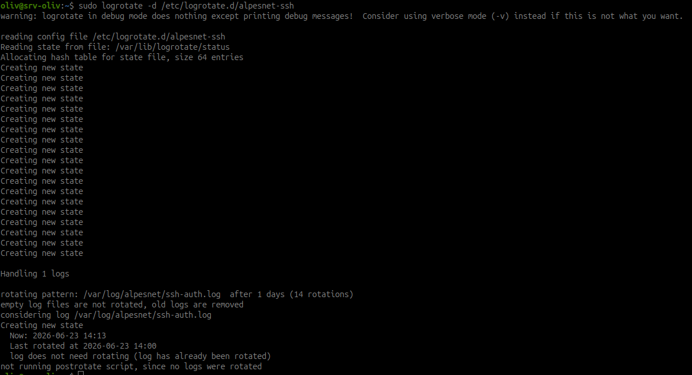
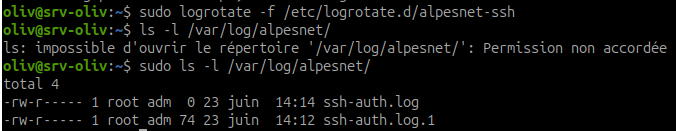

# Atelier - Politique de journalisation SSH AlpesNet avec rsyslog et logrotate

## Objectif

Créer une politique de journalisation dédiée aux événements SSH d'AlpesNet :

- `rsyslog` route les messages SSH vers un fichier dédié ;
- `logrotate` évite que les logs remplissent le disque ;
- les permissions du dossier de logs respectent le moindre privilège ;
- la configuration est testée et documentée.

`rsyslog` et `logrotate` forment ensemble la politique de journalisation du serveur.

## Principe

`rsyslog` reçoit les messages système et les écrit dans des fichiers selon des règles.

`logrotate` gère le cycle de vie de ces fichiers :

- rotation quotidienne ;
- conservation limitée ;
- compression ;
- création du nouveau fichier avec les bons droits ;
- signal envoyé au service de logs après rotation.

## Étape 1 - Vérifier les services et outils

Vérifier que `rsyslog` est installé et actif :

```bash
systemctl status rsyslog
```

Vérifier que `logrotate` est disponible :

```bash
logrotate --version
```

Vérifier le compte et le groupe utilisés pour les logs :

```bash
getent passwd syslog
getent group adm
```



Point de contrôle :

- le groupe `adm` doit exister ;
- `rsyslog` doit être actif ou démarrable.

!!! note "Utilisateur syslog absent"
    Sur cette VM Debian, l'utilisateur `syslog` peut ne pas exister. Dans ce cas, on utilise `root:adm` pour le répertoire et les fichiers de logs : `root` garde l'écriture système, et le groupe `adm` peut consulter.

## Étape 2 - Créer le répertoire de logs AlpesNet

Créer le répertoire dédié :

```bash
sudo mkdir -p /var/log/alpesnet
```

Attribuer le propriétaire et le groupe :

```bash
sudo chown root:adm /var/log/alpesnet
```

Appliquer les permissions :

```bash
sudo chmod 750 /var/log/alpesnet
```

Vérifier :

```bash
ls -ld /var/log/alpesnet
```



Résultat attendu :

```text
drwxr-x--- root adm ... /var/log/alpesnet
```

Justification :

- `root` permet à `rsyslog` d'écrire les logs sur cette VM ;
- le groupe `adm` peut consulter ;
- les autres utilisateurs n'ont aucun droit.

## Étape 3 - Créer la règle rsyslog

Créer le fichier :

```bash
sudo vim /etc/rsyslog.d/50-alpesnet-ssh.conf
```

Contenu à mettre dans le fichier :

```text
# AlpesNet - Journalisation SSH dédiée
# Auteur : Olivier HIMBLOT
# Date : 2026-06-23
# Objet : Router les messages du programme sshd vers /var/log/alpesnet/ssh-auth.log

if $programname == "sshd" then /var/log/alpesnet/ssh-auth.log
& stop
```



Explication :

| Élément | Rôle |
| --- | --- |
| `$programname == "sshd"` | sélectionne les messages émis par SSH |
| `/var/log/alpesnet/ssh-auth.log` | fichier de destination |
| `& stop` | empêche la règle suivante de retraiter le même message |

## Étape 4 - Vérifier la syntaxe rsyslog

Tester la configuration :

```bash
sudo rsyslogd -N1
```



Résultat attendu :

```text
rsyslogd: End of config validation run. Bye.
```

Si une erreur apparaît, corriger le fichier :

```bash
sudo vim /etc/rsyslog.d/50-alpesnet-ssh.conf
```

Puis relancer :

```bash
sudo rsyslogd -N1
```

## Étape 5 - Redémarrer rsyslog

Redémarrer le service :

```bash
sudo systemctl restart rsyslog
```

Vérifier son état :

```bash
systemctl status rsyslog
```



Point de contrôle : le service doit être `active (running)`.

## Étape 6 - Tester la règle rsyslog

Créer un message de test qui imite le programme `sshd` :

```bash
logger -t sshd -p auth.info "TEST-RSYSLOG AlpesNet SSH"
```

!!! note "Pourquoi `-t sshd` ?"
    La règle filtre `$programname == "sshd"`. Sans `-t sshd`, le message `logger` ne porte pas le bon nom de programme et ne sera pas routé vers le fichier dédié.

Vérifier le fichier dédié :

```bash
sudo tail -n 20 /var/log/alpesnet/ssh-auth.log
```

Résultat attendu :

```text
TEST-RSYSLOG AlpesNet SSH
```

Vérifier les droits du fichier créé :

```bash
ls -l /var/log/alpesnet/ssh-auth.log
```



## Étape 7 - Créer la politique logrotate

Créer le fichier :

```bash
sudo vim /etc/logrotate.d/alpesnet-ssh
```

Contenu à mettre dans le fichier :

```text
/var/log/alpesnet/ssh-auth.log {
    daily
    rotate 14
    compress
    delaycompress
    missingok
    notifempty
    create 640 root adm
    sharedscripts
    postrotate
        /usr/lib/rsyslog/rsyslog-rotate
    endscript
}
```



Explication :

| Directive | Rôle |
| --- | --- |
| `daily` | rotation quotidienne |
| `rotate 14` | conserve 14 anciennes versions |
| `compress` | compresse les anciens logs |
| `delaycompress` | attend une rotation avant compression |
| `missingok` | ne génère pas d'erreur si le fichier manque |
| `notifempty` | ne tourne pas un fichier vide |
| `create 640 root adm` | recrée le fichier avec les bons droits sur cette VM |
| `postrotate` | action exécutée après rotation |
| `/usr/lib/rsyslog/rsyslog-rotate` | demande à rsyslog de rouvrir ses fichiers |

!!! note "Si le script rsyslog-rotate n'existe pas"
    Vérifier avec `ls -l /usr/lib/rsyslog/rsyslog-rotate`. Si le fichier n'existe pas, utiliser une commande de rechargement adaptée au système, par exemple `systemctl kill -s HUP rsyslog.service`.

## Étape 8 - Simuler logrotate sans modifier les fichiers

Lancer une simulation :

```bash
sudo logrotate -d /etc/logrotate.d/alpesnet-ssh
```



À vérifier :

- aucune erreur de syntaxe ;
- le fichier `/var/log/alpesnet/ssh-auth.log` est bien pris en compte ;
- la sortie indique ce que `logrotate` ferait.

Cette commande ne modifie pas les fichiers : elle sert uniquement au diagnostic.

## Étape 9 - Forcer une rotation de test

Forcer la rotation :

```bash
sudo logrotate -f /etc/logrotate.d/alpesnet-ssh
```

Vérifier les fichiers :

```bash
ls -l /var/log/alpesnet/
```



Résultat attendu possible :

```text
ssh-auth.log
ssh-auth.log.1
```

Après plusieurs rotations ou selon l'état précédent, des fichiers compressés peuvent apparaître :

```text
ssh-auth.log.2.gz
```

!!! note "Compression différée"
    Avec `delaycompress`, le fichier `.1` n'est généralement pas compressé immédiatement. La compression apparaît à partir de la rotation suivante.

## Étape 10 - Vérifier que rsyslog écrit toujours après rotation

Envoyer un nouveau message de test :

```bash
logger -t sshd -p auth.info "TEST-RSYSLOG APRES ROTATION"
```

Vérifier :

```bash
sudo tail -n 20 /var/log/alpesnet/ssh-auth.log
```


Résultat attendu :

```text
TEST-RSYSLOG APRES ROTATION
```

Conclusion : la rotation n'a pas cassé l'écriture des logs.

## Résultat attendu

À la fin de l'exercice :

- le message de test apparaît dans `/var/log/alpesnet/ssh-auth.log` ;
- `sudo rsyslogd -N1` ne signale pas d'erreur ;
- `sudo logrotate -d /etc/logrotate.d/alpesnet-ssh` ne signale pas d'erreur ;
- une rotation forcée crée des fichiers de rotation ;
- des fichiers `.gz` apparaissent après rotations successives si la compression est déclenchée ;
- `rsyslog` écrit toujours dans le fichier après rotation.

## Synthèse à retenir

Une bonne politique de journalisation ne se limite pas à écrire des logs. Elle doit aussi décider où ils vont, qui peut les lire, combien de temps ils sont conservés, et comment éviter qu'ils remplissent le disque.
