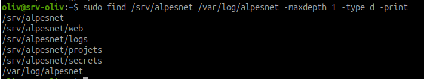
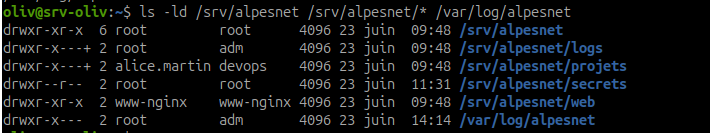
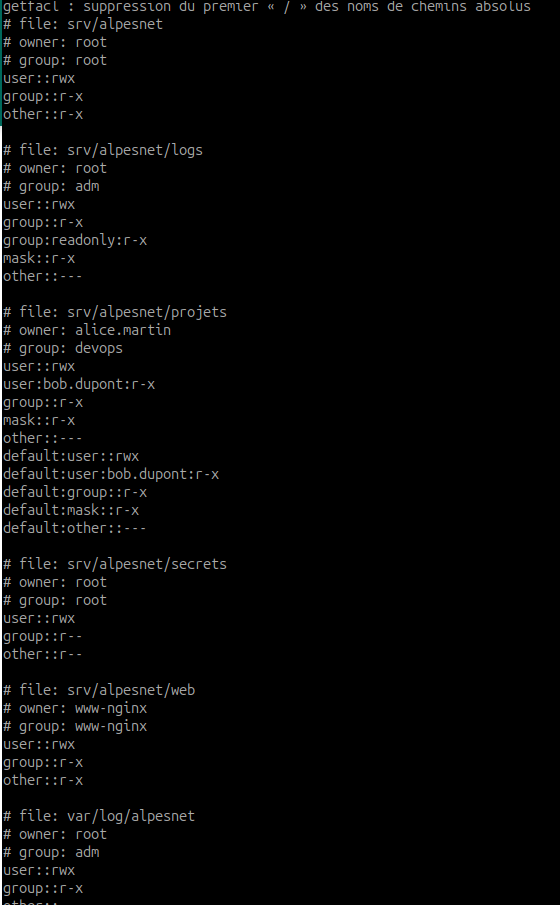

# Audit permissions AlpesNet

| en tête | audit alpesNet |
| --- | --- |
| Nom | HIMBLOT |
| Prénom | Olivier |
| Site | AlpesNet |
| Module | Administration des systèmes - Linux |
| Atelier | Audit des permissions AlpesNet |
| Date | 23 juin 2026 |
| Machine | srv-oliv |
| Distribution | Debian GNU/Linux 12 (bookworm) |
| Objet | /srv/alpesnet et /var/log/alpesnet |

## Contexte

Le DSI d'AlpesNet demande un audit complet des permissions avant la mise en production :

> Avant la mise en production, j'ai besoin d'un audit complet des permissions sur `/srv/alpesnet` et `/var/log/alpesnet`. Le prestataire a laissé la structure mais je ne suis pas sûr que tout soit correct.

Périmètre audité :

- `/srv/alpesnet` ;
- tous les sous-répertoires directs de `/srv/alpesnet` ;
- `/var/log/alpesnet`.

Objectif : vérifier les propriétaires, groupes, permissions POSIX et ACL éventuelles, puis identifier les écarts au principe du moindre privilège.

## Étape 1 - Préparation du rapport

Le rapport d'audit a été créé avec un en-tête standard indiquant le nom, le site, la machine, la distribution et le périmètre audité.

Cette étape permet de rendre le rapport relisible par une personne qui n'était pas présente pendant l'audit.

## Étape 2 - Liste des chemins audités

Commande utilisée :

```bash
sudo find /srv/alpesnet /var/log/alpesnet -maxdepth 1 -type d -print
```



Résultat observé :

```text
/srv/alpesnet
/srv/alpesnet/web
/srv/alpesnet/logs
/srv/alpesnet/projets
/srv/alpesnet/secrets
/var/log/alpesnet
```

Conclusion de l'étape : tous les répertoires attendus sont présents dans le périmètre d'audit.

## Étape 3 - Relevé des permissions POSIX

Commande utilisée :

```bash
ls -ld /srv/alpesnet /srv/alpesnet/* /var/log/alpesnet
```



Résultat analysé :

| Chemin | Propriétaire | Groupe | Permissions | Analyse |
| --- | --- | --- | --- | --- |
| `/srv/alpesnet` | `root` | `root` | `drwxr-xr-x` | Conforme : racine traversable pour atteindre les sous-répertoires |
| `/srv/alpesnet/logs` | `root` | `adm` | `drwxr-x---+` | Conforme : accès limité à root, au groupe `adm` et aux ACL justifiées |
| `/srv/alpesnet/projets` | `alice.martin` | `devops` | `drwxr-x---+` | Conforme : accès limité au propriétaire, au groupe et aux ACL justifiées |
| `/srv/alpesnet/secrets` | `root` | `root` | `drwx------` | Conforme : accès réservé à root |
| `/srv/alpesnet/web` | `www-nginx` | `www-nginx` | `drwxr-xr-x` | Conforme : contenu web lisible, écriture réservée au service |
| `/var/log/alpesnet` | `root` | `adm` | `drwxr-x---` | Conforme : logs dédiés consultables par `adm`, non accessibles aux autres |

Observation : le signe `+` sur `logs` et `projets` indique la présence d'ACL. Il faut donc vérifier ces ACL avant de conclure.

## Étape 4 - Relevé des ACL

Commande utilisée :

```bash
getfacl /srv/alpesnet /srv/alpesnet/* /var/log/alpesnet
```



ACL observées :

| Chemin | ACL observée | Analyse |
| --- | --- | --- |
| `/srv/alpesnet` | aucune ACL spécifique | Conforme |
| `/srv/alpesnet/logs` | `group:readonly:r-x` | Conforme : le groupe `readonly` peut lire et traverser, sans écrire |
| `/srv/alpesnet/projets` | `user:bob.dupont:r-x` et ACL par défaut pour `bob.dupont` | Conforme : Bob peut consulter les projets sans écrire |
| `/srv/alpesnet/secrets` | aucune ACL spécifique | Conforme : pas d'exception sur le répertoire sensible |
| `/srv/alpesnet/web` | aucune ACL spécifique | Conforme |
| `/var/log/alpesnet` | aucune ACL spécifique visible | Conforme |

Interprétation :

- `user:bob.dupont:r-x` donne à Bob un accès en lecture et traversée sur `/srv/alpesnet/projets`.
- L'absence de `w` empêche Bob de créer, modifier ou supprimer des fichiers dans `projets`.
- `group:readonly:r-x` donne au groupe `readonly` un accès en lecture et traversée sur `/srv/alpesnet/logs`.
- L'absence de `w` empêche le groupe `readonly` d'écrire dans les logs.
- `/srv/alpesnet/secrets` reste protégé par `root:root` en `700`, sans ACL ajoutée.

## Étape 5 - Comparaison avec l'état attendu

| Chemin | État attendu | État observé | Conclusion |
| --- | --- | --- | --- |
| `/srv/alpesnet` | `root:root` en `755` | `root:root` en `755` | Conforme |
| `/srv/alpesnet/logs` | `root:adm` en `750`, ACL `readonly:r-x` possible | `root:adm` en `750`, ACL `readonly:r-x` | Conforme |
| `/srv/alpesnet/projets` | `alice.martin:devops` en `750`, ACL `bob.dupont:r-x` possible | `alice.martin:devops` en `750`, ACL `bob.dupont:r-x` | Conforme |
| `/srv/alpesnet/secrets` | `root:root` en `700`, aucune ACL | `root:root` en `700`, aucune ACL | Conforme |
| `/srv/alpesnet/web` | `www-nginx:www-nginx` en `755` | `www-nginx:www-nginx` en `755` | Conforme |
| `/var/log/alpesnet` | `root:adm` en `750` | `root:adm` en `750` | Conforme |

## Étape 6 - Écarts identifiés

Aucun écart critique n'a été identifié dans les captures fournies.

Les ACL présentes sont justifiées :

- `bob.dupont` dispose d'un accès en lecture/traversée sur `projets`, sans droit d'écriture ;
- le groupe `readonly` dispose d'un accès en lecture/traversée sur `logs`, sans droit d'écriture.

Les répertoires sensibles ne sont pas ouverts à tous :

- `/srv/alpesnet/secrets` est en `700` ;
- `/srv/alpesnet/logs` est en `750` ;
- `/var/log/alpesnet` est en `750`.

## Étape 7 - Corrections appliquées

Aucune correction n'a été nécessaire d'après l'état observé.

Si un écart avait été détecté, il aurait été documenté sous cette forme :

```text
Chemin :
État avant :
Écart :
Risque :
Commande appliquée :
État après :
Vérification :
```

## Étape 8 - État final

État final validé :

| Élément contrôlé | État final |
| --- | --- |
| Propriétaires | Cohérents avec les rôles AlpesNet |
| Groupes | Cohérents avec les accès attendus |
| Permissions POSIX | Conformes au moindre privilège |
| ACL | Présentes uniquement sur `projets` et `logs`, avec droits limités |
| Répertoires sensibles | Non accessibles aux autres utilisateurs |

## Conclusion

L'audit des permissions sur `/srv/alpesnet` et `/var/log/alpesnet` ne révèle pas d'écart au principe du moindre privilège.

Les droits POSIX sont cohérents avec les rôles des comptes et services. Les ACL présentes sont limitées, justifiées et n'accordent pas de droit d'écriture inutile. L'état observé est donc conforme pour une mise en production côté permissions.
