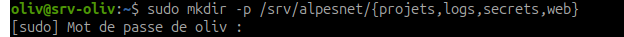
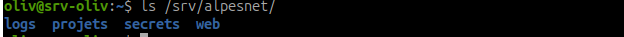
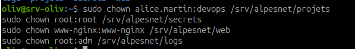
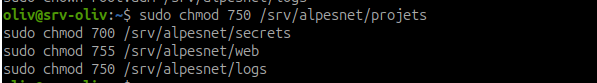
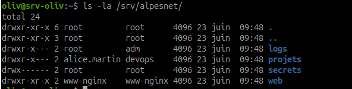
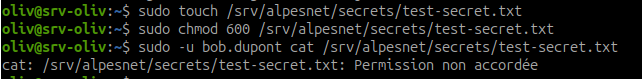

# Synthèse - Permissions Linux : chmod, chown et umask

## Objectif

Appliquer `chmod` en notation symbolique et octale, configurer les propriétaires avec `chown`, comprendre `umask`, et justifier chaque permission selon le principe du moindre privilège.

La règle à retenir : chaque permission Linux doit être justifiable. On donne uniquement le strict minimum pour que le service ou l'utilisateur fonctionne.

!!! danger "chmod 777"
    `chmod 777` signifie : tout le monde peut lire, écrire et exécuter. C'est la traduction technique d'une absence de politique de sécurité.

## Principe du moindre privilège

Le principe du moindre privilège consiste à donner uniquement les droits nécessaires :

- un utilisateur humain doit accéder seulement à ses fichiers ou à ceux de son équipe ;
- un service doit accéder uniquement aux répertoires dont il a besoin ;
- les fichiers sensibles doivent être lisibles par le minimum de comptes ;
- l'écriture doit être encore plus limitée que la lecture ;
- l'exécution sur un répertoire correspond au droit d'y entrer.

Avant d'appliquer une permission, il faut pouvoir répondre à trois questions :

1. Qui doit lire ?
2. Qui doit écrire ?
3. Qui doit entrer dans le répertoire ou exécuter le fichier ?

## Comprendre les trois familles de droits

| Élément | Signification | Exemple |
| --- | --- | --- |
| `u` | user, propriétaire du fichier | `alice.martin` |
| `g` | group, groupe propriétaire | `devops` |
| `o` | others, tous les autres utilisateurs | `bob.dupont`, comptes non membres du groupe |

| Droit | Sur un fichier | Sur un répertoire |
| --- | --- | --- |
| `r` | lire le contenu | lister le contenu |
| `w` | modifier le fichier | créer, supprimer ou renommer dedans |
| `x` | exécuter le fichier | entrer dans le répertoire |

## Notation symbolique

La notation symbolique permet d'ajouter, retirer ou définir des droits précisément.

| Commande | Effet |
| --- | --- |
| `chmod u+x fichier` | ajoute l'exécution au propriétaire |
| `chmod g-w fichier` | retire l'écriture au groupe |
| `chmod o= fichier` | supprime tous les droits des autres |
| `chmod u=rw,g=r,o= fichier` | définit exactement les droits du propriétaire, du groupe et des autres |
| `chmod -R g+rX dossier` | ajoute lecture au groupe et exécution seulement aux répertoires ou fichiers déjà exécutables |

Exemples :

```bash
chmod u+x script.sh
chmod g-w fichier.conf
chmod o= secrets.txt
```

## Notation octale

La notation octale repose sur l'addition des valeurs suivantes :

```text
r = 4
w = 2
x = 1
```

Exemples de calcul :

| Octal | Calcul | Permissions |
| --- | --- | --- |
| `7` | `4+2+1` | `rwx` |
| `6` | `4+2` | `rw-` |
| `5` | `4+1` | `r-x` |
| `4` | `4` | `r--` |
| `0` | `0` | `---` |

Un mode complet se lit toujours dans l'ordre propriétaire, groupe, autres.

Exemple :

```text
640 = rw-r-----
```

- propriétaire : `6` donc `rw-` ;
- groupe : `4` donc `r--` ;
- autres : `0` donc `---`.

## Modes à connaître

| Octal | Permissions | Cas d'usage |
| --- | --- | --- |
| `700` | `rwx------` | Répertoire home root, répertoires secrets |
| `750` | `rwxr-x---` | Répertoire service accessible au propriétaire et au groupe |
| `640` | `rw-r-----` | Fichier de configuration sensible |
| `644` | `rw-r--r--` | Fichier de configuration public |
| `600` | `rw-------` | Clé privée SSH, obligatoire pour éviter un refus SSH |
| `755` | `rwxr-xr-x` | Répertoire ou contenu web public en lecture |

!!! note "Différence fichier / répertoire"
    Sur un répertoire, le droit `x` permet d'entrer dans le dossier. Sans `x`, un utilisateur ne peut pas traverser le répertoire, même s'il a le droit `r`.

## Modifier les propriétaires avec chown

`chown` permet de modifier le propriétaire et le groupe propriétaire.

Syntaxe :

```bash
sudo chown utilisateur:groupe chemin
```

Exemples :

```bash
sudo chown alice.martin:devops /srv/alpesnet
sudo chown -R www-nginx:www-nginx /var/www/html
```

Le `-R` applique le changement récursivement à tout le contenu d'un répertoire.

!!! warning "Attention à chown -R"
    Une commande récursive mal ciblée peut casser beaucoup de droits d'un coup. Toujours vérifier le chemin avant d'exécuter.

## Comprendre umask

`umask` définit les droits retirés par défaut lors de la création de nouveaux fichiers ou répertoires.

Valeur fréquente :

```bash
umask
```

Résultat courant :

```text
0022
```

Avec `umask 022` :

| Type créé | Droits théoriques | Droits retirés | Résultat |
| --- | --- | --- | --- |
| Fichier | `666` | `022` | `644` |
| Répertoire | `777` | `022` | `755` |

Donc, par défaut :

- les fichiers sont créés en `644` ;
- les répertoires sont créés en `755`.

## Exercice - Sécuriser les répertoires AlpesNet

### 1. Créer l'arborescence

Commande :

```bash
sudo mkdir -p /srv/alpesnet/{projets,logs,secrets,web}
```

Objectif : préparer les quatre répertoires nécessaires à l'infrastructure AlpesNet.



Vérification :

```bash
ls /srv/alpesnet/
```



Observation : les quatre répertoires `logs`, `projets`, `secrets` et `web` sont présents dans `/srv/alpesnet`.

### 2. Appliquer les propriétaires et les groupes

Commandes :

```bash
sudo chown alice.martin:devops /srv/alpesnet/projets
sudo chown root:root /srv/alpesnet/secrets
sudo chown www-nginx:www-nginx /srv/alpesnet/web
sudo chown root:adm /srv/alpesnet/logs
```

!!! note "Groupe des logs"
    Sur cette VM Debian, le groupe `syslog` n'existe pas. Le groupe `adm` est donc utilisé pour `/srv/alpesnet/logs`, car il sert classiquement à autoriser la consultation de certains journaux système.



Observation : chaque répertoire reçoit un propriétaire et un groupe adaptés à son rôle.

Justification :

| Répertoire | Propriétaire:groupe | Justification |
| --- | --- | --- |
| `/srv/alpesnet/projets` | `alice.martin:devops` | Alice pilote les projets, le groupe DevOps doit pouvoir consulter et entrer |
| `/srv/alpesnet/secrets` | `root:root` | Données sensibles réservées à l'administration système |
| `/srv/alpesnet/web` | `www-nginx:www-nginx` | Le service web doit posséder son espace applicatif |
| `/srv/alpesnet/logs` | `root:adm` | Les logs sont administrés par root et consultables par un groupe système dédié |

### 3. Appliquer les permissions

Commandes :

```bash
sudo chmod 750 /srv/alpesnet/projets
sudo chmod 700 /srv/alpesnet/secrets
sudo chmod 755 /srv/alpesnet/web
sudo chmod 750 /srv/alpesnet/logs
```



Observation : les permissions sont appliquées en notation octale selon le niveau de sensibilité de chaque répertoire.

Justification :

| Répertoire | Mode | Justification |
| --- | --- | --- |
| `/srv/alpesnet/projets` | `750` | propriétaire complet, groupe en lecture/exécution, autres exclus |
| `/srv/alpesnet/secrets` | `700` | seul `root` peut lire, écrire et entrer |
| `/srv/alpesnet/web` | `755` | contenu web consultable, écriture réservée au propriétaire |
| `/srv/alpesnet/logs` | `750` | root administre, groupe `adm` peut consulter, autres exclus |

### 4. Vérifier l'état obtenu

Commande :

```bash
ls -la /srv/alpesnet/
```



Résultat attendu :

```text
drwxr-xr-x root         root      .
drwxr-xr-x root         root      ..
drwxr-x--- root         adm       logs
drwxr-x--- alice.martin devops    projets
drwx------ root         root      secrets
drwxr-xr-x www-nginx    www-nginx web
```

Le résultat peut varier légèrement dans l'affichage selon l'ordre des colonnes, mais les propriétaires, groupes et permissions doivent correspondre.

### 5. Tester l'accès au répertoire secrets

Créer un fichier test :

```bash
sudo touch /srv/alpesnet/secrets/test-secret.txt
sudo chmod 600 /srv/alpesnet/secrets/test-secret.txt
```

Vérifier avec `bob.dupont` :

```bash
sudo -u bob.dupont cat /srv/alpesnet/secrets/test-secret.txt
```



Résultat attendu :

```text
Permission non accordée
```

Conclusion : `bob.dupont` ne peut pas lire le fichier secret, ce qui respecte le principe du moindre privilège.

## Ressources

- `man chmod`
- `man chown`
- `man umask`
- [chmod Calculator](https://chmod-calculator.com/)
- [Debian Wiki - Permissions](https://wiki.debian.org/Permissions)

## Synthèse à retenir

`chmod` définit ce qu'on peut faire, `chown` définit à qui appartient la ressource, et `umask` définit les droits créés par défaut.

Une permission correcte n'est pas une permission qui "marche". C'est une permission minimale, vérifiée, et justifiée.
