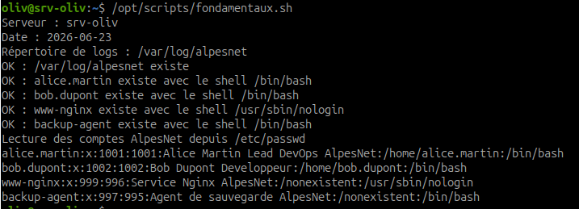
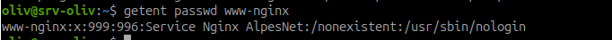

# Fondamentaux Bash - variables, conditions, boucles

## Objectif

Comprendre les bases Bash utiles à l'administration système : variables, tests, tableaux, boucles, codes de retour et lecture ligne par ligne.

Bash est un langage d'administration, pas un langage de programmation générale. Chaque ligne peut avoir des effets réels sur le système.

!!! warning "Règle absolue"
    En début de script d'administration, utiliser `set -euo pipefail` pour stopper immédiatement en cas d'erreur, de variable non définie ou d'erreur dans un pipeline.

## Pourquoi set -euo pipefail ?

```bash
set -euo pipefail
```

| Option | Rôle |
| --- | --- |
| `-e` | arrête le script si une commande échoue |
| `-u` | arrête le script si une variable non définie est utilisée |
| `-o pipefail` | considère un pipeline comme échoué si une commande du pipeline échoue |

Sans cette ligne, un script peut continuer après une erreur et produire un état incohérent.

## Étape 1 - Lire les exemples fondamentaux

### Variables simples

```bash
SERVEUR="srv-alice"
DATE="$(date +%Y-%m-%d)"
```

Explication :

- `SERVEUR` contient une chaîne de caractères ;
- `DATE` contient le résultat de la commande `date` ;
- les guillemets protègent les espaces et caractères spéciaux.

### Test sur fichier ou répertoire

```bash
LOG_DIR="/var/log/alpesnet"

if [ -d "$LOG_DIR" ]; then
    echo "OK : le répertoire existe"
else
    echo "ALERTE : le répertoire est absent"
fi
```

Explication :

- `-d` teste si le chemin est un répertoire ;
- `then` lance le bloc si le test est vrai ;
- `else` lance le bloc si le test est faux ;
- `fi` termine le `if`.

### Tableau Bash

```bash
COMPTES=("alice.martin" "bob.dupont" "www-nginx" "backup-agent")
```

Un tableau permet de stocker plusieurs valeurs dans une seule variable.

### Boucle for sur tableau

```bash
for compte in "${COMPTES[@]}"; do
    echo "Compte analysé : $compte"
done
```

Explication :

- `"${COMPTES[@]}"` parcourt tous les éléments du tableau ;
- `compte` prend une valeur différente à chaque tour ;
- `done` termine la boucle.

### Code de retour

```bash
getent passwd alice.martin
echo "$?"
```

Le code de retour indique si une commande a réussi :

| Code | Signification |
| --- | --- |
| `0` | succès |
| autre valeur | erreur |

En pratique, on préfère souvent tester directement :

```bash
if getent passwd alice.martin >/dev/null; then
    echo "OK"
else
    echo "ALERTE"
fi
```

### Lecture ligne par ligne

```bash
while IFS= read -r ligne; do
    echo "Ligne lue : $ligne"
done < /etc/passwd
```

Explication :

- `IFS=` évite de supprimer les espaces en début ou fin de ligne ;
- `read -r` lit la ligne sans interpréter les antislashs ;
- `done < fichier` donne le fichier à lire à la boucle.

## Étape 2 - Créer le script fondamentaux.sh

Créer le dossier si besoin :

```bash
sudo mkdir -p /opt/scripts
```

Créer le script :

```bash
sudo vim /opt/scripts/fondamentaux.sh
```

Contenu :

```bash
#!/usr/bin/env bash
set -euo pipefail

# AlpesNet - Fondamentaux Bash
# Auteur : Olivier HIMBLOT
# Date : 2026-06-23
# Objet : Vérifier les comptes AlpesNet et les bases Bash

SERVEUR="srv-oliv"
DATE_AUDIT="$(date +%Y-%m-%d)"
LOG_DIR="/var/log/alpesnet"
COMPTES=("alice.martin" "bob.dupont" "www-nginx" "backup-agent")

echo "Serveur : ${SERVEUR}"
echo "Date : ${DATE_AUDIT}"
echo "Répertoire de logs : ${LOG_DIR}"

if [ -d "${LOG_DIR}" ]; then
    echo "OK : ${LOG_DIR} existe"
else
    echo "ALERTE : ${LOG_DIR} est absent"
fi

for compte in "${COMPTES[@]}"; do
    if getent passwd "${compte}" >/dev/null; then
        shell="$(getent passwd "${compte}" | awk -F: '{print $7}')"
        echo "OK : ${compte} existe avec le shell ${shell}"

        if [[ "${compte}" == "www-nginx" && "${shell}" != "/usr/sbin/nologin" ]]; then
            echo "ALERTE : compte service avec shell actif"
        fi
    else
        echo "ALERTE : ${compte} est absent"
    fi
done

echo "Lecture des comptes AlpesNet depuis /etc/passwd"

while IFS= read -r ligne; do
    case "${ligne}" in
        alice.martin:*|bob.dupont:*|www-nginx:*|backup-agent:*)
            echo "${ligne}"
            ;;
    esac
done < /etc/passwd
```

## Étape 3 - Rendre le script exécutable

Commande :

```bash
sudo chmod +x /opt/scripts/fondamentaux.sh
```

Vérifier :

```bash
ls -l /opt/scripts/fondamentaux.sh
```

Résultat attendu : le fichier doit contenir le droit d'exécution `x`.

## Étape 4 - Exécuter le script

Exécution avec Bash :

```bash
bash /opt/scripts/fondamentaux.sh
```

Ou directement si le script est exécutable :

```bash
/opt/scripts/fondamentaux.sh
```



Résultat attendu :

- les 4 comptes AlpesNet sont affichés ;
- chaque compte existant affiche `OK` ;
- `LOG_DIR` pointe vers `/var/log/alpesnet` ;
- si `www-nginx` n'a pas `/usr/sbin/nologin`, une alerte apparaît.

Observation : le script affiche bien les comptes AlpesNet et confirme que `www-nginx` utilise `/usr/sbin/nologin`. La sortie montre aussi que `backup-agent` possède encore `/bin/bash`, ce qui mérite un contrôle dans un audit de comptes service.

## Étape 5 - Adapter à ta VM

Vérifier le shell de `www-nginx` :

```bash
getent passwd www-nginx
```



Si le shell est bien `/usr/sbin/nologin`, aucune alerte ne doit apparaître pour `www-nginx`.

Si le shell est différent, le script doit afficher :

```text
ALERTE : compte service avec shell actif
```

## Résultat attendu

À la fin de l'exercice :

- le fichier `/opt/scripts/fondamentaux.sh` existe ;
- le script est exécutable ;
- les 4 comptes AlpesNet sont testés ;
- chaque compte existant affiche `OK` ;
- une alerte apparaît uniquement si `www-nginx` a un shell actif ;
- le script est exécutable avec `bash`.

## Synthèse à retenir

Bash sert à automatiser des gestes d'administration. Un bon script doit être compréhensible avant d'être exécutable.

La règle : lire, comprendre, exécuter, vérifier.
