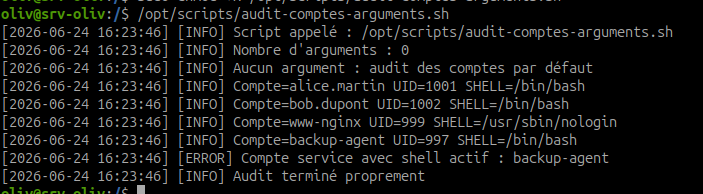
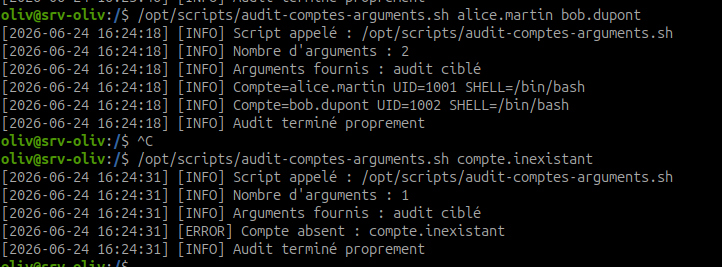

# Fonctions, arguments et trap en Bash

## Objectif

Transformer un script Bash simple en outil d'administration durable, réutilisable et testable.

Les fonctions rendent un script plus lisible. Les arguments permettent d'utiliser le même script avec des paramètres différents sans modifier son contenu. `trap` permet d'exécuter une action automatiquement à la fin du script ou lors d'une interruption.

## À retenir

Un script jetable contient souvent une suite de commandes.  
Un outil durable contient :

- des fonctions ;
- une gestion des arguments ;
- des messages clairs ;
- des logs horodatés ;
- un nettoyage ou message final avec `trap`.

## Étape 1 - Comprendre les variables d'arguments

| Élément | Signification |
| --- | --- |
| `$0` | nom du script appelé |
| `$1` | premier argument |
| `$2` | deuxième argument |
| `$#` | nombre total d'arguments |
| `"$@"` | tous les arguments, conservés séparément |

Exemple :

```bash
./audit-comptes.sh alice.martin bob.dupont
```

Dans ce cas :

```text
$0 = ./audit-comptes.sh
$1 = alice.martin
$2 = bob.dupont
$# = 2
"$@" = alice.martin bob.dupont
```

## Étape 2 - Comprendre log_info et log_error

Fonction d'information :

```bash
log_info() {
    echo "[$(date '+%Y-%m-%d %H:%M:%S')] [INFO] $*"
}
```

Fonction d'erreur :

```bash
log_error() {
    echo "[$(date '+%Y-%m-%d %H:%M:%S')] [ERROR] $*" >&2
}
```

Différence importante :

- `log_info` écrit sur la sortie standard ;
- `log_error` écrit sur la sortie d'erreur grâce à `>&2`.

## Étape 3 - Comprendre local dans une fonction

Exemple :

```bash
verifier_compte() {
    local compte="$1"
    local shell

    shell="$(getent passwd "$compte" | awk -F: '{print $7}')"
    log_info "Compte ${compte} avec shell ${shell}"
}
```

`local` limite la variable à la fonction. Cela évite de modifier accidentellement une variable utilisée ailleurs dans le script.

## Étape 4 - Comprendre trap

`trap` permet d'exécuter une fonction quand un événement arrive.

Exemple :

```bash
cleanup() {
    log_info "Audit terminé proprement"
}

trap cleanup EXIT
```

Ici, `cleanup` sera exécutée à la fin du script, même si le script s'arrête après une erreur.

## Étape 5 - Lire le script de référence

Créer un fichier de test :

```bash
sudo vim /opt/scripts/audit-comptes-arguments.sh
```

Script de référence :

```bash
#!/usr/bin/env bash
set -euo pipefail

# AlpesNet - Audit comptes avec fonctions et arguments
# Auteur : Olivier HIMBLOT
# Date : 2026-06-24
# Objet : Auditer tous les comptes AlpesNet ou une liste de comptes passée en argument

COMPTES_PAR_DEFAUT=("alice.martin" "bob.dupont" "www-nginx" "backup-agent")

log_info() {
    echo "[$(date '+%Y-%m-%d %H:%M:%S')] [INFO] $*"
}

log_error() {
    echo "[$(date '+%Y-%m-%d %H:%M:%S')] [ERROR] $*" >&2
}

cleanup() {
    log_info "Audit terminé proprement"
}

trap cleanup EXIT

verifier_compte() {
    local compte="$1"
    local uid
    local shell

    if ! getent passwd "$compte" >/dev/null; then
        log_error "Compte absent : ${compte}"
        return 1
    fi

    uid="$(id -u "$compte")"
    shell="$(getent passwd "$compte" | awk -F: '{print $7}')"

    log_info "Compte=${compte} UID=${uid} SHELL=${shell}"

    if [[ "$uid" == "0" && "$compte" != "root" ]]; then
        log_error "UID 0 anormal détecté : ${compte}"
    fi

    if [[ "$compte" == "www-nginx" && "$shell" != "/usr/sbin/nologin" ]]; then
        log_error "Compte service avec shell actif : ${compte}"
    fi

    if [[ "$compte" == "backup-agent" && "$shell" != "/usr/sbin/nologin" ]]; then
        log_error "Compte service avec shell actif : ${compte}"
    fi
}

main() {
    log_info "Script appelé : $0"
    log_info "Nombre d'arguments : $#"

    if [[ "$#" -eq 0 ]]; then
        log_info "Aucun argument : audit des comptes par défaut"
        for compte in "${COMPTES_PAR_DEFAUT[@]}"; do
            verifier_compte "$compte" || true
        done
    else
        log_info "Arguments fournis : audit ciblé"
        for compte in "$@"; do
            verifier_compte "$compte" || true
        done
    fi
}

main "$@"
```

## Étape 6 - Rendre le script exécutable

Commande :

```bash
sudo chmod +x /opt/scripts/audit-comptes-arguments.sh
```

Vérifier :

```bash
ls -l /opt/scripts/audit-comptes-arguments.sh
```

## Étape 7 - Tester sans argument

Commande :

```bash
/opt/scripts/audit-comptes-arguments.sh
```



Résultat attendu :

- le script indique qu'il n'a reçu aucun argument ;
- il audite les 4 comptes par défaut ;
- les lignes affichent `[INFO]` ou `[ERROR]` avec horodatage ;
- le message `Audit terminé proprement` apparaît à la fin.

Observation : le mode sans argument audite les comptes par défaut et signale `backup-agent` comme compte service avec shell actif.

## Étape 8 - Tester avec arguments

Commande :

```bash
/opt/scripts/audit-comptes-arguments.sh alice.martin bob.dupont
```



Résultat attendu :

- le script indique qu'il a reçu des arguments ;
- seuls `alice.martin` et `bob.dupont` sont audités ;
- le trap affiche le message final.

Tester avec un compte absent :

```bash
/opt/scripts/audit-comptes-arguments.sh compte.inexistant
```

Résultat attendu :

```text
[ERROR] Compte absent : compte.inexistant
```

## Exercice 4 - Transformer audit-comptes.sh en outil avec arguments

À faire sur `/opt/scripts/audit-comptes.sh` :

Ajouter les fonctions de log :

- `log_info` pour les messages normaux ;
- `log_error` pour les erreurs ;
- remplacer les `echo` par `log_info` ou `log_error`.

Ajouter la gestion des arguments :

```bash
if [[ "$#" -eq 0 ]]; then
    # auditer les 4 comptes AlpesNet
else
    # auditer les comptes passés en arguments
fi
```

Utiliser une boucle sur les arguments :

```bash
for compte in "$@"; do
    verifier_compte "$compte"
done
```

Ajouter un `trap` :

```bash
cleanup() {
    log_info "Audit terminé proprement"
}

trap cleanup EXIT
```

## Résultat attendu

À la fin :

- le script fonctionne sans argument ;
- le script fonctionne avec une liste de comptes ;
- les messages `[INFO]` et `[ERROR]` sont horodatés ;
- `log_info` et `log_error` sont utilisés ;
- `verifier_compte` utilise `local` ;
- `trap cleanup EXIT` affiche `Audit terminé proprement`.

## Synthèse à retenir

Les fonctions rendent le script lisible et réutilisable. Les arguments rendent le script flexible. `trap` garantit une action finale, utile pour nettoyer, fermer proprement ou afficher un état de fin.
