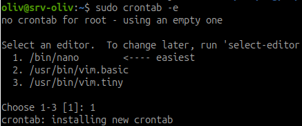
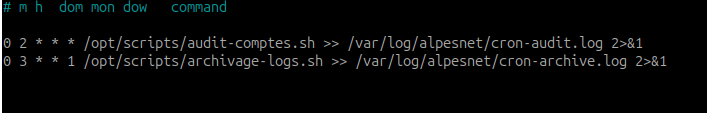
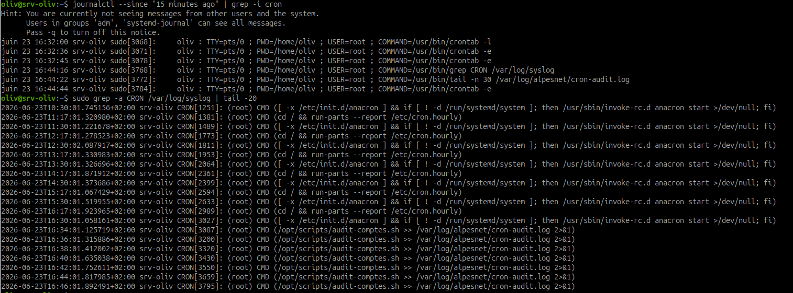
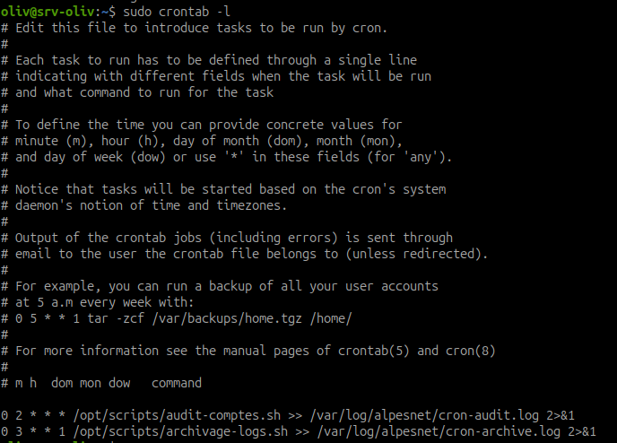

# Planification cron des scripts AlpesNet

## Objectif

Planifier automatiquement les scripts d'administration AlpesNet avec `cron`, vérifier leur exécution dans les logs système, puis conserver uniquement les règles finales.

Les scripts concernés :

- `/opt/scripts/audit-comptes.sh` ;
- `/opt/scripts/archivage-logs.sh`.

## Principe de cron

`cron` exécute des commandes selon une planification.

Format d'une ligne cron :

```text
minute heure jour_du_mois mois jour_de_semaine commande
```

Exemple :

```cron
0 2 * * * /opt/scripts/audit-comptes.sh
```

Signification :

| Champ | Valeur | Sens |
| --- | --- | --- |
| minute | `0` | à la minute 0 |
| heure | `2` | à 2h |
| jour du mois | `*` | tous les jours du mois |
| mois | `*` | tous les mois |
| jour semaine | `*` | tous les jours de la semaine |

## Étape 1 - Vérifier les scripts à planifier

Vérifier que les scripts existent et sont exécutables :

```bash
ls -l /opt/scripts/audit-comptes.sh
ls -l /opt/scripts/archivage-logs.sh
```

Tester manuellement les scripts avant planification :

```bash
sudo /opt/scripts/audit-comptes.sh
sudo /opt/scripts/archivage-logs.sh
```

Point de contrôle : un script ne doit pas être planifié s'il échoue en exécution manuelle.

## Étape 2 - Préparer les fichiers de logs cron

Créer le répertoire si besoin :

```bash
sudo mkdir -p /var/log/alpesnet
```

Vérifier les droits :

```bash
ls -ld /var/log/alpesnet
```

Les sorties cron seront redirigées vers :

```text
/var/log/alpesnet/cron-audit.log
/var/log/alpesnet/cron-archive.log
```

## Étape 3 - Ajouter un verrou d'exécution dans `/var/lock`

Une tâche `cron` peut se relancer alors qu'une exécution précédente n'est pas terminée. C'est un risque classique avec les scripts d'administration :

- deux sauvegardes peuvent écrire dans le même dossier ;
- deux audits peuvent produire des rapports incohérents ;
- deux rotations ou archivages peuvent manipuler les mêmes fichiers ;
- une tâche lente peut s'empiler à chaque nouvelle planification.

Pour éviter cela, on ajoute un **verrou**. Le principe est simple : au démarrage, le script crée ou prend un fichier de lock. Si le lock existe déjà et est utilisé, le script s'arrête proprement.

Emplacement conseillé :

```text
/var/lock/alpesnet-audit.lock
/var/lock/alpesnet-archive.lock
```

`/var/lock` est prévu pour ce type de fichiers temporaires de verrouillage. Le lock ne sert pas à stocker des données métier : il sert seulement à empêcher plusieurs instances du même script de tourner en même temps.

### Méthode recommandée avec `flock`

Exemple à placer au début d'un script planifié :

```bash
LOCK_FILE="/var/lock/alpesnet-audit.lock"
exec 9>"$LOCK_FILE"

if ! flock -n 9; then
  echo "$(date --iso-8601=seconds) SKIP audit déjà en cours"
  exit 0
fi
```

Explication :

| Élément | Rôle |
| --- | --- |
| `LOCK_FILE="/var/lock/alpesnet-audit.lock"` | Définit le fichier de verrou |
| `exec 9>"$LOCK_FILE"` | Ouvre le fichier sur le descripteur 9 |
| `flock -n 9` | Tente de prendre le verrou sans attendre |
| `exit 0` | Quitte proprement si une autre exécution est déjà active |

Cette sécurité est importante pour `cron`, car `cron` lance les commandes sans vérifier si l'exécution précédente est encore en cours.

### Variante directement dans la crontab

On peut aussi protéger la ligne cron elle-même :

```cron
0 2 * * * flock -n /var/lock/alpesnet-audit.lock /opt/scripts/audit-comptes.sh >> /var/log/alpesnet/cron-audit.log 2>&1
0 3 * * 1 flock -n /var/lock/alpesnet-archive.lock /opt/scripts/archivage-logs.sh >> /var/log/alpesnet/cron-archive.log 2>&1
```

Dans ce cas, `flock` refuse de lancer une nouvelle instance si le lock est déjà pris.

## Étape 4 - Éditer la crontab root

Comme les scripts écrivent dans des dossiers système, utiliser la crontab de `root` :

```bash
sudo crontab -e
```



Ajouter les deux règles finales :

```cron
0 2 * * * flock -n /var/lock/alpesnet-audit.lock /opt/scripts/audit-comptes.sh >> /var/log/alpesnet/cron-audit.log 2>&1
0 3 * * 1 flock -n /var/lock/alpesnet-archive.lock /opt/scripts/archivage-logs.sh >> /var/log/alpesnet/cron-archive.log 2>&1
```



Explication :

| Règle | Sens |
| --- | --- |
| `0 2 * * *` | tous les jours à 02h00 |
| `0 3 * * 1` | tous les lundis à 03h00 |
| `flock -n /var/lock/...` | empêche une deuxième exécution simultanée |
| `>> fichier.log` | ajoute la sortie standard dans le fichier |
| `2>&1` | ajoute aussi les erreurs dans le même fichier |

## Étape 5 - Vérifier la crontab

Commande :

```bash
sudo crontab -l
```

Résultat attendu :

```cron
0 2 * * * flock -n /var/lock/alpesnet-audit.lock /opt/scripts/audit-comptes.sh >> /var/log/alpesnet/cron-audit.log 2>&1
0 3 * * 1 flock -n /var/lock/alpesnet-archive.lock /opt/scripts/archivage-logs.sh >> /var/log/alpesnet/cron-archive.log 2>&1
```

## Étape 6 - Ajouter une règle temporaire de test

Pour éviter d'attendre 02h00, ajouter une règle temporaire toutes les 2 minutes.

Éditer :

```bash
sudo crontab -e
```

Ajouter temporairement :

```cron
*/2 * * * * flock -n /var/lock/alpesnet-audit.lock /opt/scripts/audit-comptes.sh >> /var/log/alpesnet/cron-audit.log 2>&1
```

!!! warning "Règle temporaire"
    Cette règle sert uniquement au test. Elle doit être supprimée après vérification.

## Étape 7 - Attendre et vérifier l'exécution cron

Attendre au moins 2 minutes.

Vérifier les traces cron dans `syslog` :

```bash
sudo grep CRON /var/log/syslog | tail -20
```

Si `grep` indique que `/var/log/syslog` est un fichier binaire, forcer la lecture en texte :

```bash
sudo grep -a CRON /var/log/syslog | tail -20
```

Autre possibilité avec `journalctl` :

```bash
journalctl --since "15 minutes ago" | grep -i cron
```

Vérifier le log applicatif :

```bash
sudo tail -n 30 /var/log/alpesnet/cron-audit.log
```



Observation : les lignes `CRON` dans `syslog` montrent que le service cron exécute les commandes planifiées. La règle temporaire toutes les 2 minutes apparaît dans les logs pendant la phase de test.

!!! note "cron-audit.log vide"
    Le script `audit-comptes.sh` écrit surtout dans son propre fichier `/var/log/alpesnet/audit-comptes-[date].log`. Si `cron-audit.log` est vide, vérifier d'abord que cron a bien lancé le script, puis vérifier les fichiers `audit-comptes-*.log`.

```bash
sudo bash -c 'ls -lt /var/log/alpesnet/audit-comptes-*.log | head'
sudo bash -c 'tail -n 30 "$(ls -t /var/log/alpesnet/audit-comptes-*.log | head -1)"'
```

Résultat attendu :

- `syslog` montre une exécution cron ;
- `/var/log/alpesnet/cron-audit.log` contient au moins une entrée du script d'audit.

## Étape 8 - Supprimer la règle temporaire

Éditer la crontab :

```bash
sudo crontab -e
```

Supprimer uniquement cette ligne :

```cron
*/2 * * * * flock -n /var/lock/alpesnet-audit.lock /opt/scripts/audit-comptes.sh >> /var/log/alpesnet/cron-audit.log 2>&1
```

Conserver uniquement les deux règles finales :

```cron
0 2 * * * flock -n /var/lock/alpesnet-audit.lock /opt/scripts/audit-comptes.sh >> /var/log/alpesnet/cron-audit.log 2>&1
0 3 * * 1 flock -n /var/lock/alpesnet-archive.lock /opt/scripts/archivage-logs.sh >> /var/log/alpesnet/cron-archive.log 2>&1
```

## Étape 9 - Vérification finale

Commande :

```bash
sudo crontab -l
```



Résultat attendu : seules les deux règles finales doivent rester.

Vérifier les logs :

```bash
sudo ls -l /var/log/alpesnet/cron-audit.log /var/log/alpesnet/cron-archive.log
sudo tail -n 30 /var/log/alpesnet/cron-audit.log
```

Si `cron-archive.log` n'existe pas encore, c'est normal tant que l'archivage hebdomadaire n'a pas été exécuté.

## Résultat attendu

À la fin :

- `sudo crontab -l` montre les deux règles planifiées ;
- `sudo grep CRON /var/log/syslog` montre au moins une exécution cron ;
- `/var/log/alpesnet/cron-audit.log` contient au moins une entrée ;
- les lignes cron utilisent `flock` avec un lock dans `/var/lock` ;
- la règle temporaire `*/2 * * * *` a été supprimée.

## Synthèse à retenir

Planifier un script ne suffit pas. Il faut vérifier qu'il s'exécute, que sa sortie est journalisée, que les règles temporaires de test sont supprimées après validation, et qu'un verrou empêche les exécutions simultanées.
