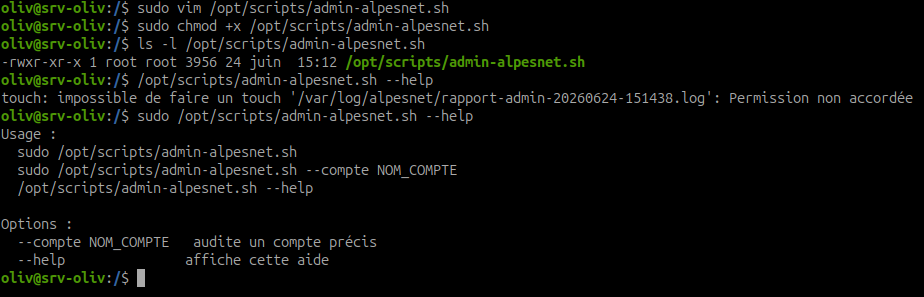
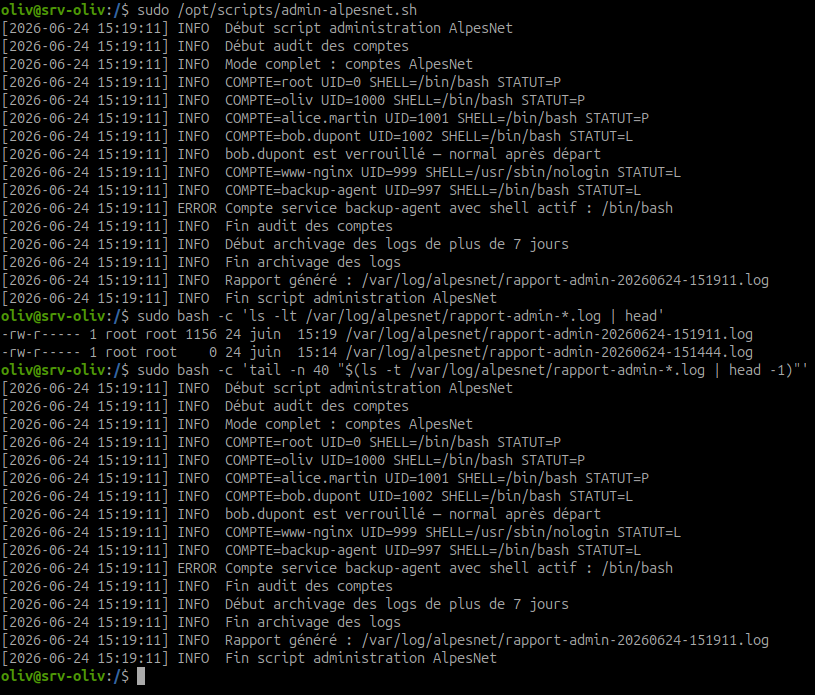
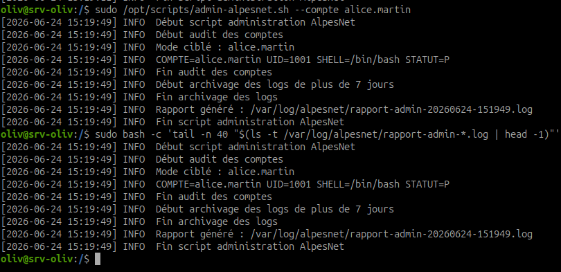
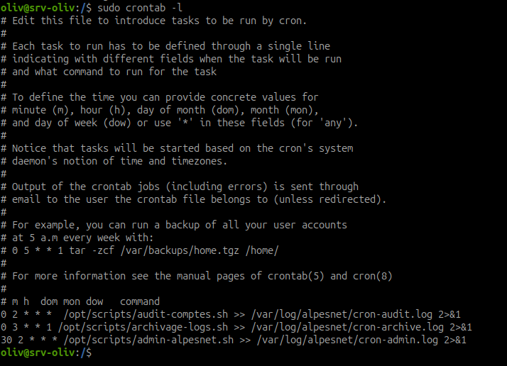
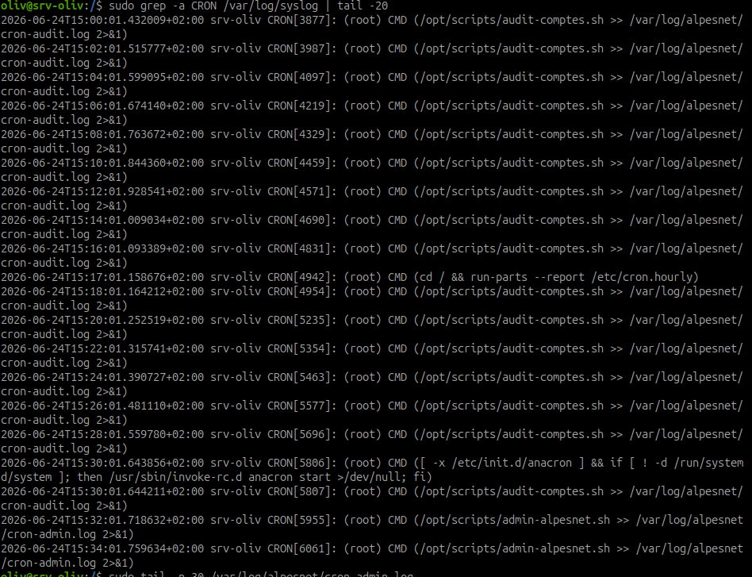
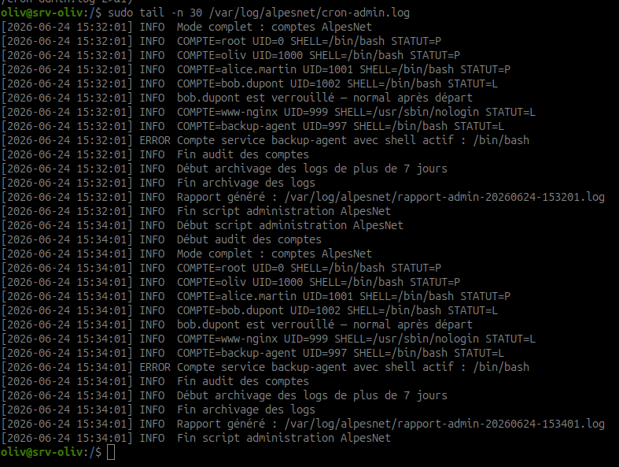
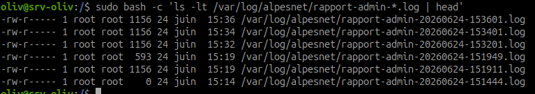

# Script d'administration robuste AlpesNet

## Objectif

Produire un script d'administration robuste, documenté, avec fonctions, arguments, rapport lisible et planification `cron`.

Le script doit pouvoir :

- auditer les comptes ;
- archiver les logs de plus de 7 jours ;
- produire un rapport lisible ;
- être lancé sans argument pour un audit complet ;
- être lancé avec un nom de compte pour un audit ciblé ;
- être planifié chaque nuit.

## Consigne

Le DSI d'AlpesNet transmet le message suivant :

> J'ai besoin d'un script d'administration robuste qui tourne chaque nuit. Il doit auditer les comptes, archiver les logs de plus de 7 jours et produire un rapport lisible. Je veux pouvoir l'appeler avec un nom de compte spécifique si besoin.

Contraintes obligatoires :

- couvrir au moins 2 fonctions parmi : audit des comptes, archivage des logs, sauvegarde tar de `/etc` ;
- utiliser `log_info` et `log_error` ;
- gérer les arguments ;
- définir un comportement par défaut sans argument ;
- définir un comportement ciblé avec argument ;
- utiliser `set -euo pipefail` ;
- inclure un en-tête standard ;
- prévoir une planification `cron` avec justification ;
- rediriger la sortie cron vers un log.

## Étape 1 - Choisir les fonctions couvertes

Dans cette version, le script couvre deux fonctions principales :

| Fonction | Choix | Justification |
| --- | --- | --- |
| Audit des comptes | Oui | demandé par le DSI |
| Archivage des logs | Oui | demandé par le DSI |
| Sauvegarde tar de `/etc` | Non dans cette version | option possible en amélioration |

Le script produit aussi un rapport lisible dans `/var/log/alpesnet`.

## Étape 2 - Définir le comportement attendu

Sans argument :

```bash
sudo /opt/scripts/admin-alpesnet.sh
```

Comportement attendu :

- audit des comptes standards AlpesNet ;
- archivage des logs de plus de 7 jours ;
- génération d'un rapport horodaté.

Avec un compte ciblé :

```bash
sudo /opt/scripts/admin-alpesnet.sh --compte alice.martin
```

Comportement attendu :

- audit uniquement du compte demandé ;
- archivage des logs ;
- rapport indiquant le compte ciblé.

Avec aide :

```bash
/opt/scripts/admin-alpesnet.sh --help
```

Comportement attendu : afficher l'aide.

## Étape 3 - Créer le script

Créer le dossier si besoin :

```bash
sudo mkdir -p /opt/scripts
```

Créer le fichier :

```bash
sudo vim /opt/scripts/admin-alpesnet.sh
```

Contenu :

```bash
#!/usr/bin/env bash
set -euo pipefail

# AlpesNet - Script d'administration robuste
# Auteur : Olivier HIMBLOT
# Date : 2026-06-24
# Objet : Audit des comptes, archivage des logs et rapport lisible
# Usage :
#   sudo /opt/scripts/admin-alpesnet.sh
#   sudo /opt/scripts/admin-alpesnet.sh --compte alice.martin
#   /opt/scripts/admin-alpesnet.sh --help

DATE_EXECUTION="$(date +%Y%m%d-%H%M%S)"
LOG_DIR="/var/log/alpesnet"
BACKUP_DIR="/backup/logs-alpesnet"
RETENTION_JOURS=7
RAPPORT="${LOG_DIR}/rapport-admin-${DATE_EXECUTION}.log"
COMPTE_CIBLE=""

COMPTES=("root" "oliv" "alice.martin" "bob.dupont" "www-nginx" "backup-agent")

log_info() {
    echo "[$(date '+%Y-%m-%d %H:%M:%S')] INFO  $*" | tee -a "${RAPPORT}"
}

log_error() {
    echo "[$(date '+%Y-%m-%d %H:%M:%S')] ERROR $*" | tee -a "${RAPPORT}" >&2
}

afficher_aide() {
    cat <<'EOF'
Usage :
  sudo /opt/scripts/admin-alpesnet.sh
  sudo /opt/scripts/admin-alpesnet.sh --compte NOM_COMPTE
  /opt/scripts/admin-alpesnet.sh --help

Options :
  --compte NOM_COMPTE   audite un compte précis
  --help               affiche cette aide
EOF
}

preparer_environnement() {
    mkdir -p "${LOG_DIR}" "${BACKUP_DIR}"
    touch "${RAPPORT}"
    chmod 640 "${RAPPORT}"
}

analyser_arguments() {
    while [[ $# -gt 0 ]]; do
        case "$1" in
            --compte)
                if [[ $# -lt 2 ]]; then
                    echo "ERROR Option --compte utilisée sans nom de compte" >&2
                    exit 1
                fi
                COMPTE_CIBLE="$2"
                shift 2
                ;;
            --help|-h)
                afficher_aide
                exit 0
                ;;
            *)
                echo "ERROR Argument inconnu : $1" >&2
                afficher_aide
                exit 1
                ;;
        esac
    done
}

auditer_compte() {
    local compte="$1"

    if ! getent passwd "${compte}" >/dev/null; then
        log_error "Compte absent : ${compte}"
        return 1
    fi

    local uid shell statut
    uid="$(id -u "${compte}")"
    shell="$(getent passwd "${compte}" | awk -F: '{print $7}')"
    statut="$(passwd -S "${compte}" | awk '{print $2}')"

    log_info "COMPTE=${compte} UID=${uid} SHELL=${shell} STATUT=${statut}"

    if [[ "${uid}" == "0" && "${compte}" != "root" ]]; then
        log_error "UID 0 anormal détecté : ${compte}"
    fi

    if [[ "${compte}" == "bob.dupont" && "${statut}" == "L" ]]; then
        log_info "bob.dupont est verrouillé — normal après départ"
    fi

    if [[ "${compte}" == "www-nginx" && "${shell}" != "/usr/sbin/nologin" ]]; then
        log_error "Compte service www-nginx avec shell actif : ${shell}"
    fi

    if [[ "${compte}" == "backup-agent" && "${shell}" != "/usr/sbin/nologin" ]]; then
        log_error "Compte service backup-agent avec shell actif : ${shell}"
    fi
}

auditer_comptes() {
    log_info "Début audit des comptes"

    if [[ -n "${COMPTE_CIBLE}" ]]; then
        log_info "Mode ciblé : ${COMPTE_CIBLE}"
        auditer_compte "${COMPTE_CIBLE}"
    else
        log_info "Mode complet : comptes AlpesNet"
        for compte in "${COMPTES[@]}"; do
            auditer_compte "${compte}" || true
        done
    fi

    log_info "Fin audit des comptes"
}

archiver_logs() {
    log_info "Début archivage des logs de plus de ${RETENTION_JOURS} jours"

    find "${LOG_DIR}" -type f -name "*.log" -mtime +"${RETENTION_JOURS}" -print | while IFS= read -r fichier; do
        log_info "Archivage : ${fichier}"
        gzip -9 "${fichier}"
        mv "${fichier}.gz" "${BACKUP_DIR}/"
    done

    find "${BACKUP_DIR}" -type f -name "*.gz" -mtime +30 -print -delete

    log_info "Fin archivage des logs"
}

main() {
    analyser_arguments "$@"
    preparer_environnement

    log_info "Début script administration AlpesNet"
    auditer_comptes
    archiver_logs
    log_info "Rapport généré : ${RAPPORT}"
    log_info "Fin script administration AlpesNet"
}

main "$@"
```

## Étape 4 - Rendre le script exécutable

Commande :

```bash
sudo chmod +x /opt/scripts/admin-alpesnet.sh
```

Vérifier :

```bash
ls -l /opt/scripts/admin-alpesnet.sh
```



Résultat attendu : le droit `x` doit être présent.

## Étape 5 - Tester l'aide

Commande :

```bash
/opt/scripts/admin-alpesnet.sh --help
```

Résultat attendu : le script affiche les options disponibles.

!!! note "Aide sans sudo"
    Le script analyse les arguments avant de créer le rapport. Cela permet à `--help` de fonctionner sans `sudo`.
    Si une ancienne version du script affiche `Permission non accordée` avant l'aide, déplacer `analyser_arguments "$@"` avant `preparer_environnement` dans `main`.

## Étape 6 - Tester le comportement par défaut

Commande :

```bash
sudo /opt/scripts/admin-alpesnet.sh
```

Vérifier le rapport :

```bash
sudo bash -c 'ls -lt /var/log/alpesnet/rapport-admin-*.log | head'
sudo bash -c 'tail -n 40 "$(ls -t /var/log/alpesnet/rapport-admin-*.log | head -1)"'
```



Résultat attendu :

- audit de tous les comptes du tableau `COMPTES` ;
- messages `INFO` ;
- éventuels messages `ERROR` si un écart est détecté ;
- archivage des logs de plus de 7 jours.

Observation : le mode complet audite tous les comptes du tableau. La sortie montre aussi une erreur sur `backup-agent`, car ce compte service possède encore un shell actif `/bin/bash`.

## Étape 7 - Tester le comportement ciblé

Commande :

```bash
sudo /opt/scripts/admin-alpesnet.sh --compte alice.martin
```

Vérifier :

```bash
sudo bash -c 'tail -n 40 "$(ls -t /var/log/alpesnet/rapport-admin-*.log | head -1)"'
```



Résultat attendu :

- le rapport indique `Mode ciblé : alice.martin` ;
- seul le compte `alice.martin` est audité côté comptes ;
- l'archivage des logs est quand même exécuté.

## Étape 8 - Comprendre les fonctions obligatoires

### log_info

```bash
log_info() {
    echo "[$(date '+%Y-%m-%d %H:%M:%S')] INFO  $*" | tee -a "${RAPPORT}"
}
```

Rôle :

- écrire une information horodatée ;
- l'afficher à l'écran ;
- l'ajouter au rapport.

### log_error

```bash
log_error() {
    echo "[$(date '+%Y-%m-%d %H:%M:%S')] ERROR $*" | tee -a "${RAPPORT}" >&2
}
```

Rôle :

- écrire une erreur horodatée ;
- l'envoyer sur la sortie d'erreur ;
- l'ajouter au rapport.

## Étape 9 - Planifier avec cron

Éditer la crontab root :

```bash
sudo crontab -e
```

Ajouter la règle :

```cron
30 2 * * * /opt/scripts/admin-alpesnet.sh >> /var/log/alpesnet/cron-admin.log 2>&1
```

Justification :

- `30 2 * * *` : tous les jours à 02h30 ;
- l'heure est placée après l'audit quotidien de 02h00 ;
- la sortie standard et les erreurs sont conservées dans `/var/log/alpesnet/cron-admin.log`.

Vérifier :

```bash
sudo crontab -l
```



## Étape 10 - Vérifier l'exécution planifiée

Pour tester rapidement, ajouter temporairement :

```cron
*/2 * * * * /opt/scripts/admin-alpesnet.sh >> /var/log/alpesnet/cron-admin.log 2>&1
```

Attendre deux minutes puis vérifier :

```bash
sudo grep -a CRON /var/log/syslog | tail -20
sudo tail -n 30 /var/log/alpesnet/cron-admin.log
sudo bash -c 'ls -lt /var/log/alpesnet/rapport-admin-*.log | head'
```







Supprimer ensuite la règle temporaire et conserver uniquement :

```cron
30 2 * * * /opt/scripts/admin-alpesnet.sh >> /var/log/alpesnet/cron-admin.log 2>&1
```

## Résultat attendu

À la fin :

- `/opt/scripts/admin-alpesnet.sh` existe ;
- le script contient `set -euo pipefail` ;
- le script contient un en-tête standard ;
- les fonctions `log_info` et `log_error` existent ;
- le mode sans argument fonctionne ;
- le mode `--compte NOM` fonctionne ;
- un rapport lisible est généré dans `/var/log/alpesnet` ;
- les logs anciens de plus de 7 jours sont archivés ;
- une règle `cron` planifie le script chaque nuit ;
- la sortie cron est redirigée vers `/var/log/alpesnet/cron-admin.log`.

## Synthèse à retenir

Un script robuste n'est pas seulement un script qui fonctionne une fois. Il doit être lisible, paramétrable, journalisé, testable, et planifié avec une trace exploitable.
