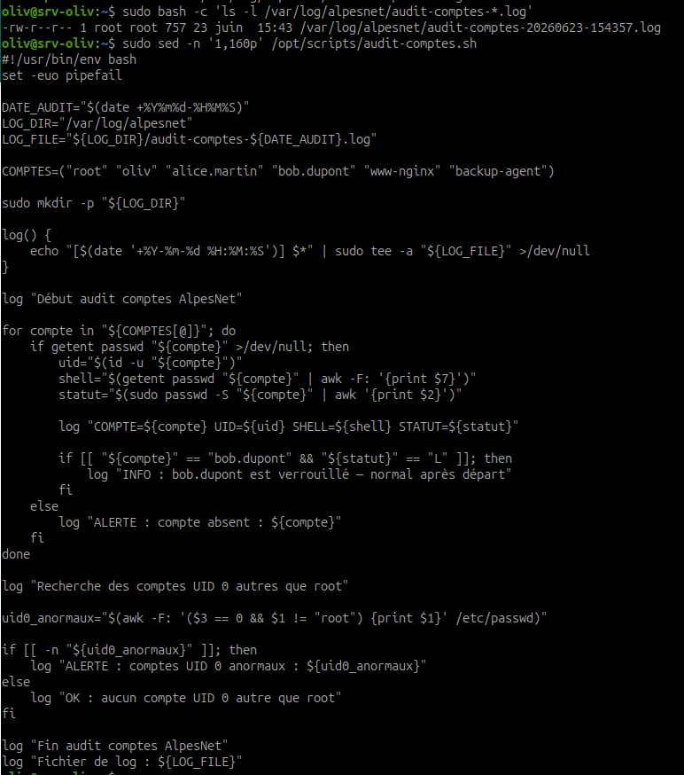
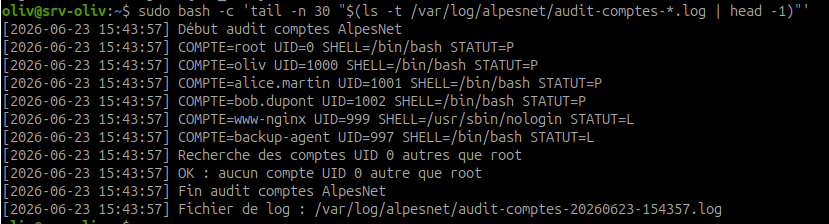
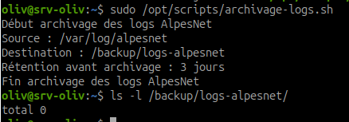
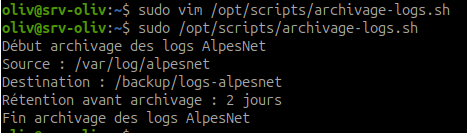

# Scripts d'administration pratiques

## Objectif

Lire, comprendre, exécuter et adapter deux scripts Bash d'administration utilisables sur l'infrastructure AlpesNet :

- `audit-comptes.sh` pour auditer les comptes locaux ;
- `archivage-logs.sh` pour compresser et archiver les logs anciens.

!!! warning "Règle de sécurité"
    Ne jamais coller ni exécuter un script sans l'avoir lu. Un script lancé avec `sudo` peut modifier tout le système.

## Principes à retenir

Un script d'administration doit être :

- lisible ;
- commenté quand c'est utile ;
- vérifiable avant exécution ;
- prudent avec les chemins ;
- explicite dans ses logs ;
- testable sans casser le système.

La ligne suivante rend un script plus strict :

```bash
set -euo pipefail
```

| Option | Rôle |
| --- | --- |
| `-e` | arrête le script si une commande échoue |
| `-u` | arrête le script si une variable non définie est utilisée |
| `-o pipefail` | considère un pipeline en erreur si une commande du pipeline échoue |

## Script 1 - audit-comptes.sh

### Rôle du script

Le script `audit-comptes.sh` vérifie une liste de comptes AlpesNet, affiche leur UID, leur shell, leur statut de mot de passe, puis détecte les comptes UID `0` autres que `root`.

Il écrit un log horodaté dans :

```text
/var/log/alpesnet/audit-comptes-[date].log
```

### Créer le script

Créer le dossier :

```bash
sudo mkdir -p /opt/scripts
```

Créer le fichier :

```bash
sudo vim /opt/scripts/audit-comptes.sh
```

Contenu :

```bash
#!/usr/bin/env bash
set -euo pipefail

DATE_AUDIT="$(date +%Y%m%d-%H%M%S)"
LOG_DIR="/var/log/alpesnet"
LOG_FILE="${LOG_DIR}/audit-comptes-${DATE_AUDIT}.log"

COMPTES=("root" "oliv" "alice.martin" "bob.dupont" "www-nginx" "backup-agent")

sudo mkdir -p "${LOG_DIR}"

log() {
    echo "[$(date '+%Y-%m-%d %H:%M:%S')] $*" | sudo tee -a "${LOG_FILE}" >/dev/null
}

log "Début audit comptes AlpesNet"

for compte in "${COMPTES[@]}"; do
    if getent passwd "${compte}" >/dev/null; then
        uid="$(id -u "${compte}")"
        shell="$(getent passwd "${compte}" | awk -F: '{print $7}')"
        statut="$(sudo passwd -S "${compte}" | awk '{print $2}')"

        log "COMPTE=${compte} UID=${uid} SHELL=${shell} STATUT=${statut}"

        if [[ "${compte}" == "bob.dupont" && "${statut}" == "L" ]]; then
            log "INFO : bob.dupont est verrouillé — normal après départ"
        fi
    else
        log "ALERTE : compte absent : ${compte}"
    fi
done

log "Recherche des comptes UID 0 autres que root"

uid0_anormaux="$(awk -F: '($3 == 0 && $1 != "root") {print $1}' /etc/passwd)"

if [[ -n "${uid0_anormaux}" ]]; then
    log "ALERTE : comptes UID 0 anormaux : ${uid0_anormaux}"
else
    log "OK : aucun compte UID 0 autre que root"
fi

log "Fin audit comptes AlpesNet"
log "Fichier de log : ${LOG_FILE}"
```

### Rendre le script exécutable

Commande :

```bash
sudo chmod +x /opt/scripts/audit-comptes.sh
```

Vérifier :

```bash
ls -l /opt/scripts/audit-comptes.sh
```

Résultat attendu : le fichier doit contenir le droit `x`.

### Exécuter le script

Commande :

```bash
sudo /opt/scripts/audit-comptes.sh
```

Vérifier le log créé :

```bash
sudo bash -c 'ls -l /var/log/alpesnet/audit-comptes-*.log'
```

Lire le dernier log :

```bash
sudo bash -c 'tail -n 30 "$(ls -t /var/log/alpesnet/audit-comptes-*.log | head -1)"'
```



Observation : le fichier de log est bien présent dans `/var/log/alpesnet`. L'utilisation de `sudo bash -c` permet au shell lancé avec les droits administrateur de développer le motif `audit-comptes-*.log`.



Observation : le log contient les comptes analysés, leur UID, leur shell, leur statut et la vérification des comptes UID `0`.

### Comprendre la boucle for

Bloc important :

```bash
for compte in "${COMPTES[@]}"; do
    if getent passwd "${compte}" >/dev/null; then
        uid="$(id -u "${compte}")"
        shell="$(getent passwd "${compte}" | awk -F: '{print $7}')"
        statut="$(sudo passwd -S "${compte}" | awk '{print $2}')"
        log "COMPTE=${compte} UID=${uid} SHELL=${shell} STATUT=${statut}"
    else
        log "ALERTE : compte absent : ${compte}"
    fi
done
```

| Ligne | Explication |
| --- | --- |
| `for compte in "${COMPTES[@]}"` | parcourt chaque compte du tableau |
| `getent passwd "${compte}"` | vérifie que le compte existe |
| `id -u "${compte}"` | récupère l'UID |
| `awk -F: '{print $7}'` | récupère le shell dans `/etc/passwd` |
| `passwd -S` | affiche le statut du mot de passe |
| `log ...` | écrit une ligne horodatée dans le fichier de log |

## Script 2 - archivage-logs.sh

### Rôle du script script2

Le script `archivage-logs.sh` recherche les fichiers `.log` anciens dans `/var/log/alpesnet`, les compresse en `gzip -9`, les déplace vers `/backup/logs-alpesnet/`, puis supprime les archives de plus de 30 jours.

### Créer le script script2

Créer le fichier :

```bash
sudo vim /opt/scripts/archivage-logs.sh
```

Contenu :

```bash
#!/usr/bin/env bash
set -euo pipefail

SOURCE_DIR="/var/log/alpesnet"
BACKUP_DIR="/backup/logs-alpesnet"
RETENTION_JOURS=3
SUPPRESSION_ARCHIVES_JOURS=30

sudo mkdir -p "${BACKUP_DIR}"

echo "Début archivage des logs AlpesNet"
echo "Source : ${SOURCE_DIR}"
echo "Destination : ${BACKUP_DIR}"
echo "Rétention avant archivage : ${RETENTION_JOURS} jours"

find "${SOURCE_DIR}" -type f -name "*.log" -mtime +"${RETENTION_JOURS}" -print | while read -r fichier; do
    echo "Archivage : ${fichier}"
    gzip -9 "${fichier}"
    sudo mv "${fichier}.gz" "${BACKUP_DIR}/"
done

find "${BACKUP_DIR}" -type f -name "*.gz" -mtime +"${SUPPRESSION_ARCHIVES_JOURS}" -print -delete

echo "Fin archivage des logs AlpesNet"
```

### Rendre le script exécutable script2

Commande :

```bash
sudo chmod +x /opt/scripts/archivage-logs.sh
```

Vérifier :

```bash
ls -l /opt/scripts/archivage-logs.sh
```

### Exécuter le script script2

Commande :

```bash
sudo /opt/scripts/archivage-logs.sh
```

Vérifier le dossier d'archives :

```bash
ls -l /backup/logs-alpesnet/
```



Observation : le script s'exécute avec `RETENTION_JOURS=3`. Aucun fichier n'est archivé ici, car aucun fichier `.log` ne correspond au critère `-mtime +3`.



Observation : la capture montre une adaptation de test avec une rétention de 2 jours. La logique du script reste identique : seuls les fichiers plus anciens que la valeur configurée sont sélectionnés.

## Comprendre la boucle find

Ligne :

```bash
find "${SOURCE_DIR}" -type f -name "*.log" -mtime +"${RETENTION_JOURS}" -print | while read -r fichier; do
```

Explication :

| Élément | Signification |
| --- | --- |
| `find "${SOURCE_DIR}"` | cherche dans le dossier source |
| `-type f` | limite la recherche aux fichiers |
| `-name "*.log"` | ne prend que les fichiers qui finissent par `.log` |
| `-mtime +"${RETENTION_JOURS}"` | sélectionne les fichiers modifiés il y a plus de X jours |
| `-print` | affiche les chemins trouvés |
| `while read -r fichier` | lit chaque chemin trouvé, ligne par ligne |

### Que signifie -mtime +3 ?

Avec :

```bash
RETENTION_JOURS=3
```

La condition :

```bash
-mtime +3
```

signifie :

```text
fichiers dont la dernière modification date de plus de 3 jours complets
```

Ce n'est pas "depuis exactement 3 jours", mais bien "strictement plus ancien que 3 jours".

## Exercice 2 - Exécuter et adapter les scripts

### Partie A - Audit des comptes

1. Créer `/opt/scripts/audit-comptes.sh`.
2. Lire le script ligne par ligne.
3. Rendre le script exécutable.
4. Exécuter le script avec `sudo`.
5. Vérifier le log dans `/var/log/alpesnet/`.
6. Vérifier que le cas `bob.dupont` verrouillé affiche :

```text
INFO : bob.dupont est verrouillé — normal après départ
```

### Partie B - Archivage des logs

Créer le script :

```bash
sudo vim /opt/scripts/archivage-logs.sh
```

Modifier la valeur de rétention :

```bash
RETENTION_JOURS=3
```

Lire le script ligne par ligne, puis le rendre exécutable :

```bash
sudo chmod +x /opt/scripts/archivage-logs.sh
```

Exécuter le script :

```bash
sudo /opt/scripts/archivage-logs.sh
```

Vérifier le dossier d'archives :

```bash
ls -l /backup/logs-alpesnet/
```

## Ressources

- `man find`
- `man gzip`
- `man awk`
- `man tee`
- [Google Shell Style Guide](https://google.github.io/styleguide/shellguide.html)
- [Explainshell.com](https://explainshell.com/)

## Synthèse à retenir

Un script d'administration n'est pas seulement une suite de commandes. C'est une procédure automatisée qui doit être lisible, traçable, prudente et vérifiable.

Avant d'exécuter un script, on le lit. Après l'exécution, on vérifie ses effets.
