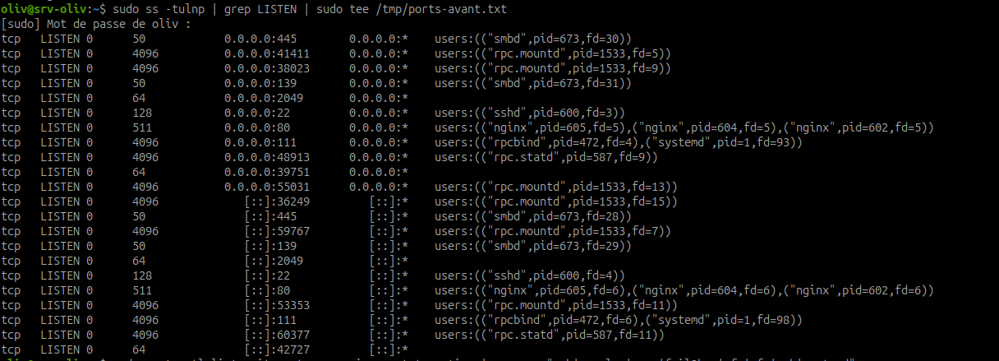

# Durcissement Linux AlpesNet - SSH, UFW, Fail2ban et services

## Objectif

Réaliser un durcissement complet d'une VM Linux avant mise en production, à partir d'un incident de départ : **SSH root activé sur le port 22 public, sans authentification par clés**.

Le but est de réduire la surface d'attaque, empêcher l'accès direct `root`, limiter les tentatives de force brute, filtrer le réseau et désactiver les services inutiles.

## Rappel de l'incident

| Élément | Situation risquée |
| --- | --- |
| SSH | Port 22 exposé publiquement |
| Compte root | Connexion root autorisée |
| Authentification | Mot de passe accepté, pas d'obligation de clé |
| Pare-feu | Règles minimales absentes ou trop ouvertes |
| Force brute | Pas de bannissement automatique |
| Services | Ports et services actifs non justifiés |

!!! warning "Règle de sécurité"
    Avant de recharger SSH ou d'activer `ufw`, toujours garder une session SSH active ouverte et tester depuis un **nouveau terminal**. Cela évite de se verrouiller soi-même hors de la VM.

## Architecture de l'atelier

| Élément | Rôle | Exemple |
| --- | --- | --- |
| Serveur | VM Debian 12 AlpesNet | `[IP-VM]` |
| Client de test | Laptop Ubuntu ou autre poste du campus | réseau campus |
| Utilisateur autorisé | Compte d'administration nominatif | `adm-[prenom]` |
| Compte interdit | Connexion directe interdite | `root` |
| Sous-réseau autorisé SSH | Campus | `192.168.0.0/24` ou réseau réel du lab |

## Étape 1 - Capturer l'état AVANT

Avant toute modification, conserver l'état initial des ports et services.

Lister les ports en écoute :

```bash
sudo ss -tulnp | grep LISTEN
```

Sauvegarder dans un fichier :

```bash
sudo ss -tulnp | grep LISTEN | sudo tee /tmp/ports-avant.txt
```

Lister les services actifs :

```bash
sudo systemctl list-units --type=service --state=active
```

Sauvegarder dans un fichier :

```bash
sudo systemctl list-units --type=service --state=active | sudo tee /tmp/services-avant.txt
```

Résultat attendu : deux fichiers existent dans `/tmp`.

```bash
ls -l /tmp/ports-avant.txt /tmp/services-avant.txt
```


Observation : l'état initial montre plusieurs ports en écoute, notamment SSH, Samba, NFS/RPC et Nginx. Cette capture sert de référence avant durcissement.


Observation : la liste des services actifs permet d'identifier les services attendus et ceux qui devront être justifiés ou désactivés.

## Étape 2 - Sauvegarder la configuration SSH

Sauvegarder le fichier avant modification :

```bash
sudo cp /etc/ssh/sshd_config /etc/ssh/sshd_config.bak
```

Vérifier :

```bash
ls -l /etc/ssh/sshd_config /etc/ssh/sshd_config.bak
```

!!! note "Pourquoi sauvegarder ?"
    En cas d'erreur de configuration, la sauvegarde permet de revenir vite à l'état précédent depuis la session encore ouverte.

## Étape 3 - Durcir SSH

Éditer la configuration :

```bash
sudo vim /etc/ssh/sshd_config
```

Paramètres à appliquer :

```text
PermitRootLogin no
PasswordAuthentication no
PubkeyAuthentication yes
AllowUsers adm-[prenom]
MaxAuthTries 3
LoginGraceTime 20
ClientAliveInterval 300
ClientAliveCountMax 2
X11Forwarding no
AllowTcpForwarding no
```

Explication :

| Paramètre | Rôle |
| --- | --- |
| `PermitRootLogin no` | interdit la connexion SSH directe de `root` |
| `PasswordAuthentication no` | impose l'authentification par clé |
| `PubkeyAuthentication yes` | autorise les clés publiques |
| `AllowUsers adm-[prenom]` | limite SSH à un ou plusieurs comptes explicitement autorisés |
| `MaxAuthTries 3` | limite les tentatives d'authentification |
| `LoginGraceTime 20` | impose un délai court pour s'authentifier |
| `ClientAliveInterval 300` | vérifie l'activité client toutes les 5 minutes |
| `ClientAliveCountMax 2` | déconnecte après deux échecs de réponse |
| `X11Forwarding no` | désactive le transfert graphique X11 |
| `AllowTcpForwarding no` | désactive les tunnels TCP SSH |

!!! warning "Adapter `AllowUsers`"
    Remplacer `adm-[prenom]` par le compte réellement utilisé. Si le compte n'est pas listé, la connexion SSH sera refusée même avec une clé valide.

## Étape 4 - Vérifier la syntaxe SSH avant reload

La vérification est obligatoire avant tout rechargement :

```bash
sudo sshd -t
```

Résultat attendu : aucune sortie.

Si une erreur apparaît, ne pas recharger SSH. Corriger d'abord `/etc/ssh/sshd_config`.

## Étape 5 - Recharger SSH sans couper la session active

Recharger la configuration :

```bash
sudo systemctl reload sshd
```

Selon la distribution, le service peut s'appeler `ssh` :

```bash
sudo systemctl reload ssh
```

Vérifier l'état :

```bash
systemctl status ssh
```

ou :

```bash
systemctl status sshd
```

!!! tip "Ne pas fermer le terminal actuel"
    Garder la session active ouverte jusqu'à validation complète depuis un second terminal.

## Étape 6 - Tester SSH depuis un nouveau terminal

Depuis le client, dans un **nouveau terminal** :

```bash
ssh adm-[prenom]@[IP-VM]
```

Résultat attendu : la connexion fonctionne avec la clé SSH.

Tester ensuite l'accès root :

```bash
ssh root@[IP-VM]
```

Résultat attendu : la connexion `root` est refusée.

Preuves à conserver :

| Test | Résultat attendu |
| --- | --- |
| `ssh adm-[prenom]@[IP-VM]` | connexion autorisée |
| `ssh root@[IP-VM]` | connexion refusée |
| `sudo sshd -t` | aucune erreur |


Observation : l'accès avec l'utilisateur autorisé fonctionne, tandis que les tentatives avec `bob.dupont` et `root` sont refusées par authentification par clé. Cela confirme le durcissement SSH et la restriction des comptes.

## Étape 7 - Configurer la politique UFW minimale

Politique par défaut :

```bash
sudo ufw default deny incoming
sudo ufw default allow outgoing
```

Autoriser SSH uniquement depuis le sous-réseau campus :

```bash
sudo ufw allow from 192.168.0.0/24 to any port 22
```

Adapter au réseau réel du lab si nécessaire, par exemple :

```bash
sudo ufw allow from 192.168.56.0/24 to any port 22
```

!!! danger "À éviter"
    Ne pas utiliser `sudo ufw allow ssh` si le serveur ne doit pas être joignable depuis partout. Cette commande ouvre SSH à toutes les sources.

## Étape 8 - Activer UFW et vérifier

Avant activation, vérifier que la règle SSH existe :

```bash
sudo ufw status numbered
```

Activer :

```bash
sudo ufw enable
```

Vérifier :

```bash
sudo ufw status verbose
```

Activer les logs :

```bash
sudo ufw logging on
```

Observer les logs :

```bash
sudo tail -f /var/log/ufw.log
```

Résultat attendu :

- politique entrante : `deny`;
- politique sortante : `allow`;
- port 22 autorisé uniquement depuis le sous-réseau choisi ;
- logs UFW actifs.


Observation : UFW est actif, la politique entrante est en `deny`, la sortie est en `allow`, et le port SSH est limité aux sous-réseaux explicitement autorisés. Les logs UFW montrent les paquets bloqués, ce qui valide la journalisation.

## Étape 9 - Installer et préparer Fail2ban

Installer si nécessaire :

```bash
sudo apt update
sudo apt install -y fail2ban
```

Créer la configuration locale :

```bash
sudo cp /etc/fail2ban/jail.conf /etc/fail2ban/jail.local
```

!!! note "Ne pas modifier `jail.conf` directement"
    `jail.conf` est le fichier fourni par le paquet. Les personnalisations doivent être faites dans `jail.local` pour éviter d'être écrasées lors d'une mise à jour.

## Étape 10 - Configurer Fail2ban pour SSH

Éditer :

```bash
sudo vim /etc/fail2ban/jail.local
```

Dans `[DEFAULT]`, appliquer :

```ini
bantime  = 3600
findtime = 600
maxretry = 3
```

Vérifier que la jail `[sshd]` est activée :

```ini
[sshd]
enabled = true
```

Explication :

| Paramètre | Rôle |
| --- | --- |
| `bantime = 3600` | bannissement pendant 1 heure |
| `findtime = 600` | fenêtre d'observation de 10 minutes |
| `maxretry = 3` | 3 échecs avant bannissement |
| `enabled = true` | active la protection SSH |

## Étape 11 - Redémarrer Fail2ban et vérifier

Redémarrer :

```bash
sudo systemctl restart fail2ban
```

Vérifier le service :

```bash
systemctl status fail2ban
```

Vérifier la jail SSH :

```bash
sudo fail2ban-client status sshd
```

Résultat attendu : la jail `sshd` est active.

## Étape 12 - Tester le bannissement Fail2ban

Depuis un second terminal client, provoquer plusieurs échecs SSH contrôlés :

```bash
ssh mauvais-user@[IP-VM]
ssh mauvais-user@[IP-VM]
ssh mauvais-user@[IP-VM]
ssh mauvais-user@[IP-VM]
```

Revenir sur le serveur et vérifier :

```bash
sudo fail2ban-client status sshd
```

Résultat attendu : l'IP du client apparaît dans la liste des IP bannies.

Si besoin, vérifier les logs :

```bash
sudo journalctl -u fail2ban --since "15 minutes ago"
sudo tail -n 50 /var/log/auth.log
```

!!! warning "Test contrôlé"
    Faire ce test uniquement dans le lab et depuis une adresse que l'on peut débannir si nécessaire.

Débannir une IP en cas de besoin :

```bash
sudo fail2ban-client set sshd unbanip [IP-CLIENT]
```


Observation : la jail `sshd` indique des échecs d'authentification et des IP bannies, dont l'IP du client de test. Le déban manuel avec `fail2ban-client set sshd unbanip` permet de récupérer l'accès après l'auto-ban de test.

## Étape 13 - Identifier les services inutiles

Capturer les ports avant désactivation si ce n'est pas déjà fait :

```bash
sudo ss -tulnp | grep LISTEN | sudo tee /tmp/ports-avant.txt
```

Lister les services actifs, en excluant les services attendus :

```bash
sudo systemctl list-units --type=service --state=active | grep -v "ssh|rsyslog|cron|fail2ban|ufw|nfs|smb|systemd"
```

Objectif : repérer les services non nécessaires au rôle du serveur.


Observation : le filtrage retire les services attendus de la commande pour faire ressortir les services à examiner. Chaque service restant doit être justifié ou désactivé si inutile.

!!! warning "Ne pas désactiver à l'aveugle"
    Avant chaque désactivation, vérifier le rôle du service avec `systemctl status service` et, si besoin, `apt show paquet`.

## Étape 14 - Désactiver un service inutile

Exemple avec `avahi-daemon` si le service est présent et inutile sur le serveur :

```bash
sudo systemctl disable --now avahi-daemon 2>/dev/null || true
```

Vérifier :

```bash
systemctl status avahi-daemon
```

La commande `|| true` évite de bloquer le script ou la procédure si le service n'existe pas.

## Étape 15 - Capturer l'état APRÈS et comparer

Capturer les ports après durcissement :

```bash
sudo ss -tulnp | grep LISTEN | sudo tee /tmp/ports-apres.txt
```

!!! note "Attention aux pipelines avec `sudo`"
    Dans une commande avec des pipes, `sudo` ne s'applique qu'à la commande placée juste après lui. Pour écrire dans `/tmp/ports-apres.txt` avec les droits administrateur, utiliser `sudo tee` :

    ```bash
    sudo ss -tulnp | grep LISTEN | sudo tee /tmp/ports-apres.txt
    ```

Comparer :

```bash
diff /tmp/ports-avant.txt /tmp/ports-apres.txt
```

Capturer les services après :

```bash
sudo systemctl list-units --type=service --state=active | sudo tee /tmp/services-apres.txt
```

Comparer si besoin :

```bash
diff /tmp/services-avant.txt /tmp/services-apres.txt
```

Vérifier qu'aucun service critique n'est cassé :

```bash
sudo systemctl list-units --state=failed
```

Résultat attendu : aucun service critique en échec.




Observation : les ports avant/après servent de preuve de comparaison. Si la sortie est identique, il faut justifier que les services restants sont nécessaires au rôle de la machine.


Observation : `systemctl list-units --state=failed` retourne `0 loaded units listed`, ce qui confirme qu'aucun service critique n'est cassé après durcissement.

## Exercice 3 - Réaliser et documenter le durcissement complet

Tu dois appliquer toutes les mesures de durcissement et produire le rapport avant/après pour le dossier RNCP.

Ce que tu dois faire :

1. Capturer l'état AVANT :

```bash
sudo ss -tulnp | grep LISTEN | sudo tee /tmp/ports-avant.txt
sudo systemctl list-units --type=service --state=active | sudo tee /tmp/services-avant.txt
```

2. Appliquer le durcissement SSH complet. Tester depuis un nouveau terminal que `root` est refusé et que `adm-[prenom]` passe.
3. Activer `ufw` avec les règles minimales : port `22` restreint au campus, pas de règle ouverte à tout Internet. Vérifier :

```bash
sudo ufw status verbose
```

4. Configurer Fail2ban. Tester un ban en provoquant 4 tentatives SSH échouées. Montrer :

```bash
sudo fail2ban-client status sshd
```

5. Capturer l'état APRÈS puis comparer :

```bash
sudo ss -tulnp | grep LISTEN | sudo tee /tmp/ports-apres.txt
diff /tmp/ports-avant.txt /tmp/ports-apres.txt
```

6. Rédiger le rapport de durcissement : pour chaque mesure, indiquer état avant, commande appliquée, état après et commande de vérification.

Résultat attendu :

- rapport de durcissement avec tableau avant/après ;
- SSH durci et testé ;
- `ufw` actif avec règle SSH restreinte ;
- Fail2ban actif avec ban démontré en live ;
- `diff` montrant la réduction ou la justification de la surface exposée.

## Preuves à conserver

| Preuve | Commande |
| --- | --- |
| Ports avant | `cat /tmp/ports-avant.txt` |
| Services avant | `cat /tmp/services-avant.txt` |
| Syntaxe SSH valide | `sudo sshd -t` |
| Test utilisateur autorisé | `ssh adm-[prenom]@[IP-VM]` |
| Test root refusé | `ssh root@[IP-VM]` |
| UFW actif | `sudo ufw status verbose` |
| Logs UFW | `sudo tail /var/log/ufw.log` |
| Fail2ban actif | `sudo fail2ban-client status sshd` |
| IP bannie | sortie `fail2ban-client status sshd` |
| Ports après | `cat /tmp/ports-apres.txt` |
| Comparaison | `diff /tmp/ports-avant.txt /tmp/ports-apres.txt` |
| Services en échec | `sudo systemctl list-units --state=failed` |

## Dépannage rapide

| Symptôme | Vérifications |
| --- | --- |
| SSH refuse le bon utilisateur | vérifier `AllowUsers`, clé publique, `PasswordAuthentication`, logs `/var/log/auth.log` |
| `sshd -t` retourne une erreur | corriger la ligne indiquée avant tout reload |
| UFW bloque SSH | garder session ouverte, vérifier règle source et port 22 |
| Fail2ban ne bannit pas | vérifier jail `sshd`, logs auth, `maxretry`, backend |
| Aucun changement dans `diff` | vérifier si les services inutiles étaient déjà absents |
| Service critique cassé | `systemctl list-units --state=failed`, rollback configuration |

## Synthèse à retenir

Un durcissement Linux se valide par des preuves. La logique est toujours :

1. mesurer l'état avant ;
2. appliquer une mesure ciblée ;
3. tester depuis un nouveau terminal ou un client ;
4. mesurer l'état après ;
5. documenter le résultat.

SSH, UFW, Fail2ban et la désactivation des services inutiles forment une base minimale avant production.
