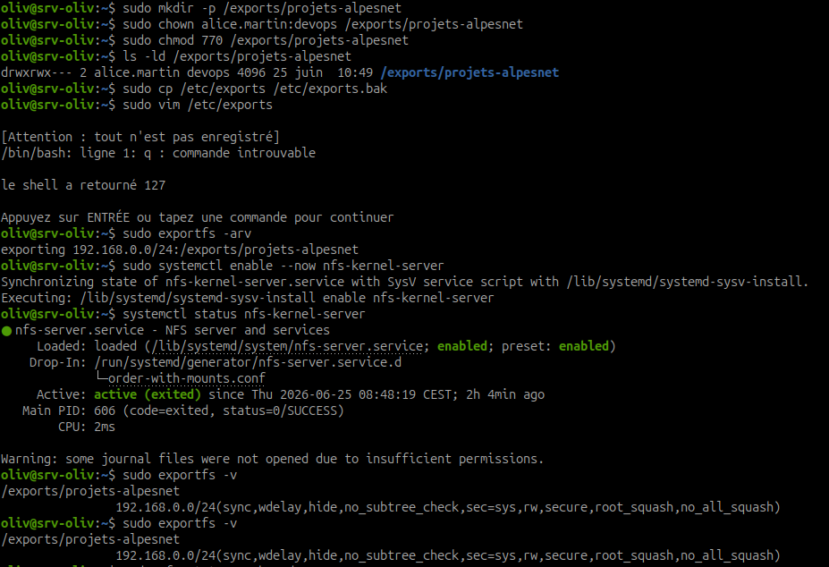
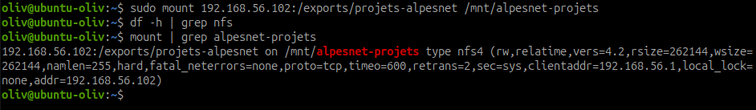
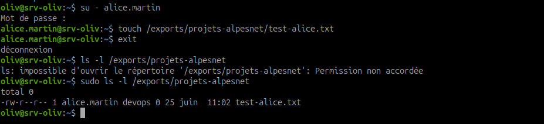
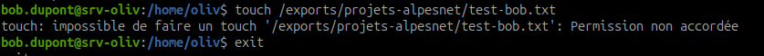
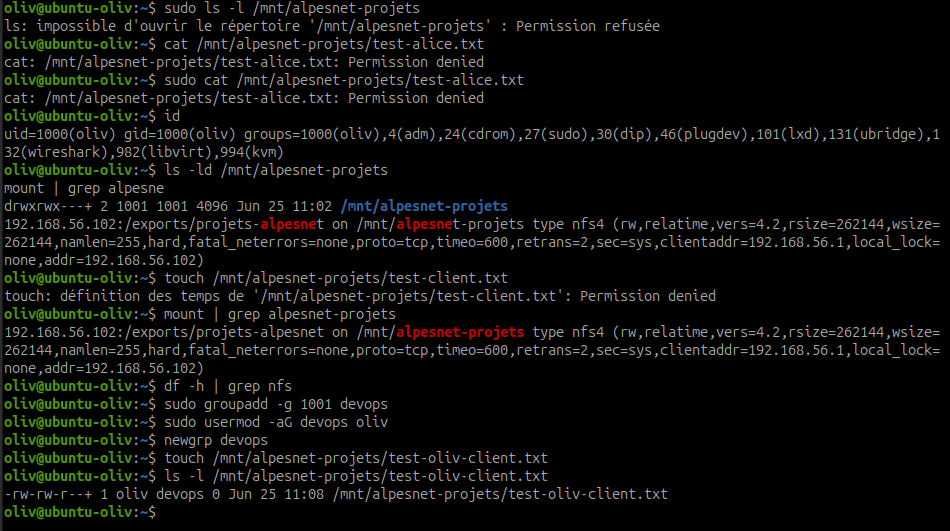
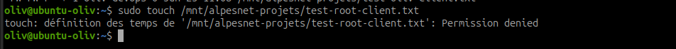
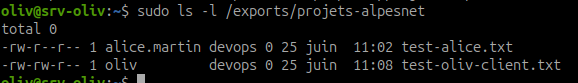

# NFS AlpesNet - partage réseau Linux

## Objectif

Configurer un partage NFS pour l'équipe AlpesNet, le restreindre au sous-réseau campus `192.168.0.0/24`, le monter depuis un client Ubuntu 24.04, puis valider les droits d'accès.

NFS, pour **Network File System**, permet à un serveur Linux d'exporter des répertoires montables par des clients en réseau. C'est simple, natif sur Linux et très utile pour partager un espace de travail. La sécurité repose surtout sur :

- la restriction des exports à des clients ou sous-réseaux précis ;
- les permissions Unix du dossier exporté ;
- les options NFS choisies dans `/etc/exports` ;
- le filtrage réseau, par exemple avec `ufw`.

## Architecture de l'atelier

| Élément | Rôle | Exemple |
| --- | --- | --- |
| Serveur NFS | VM Debian 12 AlpesNet | `[IP-VM]` |
| Client NFS | Poste Ubuntu 24.04 ou seconde VM | même réseau campus |
| Sous-réseau autorisé | Réseau campus | `192.168.0.0/24` |
| Répertoire serveur | Dossier exporté | `/exports/projets-alpesnet` |
| Point de montage client | Dossier local de montage | `/mnt/alpesnet-projets` |
| Groupe projet | Groupe autorisé | `devops` |
| Utilisateur test | Utilisateur propriétaire | `alice.martin` |

!!! warning "Point de vigilance"
    NFS fait confiance au réseau et aux UID/GID. Il faut donc éviter d'exporter largement vers `*`, restreindre les sous-réseaux et vérifier les permissions côté serveur.

## Étape 1 - Préparer le serveur NFS

Installer le service NFS côté serveur si nécessaire :

```bash
sudo apt update
sudo apt install -y nfs-kernel-server
```

Vérifier que l'utilisateur et le groupe existent :

```bash
getent passwd alice.martin
getent group devops
```

Si le groupe n'existe pas encore :

```bash
sudo groupadd devops
sudo usermod -aG devops alice.martin
```

!!! note "Session utilisateur"
    Après ajout dans un groupe, l'utilisateur doit rouvrir sa session pour que l'appartenance au groupe soit prise en compte.

## Étape 2 - Créer le répertoire à exporter

Créer l'arborescence :

```bash
sudo mkdir -p /exports/projets-alpesnet
```

Attribuer le propriétaire et le groupe :

```bash
sudo chown alice.martin:devops /exports/projets-alpesnet
```

Appliquer les droits :

```bash
sudo chmod 770 /exports/projets-alpesnet
```

Vérifier :

```bash
ls -ld /exports/projets-alpesnet
```

Résultat attendu :

```text
drwxrwx--- ... alice.martin devops ... /exports/projets-alpesnet
```

Explication :

| Droit | Sens |
| --- | --- |
| `7` propriétaire | `alice.martin` peut lire, écrire et traverser |
| `7` groupe | les membres de `devops` peuvent lire, écrire et traverser |
| `0` autres | aucun accès pour les autres utilisateurs |

## Étape 3 - Configurer `/etc/exports`

Sauvegarder la configuration actuelle :

```bash
sudo cp /etc/exports /etc/exports.bak
```

Éditer le fichier :

```bash
sudo vim /etc/exports
```

Ajouter la ligne suivante :

```text
/exports/projets-alpesnet  192.168.0.0/24(rw,sync,no_subtree_check,root_squash)
```

Explication des options :

| Option | Rôle |
| --- | --- |
| `rw` | autorise lecture et écriture |
| `ro` | lecture seule, non utilisée ici |
| `sync` | écrit les données de façon synchrone, plus sûr que `async` |
| `no_subtree_check` | évite certains problèmes de vérification de sous-arborescence |
| `root_squash` | transforme le root du client en utilisateur non privilégié côté serveur |

!!! info "Pourquoi `root_squash` ?"
    Sans `root_squash`, le compte `root` d'un client pourrait agir comme `root` sur les fichiers exportés. Avec `root_squash`, l'UID `0` du client est transformé en utilisateur non privilégié côté serveur, souvent `nobody` ou `nfsnobody`.

## Étape 4 - Appliquer et vérifier les exports

Recharger les exports :

```bash
sudo exportfs -arv
```

Signification :

| Option | Rôle |
| --- | --- |
| `-a` | traite tous les exports |
| `-r` | réexporte après modification |
| `-v` | affiche le détail en mode verbeux |

Démarrer et activer le service :

```bash
sudo systemctl enable --now nfs-kernel-server
```

Vérifier le service :

```bash
systemctl status nfs-kernel-server
```

Vérifier ce qui est exporté :

```bash
sudo exportfs -v
```

Résultat attendu : `/exports/projets-alpesnet` doit apparaître avec le sous-réseau `192.168.0.0/24` et les options configurées.



Observation : le service NFS est actif et `exportfs -v` affiche bien l'export `/exports/projets-alpesnet` avec les options NFS, dont `rw`, `sync`, `no_subtree_check` et `root_squash`.

!!! note "Adapter le sous-réseau au lab réel"
    Dans un réseau VirtualBox host-only, le client peut être dans un réseau du type `192.168.56.0/24`. Dans ce cas, la ligne `/etc/exports` et la règle `ufw` doivent autoriser ce sous-réseau réel, sinon le client reçoit `access denied by server`.

## Étape 5 - Autoriser NFS dans `ufw`

Si `ufw` est actif, autoriser NFS uniquement depuis le sous-réseau campus :

```bash
sudo ufw allow from 192.168.0.0/24 to any port nfs
```

Vérifier :

```bash
sudo ufw status numbered
```

!!! warning "Ne pas ouvrir trop large"
    Éviter une règle du type `sudo ufw allow nfs` sans source. Le service serait accessible depuis plus de machines que nécessaire.

## Étape 6 - Préparer le client NFS

Sur le client Ubuntu 24.04 ou une seconde VM :

```bash
sudo apt update
sudo apt install -y nfs-common
```

Créer le point de montage :

```bash
sudo mkdir -p /mnt/alpesnet-projets
```

Monter le partage :

```bash
sudo mount [IP-SERVEUR]:/exports/projets-alpesnet /mnt/alpesnet-projets
```

Exemple :

```bash
sudo mount 192.168.0.50:/exports/projets-alpesnet /mnt/alpesnet-projets
```

Vérifier le montage :

```bash
df -h | grep nfs
mount | grep alpesnet-projets
findmnt /mnt/alpesnet-projets
```

Résultat attendu : le point de montage `/mnt/alpesnet-projets` doit apparaître comme partage NFS.

!!! note "`df -h | grep nfs` peut ne rien afficher"
    Côté client, si `df -h | grep nfs` ne retourne rien, cela ne veut pas forcément dire que le montage a échoué. Selon l'affichage de `df`, la ligne peut ne pas contenir le mot `nfs`. Vérifier plutôt avec :

    ```bash
    df -h /mnt/alpesnet-projets
    mount | grep alpesnet-projets
    findmnt /mnt/alpesnet-projets
    ```

    `mount` ou `findmnt` doivent indiquer un type `nfs` ou `nfs4`.



Observation : le partage `192.168.56.102:/exports/projets-alpesnet` est monté sur `/mnt/alpesnet-projets` avec le type `nfs4`. La commande `mount` confirme le serveur, le point de montage et les options réellement utilisées.

## Étape 7 - Tester les droits côté serveur

Sur le serveur, tester avec `alice.martin` :

```bash
su - alice.martin
touch /exports/projets-alpesnet/test-alice.txt
exit
```

Vérifier :

```bash
ls -l /exports/projets-alpesnet
```

Résultat attendu : le fichier `test-alice.txt` existe et appartient à `alice.martin`.



Observation : `alice.martin` peut créer `test-alice.txt` dans l'export. La vérification avec `sudo ls -l` montre que le fichier appartient bien à `alice.martin:devops`.

### Test négatif avec `bob.dupont`

Tester ensuite avec un utilisateur non autorisé :

```bash
su - bob.dupont
touch /exports/projets-alpesnet/test-bob.txt
exit
```

Résultat attendu :

```text
Permission non accordée
```

Ce test prouve que les droits `770` sont effectifs : un utilisateur qui n'est ni propriétaire ni membre du groupe `devops` ne peut pas écrire dans le partage.



## Étape 8 - Vérifier la visibilité côté client

Sur le client :

```bash
ls -l /mnt/alpesnet-projets
cat /mnt/alpesnet-projets/test-alice.txt
```

Résultat attendu : le fichier créé côté serveur est visible côté client.

Créer un fichier depuis le client avec un utilisateur autorisé :

```bash
touch /mnt/alpesnet-projets/test-client.txt
ls -l /mnt/alpesnet-projets/test-client.txt
```

Si l'écriture échoue, vérifier :

- l'UID/GID de l'utilisateur côté client et côté serveur ;
- l'appartenance au groupe `devops` ;
- les permissions du répertoire exporté ;
- les options NFS et le sous-réseau autorisé.

### Cas observé : client non autorisé au départ

Dans le test réalisé depuis le laptop, l'utilisateur local `oliv` n'avait pas encore de groupe correspondant à `devops` côté serveur. Le montage NFS était bien actif, mais l'accès aux fichiers était refusé :

```bash
ls -l /mnt/alpesnet-projets
sudo ls -l /mnt/alpesnet-projets
cat /mnt/alpesnet-projets/test-alice.txt
sudo cat /mnt/alpesnet-projets/test-alice.txt
```

Résultat observé :

```text
Permission denied
```

Même `sudo` est refusé, car `root_squash` empêche le root du client d'agir comme root côté serveur.

Pour autoriser le client, le groupe `devops` a été créé côté laptop avec le même GID que côté serveur, puis `oliv` a été ajouté à ce groupe :

```bash
sudo groupadd -g 1001 devops
sudo usermod -aG devops oliv
newgrp devops
touch /mnt/alpesnet-projets/test-oliv-client.txt
ls -l /mnt/alpesnet-projets/test-oliv-client.txt
```

Résultat attendu : `oliv` peut écrire car il est maintenant membre d'un groupe dont le GID correspond au groupe `devops` de l'export.



## Étape 9 - Vérifier `root_squash`

Depuis le client, tenter d'écrire en root :

```bash
sudo touch /mnt/alpesnet-projets/test-root-client.txt
```

Résultat attendu avec `root_squash` :

```text
Permission denied
```

ou un fichier créé avec un propriétaire non privilégié si le répertoire donne des droits compatibles à l'utilisateur mappé. Dans cette configuration avec `770` et groupe `devops`, l'objectif est que root côté client ne puisse pas contourner les droits du serveur.

Vérifier côté serveur :

```bash
ls -l /exports/projets-alpesnet
```

Conclusion attendue : `root_squash` empêche le root du client d'agir comme root sur l'export NFS.





Observation : le fichier créé par `oliv` côté client apparaît côté serveur avec le groupe `devops`. Le fichier `test-root-client.txt`, lui, n'est pas créé : le test valide bien l'effet de `root_squash`.

## Étape 10 - Démonter proprement le partage

Sur le client :

```bash
sudo umount /mnt/alpesnet-projets
```

Vérifier :

```bash
mount | grep alpesnet-projets
```

Si aucune ligne n'apparaît, le partage est démonté.

## Exercice 1 - Configurer et tester le partage NFS AlpesNet

L'équipe AlpesNet a besoin d'un partage réseau pour les projets. Tu dois le configurer, le sécuriser et valider les droits.

Ce que tu dois faire :

1. Créer `/exports/projets-alpesnet` avec les bons droits : `alice.martin:devops` et `770`.
2. Configurer `/etc/exports` pour exporter ce répertoire uniquement vers le sous-réseau campus `192.168.0.0/24`, puis appliquer avec `exportfs -arv`.
3. Monter le partage depuis le poste Ubuntu 24.04 :

```bash
sudo mount [IP-VM]:/exports/projets-alpesnet /mnt/alpesnet-projets
```

4. Tester les droits : se connecter en `alice.martin` sur la VM et créer un fichier. Vérifier qu'il est visible depuis le client monté.
5. Vérifier que `root_squash` fonctionne : depuis le client, tenter d'écrire en root dans le partage.

Résultat attendu :

- le partage est monté sur le client ;
- `alice.martin` peut créer des fichiers visibles des deux côtés ;
- `root_squash` bloque les tentatives root côté client.

## Preuves à conserver

| Preuve | Commande |
| --- | --- |
| Droits du dossier exporté | `ls -ld /exports/projets-alpesnet` |
| Configuration export | `grep projets-alpesnet /etc/exports` |
| Exports actifs | `sudo exportfs -v` |
| État du service | `systemctl status nfs-kernel-server` |
| Règle firewall | `sudo ufw status numbered` |
| Montage côté client | `df -h | grep nfs` |
| Fichier créé par `alice.martin` | `ls -l /exports/projets-alpesnet` et `ls -l /mnt/alpesnet-projets` |
| Refus utilisateur non autorisé | test avec `bob.dupont` |
| Test `root_squash` | sortie du `sudo touch` côté client |

## Dépannage rapide

| Symptôme | Vérifications |
| --- | --- |
| `mount: access denied by server` | vérifier `/etc/exports`, sous-réseau client, `exportfs -v` |
| `Permission denied` en écriture | vérifier propriétaire, groupe, UID/GID, `chmod 770` |
| Service absent | installer `nfs-kernel-server` côté serveur et `nfs-common` côté client |
| Client non autorisé | vérifier IP client et règle `192.168.0.0/24` |
| NFS bloqué | vérifier `ufw`, connectivité, port NFS |

## Ressources

- `man exports`
- `man exportfs`
- `man mount.nfs`
- [NFS - Debian Wiki](https://wiki.debian.org/NFSServerSetup)
- [NFS HowTo - Linux Documentation Project](https://tldp.org/HOWTO/NFS-HOWTO/index.html)

## Synthèse à retenir

NFS permet de partager un dossier Linux sur le réseau. Pour un usage propre, il faut toujours vérifier trois niveaux :

1. l'export serveur dans `/etc/exports` ;
2. les droits Unix du dossier exporté ;
3. le montage et les tests réels depuis un client.

La sécurité minimale consiste à restreindre le sous-réseau, utiliser `root_squash`, éviter les exports trop larges et garder des preuves de validation.
