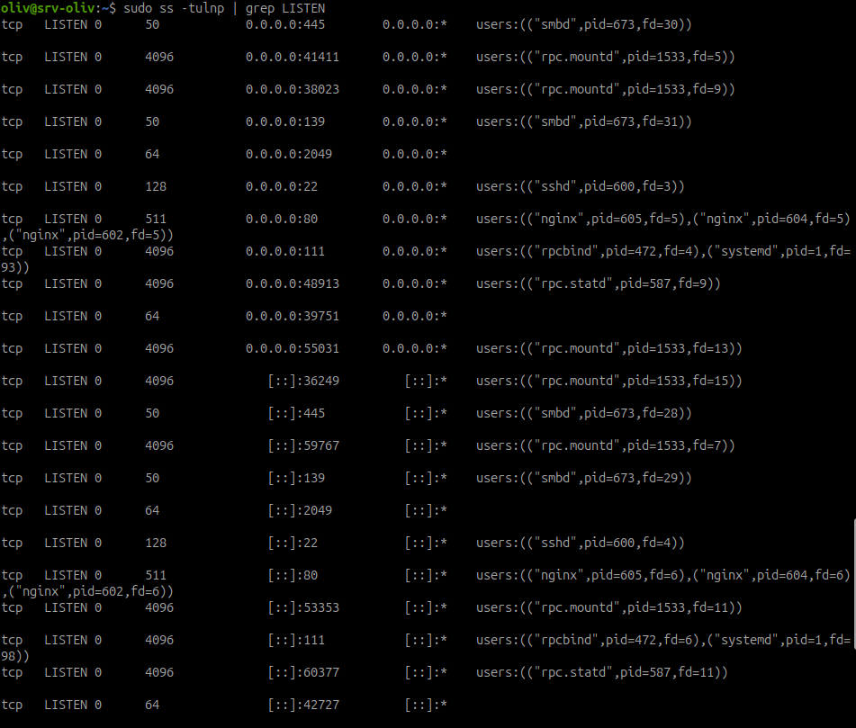
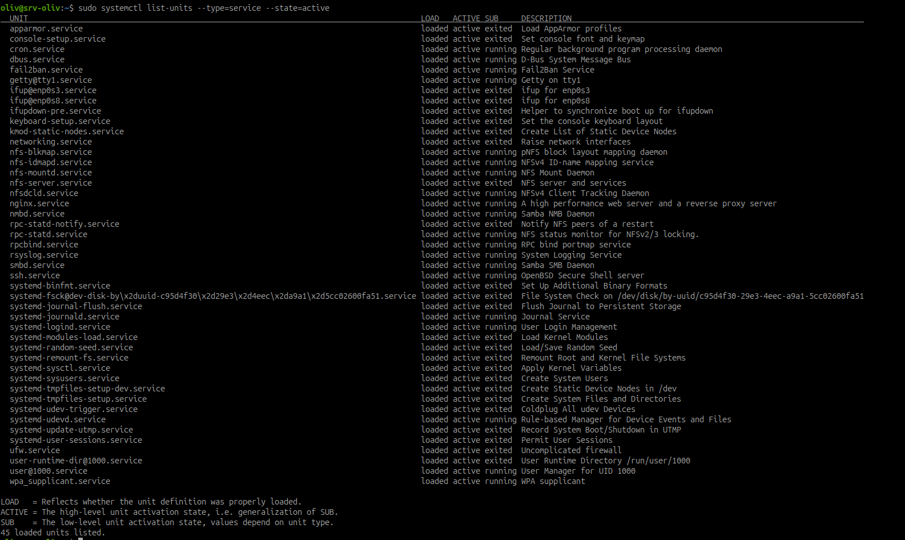
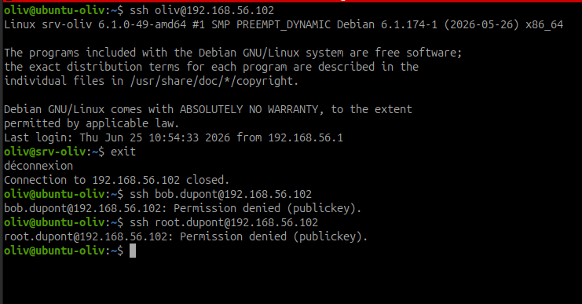
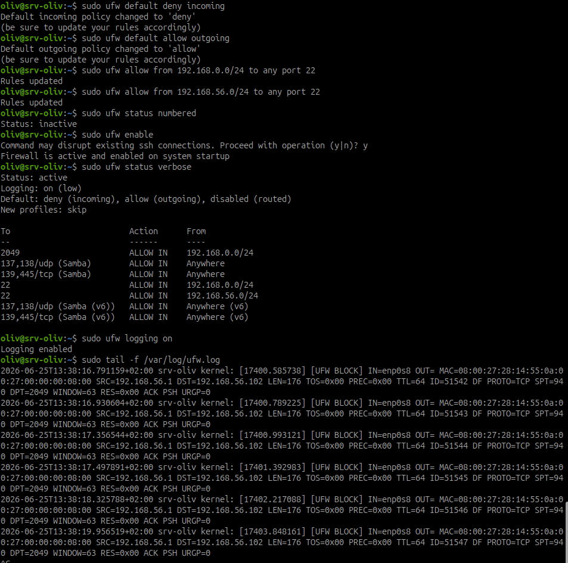
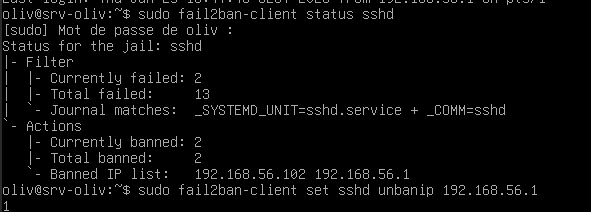
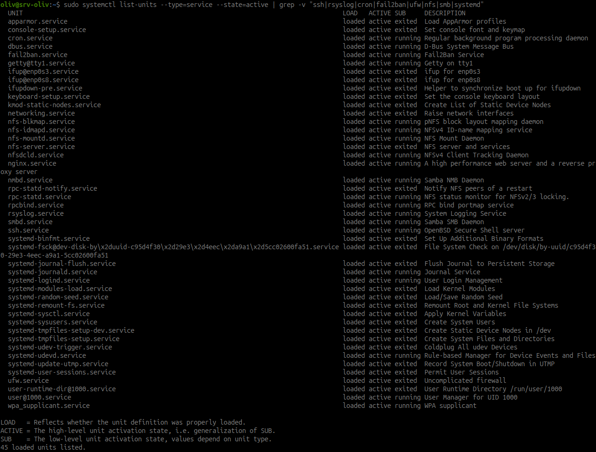
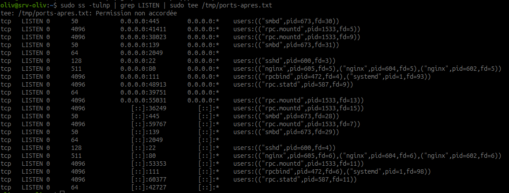
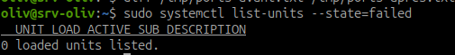

# Rapport de durcissement Linux AlpesNet

## En-tête

| Élément | Valeur |
| --- | --- |
| Titre | Rapport de durcissement Linux AlpesNet |
| Auteur | Olivier |
| Date | 25 juin 2026 |
| Machine | `srv-oliv` |
| IP | `192.168.56.102` |
| Client de test | `ubuntu-oliv` - `192.168.56.1` |
| Périmètre | SSH, UFW, Fail2ban, services actifs |

## Contexte

L'incident de départ concerne un serveur Linux exposant SSH sur le port 22 avec une configuration trop permissive : accès direct `root`, authentification par mot de passe et absence de protection contre les tentatives répétées.

Le durcissement appliqué vise à :

- interdire l'accès SSH direct au compte `root` ;
- imposer l'authentification par clé ;
- limiter SSH aux comptes autorisés ;
- restreindre le port 22 au réseau du lab ;
- activer Fail2ban contre les tentatives de force brute ;
- comparer les ports et services avant/après ;
- vérifier qu'aucun service critique n'est cassé.

## Synthèse avant/après

| Mesure | État avant | Commande appliquée | État après | Vérification |
| --- | --- | --- | --- | --- |
| SSH root | Accès root considéré non conforme dans le scénario d'incident | `PermitRootLogin no` | Connexion `root` refusée | `ssh root@192.168.56.102` |
| Auth SSH | Authentification par mot de passe considérée non conforme | `PasswordAuthentication no` et `PubkeyAuthentication yes` | Authentification par clé obligatoire | Test SSH depuis un nouveau terminal |
| Utilisateurs SSH | Accès SSH non limité explicitement | `AllowUsers oliv` ou compte admin autorisé | Seul le compte listé peut se connecter | `ssh oliv@192.168.56.102` |
| UFW | Politique entrante non restrictive ou non documentée | `ufw default deny incoming`, règle SSH limitée au réseau du lab | Pare-feu actif, entrée refusée par défaut | `sudo ufw status verbose` |
| Fail2ban | Protection force brute absente ou non validée | Jail `sshd` avec `bantime`, `findtime`, `maxretry` | IP bannie après échecs SSH | `sudo fail2ban-client status sshd` |
| Services | Ports et services actifs à justifier | Analyse `ss` et `systemctl`, désactivation ciblée si inutile | Services restants justifiés, aucun service en échec | `diff /tmp/ports-avant.txt /tmp/ports-apres.txt` et `systemctl list-units --state=failed` |

## État avant

Les ports en écoute ont été capturés avant durcissement.

```bash
sudo ss -tulnp | grep LISTEN | sudo tee /tmp/ports-avant.txt
```



Observation : plusieurs services sont exposés, notamment SSH, Samba, NFS/RPC et Nginx. Cette liste sert de base de comparaison.

Les services actifs ont également été listés.

```bash
sudo systemctl list-units --type=service --state=active | sudo tee /tmp/services-avant.txt
```



Observation : les services actifs sont nombreux. Les services utiles au TP, comme SSH, NFS, Samba, UFW et Fail2ban, doivent être conservés et justifiés.

## Mesure 1 - Durcissement SSH

### Commandes et configuration appliquées

Sauvegarde :

```bash
sudo cp /etc/ssh/sshd_config /etc/ssh/sshd_config.bak
```

Paramètres de durcissement :

```text
PermitRootLogin no
PasswordAuthentication no
PubkeyAuthentication yes
AllowUsers oliv
MaxAuthTries 3
LoginGraceTime 20
ClientAliveInterval 300
ClientAliveCountMax 2
X11Forwarding no
AllowTcpForwarding no
```

Validation syntaxique :

```bash
sudo sshd -t
```

Rechargement :

```bash
sudo systemctl reload ssh
```

### Vérification

Tests depuis un nouveau terminal :

```bash
ssh oliv@192.168.56.102
ssh bob.dupont@192.168.56.102
ssh root@192.168.56.102
```



Résultat :

- `oliv` peut se connecter ;
- `bob.dupont` est refusé ;
- `root` est refusé ;
- le refus se fait par clé publique, ce qui confirme que le mot de passe n'est plus accepté.

## Mesure 2 - UFW

### Commandes appliquées

Politique par défaut :

```bash
sudo ufw default deny incoming
sudo ufw default allow outgoing
```

Règles SSH limitées aux réseaux utilisés pendant le TP :

```bash
sudo ufw allow from 192.168.0.0/24 to any port 22
sudo ufw allow from 192.168.56.0/24 to any port 22
```

Activation :

```bash
sudo ufw enable
sudo ufw status verbose
sudo ufw logging on
```

### Vérification



Résultat :

- UFW est actif ;
- la politique entrante est `deny` ;
- la politique sortante est `allow` ;
- SSH est autorisé uniquement depuis les sous-réseaux prévus ;
- les logs montrent des paquets bloqués, ce qui confirme la journalisation.

Point d'attention : des règles Samba ouvertes à `Anywhere` apparaissent encore. Elles sont acceptables pour le TP Samba local, mais seraient à restreindre à un sous-réseau précis avant production.

## Mesure 3 - Fail2ban

### Configuration appliquée

Configuration locale recommandée :

```ini
[DEFAULT]
bantime = 3600
findtime = 600
maxretry = 3

[sshd]
enabled = true
backend = systemd
port = ssh
```

Redémarrage :

```bash
sudo systemctl restart fail2ban
```

### Vérification

Après plusieurs tentatives SSH échouées depuis le client :

```bash
sudo fail2ban-client status sshd
```



Résultat :

- la jail `sshd` est active ;
- Fail2ban a comptabilisé les échecs ;
- l'IP du client `192.168.56.1` apparaît dans la liste des IP bannies ;
- un déban manuel a été réalisé avec :

```bash
sudo fail2ban-client set sshd unbanip 192.168.56.1
```

Conclusion : Fail2ban protège bien SSH contre les tentatives répétées.

## Mesure 4 - Services actifs et surface d'attaque

### Analyse des services

Les services actifs ont été filtrés pour identifier ceux à justifier ou désactiver.

```bash
sudo systemctl list-units --type=service --state=active | grep -v "ssh|rsyslog|cron|fail2ban|ufw|nfs|smb|systemd"
```



Observation : plusieurs services restent présents car ils correspondent au contexte du TP : NFS, Samba, Nginx, RPC et services système. Les services non nécessaires doivent être désactivés après vérification de leur rôle.

### État après

Capture des ports après durcissement :

```bash
sudo ss -tulnp | grep LISTEN | sudo tee /tmp/ports-apres.txt
```



Vérification des services en échec :

```bash
sudo systemctl list-units --state=failed
```



Résultat :

- aucun service critique n'est en échec ;
- la surface exposée reste cohérente avec les services de l'itération 4 ;
- les ports encore ouverts doivent être justifiés dans le cadre NFS, Samba, SSH et Nginx.

## Points de vigilance production

| Point | Recommandation |
| --- | --- |
| Règles Samba | Restreindre Samba au sous-réseau utile, éviter `Anywhere`. |
| SSH | Créer un compte admin dédié `adm-oliv` plutôt que d'utiliser un compte général. |
| UFW | Conserver une règle SSH de secours uniquement pendant les tests, puis nettoyer. |
| Fail2ban | Vérifier régulièrement les bans et les logs. |
| Services | Désactiver tout service non lié au rôle réel du serveur. |
| Rapport | Conserver les fichiers `/tmp/ports-avant.txt`, `/tmp/ports-apres.txt`, `/tmp/services-avant.txt` et `/tmp/services-apres.txt` avec les captures. |

## Conclusion

Le durcissement appliqué réduit les risques principaux de l'incident initial :

- le compte `root` n'est plus accessible en SSH ;
- l'authentification par mot de passe est désactivée ;
- l'accès SSH est limité aux comptes explicitement autorisés ;
- UFW applique une politique entrante restrictive ;
- Fail2ban bannit les tentatives répétées ;
- les services actifs sont contrôlés et aucun service critique n'est en échec.

Le serveur `srv-oliv` est donc mieux préparé pour une mise en production, sous réserve de restreindre davantage les règles Samba si le service doit rester actif hors contexte de TP.

