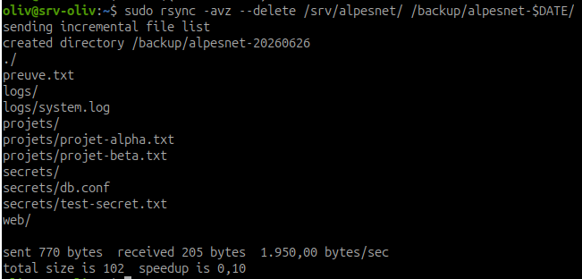
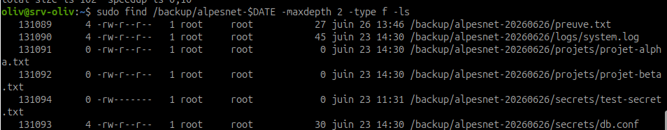
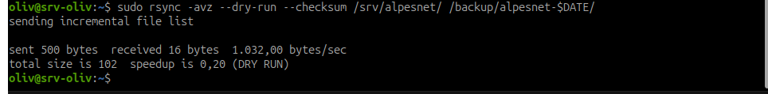
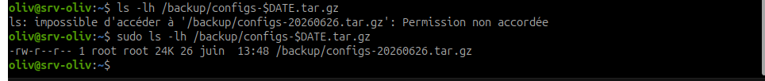
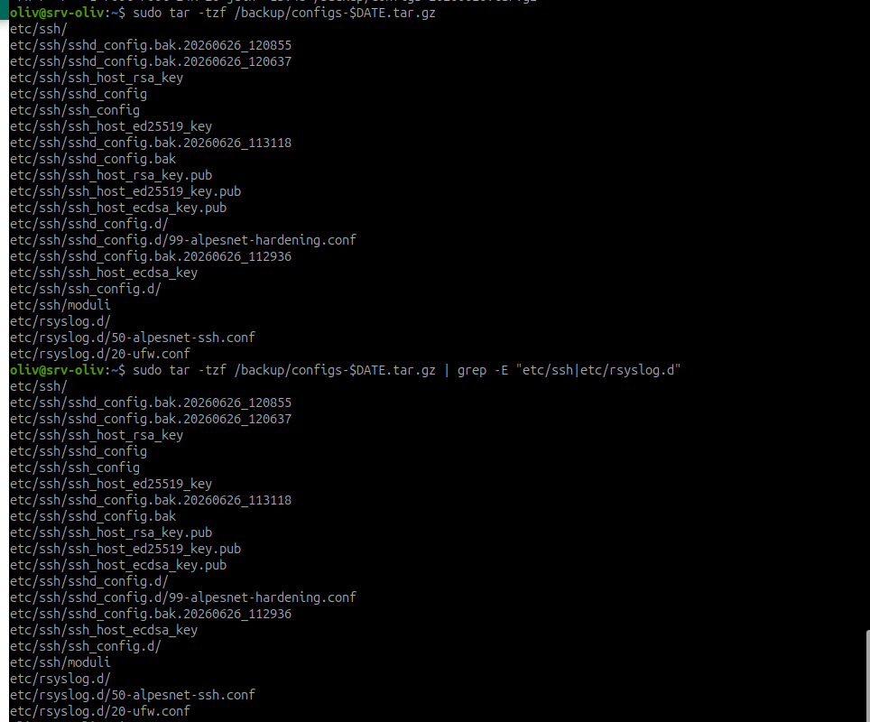
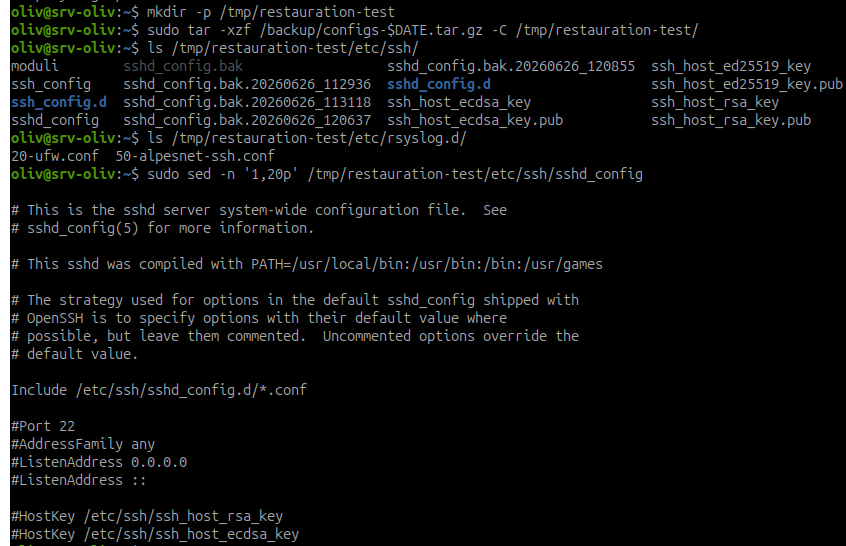
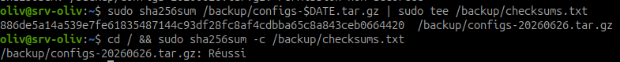

# Sauvegarde et restauration AlpesNet

## Objectif

Mettre en place une sauvegarde de l'infrastructure AlpesNet avec `rsync` et `tar`, puis prouver que cette sauvegarde est restaurable.

!!! danger "Règle absolue"
    Une sauvegarde non testée n'est pas une sauvegarde. Chaque sauvegarde doit inclure une restauration testée sur un répertoire de test. C'est un point que le jury RNCP regardera en priorité.

## Architecture de l'atelier

| Élément | Rôle | Chemin |
| --- | --- | --- |
| Source applicative | Données à sauvegarder | `/srv/alpesnet` |
| Dossier de sauvegarde | Destination locale | `/backup` |
| Sauvegarde rsync | Copie incrémentale datée | `/backup/alpesnet-YYYYMMDD/` |
| Archive configuration | Archive compressée | `/backup/configs-YYYYMMDD.tar.gz` |
| Test de restauration | Répertoire temporaire | `/tmp/restauration-test/` |
| Preuve d'intégrité | Checksum SHA-256 | `/backup/checksums.txt` |

## Étape 1 - Préparer le dossier `/backup`

Créer le dossier de sauvegarde :

```bash
sudo mkdir -p /backup
```

Appliquer des droits restrictifs :

```bash
sudo chmod 750 /backup
```

Vérifier :

```bash
ls -ld /backup
```

Résultat attendu :

```text
drwxr-x--- ... /backup
```

Explication : seuls `root` et le groupe propriétaire peuvent accéder au dossier. Les autres utilisateurs n'ont aucun droit.

## Étape 2 - Préparer la source `/srv/alpesnet`

Vérifier que le dossier source existe :

```bash
ls -ld /srv/alpesnet
```

Si le dossier n'existe pas encore pour le TP, le créer avec un fichier de test :

```bash
sudo mkdir -p /srv/alpesnet
echo "preuve sauvegarde AlpesNet" | sudo tee /srv/alpesnet/preuve.txt
```

Vérifier le contenu :

```bash
find /srv/alpesnet -maxdepth 2 -type f -ls
```

## Étape 3 - Sauvegarder avec `rsync`

Créer une variable de date pour éviter les erreurs de nommage :

```bash
DATE=$(date +%Y%m%d)
```

Lancer la sauvegarde :

```bash
sudo rsync -avz --delete /srv/alpesnet/ /backup/alpesnet-$DATE/
```

Explication des options :

| Option | Rôle |
| --- | --- |
| `-a` | mode archive : conserve permissions, dates et liens |
| `-v` | affiche les fichiers traités |
| `-z` | compresse pendant le transfert |
| `--delete` | supprime côté destination ce qui n'existe plus côté source |

Vérifier le résultat :

```bash
sudo find /backup/alpesnet-$DATE -maxdepth 2 -type f -ls
```



Observation : `rsync` crée le dossier daté `/backup/alpesnet-20260626/` et copie les répertoires applicatifs, journaux, projets, secrets et web.



Observation : la vérification liste les fichiers présents dans la sauvegarde. Les fichiers de `/srv/alpesnet` sont bien retrouvés côté `/backup`.

## Étape 4 - Vérifier la sauvegarde `rsync`

Faire un dry-run avec checksum :

```bash
sudo rsync -avz --dry-run --checksum /srv/alpesnet/ /backup/alpesnet-$DATE/
```

Résultat attendu : aucune différence à synchroniser, ou seulement les lignes de résumé selon la version de `rsync`.

Explication :

| Élément | Rôle |
| --- | --- |
| `--dry-run` | simule sans modifier |
| `--checksum` | compare le contenu plutôt que seulement les dates |

Cette vérification prouve que la destination correspond à la source.



Observation : le dry-run ne propose aucun fichier à recopier. La sauvegarde est donc cohérente avec la source au moment du test.

## Étape 5 - Créer une archive `tar` des configurations

Créer l'archive compressée :

```bash
sudo tar -czf /backup/configs-$DATE.tar.gz /etc/ssh /etc/rsyslog.d
```

Explication des options :

| Option | Rôle |
| --- | --- |
| `-c` | crée une archive |
| `-z` | compresse avec gzip |
| `-f` | indique le nom du fichier |
| `-v` | mode verbeux, optionnel si ajouté |

Vérifier que l'archive existe :

```bash
ls -lh /backup/configs-$DATE.tar.gz
```



Observation : l'archive `configs-20260626.tar.gz` existe dans `/backup`. Un accès simple sans `sudo` peut être refusé selon les droits, ce qui est cohérent avec un dossier de sauvegarde restrictif.

## Étape 6 - Lister le contenu de l'archive

Lister sans extraire :

```bash
sudo tar -tzf /backup/configs-$DATE.tar.gz
```

Vérifier que les chemins attendus apparaissent :

```bash
sudo tar -tzf /backup/configs-$DATE.tar.gz | grep -E "etc/ssh|etc/rsyslog.d"
```

Résultat attendu : l'archive contient les fichiers de configuration SSH et rsyslog.



Observation : l'archive contient bien `etc/ssh/` et `etc/rsyslog.d/`, dont les fichiers de configuration SSH et les règles rsyslog.

## Étape 7 - Tester la restauration

Créer le répertoire de test :

```bash
mkdir -p /tmp/restauration-test
```

Extraire l'archive dedans :

```bash
sudo tar -xzf /backup/configs-$DATE.tar.gz -C /tmp/restauration-test/
```

Vérifier les fichiers restaurés :

```bash
ls /tmp/restauration-test/etc/ssh/
ls /tmp/restauration-test/etc/rsyslog.d/
```

Lire un fichier restauré :

```bash
sudo sed -n '1,20p' /tmp/restauration-test/etc/ssh/sshd_config
```

Résultat attendu : les fichiers sont présents et lisibles dans `/tmp/restauration-test`.



Observation : l'archive est extraite dans `/tmp/restauration-test`. Les fichiers restaurés sont listés et `sshd_config` est lisible, ce qui prouve que la sauvegarde est exploitable.

## Étape 8 - Vérifier l'intégrité avec `sha256sum`

Générer le checksum :

```bash
sha256sum /backup/configs-$DATE.tar.gz | sudo tee /backup/checksums.txt
```

Vérifier l'intégrité :

```bash
cd / && sudo sha256sum -c /backup/checksums.txt
```

Résultat attendu :

```text
/backup/configs-YYYYMMDD.tar.gz: OK
```

Explication : le checksum permet de détecter si l'archive a été modifiée ou corrompue après sa création.



Observation : `sha256sum -c` retourne `Réussi`, ce qui confirme que l'archive n'a pas été altérée depuis la génération du checksum.

## Étape 9 - Écrire la procédure de restauration

Dans le carnet de bord, noter la procédure en cas d'incident SSH.

Exemple :

```text
Procédure de restauration /etc/ssh
1. Identifier la dernière archive valide dans /backup.
2. Vérifier son intégrité avec sha256sum -c /backup/checksums.txt.
3. Extraire l'archive dans /tmp/restauration-test.
4. Comparer les fichiers restaurés avec les fichiers actuels.
5. Copier uniquement les fichiers nécessaires vers /etc/ssh.
6. Vérifier la syntaxe avec sudo sshd -t.
7. Recharger SSH avec sudo systemctl reload sshd.
8. Tester une nouvelle connexion avant de fermer la session active.
```

!!! warning "Ne jamais restaurer à l'aveugle"
    Restaurer directement sur `/etc/ssh` sans test peut casser l'accès distant. La restauration doit d'abord être faite dans `/tmp/restauration-test`.

## Étape 10 - Nettoyer le test si nécessaire

Une fois les preuves conservées, supprimer le répertoire de test :

```bash
sudo rm -rf /tmp/restauration-test
```

Conserver les sauvegardes :

```bash
sudo ls -lh /backup
```

## Étape 11 - Automatiser avec le script d'itération

Un script évolutif est disponible pour rejouer les étapes de sauvegarde, générer les preuves et produire un rapport final :

[alpesnet-it5-sauvegarde.sh](../../assets/scripts/admin-systemes-linux/it-5/alpesnet-it5-sauvegarde.sh)

Le rendre exécutable sur la VM :

```bash
chmod +x alpesnet-it5-sauvegarde.sh
```

Prévisualiser sans modifier le système :

```bash
./alpesnet-it5-sauvegarde.sh --dry-run
```

Lancer réellement :

```bash
sudo ./alpesnet-it5-sauvegarde.sh
```

Le script affiche les étapes en direct et génère :

```text
/var/log/alpesnet-it5/rapport-it5-YYYYMMDD_HHMMSS.md
/var/log/alpesnet-it5/execution-it5-YYYYMMDD_HHMMSS.log
```

Variables utiles :

| Variable | Rôle | Défaut |
| --- | --- | --- |
| `SOURCE_DIR` | Dossier source à sauvegarder | `/srv/alpesnet` |
| `BACKUP_DIR` | Dossier de sauvegarde | `/backup` |
| `RESTORE_DIR` | Dossier de restauration test | `/tmp/restauration-test` |
| `DATE_TAG` | Suffixe de date utilisé dans les fichiers | date du jour |
| `PRENOM` | Prénom affiché sur la page intranet | `Oliv` |
| `INTRANET_HOST` | Nom du vhost Nginx | `intranet.alpesnet.local` |
| `CAMPUS_SUBNET` | Sous-réseau autorisé pour SSH | `192.168.56.0/24` |

!!! note "Script évolutif"
    Le script couvre maintenant la sauvegarde/restauration et l'autonomie Nginx sécurisé. Il pourra encore être enrichi si de nouvelles exigences apparaissent pendant l'itération.

## Exercice 1 - Sauvegarder et restaurer les données AlpesNet

Tu dois mettre en place la sauvegarde de l'infrastructure AlpesNet et prouver qu'elle est restaurable.

Ce que tu dois faire :

1. Créer `/backup/` avec les bons droits :

```bash
sudo mkdir -p /backup
sudo chmod 750 /backup
```

2. Lancer une sauvegarde `rsync` de `/srv/alpesnet` vers `/backup/alpesnet-[date]/`, puis vérifier le résultat.

3. Créer une archive `tar` de `/etc/ssh` et `/etc/rsyslog.d` :

```bash
sudo tar -czf /backup/configs-[date].tar.gz /etc/ssh /etc/rsyslog.d
```

4. Tester la restauration dans `/tmp/restauration-test/`, puis vérifier que les fichiers sont lisibles et conformes.

5. Générer le checksum :

```bash
sha256sum /backup/configs-[date].tar.gz > /backup/checksums.txt
```

Puis vérifier :

```bash
sha256sum -c /backup/checksums.txt
```

6. Noter dans le carnet la procédure de restauration de `/etc/ssh` en cas d'incident.

## Résultat attendu

| Élément | Validation |
| --- | --- |
| Sauvegarde rsync | `/backup/alpesnet-YYYYMMDD/` existe et contient les données |
| Vérification rsync | `rsync --dry-run --checksum` ne montre pas d'écart |
| Archive tar | `/backup/configs-YYYYMMDD.tar.gz` existe |
| Restauration testée | les fichiers sont extraits dans `/tmp/restauration-test/` |
| Checksum | `sha256sum -c /backup/checksums.txt` affiche `OK` |
| Procédure | la restauration de `/etc/ssh` est documentée dans le carnet |

## Ressources

- `man rsync`
- `man tar`
- `man sha256sum`
- [rsync documentation officielle](https://rsync.samba.org/documentation.html)
- [GNU tar manual](https://www.gnu.org/software/tar/manual/tar.html)

## Synthèse à retenir

Une sauvegarde se valide en trois temps :

1. créer la sauvegarde ;
2. vérifier son intégrité ;
3. tester une restauration dans un dossier séparé.

Sans test de restauration, la sauvegarde reste une hypothèse, pas une preuve.
