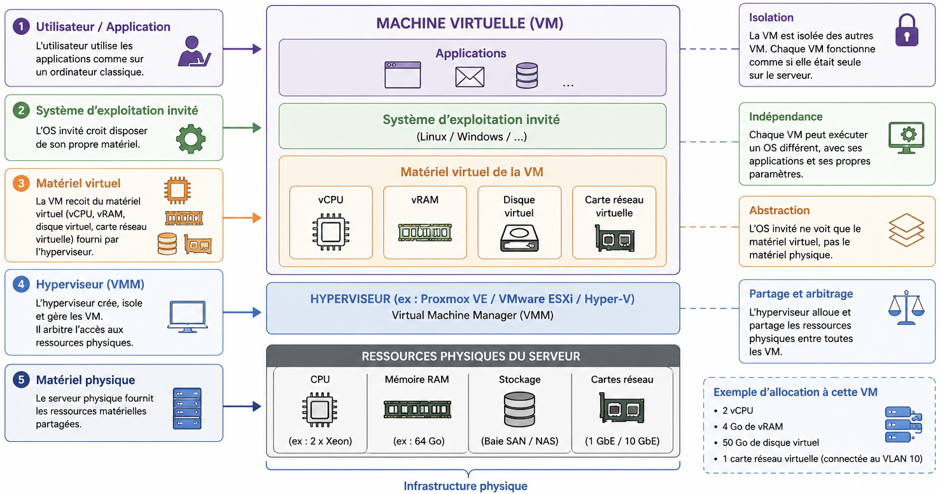
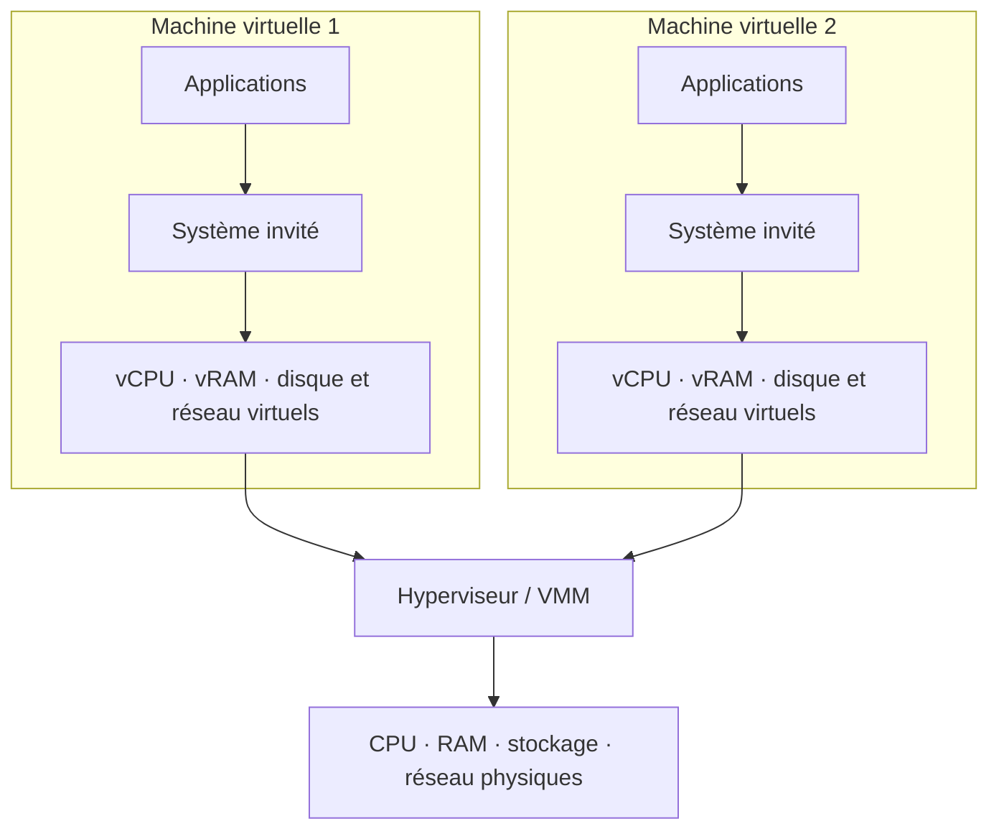

# Comment fonctionne une machine virtuelle ?

## Objectif

Comprendre comment une machine virtuelle s'exécute sur un serveur physique et identifier le rôle de chacun des composants.

!!! question "Problématique"
    Comment plusieurs systèmes d'exploitation peuvent-ils fonctionner simultanément sur un même serveur physique sans interférer les uns avec les autres ?

    L'**hyperviseur** crée pour chaque machine virtuelle un environnement matériel isolé. Il répartit les ressources physiques et contrôle tous les accès au processeur, à la mémoire, au stockage et au réseau.

## Fonctionnement d'une machine virtuelle

Une machine virtuelle fonctionne comme un ordinateur indépendant, mais son matériel est simulé par l'hyperviseur. Son système d'exploitation invité utilise des **vCPU**, de la **vRAM**, un **disque virtuel** et une **carte réseau virtuelle**.

L'hyperviseur fait le lien entre ces composants virtuels et les ressources physiques du serveur. Il décide quelle VM peut utiliser une ressource, à quel moment et dans quelle proportion.

## Les différentes couches

| Couche | Rôle |
| --- | --- |
| Applications | Fournissent les services utilisés dans la VM. |
| Système d'exploitation invité | Administre la VM comme s'il fonctionnait sur un ordinateur physique. |
| Matériel virtuel | Présente à l'OS invité des composants normalisés : vCPU, vRAM, disque et carte réseau. |
| Hyperviseur ou VMM | Crée les VM, assure leur isolation et arbitre l'accès aux ressources physiques. |
| Matériel physique | Fournit la puissance de calcul, la mémoire, le stockage et la connectivité réels. |

## Activité 1 — Réponses

### Quels éléments correspondent à des composants physiques ?

Les composants physiques sont ceux qui appartiennent réellement au serveur et à son infrastructure :

- les processeurs ou cœurs **CPU** ;
- les barrettes de **mémoire RAM** ;
- les disques locaux ou les équipements de stockage **SAN/NAS** ;
- les cartes et ports réseau physiques ;
- le serveur lui-même, son alimentation et ses autres périphériques.

### Quels éléments sont virtualisés ?

Chaque VM reçoit des composants logiques créés ou présentés par l'hyperviseur :

- un ou plusieurs **vCPU** ;
- une quantité de **vRAM** ;
- un ou plusieurs **disques virtuels** ;
- une ou plusieurs **cartes réseau virtuelles** ;
- éventuellement d'autres périphériques virtuels, comme un lecteur optique, un contrôleur de stockage ou une puce TPM virtuelle.

Le système d'exploitation invité et les applications ne sont pas du matériel virtualisé : ce sont des logiciels exécutés dans la VM.

### Quel composant permet aux VM d'utiliser les ressources matérielles ?

C'est l'**hyperviseur**, avec son gestionnaire de machines virtuelles ou **VMM**. Il présente le matériel virtuel aux systèmes invités, traduit leurs demandes et arbitre l'accès aux ressources physiques.

### Où est réellement stocké le disque d'une VM ?

Pour la VM, le disque apparaît comme un disque classique. En réalité, il est généralement stocké sous la forme d'un fichier de disque virtuel, par exemple `VHDX` avec Hyper-V ou `VMDK` avec VMware.

Ce fichier peut se trouver :

- sur les disques locaux de l'hôte ;
- sur un datastore partagé ;
- sur un NAS accessible par le réseau ;
- sur une baie SAN accessible par un réseau de stockage ;
- dans un stockage distribué ou hyperconvergé.

### Pourquoi plusieurs VM peuvent-elles partager le même processeur physique ?

L'hyperviseur utilise un **ordonnanceur**. Il attribue successivement du temps processeur aux vCPU des différentes VM. Ces intervalles sont si courts que les systèmes invités semblent fonctionner simultanément.

Plusieurs cœurs physiques permettent une véritable exécution parallèle. Une surallocation des vCPU reste possible, mais un nombre excessif de VM actives peut provoquer de la contention et ralentir les traitements.

### Une VM accède-t-elle directement au matériel du serveur ?

En fonctionnement normal, non. La VM utilise du matériel virtuel et ses accès passent par l'hyperviseur, qui assure l'abstraction et l'isolation.

Certaines fonctions avancées, comme le *passthrough* PCI ou l'affectation directe d'un périphérique, autorisent exceptionnellement une VM à utiliser un composant physique presque directement. Cette configuration réduit toutefois la souplesse de migration et de partage.

### Que deviennent les VM si le serveur physique est arrêté ?

Les VM exécutées sur cet hôte s'arrêtent également :

- lors d'un arrêt planifié, elles peuvent être arrêtées proprement ou sauvegarder leur état ;
- lors d'une panne brutale, leur fonctionnement est interrompu comme si leur alimentation était coupée ;
- dans un cluster haute disponibilité, elles peuvent être redémarrées sur un autre hôte si leur stockage reste accessible ;
- une migration à chaud préalable permet de les déplacer sans interruption notable lors d'une maintenance planifiée.

!!! warning "Disponibilité"
    La virtualisation seule ne garantit pas la haute disponibilité. Un hôte unique reste un point de défaillance. Il faut ajouter un cluster, du stockage redondant et des sauvegardes testées.

## Partage et isolation des ressources

L'hyperviseur remplit quatre fonctions essentielles :

1. **abstraction** : l'OS invité voit du matériel virtuel plutôt que le matériel réel ;
2. **allocation** : chaque VM reçoit une quantité définie de ressources ;
3. **ordonnancement** : l'accès au processeur et aux entrées-sorties est organisé dans le temps ;
4. **isolation** : chaque VM dispose de son propre espace mémoire, de ses disques et de ses interfaces logiques.

Ainsi, une panne logicielle dans une VM ne doit normalement pas modifier la mémoire ou le système d'exploitation d'une autre VM. En revanche, les performances peuvent être affectées lorsque plusieurs VM sollicitent fortement une même ressource physique.

## Exemple d'allocation

Pour une VM de serveur Web, l'hyperviseur pourrait présenter :

| Ressource virtuelle | Allocation d'exemple | Ressource physique utilisée |
| --- | ---: | --- |
| vCPU | 2 | Temps de calcul sur les CPU de l'hôte |
| vRAM | 4 Go | Mémoire RAM du serveur |
| Disque virtuel | 50 Go | Disque local, NAS, SAN ou datastore |
| Carte réseau virtuelle | 1 | vSwitch puis carte réseau physique |

Ces valeurs doivent être adaptées à la charge réelle et surveillées afin d'éviter le sous-dimensionnement comme le gaspillage de ressources.

## Glossaire associé

→ [Consulter le glossaire Virtualisation — Itération 1](../../pense-bete/glossaire/admin-systemes-virtualisation/it-1.md)
