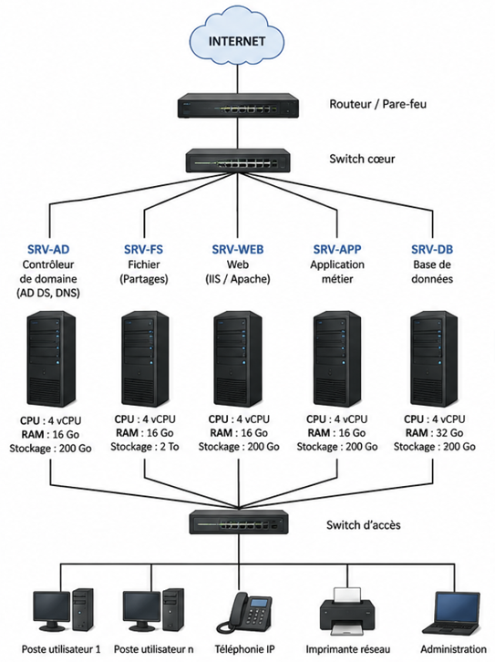
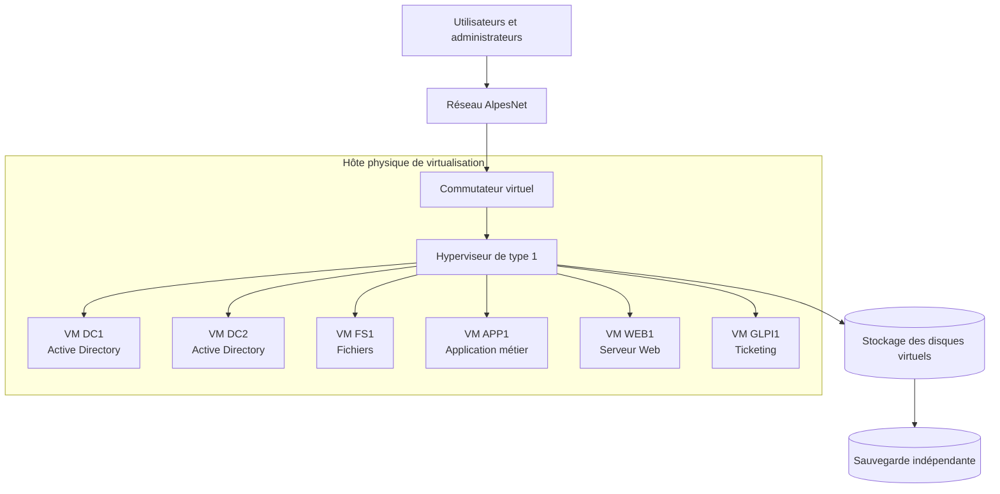

# Itération 1 — Fondamentaux de la virtualisation

## Synthèse

La **virtualisation** permet d'exécuter plusieurs systèmes informatiques indépendants sur un même serveur physique. Chaque **machine virtuelle** (VM) dispose de son propre système d'exploitation, de ressources attribuées et d'un environnement isolé.

Dans le cas d'AlpesNet, elle permet de remplacer plusieurs serveurs physiques sous-utilisés par un ou plusieurs hôtes de virtualisation capables d'héberger les services `DC1`, `DC2`, `FS1`, `APP1`, `WEB1` et `GLPI1` sous forme de VM.

!!! abstract "Problématique"
    Comment héberger plusieurs services sur un même serveur physique tout en garantissant leur isolation, leurs performances et leur disponibilité ?

    La réponse repose sur un **hyperviseur**, une allocation maîtrisée des ressources, une séparation des réseaux et du stockage, ainsi que des mécanismes de sauvegarde et de haute disponibilité.

## Objectifs de l'itération

À l'issue de cette première journée, je dois être capable de :

| Compétence attendue | Validation |
| --- | --- |
| Expliquer les principes et les bénéfices de la virtualisation | CA-01 |
| Distinguer les hyperviseurs de type 1 et de type 2 | CA-01 |
| Décrire le rôle de l'hyperviseur dans l'abstraction du matériel | CA-01 |
| Identifier les composants d'une infrastructure virtualisée | CA-02 |
| Représenter une infrastructure virtualisée par un schéma | CA-02 |
| Comparer les machines virtuelles et les conteneurs | CA-03 |

## Pourquoi virtualiser ?

L'infrastructure actuelle d'AlpesNet utilise un serveur physique par service. Cette organisation entraîne une faible utilisation des processeurs et de la mémoire, davantage de matériel à alimenter et à maintenir, et des délais importants pour déployer un nouveau service.

La virtualisation apporte plusieurs bénéfices :

- **consolidation** : plusieurs serveurs logiques fonctionnent sur un même hôte physique ;
- **meilleure utilisation des ressources** : CPU, mémoire, stockage et réseau sont répartis entre les VM ;
- **isolation** : une panne logicielle dans une VM ne doit pas affecter les autres ;
- **souplesse** : une VM peut être créée, clonée, déplacée ou restaurée plus rapidement qu'un serveur physique ;
- **réduction des coûts** : moins de serveurs physiques signifie moins d'énergie, de câblage et de maintenance ;
- **disponibilité améliorée** : avec plusieurs hôtes, les VM peuvent être redémarrées ou déplacées en cas de panne.

!!! warning "Limite importante"
    La consolidation crée aussi un point de concentration : si un hôte unique tombe en panne, toutes ses VM deviennent indisponibles. La haute disponibilité nécessite donc au minimum plusieurs hôtes, un stockage adapté, des sauvegardes et un plan de reprise.

### Infrastructure physique avant virtualisation

Le schéma suivant illustre une infrastructure classique dans laquelle chaque service est hébergé sur un serveur dédié. Les utilisateurs accèdent aux différents services par le réseau local, tandis que le routeur et le pare-feu assurent la liaison avec Internet.

*Exemple d'une infrastructure composée de serveurs physiques dédiés avant consolidation par la virtualisation.*

## Le rôle de l'hyperviseur

L'**hyperviseur** est la couche logicielle qui se place entre le matériel physique et les machines virtuelles. Il abstrait les ressources du serveur et présente à chaque VM un matériel virtuel : processeurs virtuels, mémoire, disque, carte réseau et périphériques.

Ses fonctions principales sont :

1. créer, démarrer, arrêter et superviser les VM ;
2. répartir le CPU et la mémoire entre les VM ;
3. connecter les VM aux réseaux et aux stockages virtuels ;
4. assurer leur isolation ;
5. contrôler l'accès aux ressources physiques.

### Hyperviseur de type 1

Il s'installe directement sur le serveur physique, sans système d'exploitation hôte généraliste. Il est privilégié en production pour ses performances, sa stabilité et ses fonctions d'administration centralisée.

Exemples : **VMware ESXi**, **Microsoft Hyper-V Server/role Hyper-V**, **Proxmox VE** et **Xen**.

### Hyperviseur de type 2

Il fonctionne comme une application au-dessus d'un système d'exploitation déjà installé. Il est simple à utiliser sur un poste de travail, mais dépend de l'OS hôte et possède davantage de surcharge.

Exemples : **VirtualBox**, **VMware Workstation** et **Parallels Desktop**.

| Critère | Type 1 | Type 2 |
| --- | --- | --- |
| Installation | Directement sur le matériel | Sur un système d'exploitation hôte |
| Usage principal | Serveurs, datacenters, production | Tests, formation, développement |
| Performances | Élevées | Plus limitées |
| Dépendance | Pas d'OS hôte généraliste | Dépend de l'OS hôte |
| Administration | Souvent centralisée | Généralement locale |

## Composants d'une infrastructure virtualisée

- **Hôte physique** : serveur fournissant CPU, RAM, interfaces réseau et accès au stockage.
- **Hyperviseur** : couche qui crée et administre les VM.
- **Machine virtuelle** : serveur logique isolé avec son propre OS.
- **Stockage** : disques locaux, SAN ou NAS contenant les disques virtuels des VM.
- **Commutateur virtuel** : relie les cartes réseau virtuelles entre elles et au réseau physique.
- **Console de gestion** : interface d'administration des hôtes et des VM.
- **Cluster** : groupe d'hôtes travaillant ensemble pour améliorer la disponibilité et répartir les charges.
- **Sauvegarde** : copie indépendante permettant de restaurer une VM ou ses données.

## Architecture envisagée pour AlpesNet

Ce schéma répond au besoin de **consolidation** et d'**isolation**. Pour garantir réellement la disponibilité, l'architecture cible devra évoluer vers au moins deux hôtes en cluster afin d'éviter qu'un seul serveur physique ne constitue un point unique de défaillance.

## Machines virtuelles et conteneurs

Une VM virtualise une machine complète et embarque son propre système d'exploitation. Un conteneur virtualise surtout l'environnement d'exécution d'une application et partage le noyau de l'OS hôte avec les autres conteneurs.

| Critère | Machine virtuelle | Conteneur |
| --- | --- | --- |
| Isolation | Forte, grâce à un OS indépendant | Isolation de processus, noyau partagé |
| Démarrage | De quelques secondes à plusieurs minutes | Généralement très rapide |
| Consommation | Plus importante | Faible |
| Compatibilité OS | Plusieurs OS différents sur un hôte | Dépend du noyau de l'hôte |
| Usage | Serveurs complets, applications anciennes, forte isolation | Microservices, applications portables, déploiement rapide |
| Administration | OS complet à maintenir | Images et orchestration à gérer |

Les deux technologies sont complémentaires : les conteneurs peuvent eux-mêmes être exécutés à l'intérieur de VM afin de combiner souplesse de déploiement et isolation de l'infrastructure.

## Réponse au cas AlpesNet

La solution la plus adaptée consiste à installer un **hyperviseur de type 1** sur des serveurs dimensionnés pour la charge, puis à transformer chaque service existant en VM distincte. L'hyperviseur partage les ressources physiques tout en conservant l'isolation logique des services.

Les performances sont garanties par un dimensionnement adapté et par la surveillance du CPU, de la RAM, du stockage et du réseau. La disponibilité repose sur la redondance des contrôleurs de domaine, des sauvegardes testées et, à terme, un cluster d'au moins deux hôtes permettant le redémarrage ou la migration des VM.

## Livrable

Le livrable de cette itération est un **glossaire technique de la virtualisation**, complété au fil des séquences.

→ [Consulter le glossaire Virtualisation — Itération 1](../../pense-bete/glossaire/admin-systemes-virtualisation/it-1.md)
