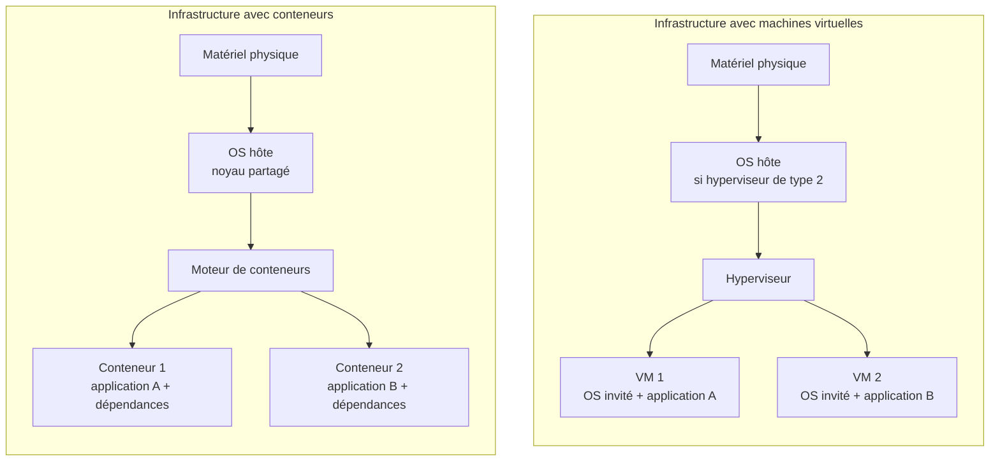

# Machine virtuelle ou conteneur : lequel choisir ?

## Objectif

Découvrir le principe de la conteneurisation et comparer son fonctionnement à celui d'une machine virtuelle afin d'identifier les cas d'usage adaptés à chaque technologie.

!!! question "Problématique"
    Faut-il systématiquement déployer une machine virtuelle pour héberger une application ?

    **Non.** Une VM convient lorsqu'un système complet ou une isolation forte est nécessaire. Un conteneur est souvent préférable pour empaqueter et déployer rapidement une application compatible avec le noyau de l'hôte. Ces technologies sont complémentaires.

## Activité 1 — Comprendre la conteneurisation

### Qu'est-ce qu'un conteneur ?

Un **conteneur** est un processus isolé regroupant une application avec ses bibliothèques, dépendances et fichiers d'exécution. Il est créé à partir d'une **image de conteneur**, modèle immuable décrivant l'application et son environnement.

Le **moteur de conteneurs** télécharge l'image, crée le conteneur, l'exécute et contrôle son accès au processeur, à la mémoire, au stockage et au réseau.

### En quoi diffère-t-il d'une VM ?

Une VM virtualise un ordinateur complet et possède son propre système d'exploitation invité avec son propre noyau. Un conteneur isole une application et ses dépendances, mais partage le noyau du système d'exploitation hôte avec les autres conteneurs.

| Critère | Machine virtuelle | Conteneur |
| --- | --- | --- |
| Élément virtualisé | Machine complète | Environnement d'une application |
| Système | OS invité et noyau dans chaque VM | Noyau de l'hôte partagé |
| Isolation | Forte frontière fournie par l'hyperviseur | Isolation de processus fournie par le noyau |
| Taille | Souvent plusieurs gigaoctets | Généralement beaucoup plus léger |
| Démarrage | Secondes à minutes | Généralement très rapide |
| Densité | Plus faible | Plus élevée |
| Compatibilité | Différents OS invités possibles | Dépend du noyau disponible |
| Cas courant | Serveur complet, application ancienne | API, microservice, application Web |

### Quel composant est partagé ?

Les conteneurs partagent le **noyau de l'OS hôte**. Les *namespaces* isolent les processus et les ressources visibles. Les *cgroups* limitent et mesurent les ressources consommées.

### Avantages

- démarrage rapide et faible consommation de ressources ;
- forte densité d'applications sur un même hôte ;
- environnement reproductible entre développement, test et production ;
- images portables entre plateformes compatibles ;
- déploiement, mise à jour et retour arrière rapides ;
- intégration aux chaînes CI/CD ;
- mise à l'échelle horizontale facilitée.

### Limites

- noyau partagé et frontière d'isolation différente de celle d'une VM ;
- impossibilité d'exécuter directement un noyau incompatible avec celui de l'hôte ;
- persistance à organiser au moyen de volumes ou de services externes ;
- orchestration, réseau, secrets et supervision plus complexes à grande échelle ;
- images et dépendances à analyser et maintenir ;
- applications anciennes parfois difficiles à conteneuriser.

### Technologies

- **Docker** et **Podman** sont deux moteurs permettant de construire et d'exécuter des conteneurs ;
- **containerd** et **CRI-O** sont des moteurs fréquemment utilisés par des plateformes orchestrées ;
- **LXC/LXD** fournit des conteneurs système Linux.

**Kubernetes** n'est pas un moteur : c'est un **orchestrateur** qui automatise le déploiement, la disponibilité et la mise à l'échelle des applications conteneurisées.

## Activité 2 — Schéma comparatif

!!! note "Hyperviseur de type 1"
    Avec un hyperviseur de type 1, celui-ci s'exécute directement sur le matériel : il n'existe pas d'OS hôte généraliste sous l'hyperviseur. Chaque VM conserve néanmoins son OS invité.

## Comment choisir ?

| Besoin | Choix conseillé | Justification |
| --- | --- | --- |
| Active Directory | VM | OS complet et forte isolation. |
| Ancienne application Windows | VM | Dépendances fortes à Windows. |
| Windows et Linux sur le même hôte | VM | Chaque VM possède son noyau. |
| API ou site Web moderne | Conteneur | Déploiement rapide et réplication simple. |
| Environnements de test identiques | Conteneur | Création reproductible depuis une image. |
| Charge particulièrement sensible | VM ou conteneurs dans une VM dédiée | Défense en profondeur. |
| Microservices à grande échelle | Conteneurs orchestrés | Déploiement et mise à l'échelle automatisés. |
| Base de données | Selon le contexte | Conteneur possible si persistance, sauvegardes et performances sont maîtrisées. |

### Choix pour AlpesNet

Une architecture hybride est pertinente :

- conserver `VM-AD`, `VM-FS` et les applications anciennes dans des VM ;
- conteneuriser les applications Web modernes lorsque l'équipe maîtrise leur exploitation ;
- installer le moteur de conteneurs dans une ou plusieurs VM Linux du cluster ;
- sortir les données persistantes des couches éphémères des conteneurs ;
- sauvegarder les données et configurations, puis tester leur restauration.

## Glossaire et livrable

Le glossaire centralisé contient l'ensemble des termes demandés pour le livrable de l'itération 1.

→ [Consulter le glossaire Virtualisation — Itération 1](../../pense-bete/glossaire/admin-systemes-virtualisation/it-1.md)

## Ressources officielles

| Ressource | Documentation |
| --- | --- |
| Microsoft Hyper-V | [Microsoft Learn — Hyper-V](https://learn.microsoft.com/fr-fr/windows-server/virtualization/hyper-v/) |
| Proxmox VE | [Documentation Proxmox VE](https://pve.proxmox.com/pve-docs/) |
| VMware vSphere | [Documentation VMware vSphere](https://techdocs.broadcom.com/us/en/vmware-cis/vsphere.html) |
| Red Hat KVM | [Red Hat — Configuring and managing virtualization](https://docs.redhat.com/en/documentation/red_hat_enterprise_linux/9/html/configuring_and_managing_virtualization/) |
| Docker | [Docker Documentation](https://docs.docker.com/) |
| Kubernetes | [Kubernetes Documentation](https://kubernetes.io/docs/concepts/overview/) |
