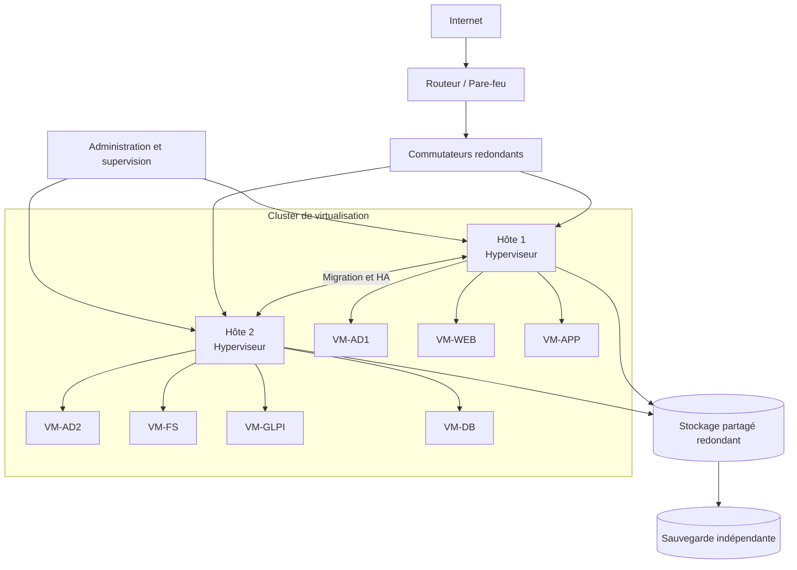
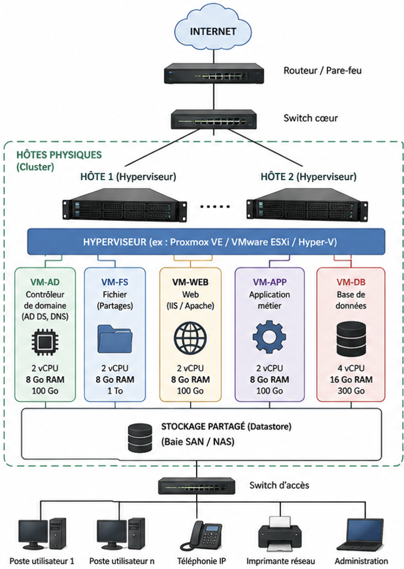

# Pourquoi virtualiser une infrastructure ?

## Objectif

Concevoir une architecture virtualisée répondant aux besoins d'une entreprise.

!!! question "Problématique"
    Quels choix d'architecture permettent de concevoir une infrastructure virtualisée fiable, performante et évolutive pour héberger les services d'AlpesNet ?

Une architecture adaptée doit associer plusieurs hôtes en **cluster**, des hyperviseurs, un stockage partagé et redondant, des réseaux séparés ainsi que des ressources dimensionnées selon les besoins de chaque service.

## Activité 1 — Proposition d'architecture

L'infrastructure proposée doit héberger les services suivants sous forme de machines virtuelles :

| Machine virtuelle | Service principal | Besoin particulier |
| --- | --- | --- |
| `VM-AD1` et `VM-AD2` | Active Directory, DNS | Deux contrôleurs de domaine pour assurer la redondance. |
| `VM-FS` | Fichiers et partages | Capacité de stockage importante et sauvegarde régulière. |
| `VM-WEB` | Site ou application Web | Réseau filtré, éventuellement placé dans une DMZ. |
| `VM-APP` | Application métier | Performances adaptées au nombre d'utilisateurs. |
| `VM-GLPI` | Ticketing | Accès au serveur de base de données. |
| `VM-DB` | Base de données | Davantage de CPU, de RAM et d'entrées-sorties disque. |

### Éléments indispensables

- au moins deux serveurs physiques formant un cluster ;
- un hyperviseur de type 1 sur chaque hôte ;
- un stockage partagé et redondant ;
- des commutateurs et cartes réseau redondants ;
- des réseaux logiques séparés pour les utilisateurs, les serveurs, l'administration, le stockage et la migration ;
- une console de gestion centralisée ;
- une solution de sauvegarde indépendante du cluster ;
- de la supervision et des alertes sur les ressources et les services.

!!! warning "Haute disponibilité"
    Toutes les VM doivent pouvoir redémarrer sur un seul hôte lors d'une panne. Le cluster doit donc être dimensionné avec une réserve suffisante de CPU et de RAM, selon une logique dite **N+1**.

## Activité 2 — Comparaison des schémas

Le tableau ci-dessous permet de comparer une première proposition simple avec l'architecture de référence.

| Catégorie | Comparaison et décision |
| --- | --- |
| Points communs | Présence des VM métiers, d'un hyperviseur, du réseau local et d'un accès à Internet protégé par un pare-feu. |
| Différences | La proposition de référence utilise deux hôtes en cluster et un datastore partagé, au lieu d'un seul serveur et de disques uniquement locaux. |
| Éléments initialement manquants | Redondance des hôtes, stockage partagé, réseau d'administration, sauvegarde indépendante, supervision et mécanisme de haute disponibilité. |
| Choix conservés | Une VM distincte par rôle, séparation logique des services et allocation adaptée des ressources. |
| Améliorations retenues | Deux contrôleurs de domaine, réseaux segmentés, équipements redondants et réserve de capacité N+1. |

## Activité 3 — Architecture retenue

Le schéma de référence présente deux hôtes physiques regroupés en cluster. Les machines virtuelles sont exécutées par les hyperviseurs et leurs disques résident sur un stockage partagé. Les utilisateurs accèdent aux services par le réseau local, tandis que le routeur et le pare-feu contrôlent les échanges avec Internet.

L'architecture répartit les ressources selon la charge : la VM de base de données reçoit davantage de vCPU et de vRAM, tandis que le serveur de fichiers bénéficie d'une capacité de stockage supérieure.

## Activité 4 — Analyse et correction

### Éléments identiques

Les deux architectures font apparaître les services essentiels d'AlpesNet : annuaire, fichiers, Web, application métier et base de données. Elles utilisent des VM distinctes, reliées au réseau de l'entreprise et protégées de l'accès Internet par un pare-feu.

### Éléments non représentés dans la première proposition

Les éléments souvent oubliés sont le second hôte physique, le cluster, le stockage partagé, la console de gestion, la sauvegarde, la supervision et les réseaux techniques dédiés au stockage ou à la migration.

### Pourquoi utiliser plusieurs hôtes physiques ?

Plusieurs hôtes permettent :

- de répartir les VM et leur charge ;
- d'effectuer la maintenance d'un serveur après migration de ses VM ;
- de redémarrer les VM sur un autre nœud en cas de panne ;
- d'ajouter progressivement de la capacité au cluster ;
- de supprimer le point unique de défaillance que représente un hôte isolé.

### Quel est le rôle du stockage partagé ?

Le stockage partagé contient les fichiers et disques virtuels des VM. Comme tous les hôtes autorisés peuvent y accéder, une VM peut être déplacée ou redémarrée sur un autre nœud sans déplacer préalablement son disque.

Le stockage doit lui-même être redondant. Une baie SAN ou un NAS unique sans réplication ni double contrôleur deviendrait un nouveau point unique de défaillance.

### Pourquoi certaines VM disposent-elles de plus de ressources ?

Les besoins dépendent du rôle et de la charge :

- une base de données effectue de nombreux calculs et accès disque ;
- un serveur de fichiers a surtout besoin de capacité et de débit de stockage ;
- un serveur Web léger consomme généralement moins de RAM ;
- un serveur d'applications peut nécessiter davantage de CPU lorsque le nombre d'utilisateurs augmente.

Attribuer la même configuration à toutes les VM gaspillerait des ressources ou créerait des ralentissements. Le dimensionnement doit partir de mesures réelles et être réévalué grâce à la supervision.

## Pourquoi cette architecture est-elle adaptée ?

| Qualité recherchée | Choix d'architecture |
| --- | --- |
| Fiabilité | Deux hôtes, composants redondants, sauvegardes et plusieurs contrôleurs de domaine. |
| Performance | Ressources attribuées selon la charge et stockage offrant suffisamment d'IOPS. |
| Évolutivité | Ajout possible de RAM, de stockage, de VM ou d'un nouveau nœud au cluster. |
| Isolation | Une VM par rôle et segmentation des réseaux. |
| Maintenabilité | Migration des VM, administration centralisée et supervision. |
| Sécurité | Pare-feu, réseaux séparés, accès d'administration restreint et sauvegardes protégées. |

## Glossaire associé

Le glossaire du pense-bête a été enrichi avec les notions d'architecture rencontrées dans cette séquence.

→ [Consulter le glossaire Virtualisation — Itération 1](../../pense-bete/glossaire/admin-systemes-virtualisation/it-1.md)
